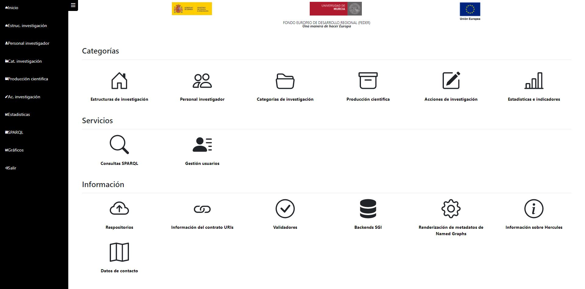
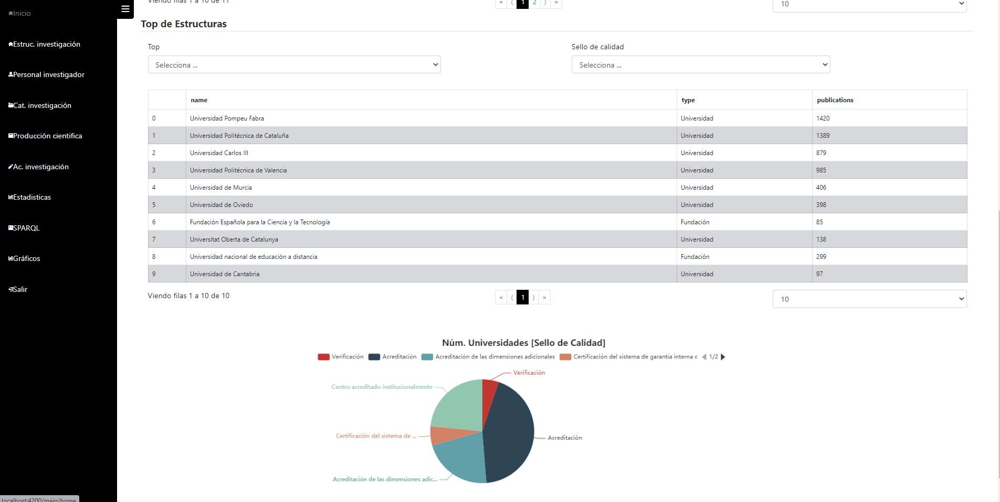
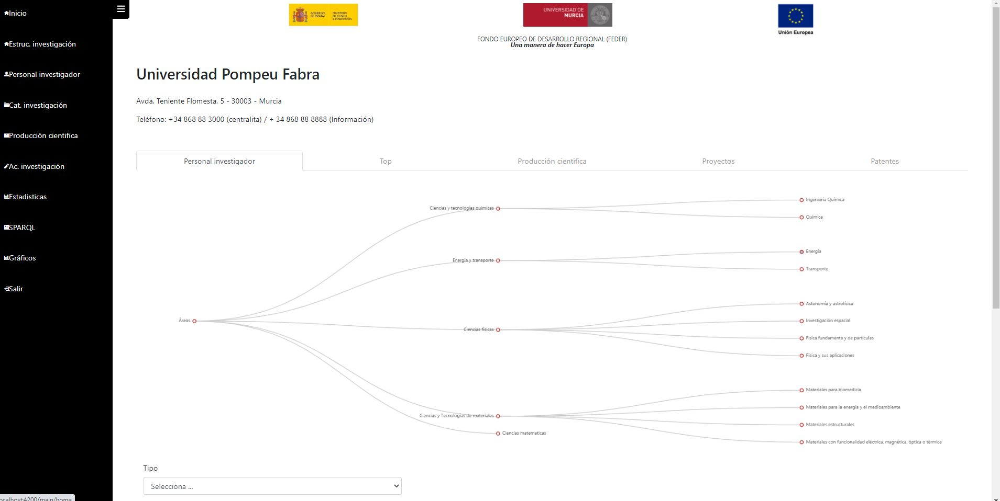
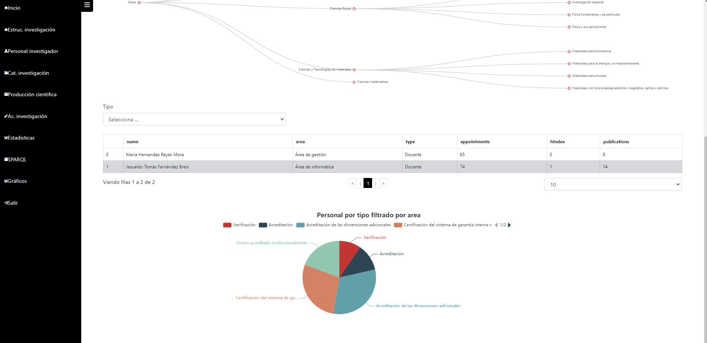
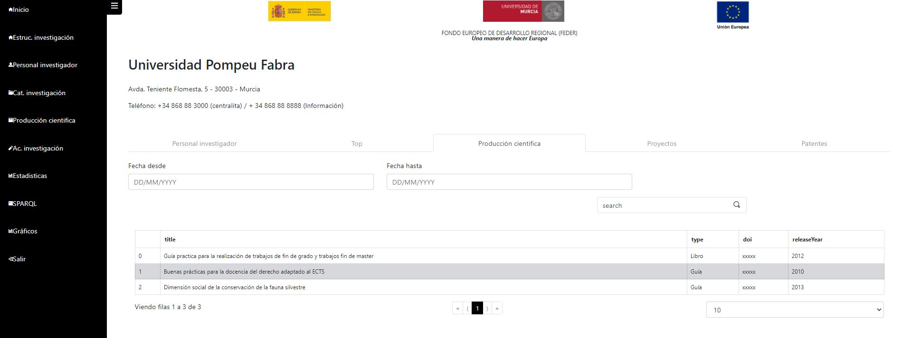
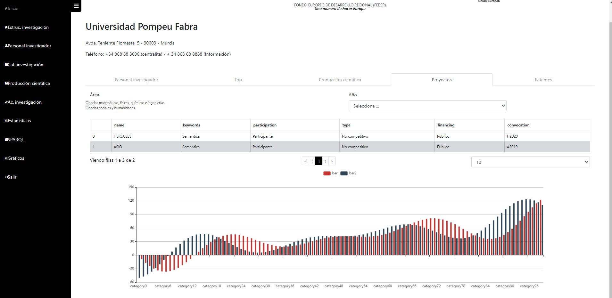
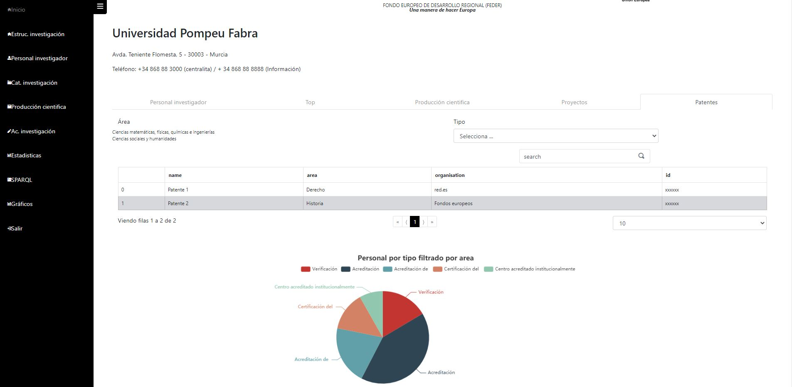

# Propuesta de solución para el front

**Índice**

[1. Home](#home)

[2. Categorías](#categorías)

[2.1. Estructura de investigación](#estructura-de-investigación)

[2.2. Detalle de centro de investigación](#detalle de proyecto)

Home
============

El home de la web dispondrá de un menú superior con los accesos a las diferentes categorías y a la pantalla de consultas SparQL. También se mostrarán los iconos de login/acceso o la imagen del usuario identificado. 

Dentro del propio Home se podrán ver:

- Buscador general de datos públicos
- Las categorías, que serían:
  - Estructuras de investigación:
    - Centros
    - Universidades
    - Fundaciones
    - Organismos
  - Personal investigador
  - Categorías:
    - Disciplinas
    - áreas
    - Líneas de investigación
    - Tópicos (topics)
  - Producción científica
    - Artículos
    - Libros
    - Congresos
  - Acciones de investigación
    - Proyectos
    - Acciones de transferencia / Startups / spinoffs
    - Patentes
  - Estadísticas e indicadores
    - Indicadores / tendencias (trends)
    - Financiación (funding) / calidad / estadísticas
    - Búsqueda de partners / estado de la técnica (state of the art)
- Los servicios de los que dispone la web, como las consultas SparQL y gestiones propias de usuarios administradores. Por ejemplo la gestión de usuarios, que sólo sería visible para usuarios de tipo Gestor Asio.
- Al final de la página se mostrarán los enlaces a información del proyecto en general:
  - Repositorios
  - Validadores
  - Información del contrato de URIs
  - Backends SGI
  - Renderización de metadatos de Named Graphs
  - Información sobre el proyecto Hércules+
  - Datos de contacto

# Categorías

En cada categoría se mostrarán una serie de filtros, algunos comunes para varias categorías.

Para el filtro por áreas, se utilizará un componente para mostrar un árbol y se utilizará el módulo vertical "[subject áreas](https://github.com/weso/hercules-ontology/blob/master/src/asio-module-subjectareas.ttl)":

## Estructura de investigación

En la categoría de estructura de investigación, podremos ver información general sobre las diferentes estructuras de investigación:

- Centros

- Universidades

- Fundaciones

- Organismos

  

Se podrá acceder a ella a través de la pantalla home, o del menú superior. En el menú superior mostrará las diferentes opciones que hay dentro de las estructuras de organización: Universidad, centro, etc. Si se selecciona una de estas sub-opciones, mostrará la información filtrada por ese tipo de estructura.

La información que se mostrará en esta página tratará de responder, entre otras, a las siguientes preguntas de competencia:

| Pregunta de competencia                                      |
| ------------------------------------------------------------ |
| CQ01. Como usuario requiero obtener un listado de los centros/estructuras de investigación que trabajan en un área/disciplina específica |
| CQ04. Como usuario requiero obtener el Top 10 (o el número que se considere relevante pues será parametrizable) de centros/estructuras de investigación que posean sellos de calidad asociados, por ejemplo: el sello Severo Ochoa. |
| CQ05. Como usuario requiero obtener un listado de los centros/estructuras de investigación que hayan realizado proyectos H2020 y/o proyectos del Plan Estatal. |
| CQ12. Como usuario necesito conocer el porcentaje de participación de un centro/estructura de investigación en proyectos nacionales o europeos. |

## Detalle de una estructura de investigación

Pulsando sobre un centro de investigación en la pantalla de esta categoría, la web nos redirigirá a la información de ese centro de investigación. Para facilitar la visualización de los datos sobre la estructura de investigación, la información se mostrará agrupada por [tabs](https://getbootstrap.com/docs/4.0/components/navs/).

### Sección de personal investigador

### Sección de top de investigadores

### Sección de producción científica

### Sección de proyectos

### Sección de patentes

En esta pantalla se responderá a las siguientes preguntas de competencia:

| Pregunta de competencia                                      |
| ------------------------------------------------------------ |
| CQ02. Como usuario requiero obtener un listado de los investigadores de un centro/estructura de investigación de un área/disciplina específica. Este listado podrá filtrarse según el tipo de investigador ya sea docente, personal investigador en formación, etc. |
| CQ03. Como usuario requiero obtener el Top 10 (o el número que se considere relevante pues será parametrizable) de los investigadores de un centro/estructura de investigación ordenados por el número de citas, número de publicaciones, h-index, etc. en un área/disciplina específica. |
| CQ06. Como usuario requiero obtener un listado de la producción científica en un determinado rango de fechas de un centro/estructura de investigación en un área/disciplina. Para cada resultado se incluirán algunos metadatos importantes de la producción como, por ejemplo, DOI, año de publicación, etc. |
| CQ09. Como usuario requiero obtener un listado de patentes, diseños industriales, etc. de un centro/estructura de investigación en un área/disciplina. |
| CQ10. Como investigador y personal no investigador de la universidad requiero obtener un listado de los proyectos adjudicados/desarrollados, de un centro/estructura de investigación, de un área/disciplina. |
| CQ12. Como usuario necesito conocer el porcentaje de participación de un centro/estructura de investigación en proyectos nacionales o europeos. |
| CQ17. Como usuario necesito obtener el listado de indicadores con su respectivo valor y unidad de medida (porcentaje, número, etc.) calculados en un periodo de tiempo, ya sea para toda la universidad o para cada centro/estructura de investigación de cada universidad. |
|                                                              |

