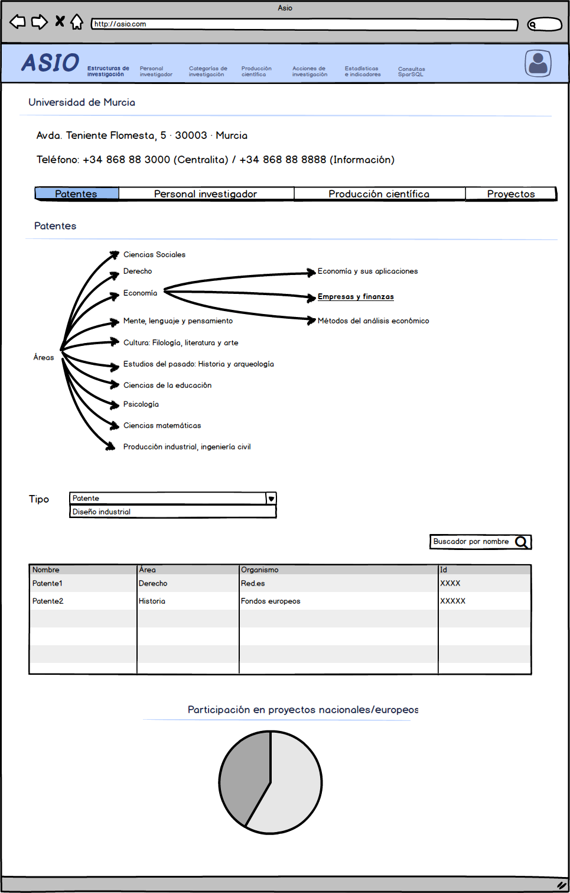
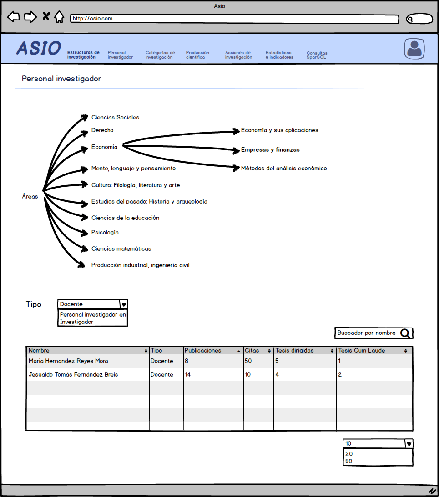

# Propuesta de solución para el front

**Índice**

[1. Home](#home)

[2. Categorías](#categorías)

[2.1. Estructura de investigación](#estructura-de-investigación)

[2.1.2. Detalle de una estructura de investigación](#detalle-de-una-estructura-de-investigación)

[2.2. Acciones de investigación](#acciones-de-investigación)

[2.2.1. Detalle de una acción de investigación](#detalle-de-una-acción-de-investigación)

[2.3. Personal investigador](#personal-investigador)

[2.3.1. Detalle de personal investigador](#detalle-de-personal-investigador)

Home
============

El home de la web dispondrá de un menú superior con los accesos a las diferentes categorías y a la pantalla de consultas SparQL. También se mostrarán los iconos de login/acceso o la imagen del usuario identificado. 

Dentro del propio Home se podrán ver:

- Buscador general de datos públicos
- Las categorías, que serían:
  - Estructuras de investigación:
    - Centros
    - Universidades
    - Fundaciones
    - Organismos
  - Personal investigador
  - Categorías:
    - Disciplinas
    - áreas
    - Líneas de investigación
    - Tópicos (topics)
  - Producción científica
    - Artículos
    - Libros
    - Congresos
  - Acciones de investigación
    - Proyectos
    - Documentos
  - Estadísticas e indicadores
    - Indicadores / tendencias (trends)
    - Financiación (funding) / calidad / estadísticas
    - Búsqueda de partners / estado de la técnica (state of the art)
- Los servicios de los que dispone la web, como las consultas SparQL y gestiones propias de usuarios administradores. Por ejemplo la gestión de usuarios, que sólo sería visible para usuarios de tipo Gestor Asio.
- Al final de la página se mostrarán los enlaces a información del proyecto en general:
  - Repositorios
  - Validadores
  - Información del contrato de URIs
  - Backends SGI
  - Renderización de metadatos de Named Graphs
  - Información sobre el proyecto Hércules+
  - Datos de contacto

# Categorías

En cada categoría se mostrarán una serie de filtros, algunos comunes para varias categorías.

Para el filtro por áreas, se utilizará un componente para mostrar un árbol y se utilizará el módulo vertical "[subject áreas](https://github.com/weso/hercules-ontology/blob/master/src/asio-module-subjectareas.ttl)":

## Estructura de investigación

En la categoría de centros de investigación, podremos ver información general sobre las diferentes estructuras de investigación:

- Centros
- Universidades
- Fundaciones
- Organismos

Se podrá acceder a ella a través de la pantalla home, o del menú superior.

La pantalla dispondrá de una serie de filtros:

- Las diferentes opciones que hay dentro de las estructuras de organización: Universidad, centro, etc. Si se selecciona una de estas sub-opciones, mostrará la información filtrada por ese tipo de estructura en la tabla.
- Para poder filtrar universidades que posean sellos de calidad como Severo Ochoa.
- Un filtro por centros que hayan realizado proyectos H2020 y/o proyectos del Plan Estatal.
- Un buscador general por nombre de centro.

La información que se mostrará en esta página tratará de responder, entre otras, a las siguientes preguntas de competencia:

| Pregunta de competencia                                      |
| ------------------------------------------------------------ |
| CQ01. Como usuario requiero obtener un listado de los centros/estructuras de investigación que trabajan en un área/disciplina específica |
| CQ04. Como usuario requiero obtener el Top 10 (o el número que se considere relevante pues será parametrizable) de centros/estructuras de investigación que posean sellos de calidad asociados, por ejemplo: el sello Severo Ochoa. |
| CQ05. Como usuario requiero obtener un listado de los centros/estructuras de investigación que hayan realizado proyectos H2020 y/o proyectos del Plan Estatal. |
| CQ12. Como usuario necesito conocer el porcentaje de participación de un centro/estructura de investigación en proyectos nacionales o europeos. |

## Detalle de una estructura de investigación

Pulsando sobre un centro de investigación en la pantalla de esta categoría, la web nos redirigirá a la información de ese centro de investigación. Para facilitar la visualización de los datos sobre el centro de investigación, la información se mostrará agrupada por [tabs](https://getbootstrap.com/docs/4.0/components/navs/).

### Personal investigador

### Producción científica

### Proyectos

### Patentes

En esta pantalla se responderá a las siguientes preguntas de competencia:

| Pregunta de competencia                                      |
| ------------------------------------------------------------ |
| CQ02. Como usuario requiero obtener un listado de los investigadores de un centro/estructura de investigación de un área/disciplina específica. Este listado podrá filtrarse según el tipo de investigador ya sea docente, personal investigador en formación, etc. |
| CQ03. Como usuario requiero obtener el Top 10 (o el número que se considere relevante pues será parametrizable) de los investigadores de un centro/estructura de investigación ordenados por el número de citas, número de publicaciones, h-index, etc. en un área/disciplina específica. |
| CQ06. Como usuario requiero obtener un listado de la producción científica en un determinado rango de fechas de un centro/estructura de investigación en un área/disciplina. Para cada resultado se incluirán algunos metadatos importantes de la producción como, por ejemplo, DOI, año de publicación, etc. |
| CQ09. Como usuario requiero obtener un listado de patentes, diseños industriales, etc. de un centro/estructura de investigación en un área/disciplina. |
| CQ10. Como investigador y personal no investigador de la universidad requiero obtener un listado de los proyectos adjudicados/desarrollados, de un centro/estructura de investigación, de un área/disciplina. |
| CQ12. Como usuario necesito conocer el porcentaje de participación de un centro/estructura de investigación en proyectos nacionales o europeos. |
| CQ17. Como usuario necesito obtener el listado de indicadores con su respectivo valor y unidad de medida (porcentaje, número, etc.) calculados en un periodo de tiempo, ya sea para toda la universidad o para cada centro/estructura de investigación de cada universidad. |
|                                                              |

## Acciones de investigación

Se dividirá en dos secciones, una para documentos y otra para proyectos.

### Documentos

Se mostrará un filtro, en forma de árbol al igual que las áreas, en el que se mostrarán los distintos tipos y subtipos de acciones de investigación posibles, todas subclases de la clase [Document](https://github.com/weso/hercules-ontology/blob/master/src/asio-core.ttl) de la ontología.

Además la tabla podrá ser filtrada por año y por nombre.

### Proyectos

En esta sección de acciones de transferencia se podrán ver los proyectos filtrados por nombre y por ámbito.

En esta página se trata de mostrar la información de las preguntas de competencia relacionadas con proyectos. 

| Pregunta de competencia                                      |
| ------------------------------------------------------------ |
| CQ10. Como investigador y personal no investigador de la universidad requiero obtener un listado de los proyectos adjudicados/desarrollados, de un centro/estructura de investigación, de un área/disciplina, en un determinado año de búsqueda en los que se tenga acceso al detalle de al menos: ○	Nombre del proyecto ○	Palabras claves ○	Tipo de participación: coordinador o participante ○	Tipo de proyecto: competitivo o no competitivo ○	Tipo de financiamiento: público o privado. ○	Tipo de convocatoria: nacional, H2020, etc. ○	Número y listado de personas involucradas en el proyecto ○	Nombre(s) del investigador(s) principal ○	Entregables/memoria del proyecto ○	Producción científica relacionada con el proyecto ○	Entidades colaboradoras/participantes ○	Cuantía ○	etc. |
| CQ46. Estado del arte: ¿puedo ver los resultados de proyectos por temática concreta de proyectos desarrollados en la red, diferenciando a nivel regional, nacional, europeo? |
|                                                              |
|                                                              |

## Detalle de una acción de investigación

La información se mostrará agrupada en tres secciones (tabs) :

- Información general del proyecto

- Participantes

- Entregables

  

### Información general

### Participantes

### Entregables

Se responden a las siguientes preguntas de competencia, a modo consulta:

| Pregunta de competencia                                      |
| ------------------------------------------------------------ |
| CQ13. Como investigador, personal no investigador de la universidad requiero insertar/modificar los datos relacionados con los proyectos de investigación, incluyendo los entregables que se hayan generado en la fase de propuesta. El usuario tendrá acceso a esta información según el nivel de acceso que se le haya proporcionado previamente según su rol, según niveles de confidencialidad de ser el caso. Entre los datos que se proporcionarán por cada proyecto se tendrá al menos: ○	Nombre del proyecto ○	Palabras claves ○	Tipo de participación de la entidad: coordinador o participante ○	Tipo de proyecto: competitivo o no competitivo ○	Tipo de financiamiento: público o privado ○	Tipo de convocatoria: nacional, H2020, etc. ○	Número y listado de personas involucradas en el proyecto ○	Nombre(s) del investigador(s) principal ○	Entregables/memoria del proyecto ○	Producción científica relacionada con el proyecto ○	Entidades colaboradoras/participantes ○	Cuantía  |
| CQ14. Como usuario necesito una visualización [filtering] que me permita explorar la información de cada proyecto según los filtros que haya elegido, por ejemplo, por años, por tipo de convocatoria, por cuantía mayor a determinado valor, según un área/disciplina, según la ubicación geográfica, etc. |
|                                                              |
|                                                              |

## Personal investigador

Se muestra el personal investigador filtrado por áreas y tipo, se podrá ordenar, cambiar el número de resultados, etc.

Se utilizan las siguientes preguntas de competencia para el diseño de la pantalla:

| Pregunta de competencia                                      |
| ------------------------------------------------------------ |
| CQ02. Como usuario requiero obtener un listado de los investigadores de un centro/estructura de investigación de un área/disciplina específica. Este listado podrá filtrarse según el tipo de investigador ya sea docente, personal investigador en formación, etc. |
| CQ03. Como usuario requiero obtener el Top 10 (o el número que se considere relevante pues será parametrizable) de los investigadores de un centro/estructura de investigación ordenados por el número de citas, número de publicaciones, h-index, etc. en un área/disciplina específica. [As a user I would like to obtain the Top 10 (or any relevant number, as this would be a parameter) research centers/strutures who have quality seals associated, such as the Severo Ochoa seal.] |
| CQ45. Investigadores que dirigen tesis en programas de doctorado diferentes a los de su Universidad, y cuántas de esas tesis dirigidas han obtenido mención cum laude. |
|                                                              |

## Detalle de personal investigador

Se podrá acceder al detalle de una persona investigadora a través de la pantalla de personal investigador.
La pantalla se dividirá en cuatro secciones:

- Acciones de investigación.
- Congresos.
- Actividad empresarial.
- Trayectoria.

### Acciones de investigación

| Pregunta de competencia                                      |
| ------------------------------------------------------------ |
| CQ25. Obtener el listado de los trabajos que he dirigido/codirigido ya sean de grado (TFG), máster (TFM), o tesis doctorales. |
| CQ26. Obtener el listado de congresos/workshops y eventos de divulgación científica en los que haya participado indicando el rol que he tenido: organizador, expositor, etc. |
| CQ27. Obtener el listado de patentes, diseños industriales, etc. que haya registrado como titular o cotitular X o Y persona, Z o K institución. |
| CQ28. Obtener el listado de proyectos en los que he participado incluyendo el rol que he desempeñado, por ejemplo, investigador principal. |
| CQ29. Obtener el listado de mi producción científica.        |
| CQ30. Obtener el listado de startup o spin-off que he fundado o de las que he sido socio. |
| CQ31. Obtener los indicadores de mi producción científica como, por ejemplo, total de citas, h-index, etc. |
| CQ32. Visualizar mi trayectoria según la línea del tiempo y parametrizable de acuerdo criterios como, por ejemplo, proyectos, tesis dirigidas/codirigidas, etc. |
| CQ33. Saber si soy apto para solicitar una evaluación relativa al nuevo sexenio de transferencia del conocimiento e innovación  o alguna de las evaluaciones que realiza la ANECA. |
|                                                              |