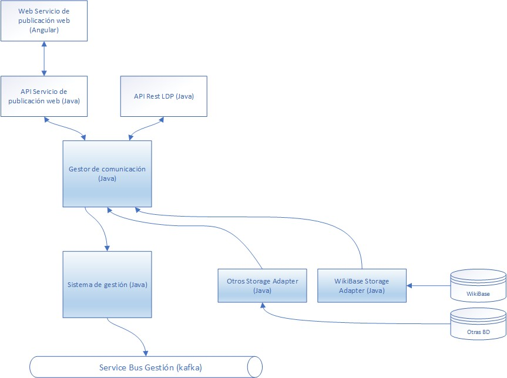
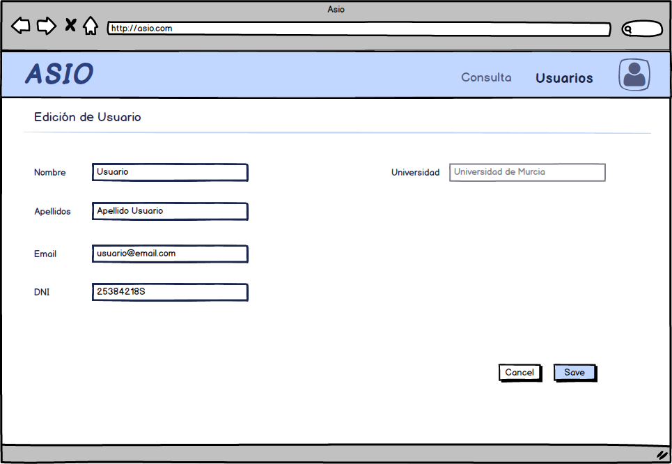
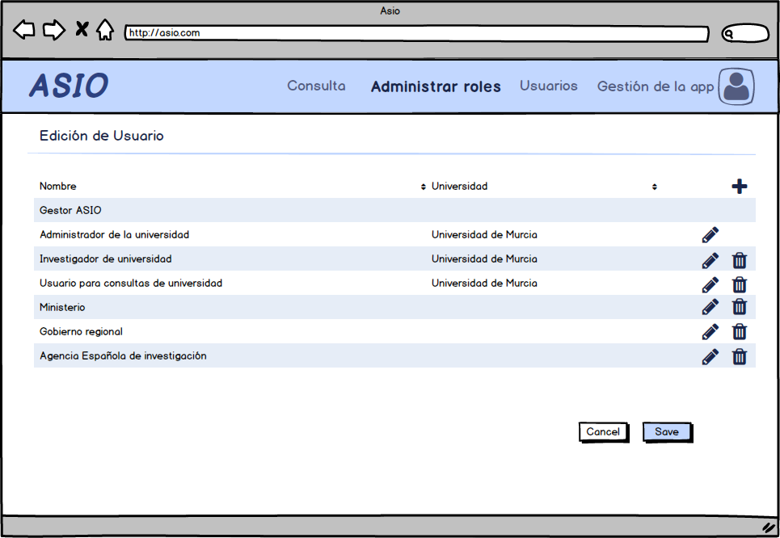
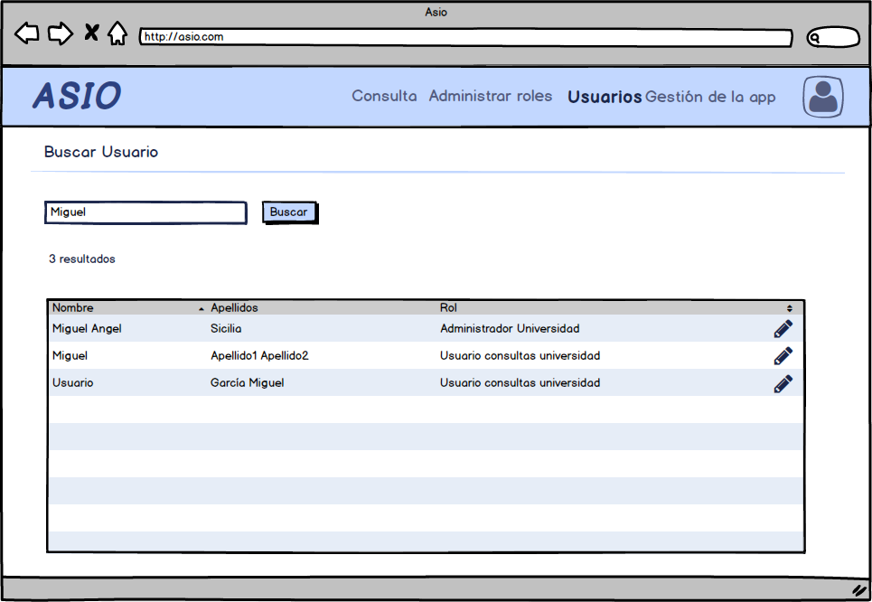
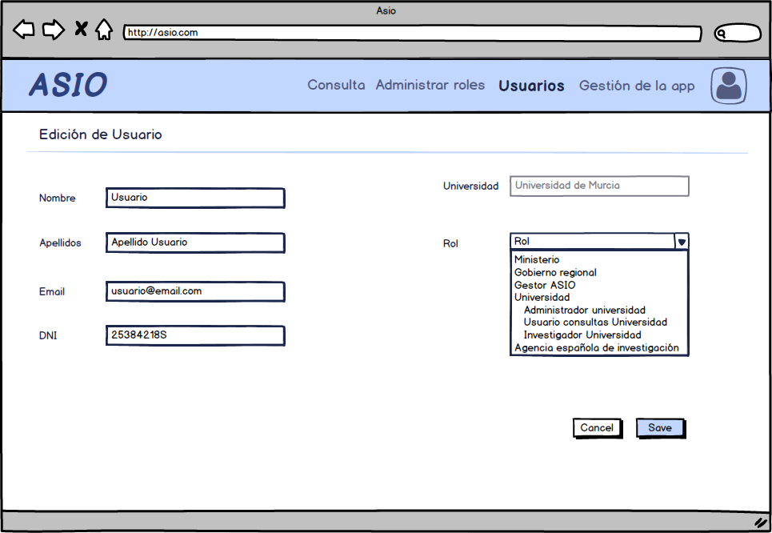
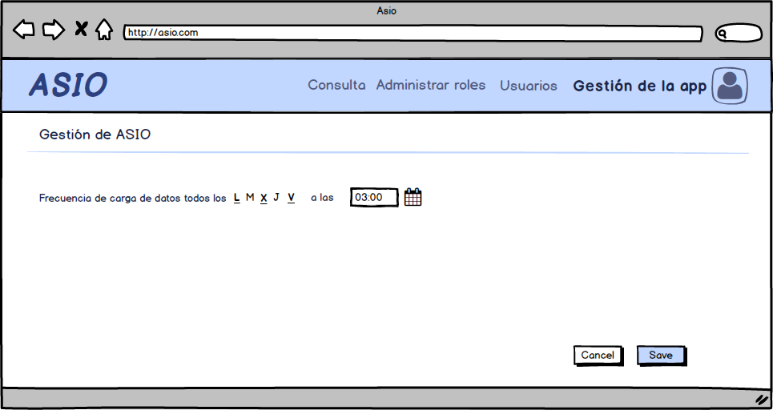
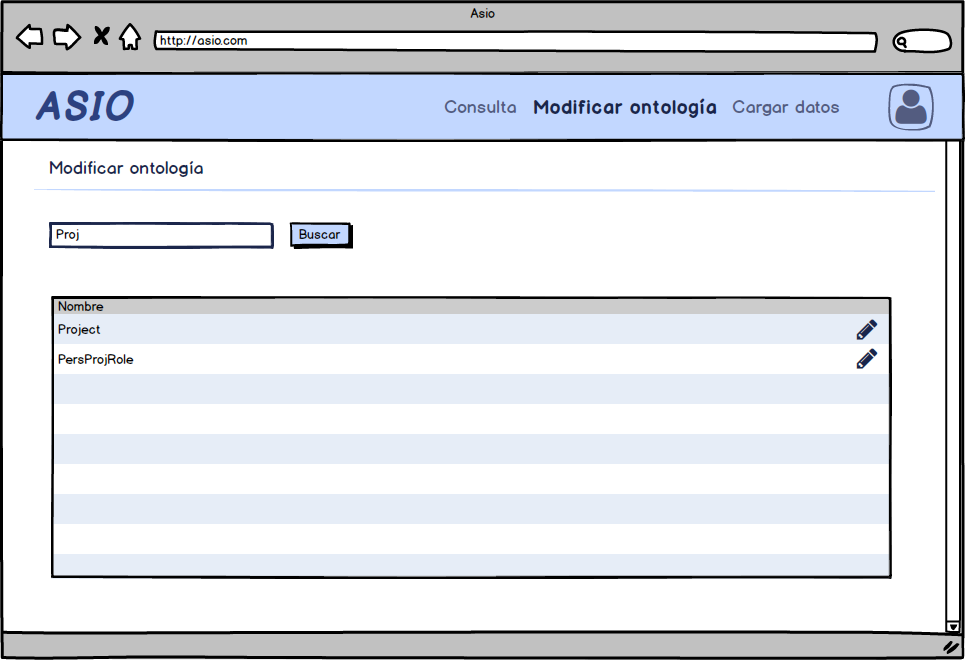
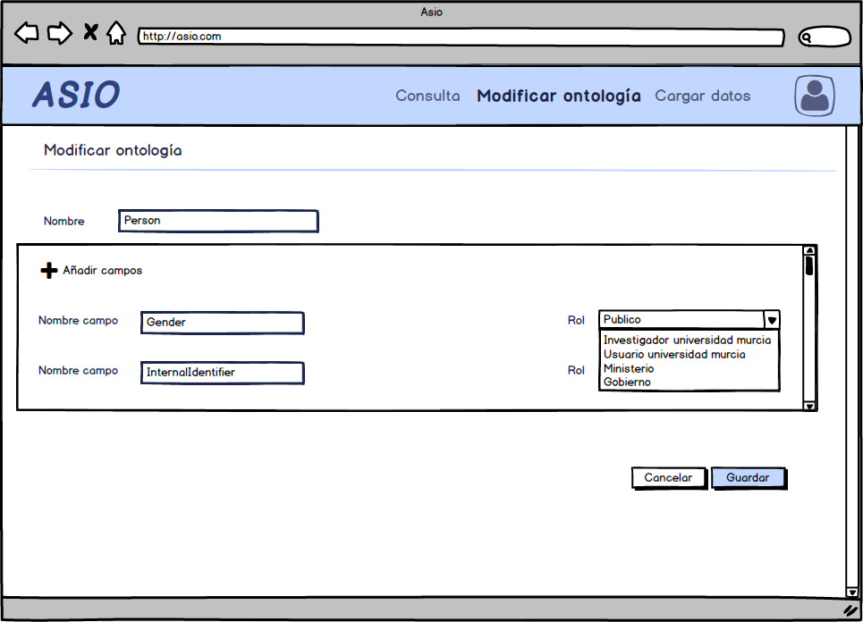
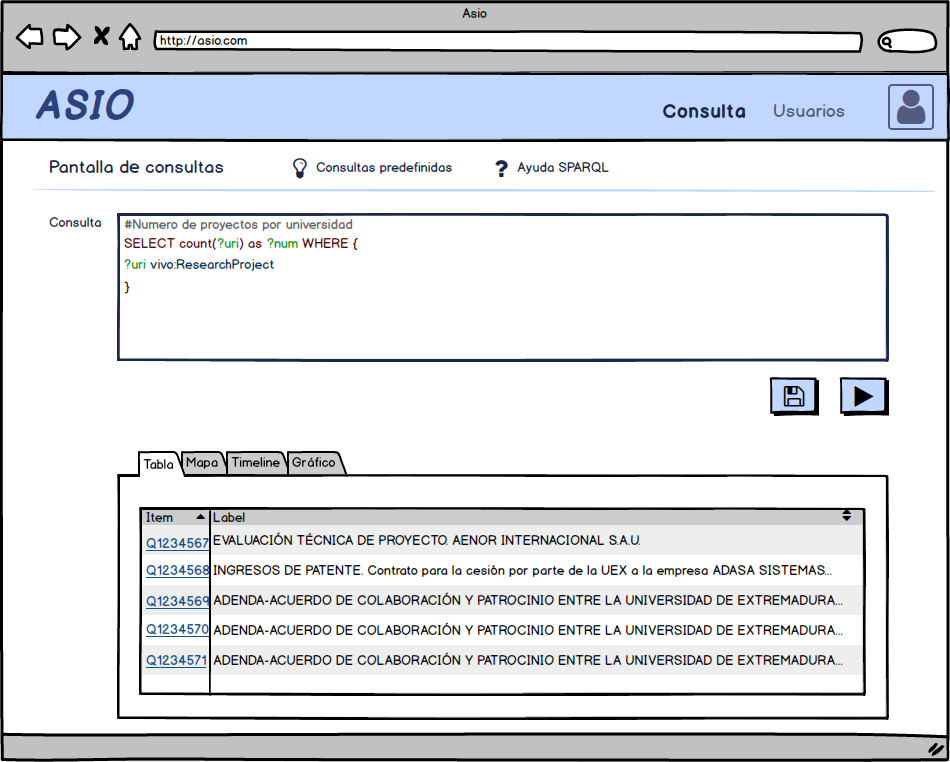
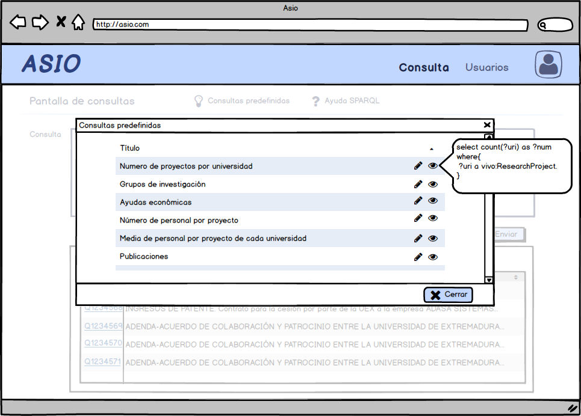

# Diseño de pantallas

**Índice**

[1. INTRODUCCIÓN](#introducción)

[2. Diseño de pantallas](#diseño-de-pantallas)

​	[2.1. Gestión de usuarios y roles](#gestión-de-usuarios-y-roles)

​		[2.1.1. Dar de alta usuario no PDI](#dar-de-alta-usuario-no-pdi)

​		[2.1.2. Edición de perfil](#edición-de-perfil)

​		[2.1.2. Pantalla de gestión de roles](#pantalla-de-gestión-de-roles)

​		[2.1.4. Edición de perfil y sus roles por el usuario administrador](#edición-de-perfil-y-sus-roles-por-el-usuario-administrador)

​		[2.1.5. Gestión de ASIO](#gestión-de-asio)

​	[2.2. Administración ontologías y datos de las ontologías](#administración-ontologías-y-datos-de-las-ontologías)

​		[2.2.1. Cargar datos](#cargar-datos)

​		[2.2.2. Modificar ontologías y sus roles](#modificar-ontologías-y-sus-roles)

​	[2.3. Consulta de datos](#consulta-de-datos)

​		[2.3.1. Pantalla genérica de consulta de datos](#pantalla-genérica-de-consulta-de-datos)

​		[2.3.2. Pantallas de categorías](../Diseño%20de%20pantallas/Categorías%20y%20buscador.md)

Introducción
============

El sistema Frontend de la aplicación se encargará de interactuar con los usuarios que intenten acceder al sistema, ya sean personas o máquinas. Se permitirá tanto la consulta de datos como la introducción de nuevos datos en el sistema mediante esta vía.

***Este documento se centra en el diseño de las pantallas para que los usuarios de tipo personas intenten acceder al sistema***, que se utilizarán como *BackOffice* de la solución, es decir para la gestión de la propia aplicación.

Diseño de pantallas
===================

En esta sección se muestran mocks de pantallas realizados con Balsamiq.

Gestión de usuarios y roles
---------------------------

### Dar de alta usuario no PDI

Un usuario no PDI deberá de estar dado de alta antes por un usuario administrador, que deberá introducir su email en el sistema.

### Edición de perfil

Cualquier usuario podrá editar su propio perfil.

### Pantalla de gestión de roles

El usuario Gestor Asio podrá añadir, borrar y editar roles en la aplicación.

### Edición de perfil y sus roles por el usuario administrador

Un usuario administrador podrá editar el perfil y roles de un usuario.

En primer lugar, debe buscar el usuario.

A partir de esta pantalla de búsqueda podrá editarlo.

### Gestión de ASIO

Los usuarios con rol Gestor ASIO podrán modificar la frecuencia de carga
de datos automática de la aplicación:

Administración ontologías y datos de las ontologías
---------------------------------------------------

### Modificar ontologías y sus roles

Los usuarios con rol administrador de la universidad, podrán modificar ontologías y sus roles para su universidad a través de la aplicación web, para eso podrán buscar las ontologías a través de un buscador simple, y a continuación modificarlas en una pantalla después de seleccionar la ontología deseada.

Consulta de datos
-----------------

### Pantalla genérica de consulta de datos

Para consultar datos, los usuarios podrán acceder a una pantalla donde se permitirá hacer consultar en [SPARQL](https://es.wikipedia.org/wiki/SPARQL).

En esta pantalla habrá la opción de seleccionar una consulta de datos predeterminada y de modificarla.

Al pulsar sobre el dato que interese cuando se muestran los datos obtenidos de la consulta, se mostrará otra pantalla con el detalle, similar a las pantallas de Wikidata. Desde esta otra pantalla podremos acceder al detalle de cada uno de los datos que se muestran si es necesario.

