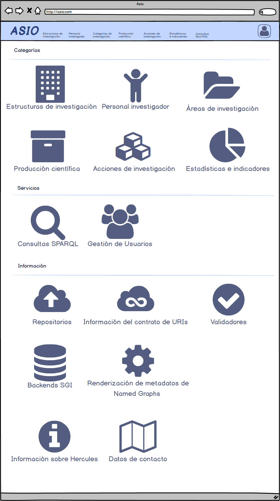

# Documento técnico FRONT

**Índice**

[1. Introducción](#introducción)

[2. Estructura](#estructura)

​ ​ [2.1. Configuración](#configuración)

​ ​ [2.2. Dependencias](#dependencias)

​ ​ [2.3. Componentes reutilizables](#componentes)

​ ​ ​ ​ [2.2.1. Tree](#tree)

​​ ​ ​ ​ [2.2.2. Gráfico](#grafico)

​​ ​ ​ ​ [2.2.3. Timeline](#timeline)

​ ​ [2.4. Main](#main)

​ ​ [2.5. Home](#home)

​ ​ [2.6. Centros de investigación](#centros)

​ ​ [2.7. Detalle centro de investigación](#detalleCentro)

# Introducción

Documento donde se indicarán los flujos de las pantallas, así como los componentes, librerias utilizados para la ejecución de las mismas.

# Estructura

En este capitulo vamos a indicar la estructura y configuración de la aplicación, así como los diferentes componentes utilizados para su ejecución.

## Configuración

La configuración de la aplicación angular sería la siguiente:

    {

    	compileOnSave: false,

    	compilerOptions: {

    		"baseUrl": "./",

    		"outDir": "./dist/out-tsc",

    		"sourceMap": true,

    		"declaration": false,

    		"downlevelIteration": true,

    		"experimentalDecorators": true,

    		"module": "esnext",

    		"moduleResolution": "node",

    		"importHelpers": true,

    		"target": "es2015",

    		"lib": ["es2018", "dom"]

    	},

    	angularCompilerOptions: {

    		"fullTemplateTypeCheck": true,

    		"strictInjectionParameters": true

    	}

    }

A continuación, indicamos la configuración css de la aplicación:

El styles.css:

    {

    	@import "bootstrap/dist/css/bootstrap.min.css";

    	@import "open-iconic/font/css/open-iconic-bootstrap.css";

    	@import "~@ng-select/ng-select/themes/default.theme.css";

    	@import "~@triply/yasgui/build/yasgui.min.css";

    	@import "assets/sidebar/simple-sidebar.css";

    	@import "leaflet/dist/leaflet.css";

    	@import "assets/app.css";

    }

Y por otro lado el app.css:

    {

    	table.table tr .actions a {

    		visibility: hidden;

    		margin: 0 1px;

    	}

    	table.table tbody tr:hover a.btn,

    	table.table tbody tr:hover button.btn {

    		visibility: visible;

    	}

    	table thead sortable:hover {

    		cursor: pointer;

    		background-color: #eee;

    	}

    	.table-users .actions {

    		width: 10em;

    	}

    	.sidebar-toggle {

    		position: fixed;

    		background: black;

    		padding: 10px;

    		border-bottom-right-radius: 5px;

    		z-index: 1;

    		cursor: pointer;

    		color: white;

    	}

    	.actions {

    		margin-top: 20px;

    	}

    	.btn-outline-primary {

    		color: white;

    		background-color: black;

    		border-color: white;

    	}

    	.btn-outline-primary:hover,

    	.btn-outline-primary:active {

    		color: white;

    		background-color: #999;

    		border-color: black;

    	}
    	.page-item.active .page-link {

    		color: #fff;

    		background-color: black;

    		border-color: black;

    	}

    	.legend {

    		display: block;

    		width: 100%;

    		margin-bottom: 20px;

    		font-size: 21px;

    		font-weight: bold;

    		line-height: inherit;

    		color: #333;

    		border-bottom: 1px solid #e5e5e5;

    	}
    	.sector-chart {

    		width: 50%;

    		margin-left: 21%;

    		margin-top: 3%;

    	}

    	/** helpers */

    	.mt-10 {

    		margin-top: 10px;

    	}

    	.mb-10 {

    		margin-bottom: 10px;

    	}

    	.mt-20 {

    		margin-top: 20px;

    	}

    	.mb-20 {

    		margin-bottom: 20px;

    	}

    	.mt-30 {

    		margin-top: 30px;

    	}

    	.mb-30 {

    		margin-bottom: 30px;

    	}

    	.mt-40 {

    		margin-top: 40px;

    	}

    	.mb-40 {

    		margin-bottom: 40px;

    	}

    	.nav-item a{

    		color: #999;

    	}

    }

## Dependencias

A continuación se indican algunas de las dependecias más representativas usadas por la aplicación:

    {

    	"@angular/...": "9.1.12",

    	"@triply/yasgui": "^4.1.3",

    	"bootstrap": "4.4.1",

    	"echarts": "^4.9.0",

    	"jquery": "^3.5.1",

    	"ngx-bootstrap": "5.6.1",

    	"ngx-echarts": "^5.1.2"

    }

## Componentes reutilizables

Componentes que se reutilizarán por las diferentes pantallas de la aplicación

### Tree

Componente para poder ver los datos de una categoria y sus subcategorias en forma de arbol. Este componente utilizará el componente de apache echart.

### Tarta

Componente para poder ver los datos de una categoria y sus subcategorias en forma de tarta. Este componente utilizará el componente de apache echart.

### Timeline

Componente para poder ver los datos en un gráfico de tiempo. Este componente utilizará el componente de apache echart.

## Main

Toda la aplicación se centra sobre el componente MainComponent, que será la plantilla del resto de componentes. En este componente estarán fijos el componente de Menú (MenuComponent), así como el pie y cabecera de página común a todas las pantallas, por otra parte, tendrá otro div para el contenido de los componentes (pantallas) por las que vaya navegando el usuario.

## Home

El HomeComponent sería el portal inicial de la aplicación donde estarían representadas todas las categorías y subcategorías, así como un buscador, donde el usuario podrá acceder a su contenido dependiendo de si esta registrado o no y su rol en caso de estarlo.

## Centros de investigación

Desde Home o el menú podremos navegar hasta la pantalla de centros de investigación, desde esta pantalla podremos hacer búsquedas sobre todos los tipos de centros donde se mostrarán algunas gráfica cargadas mediante el componente de echarts, estas serán un componente externo que se utilizará en todas aquellas pantalla que necesiten dibujar estos gráficos.

## Detalle de centro de investigación

Pulsando sobre un centro de investigación en la pantalla de esta categoría, la web nos redirigirá a la información de ese centro de investigación. Para ello se recuperarán los datos mediante un servicio y con ellos se pintará la pantalla de detalle, como en pantallas anteriores todos los graficos, barras o mapas serán componentes externos a los que se les pasará el json que utilizará para pintar el gráfico.

