# Manual de usuario


| Entregable     | Manual de usuario                                            |
| -------------- | ------------------------------------------------------------ |
| Fecha          | 13/07/2021                                                  |
| Revisado por   | Hugo Pintado Pérez                                           |
| Proyecto       | [ASIO](https://www.um.es/web/hercules/proyectos/asio) (Arquitectura Semántica e Infraestructura Ontológica) en el marco de la iniciativa [Hércules](https://www.um.es/web/hercules/) para la Semántica de Datos de Investigación de Universidades que forma parte de [CRUE-TIC](https://tic.crue.org/hercules/) |
| Módulo         | Manual de usuario                                            |
| Tipo           | Documento                                                    |
| Objetivo       | Documento destiando a dar asistencia a las personas que utilcen el sistema ASIO. |
| Estado         | **100%**                                                     |
| Próximos pasos |                                                              |


# ÍNDICE


- [1. Introducción](#1-introducción)
- [2. Acceso a la aplicación](#2-acceso-a-la-aplicación)
- [3. Acceso Público](#3-acceso-público)
	- [3.1. Estructura de investigación](#31-estructura-de-investigación)
		- [Detalle de una estructura de investigación](#detalle-de-una-estructura-de-investigación)
	- [3.2. Personal investigador](#32-personal-investigador)
		- [Detalle de personal investigador](#detalle-de-personal-investigador)
	- [3.3. Áreas](#33-áreas)
	- [3.4. Producción científica](#34-producción-científica)
		- [Publicaciones científicas](#publicaciones-científicas)
		- [Publicaciones académicas](#publicaciones-académicas)
		- [Otras publicaciones](#otras-publicaciones)
		- [Eventos](#eventos)
	- [3.5. Acciones de investigación](#35-acciones-de-investigación)
		- [Patentes](#patentes)
		- [Proyectos](#proyectos)
	- [3.6. Estadísticas](#36-estadísticas)
	- [3.7. Consultas SparQL](#37-consultas-sparql)
	- [3.8. Linked Data Graph](#38-linked-data-graph)
	- [3.9. Instalador](#39-instalador)
	- [3.10. Librería de descubrimiento](#310-librería-de-descubrimiento)
		- [Control (público)](#control-público)
	- [3.11. Factoría de URIs](#311-factoría-de-uris)
		- [URIs Públicas](#uris-públicas)
		- [URIs Privadas](#uris-privadas)
	- [3.12. Monitor Backends](#312-monitor-backends)
	- [3.13. Enlaces](#313-enlaces)
	- [3.14. Información](#314-información)
- [4. Acceso privado](#4-acceso-privado)
	- [4.1. Consultas SparQL](#41-consultas-sparql)
	- [4.2. Librería de descubrimiento](#42-librería-de-descubrimiento)
		- [Búsqueda (Privado)](#búsqueda-privado)
			- [Búsqueda de similitudes por clase](#búsqueda-de-similitudes-por-clase)
			- [Búsqueda de similitudes por clase](#búsqueda-de-similitudes-por-clase-1)
			- [Búsqueda de similitudes por instancia](#búsqueda-de-similitudes-por-instancia)
			- [Búsqueda de similitudes en la nube LOD](#búsqueda-de-similitudes-en-la-nube-lod)
			- [Respuesta](#respuesta)
		- [Resultados (Privado)](#resultados-privado)
			- [Action Result](#action-result)
			- [Action Open](#action-open)
			- [Respuestas](#respuestas)
				- [Sección de metadatos](#sección-de-metadatos)
				- [Sección de Resultados de similitudes](#sección-de-resultados-de-similitudes)
				- [Detalle de Resultado de similitud para una entidad (al desplegar las anteriores)](#detalle-de-resultado-de-similitud-para-una-entidad-al-desplegar-las-anteriores)
				- [Detalle de Resultado de entidad relacionada](#detalle-de-resultado-de-entidad-relacionada)
	- [4.3. Importador de datos](#43-importador-de-datos)
		- [Tipos de importadores](#tipos-de-importadores)
		- [Importación de datos Dataset](#importación-de-datos-dataset)
		- [Importación de datos CVN](#importación-de-datos-cvn)
		- [Importación de datos SGI y CERIF](#importación-de-datos-sgi-y-cerif)
	- [4.4. Borrado de datos](#44-borrado-de-datos)
	- [4.5. Validadores](#45-validadores)
	- [4.6. Gestión de usuarios](#46-gestión-de-usuarios)
		- [Nuevos usuarios](#nuevos-usuarios)
		- [Editar usuario](#editar-usuario)
	- [4.7. ETL](#47-etl)
- [5. Trellis](#5-trellis)
- [6. Wikibase](#6-wikibase)
	- [Ejemplos de consultas de Wikibase:](#ejemplos-de-consultas-de-wikibase)


# 1. Introducción

Este documento, pretende ser el manual de ayuda para los usuarios que utilicen el sistema ASIO. En este documento se explicarán todas las funcionalidades que se encuentran en la interfaz web, desde el punto de vista del usuario que entra en la aplicación.

Desde este sitio web, se podrán consultar los resultados del proyecto Hércules ASIO. En esta interfaz existe una parte pública, que podrá ser accesible para cualquier usuario y podrá consultar la información almacenada en el sistema. Y una parte privada, a la que accederá solamente el personal autorizado, con un usuario y contraseña.

<a name="acceso"></a>
# 2. Acceso a la aplicación

La aplicación se ejecuta en un entorno web. Los requisitos para poder utilizarla son: disponer de un equipo con conexión a Internet, un navegador web de última generación (Chrome, Firefox, Edge, etc.). No es necesario que el usuario realice la instalación de ningún otro software.
Para acceder a la aplicación basta con introducir la siguiente dirección en el navegador:
- Entorno de desarrollo: https://linkeddata1desa.um.es/
- Entorno de preproducción: https://linkeddata1.um.es/

Desde la pantalla de inicio se podrán acceder a todas las secciones de la aplicación. 

Se podrá acceder desde las secciones centrales, como desde las diferentes entradas del menú.

A continuación se detallan las diferentes secciones a las que se puede acceder desde la parte pública, es decir cualquier usuario podría acceder a ellas:

- Estructuras de investigación
- Personal investigador
- Áreas
- Producción científica
- Acciones de investigación
- Estadísticas
- Librería de descubrimiento
- Factoría de URIs
- Monitor Backends
- Consultas SPARQL
- Entidades del Grafo ASIO-SGI
- Instalador
- Enlaces
- Información

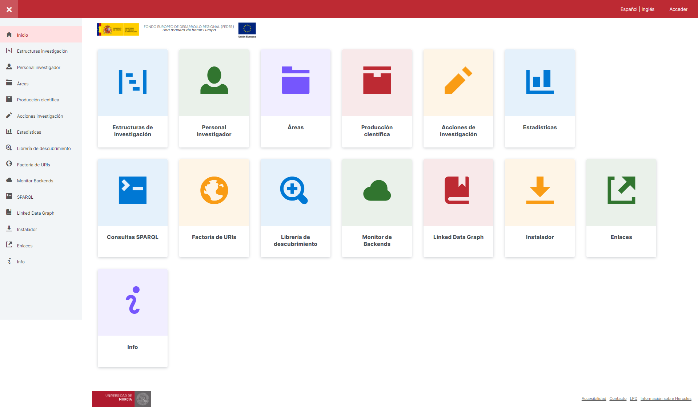

Y las secciones a las que se podrá acceder desde la parte privada, además de las anteriores, es decir una vez logueado con un usuario y contraseña, son las siguientes:

- Gestión de usuarios
- Importador de datos
- Borrado de datos
- ETL

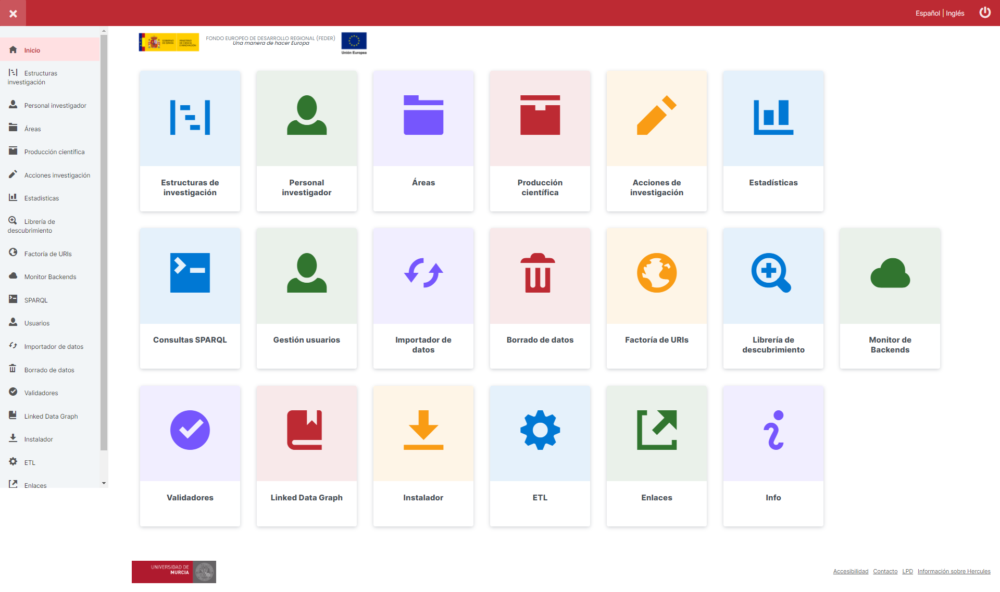

A continuación, se explica cada una de las secciones, agrupadas por acceso público y privado

<a name="accesopublico"></a>
# 3. Acceso Público

Cualquier usuario, sin necesidad de loguearse en el sistema podrá acceder a la información pública del sistema.
A continuación, se detallan las secciones que podrá consultar:

<a name="estructurasinvestigacion"></a>
## 3.1. Estructura de investigación

En esta sección, podremos ver información general sobre las diferentes estructuras de investigación. Las estructuras de investigación, pueden ser de los siguientes tipos:

- Centros

- Universidades

- Fundaciones

- Empresa

- etc

Como se ha explicado en el punto anterior, se podrá acceder a ella a través de la pantalla de inicio o desde el menú de la parte izquierda.

La pantalla dispondrá de una serie de filtros:

- Las diferentes opciones que hay dentro de las estructuras de organización: Universidad, centro, etc. Si se selecciona una de estas sub-opciones, mostrará la información filtrada por ese tipo de estructura en la tabla.
- Un buscador general por nombre de centro.

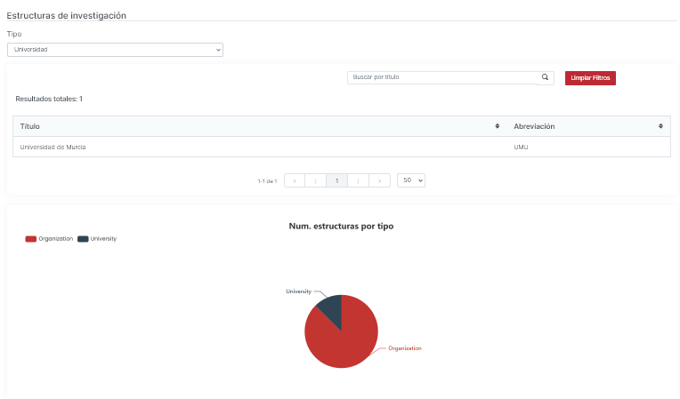


La información que se muestra en esta página tratará de responder, entre otras, a las siguientes preguntas de competencia:

| Pregunta de competencia                                      |
| ------------------------------------------------------------ |
| CQ01. Como usuario requiero obtener un listado de los centros/estructuras de investigación que trabajan en un área/disciplina específica |
| CQ04. Como usuario requiero obtener el Top 10 (o el número que se considere relevante pues será parametrizable) de centros/estructuras de investigación que posean sellos de calidad asociados, por ejemplo: el sello Severo Ochoa. |
| CQ05. Como usuario requiero obtener un listado de los centros/estructuras de investigación que hayan realizado proyectos H2020 y/o proyectos del Plan Estatal. |
| CQ12. Como usuario necesito conocer el porcentaje de participación de un centro/estructura de investigación en proyectos nacionales o europeos. |


### Detalle de una estructura de investigación

Pulsando sobre un centro de investigación en el listado, la web redirigirá a la información de esa estrutura de investigación.
De cada estructura de investigación, se podrá consultar el listado de los investigadores y patentes asociados a dicha estructura.

- **Personal investigador**

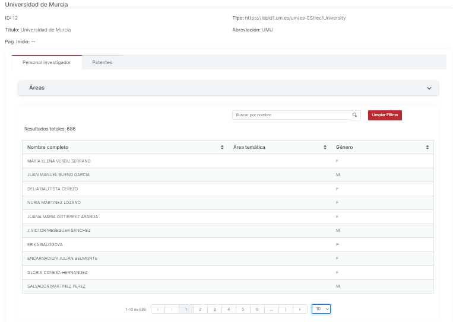


- **Patentes**

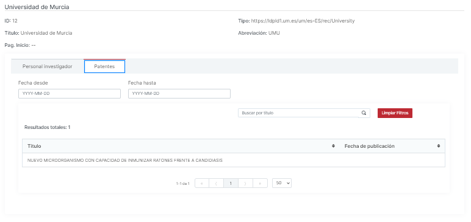


En esta pantalla se responde a las siguientes preguntas de competencia:

| Pregunta de competencia                                      |
| ------------------------------------------------------------ |
| CQ02. Como usuario requiero obtener un listado de los investigadores de un centro/estructura de investigación de un área/disciplina específica. Este listado podrá filtrarse según el tipo de investigador ya sea docente, personal investigador en formación, etc. |
| CQ03. Como usuario requiero obtener el Top 10 (o el número que se considere relevante pues será parametrizable) de los investigadores de un centro/estructura de investigación ordenados por el número de citas, número de publicaciones, h-index, etc. en un área/disciplina específica. |
| CQ06. Como usuario requiero obtener un listado de la producción científica en un determinado rango de fechas de un centro/estructura de investigación en un área/disciplina. Para cada resultado se incluirán algunos metadatos importantes de la producción como, por ejemplo, DOI, año de publicación, etc. |
| CQ09. Como usuario requiero obtener un listado de patentes, diseños industriales, etc. de un centro/estructura de investigación en un área/disciplina. |
| CQ10. Como investigador y personal no investigador de la universidad requiero obtener un listado de los proyectos adjudicados/desarrollados, de un centro/estructura de investigación, de un área/disciplina. |
| CQ12. Como usuario necesito conocer el porcentaje de participación de un centro/estructura de investigación en proyectos nacionales o europeos. |
| CQ17. Como usuario necesito obtener el listado de indicadores con su respectivo valor y unidad de medida (porcentaje, número, etc.) calculados en un periodo de tiempo, ya sea para toda la universidad o para cada centro/estructura de investigación de cada universidad. |

<a name="personalinvestigador"></a>
## 3.2. Personal investigador


Se muestra el personal investigador filtrado por áreas y tipo, se podrá ordenar, cambiar el número de resultados, etc.

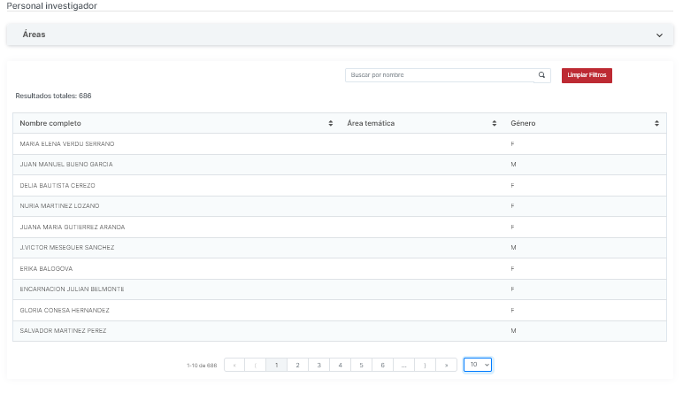

Existe un filtro por áreas que por defecto estará oculto, para ser usado deberá ser desplegado 

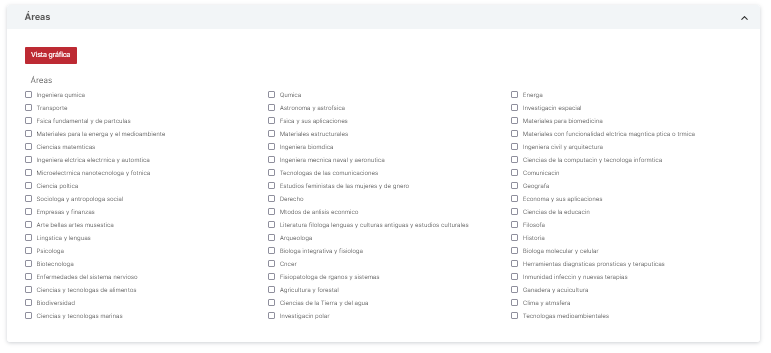

Se utilizan las siguientes preguntas de competencia para el diseño de la pantalla:

| Pregunta de competencia                                      |
| ------------------------------------------------------------ |
| CQ02. Como usuario requiero obtener un listado de los investigadores de un centro/estructura de investigación de un área/disciplina específica. Este listado podrá filtrarse según el tipo de investigador ya sea docente, personal investigador en formación, etc. |
| CQ03. Como usuario requiero obtener el Top 10 (o el número que se considere relevante pues será parametrizable) de los investigadores de un centro/estructura de investigación ordenados por el número de citas, número de publicaciones, h-index, etc. en un área/disciplina específica. [As a user I would like to obtain the Top 10 (or any relevant number, as this would be a parameter) research centers/strutures who have quality seals associated, such as the Severo Ochoa seal.] |
| CQ45. Investigadores que dirigen tesis en programas de doctorado diferentes a los de su Universidad, y cuántas de esas tesis dirigidas han obtenido mención cum laude. |
|                                                              |


### Detalle de personal investigador


- **Acciones de investigación**

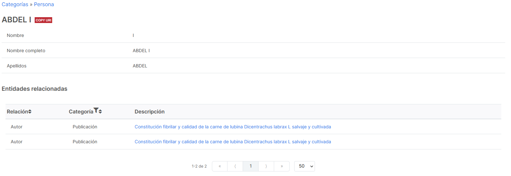


- **Publicaciones científicas**

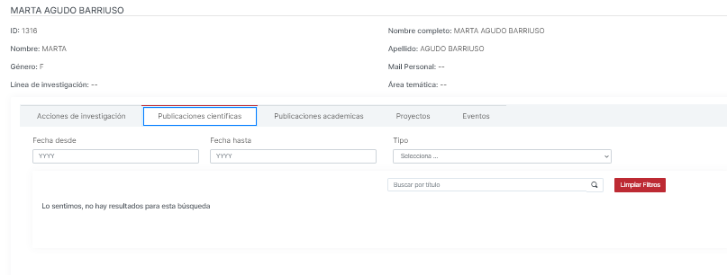


- **Publicaciones académicas**

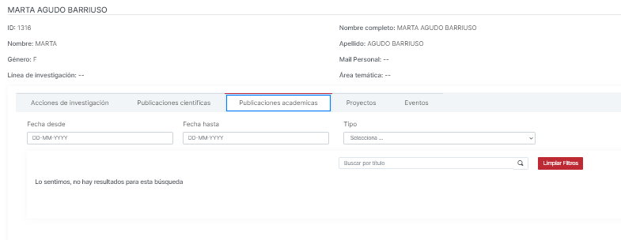

- **Proyectos**

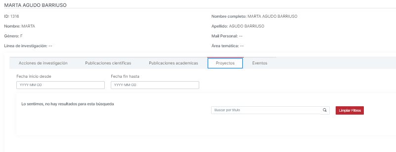


- **Eventos**

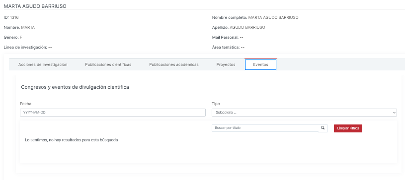


<a name="areas"></a>
## 3.3. Áreas


En esta pantalla se muestra información sobre los datos del módulo vertical "áreas de conocimiento".


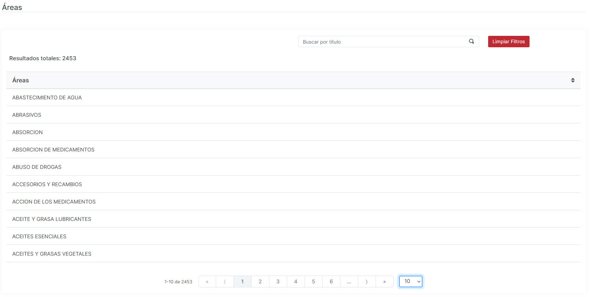


<a name="produccioncientifica"></a>
## 3.4. Producción científica


En esta pantalla, se muestran las publicaciones y los eventos de investigaciones.


### Publicaciones científicas


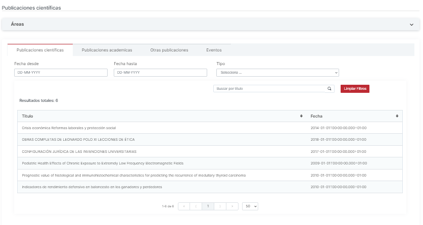

Se podrá acceder al detalle de cada publicación científica pulsando en cada item del listado.


### Publicaciones académicas


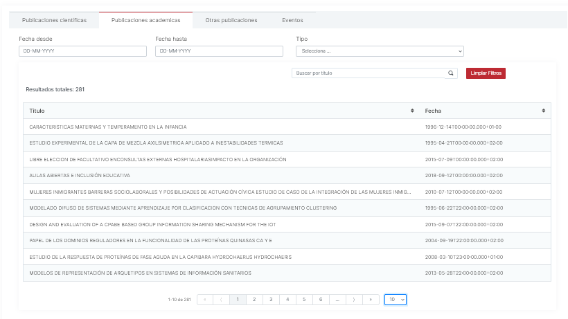

Se podrá acceder al detalle de cada publicación académica pulsando en cada item del listado.

### Otras publicaciones


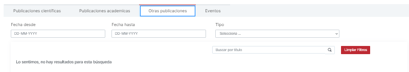

Se podrá acceder al detalle de cada publicación pulsando en cada item del listado.

### Eventos

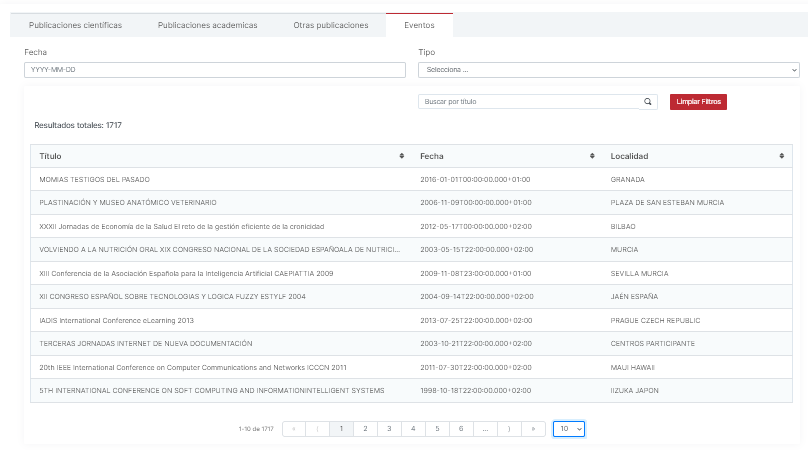

Se podrá acceder al detalle de cada evento pulsando en cada item del listado.


<a name="accionesinvestigacion"></a>
## 3.5. Acciones de investigación


Se divide en dos secciones: Patentes y Proyectos


### Patentes

En esta sección de acciones de investigación se podrán ver las patentes filtradas por nombre y por ámbito.

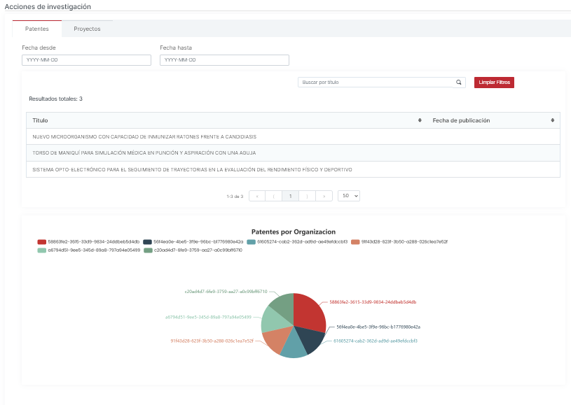

Se podrá acceder al detalle de cada patente pulsando en cada item del listado.

### Proyectos


La tabla podrá ser filtrada por año y por nombre.


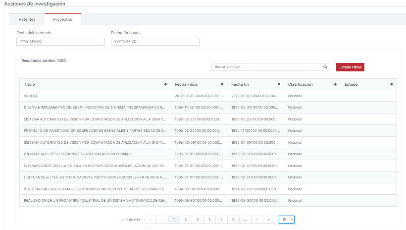

Se podrá acceder al detalle de cada proyecto, pulsando en cada item del listado. En dicho detalle, se podrá consultar la información general del proyecto y los participantes del mismo.

En esta página se muestra la información de las preguntas de competencia relacionadas con proyectos. 

| Pregunta de competencia                                      |
| ------------------------------------------------------------ |
| CQ10. Como investigador y personal no investigador de la universidad requiero obtener un listado de los proyectos adjudicados/desarrollados, de un centro/estructura de investigación, de un área/disciplina, en un determinado año de búsqueda en los que se tenga acceso al detalle de al menos:<br/>○	Nombre del proyecto<br/>○	Palabras claves<br/>○	Tipo de participación: coordinador o participante<br/>○	Tipo de proyecto: competitivo o no competitivo<br/>○	Tipo de financiamiento: público o privado.<br/>○	Tipo de convocatoria: nacional, H2020, etc.<br/>○	Número y listado de personas involucradas en el proyecto<br/>○	Nombre(s) del investigador(s) principal<br/>○	Entregables/memoria del proyecto<br/>○	Producción científica relacionada con el proyecto<br/>○	Entidades colaboradoras/participantes<br/>○	Cuantía<br/>○	etc. |
| CQ46. Estado del arte: ¿puedo ver los resultados de proyectos por temática concreta de proyectos desarrollados en la red, diferenciando a nivel regional, nacional, europeo? |
| CQ13. Como investigador, personal no investigador de la universidad requiero insertar/modificar los datos relacionados con los proyectos de investigación, incluyendo los entregables que se hayan generado en la fase de propuesta. El usuario tendrá acceso a esta información según el nivel de acceso que se le haya proporcionado previamente según su rol, según niveles de confidencialidad de ser el caso. Entre los datos que se proporcionarán por cada proyecto se tendrá al menos:<br/>○	Nombre del proyecto<br/>○	Palabras claves<br/>○	Tipo de participación de la entidad: coordinador o participante<br/>○	Tipo de proyecto: competitivo o no competitivo<br/>○	Tipo de financiamiento: público o privado<br/>○	Tipo de convocatoria: nacional, H2020, etc.<br/>○	Número y listado de personas involucradas en el proyecto<br/>○	Nombre(s) del investigador(s) principal<br/>○	Entregables/memoria del proyecto<br/>○	Producción científica relacionada con el proyecto<br/>○	Entidades colaboradoras/participantes<br/>○	Cuantía<br/> |
| CQ14. Como usuario necesito una visualización [filtering] que me permita explorar la información de cada proyecto según los filtros que haya elegido, por ejemplo, por años, por tipo de convocatoria, por cuantía mayor a determinado valor, según un área/disciplina, según la ubicación geográfica, etc. |

<a name="estadisticas"></a>
## 3.6. Estadísticas

El objetivo de esta sección es que se muestren estadísticas, en base a los datos del sistema.

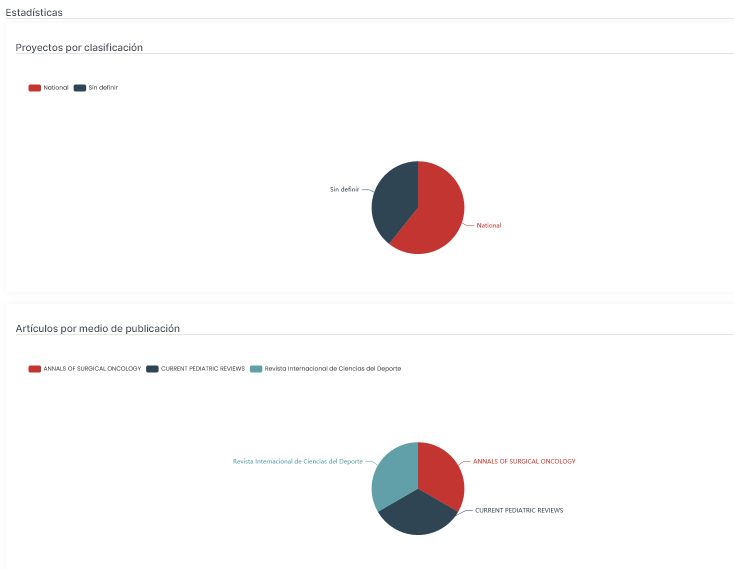

<a name="consultassparql"></a>
## 3.7. Consultas SparQL

A través de esta sección, se podrán visualizar, ejecutar y mantener las consultas de competencia y/o consultas SPARQL predefinidas.
Esta sección, a diferencia de las anteriores, varía si se accede de forma pública o privada. A continuación, se explican las funcionades de la parte pública, y en el apartado 4.1 las funcionalidades que pueden realizarse por un usuario logueado.

- No se podrán guardar consultas
- No se podrán consultas federadas

Al entrar en la pantalla, veremos que está dividida en dos partes
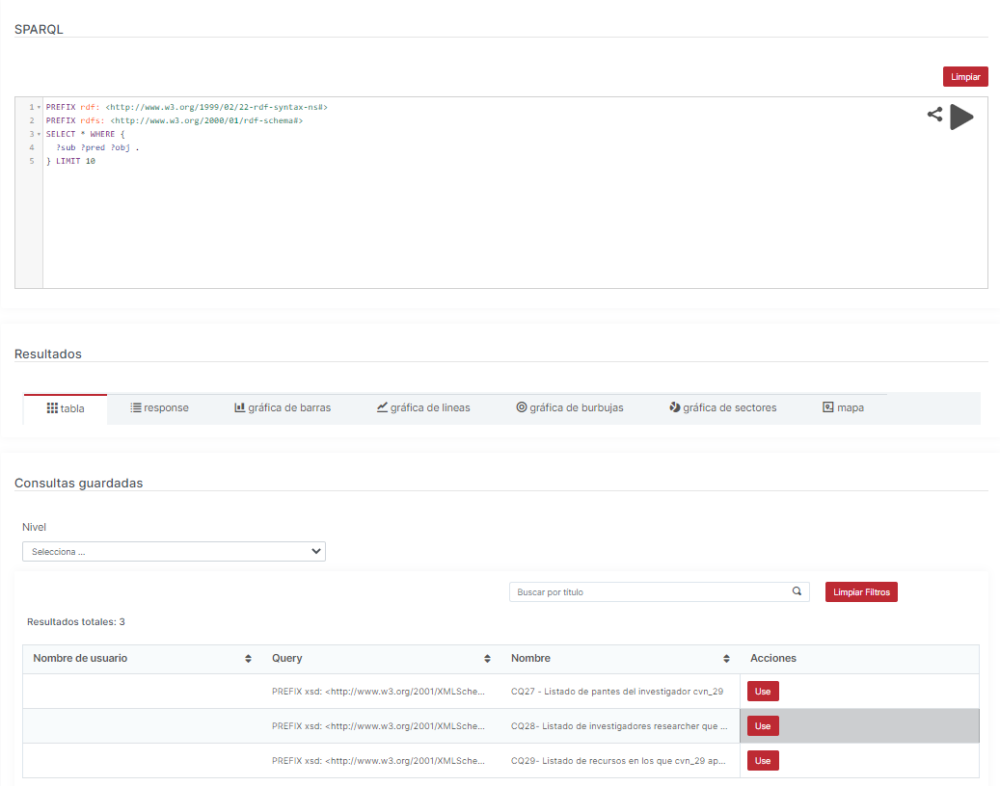
Una parte superior donde se podrán lanzar consultas sparql y ver los resultados y una parte inferior donde se podrán consultar las consultas predefinidas.


<a name="linkeddata"></a>
## 3.8. Linked Data Graph

A través de esta sección se accederá al Linked Data Graph. En una primera pantalla se mostrará el contador de registros por entidad.

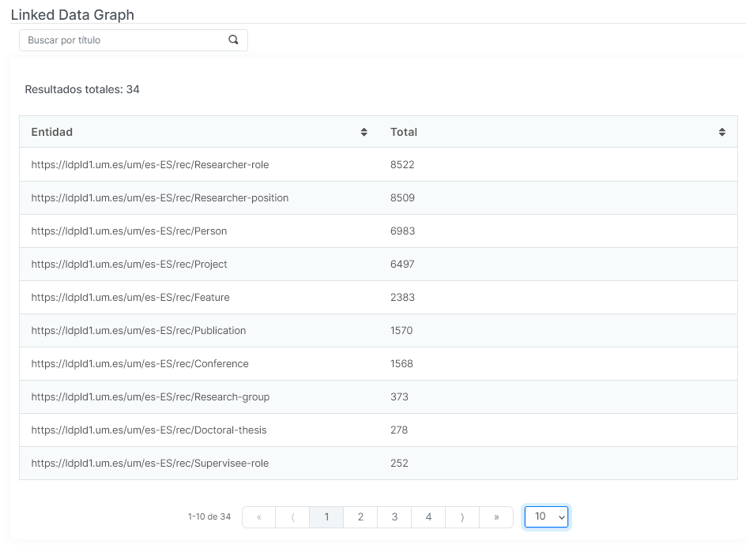

A través del cajetín de búsqueda se podrán realizar consultas sobre el grafo.

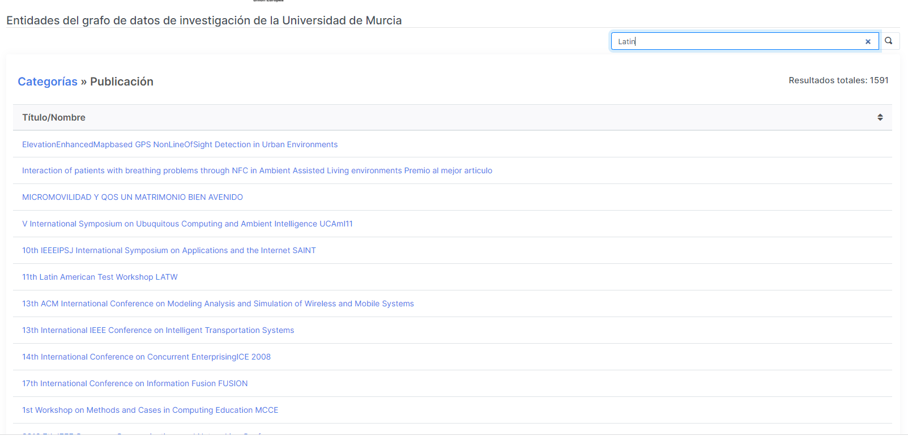

<a name="instalador"></a>
## 3.9. Instalador

A traves de esta sección se podrá acceder a las instrucciones de instalación, teniendo dos opciones.
 * instalación manual
 * instalación a través de script

<a name="enlaces"></a>

<a name="libreriadescubrimiento"></a>

## 3.10. Librería de descubrimiento

Desde esta opción de menú podremos realizar consultas sobre la librería de descubrimiento. Visualizando tanto datos estadísticos de los objetos, como realizar búsquedas de similitudes.

Básicamente podemos acceder a tres pestañas distintas, aunque las pestañas de Búsqueda y Resultados, solo son visibles en la zona privada, para un usuario administrador


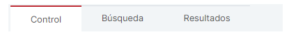


En esta documentación se comentaran las tres y se indicara claramente que opciones seran solo visibles para usuarios administradores

### Control (público)

Visible para cualquier perfil de usuario, básicamente muestra estadísticas

* Estado de la librería de descubrimiento: Muestra el estado y la sincronización  de los datos en la librería de descubrimiento, en tres tipos de almacenamientos:

  * Redis: Cache
  * Elasticsearh: Motor de búsqueda
  * Real Data: Estructuras de datos en memoria

  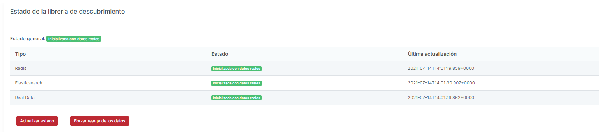

  

  También muestra dos botones:

  * Actualizar estado: Refresca la tabla que se esta visualizando
  * Forzar recarga de los datos: Esta acción, fuerza a la librería de descubrimiento a obtener todos los datos desde el Triple Store, y actualizar Redis y Elasticsearch. Es una acción pesada, que dejara inactiva la librería de descubrimiento, por un periodo de tiempo dependiente de la volumetria de datos, por lo tanto esta acción esta restringida a administradores.

* Estadísticas de objetos: En esta sección es posible visualizar las estadísticas relativas  a la importancia de un determinado atributo para una determinada entidad, filtrando por Nodo, Triple Store y Clase.

  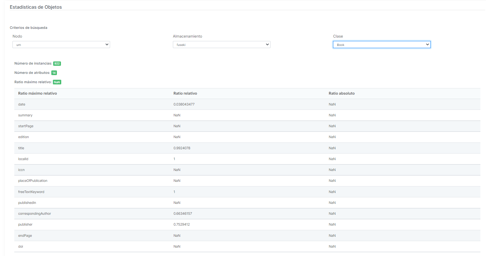

  

<a name="factoriauris"></a>

## 3.11. Factoría de URIs

Desde esta sección se podrán realizar consultas a la factoría de URIS y de esta forma poder visualizar las URIs de una entidad en concreto, por ejemplo.

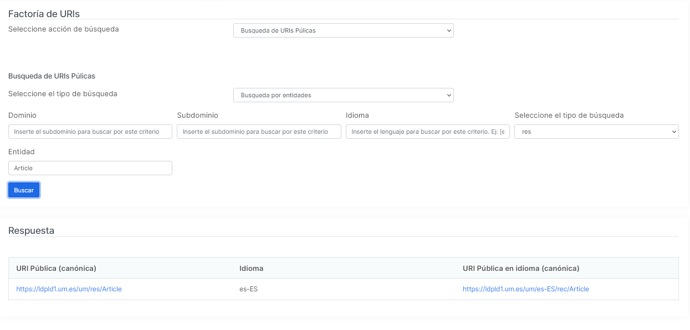 

Esta pantalla pretende dar soporte a las acciones que para un usuario puedan tener sentido a la hora de interactuar con la Factoría de URIs. 

Podemos seleccionar el tipo de URI, por medio del selector que aparece en la pantalla principal

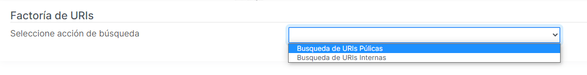

Básicamente implementa la funcionalidad para obtener URIs de recursos, ya sean:

### URIs Públicas 

Son aquellas que siguen el [esquema de URIs Hércules](https://github.com/HerculesCRUE/ib-asio-docs-/blob/master/08-Esquema_de_URIs_H%C3%A9rcules/ASIO_Izertis_ArquitecturaDeURIs.md), implementado por la [Factoría de URIs](https://github.com/HerculesCRUE/ib-uris-generator).

Lo primero que veremos es un selector, donde podemos seleccionar el tipo de recurso al que queremos acceder

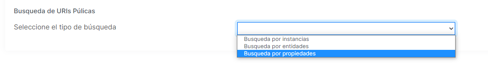

Para los distintos tipos de recursos, veremos distintos tipos de formularios, todos ellos comparten los selectores:

* Dominio:  Dominio de la URI, definido en el [esquema de URIs Hércules](https://github.com/HerculesCRUE/ib-asio-docs-/blob/master/08-Esquema_de_URIs_H%C3%A9rcules/ASIO_Izertis_ArquitecturaDeURIs.md). El campo es opcional, si se informa se filtrara por ese criterio
* Subdominio: Subdominio de la URI, definido en el [esquema de URIs Hércules](https://github.com/HerculesCRUE/ib-asio-docs-/blob/master/08-Esquema_de_URIs_H%C3%A9rcules/ASIO_Izertis_ArquitecturaDeURIs.md). El campo es opcional, si se informa se filtrara por ese criterio
* Idioma: Idioma en la cual se definió la URI, definido en el [esquema de URIs Hércules](https://github.com/HerculesCRUE/ib-asio-docs-/blob/master/08-Esquema_de_URIs_H%C3%A9rcules/ASIO_Izertis_ArquitecturaDeURIs.md). El campo es opcional, si se informa se filtrara por ese criterio
* Tipo: Tipo de recursode la URI, definido en el [esquema de URIs Hércules](https://github.com/HerculesCRUE/ib-asio-docs-/blob/master/08-Esquema_de_URIs_H%C3%A9rcules/ASIO_Izertis_ArquitecturaDeURIs.md). El campo es opcional, si se informa se filtrara por ese criterio

Los siguientes campos son obligatorios según el tipo de recurso buscado:

* Instancias: URIs de instancias concretas, por ejemplo un investigador concreto

  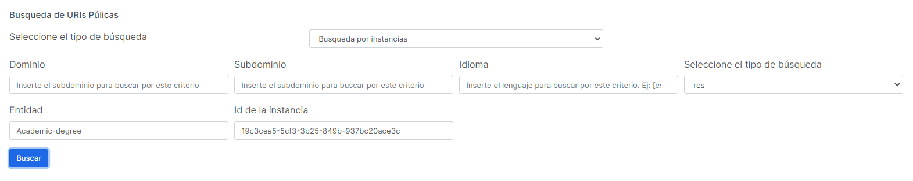

  * Entidad:  Clase de la entidad a la que pertenece la instancia, definido en el [esquema de URIs Hércules](https://github.com/HerculesCRUE/ib-asio-docs-/blob/master/08-Esquema_de_URIs_H%C3%A9rcules/ASIO_Izertis_ArquitecturaDeURIs.md). El campo es obligatorio.
  * Id:  Identificador de la instancia, definido en el [esquema de URIs Hércules](https://github.com/HerculesCRUE/ib-asio-docs-/blob/master/08-Esquema_de_URIs_H%C3%A9rcules/ASIO_Izertis_ArquitecturaDeURIs.md). El campo es obligatorio.

* Entidades:  URIs de clases las que pertenecen las instancias

  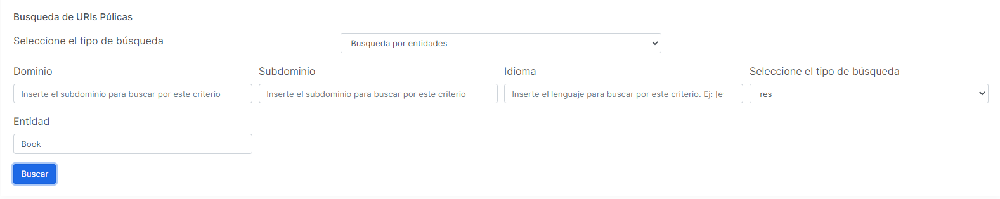

  * Entidad:  Clase de la entidad que queremos buscar, definido en el [esquema de URIs Hércules](https://github.com/HerculesCRUE/ib-asio-docs-/blob/master/08-Esquema_de_URIs_H%C3%A9rcules/ASIO_Izertis_ArquitecturaDeURIs.md). El campo es obligatorio.

* Propiedades: URIs de propiedades que tienen tanto las instancias como las clases

  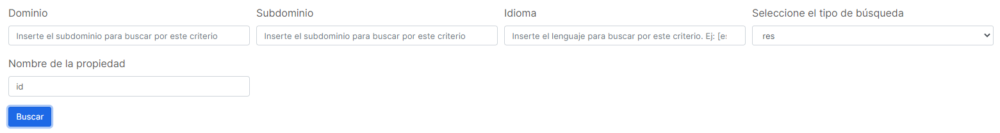

  * Propiedad:  Nombre de la propiedad que queremos buscar, definido en el [esquema de URIs Hércules](https://github.com/HerculesCRUE/ib-asio-docs-/blob/master/08-Esquema_de_URIs_H%C3%A9rcules/ASIO_Izertis_ArquitecturaDeURIs.md). El campo es obligatorio.

La respuesta podrá visualizarse como una tabla con una lista de resultados

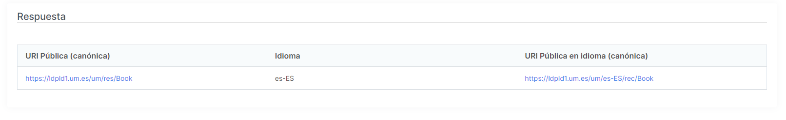

### URIs Privadas

Son aquellas que URIs des-referenciables, que indican la ubicación real del recurso.

Podemos acceder a dichas URIS  a partir de la URI Canónica del recurso, descrito en el apartado anterior.

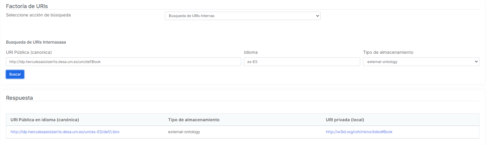

<a name="monitorbackends"></a>

## 3.12. Monitor Backends

Desde el monitor de Backends se podrá visualizar la información sobre los distintos backends que esté federados.

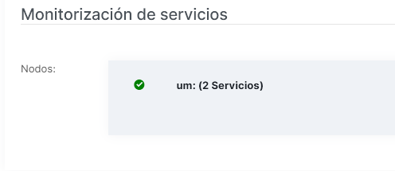

Estos aparecerán como paneles anidados, que podrán ser desplegados pulsando en ellos. Como se aprecia en la imagen, cada nivel muestra información de el contenido del siguiente nivel, por ejemplo, en la imagen se aprecian 2 nodos:

* um: Que contiene 2 servicios
* um2: Que contiene 1 servicio

En cuanto a los niveles, son 3:

* Nivel de nodo: Indica un backend completo, por ejemplo um para la Universidad de Murcia. Al desplegar un nodo podemos seleccionar si el nodo esta activo o no, para participar las consultas Federadas del [Endpoint SPARQL](#4.1.-Consultas-SparQL). Para todos los Backends que no sean el backend desde el cual estamos usando el front (para este, esa opción estará desactivada), podemos cambiar el estado a activado o desactivado.

  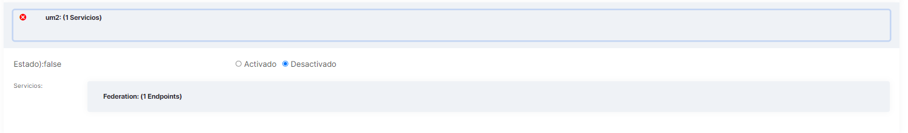

* Nivel de servicio: Servicios expuestos, dentro de un determinado nodo y sus estados

  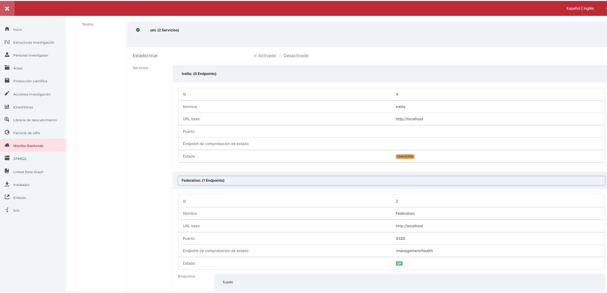

* Nivel de Endpoints: Aquí podemos ver los endpoints desplegados para cada servicio

  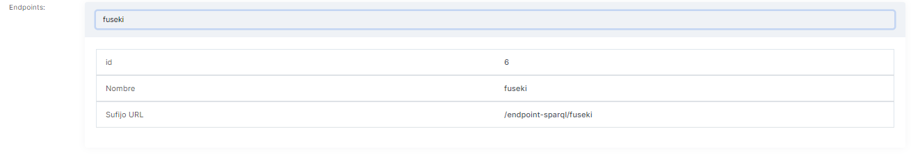


## 3.13. Enlaces

En la sección de enlaces se podrán encontrar enlaces de interes, tales como:

* Enlace al repositorio de la tercera ontologia
* Enlace al repositorio de Hércules
* Enlace a asio-docs
* ....

<a name="informacion"></a>
## 3.14. Información

En esta sección podremos encontrar una descripción del proyecto Hércules.

<a name="accesoprivado"></a>


# 4. Acceso privado

Para loguearse en el sistema, deberá accederse a la parte superior derecha y pulsar en "Acceder", ahí deberá introducir el nombre de usuario y contraseña.
Cuando el usuario introduzca estos datos y pulse el botón "Log In", la aplicación comprobará si los datos introducidos son correctos. Si estos datos son correctos entonces se mostrarán más secciones en el menu y en la pantalla de inicio.

<a name="consultassparqlprivado"></a>
## 4.1. Consultas SparQL

Además de tener las mismas funcionalidades comentadas en el apartado 3.7, si el usuario está logueado, podrá además:
- Guardar consultas
- Lanzar consultas federadas. 

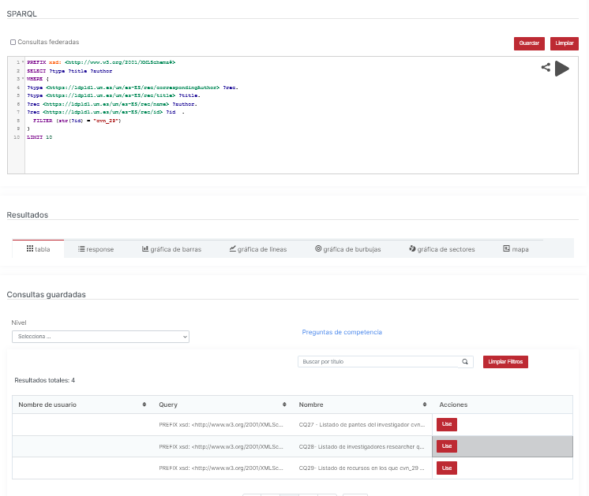

Se tiene la posibilidad de ejecutar una consulta sparQL y guardar dicha consulta que ha diseñado pulsando el botón “Guardar”, al pulsarlo se le solicitará un nombre identificativo de la consulta:


En la mitad inferior de la pantalla se cuenta con un panel para la administración y uso de las consultas sparQL almacenadas. Desde él podrá filtrar las consultas, tanto las propias como las predefinidas en el sistema.
Una vez localizada la consulta que le interese utilizar, se podrá cargar en el formulario sparQL para su posterior uso pulsando sobre el botón “Usar”.
Para las consultas propias, existe la opción de borrar, no así para las predefinidas del sistema.

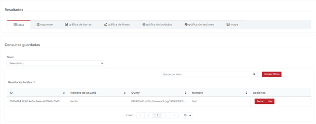

En la sección de consultas guardadas podremos encontrar las consultas predefinidas establecidas para todos los usuarios

<a name="libreriadescubrimiento"></a>
## 4.2. Librería de descubrimiento

Desde esta opción de menú podremos realizar consultas sobre la librería de descubrimiento. Visualizando tanto datos estadísticos de los objetos, como realizar búsquedas de similitudes.

Básicamente podemos acceder a tres pestañas distintas, aunque las pestañas de Búsqueda y Resultados, solo son visibles en la zona privada, para un usuario administrador


### Búsqueda (Privado)

En esta pestaña están agrupadas todas las acciones de búsqueda posibles para la librería de descubrimiento.

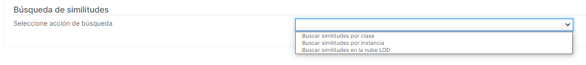

Cada acción de búsqueda muestra un formulario especifico, pero existen ciertos atributos comunes para todos los formularios como son:

* **Nodo**: (seleccionable) Nodo de origen a partir del cual se realizara la búsqueda de similitudes.
* **Almacenamiento**: (seleccionable) Triple Store donde se buscarán las similitudes.
* **Clase**: (seleccionable) Clase o entidad para la que se realizara la búsqueda.
* **Hacer petición síncrona**: (check) Determina si la aplicación esperará por la respuesta o no. Se recomienda desmarcarlo siempre, ya que es una petición pesada, y el tiempo de respuesta puede ser considerable. En caso de no hacerse síncrona, la petición se procesara cuando la librería de descubrimiento este preparada para hacerlo. En el momento de hacer la petición se mostrara un numero de petición a partir del cual se puede recuperar la respuesta una vez procesada.
* **Aplicar búsqueda solo en deltas**: (check) Determina la búsqueda se realizara solo en las entidades que pudiese haber cambiado desde la última búsqueda, reduciendo considerablemente el tiempo necesario para procesar la petición (salvo en el caso de ser la primera búsqueda, o que haya cambiado un numero considerable de entidades desde la última)
* **Buscar en otros Backends**: (check) Determina la búsqueda se realizara solo en el Backend seleccionado, o se compararan las entidades de dicho Backend con las entidades de otros Backends. Obviamente el tiempo necesario para ejecutar la acción aumenta drásticamente, por lo que se aconseja, mantenerlo desactivado.  

Básicamente se dispone de tres tipos de búsqueda:

#### Búsqueda de similitudes por clase

Esto lanzará una búsqueda de similitudes, para comparar todas las instancias de una misma clase (o solo los deltas si el check esta activado).

No tiene parámetros adicionales a los ya explicados.

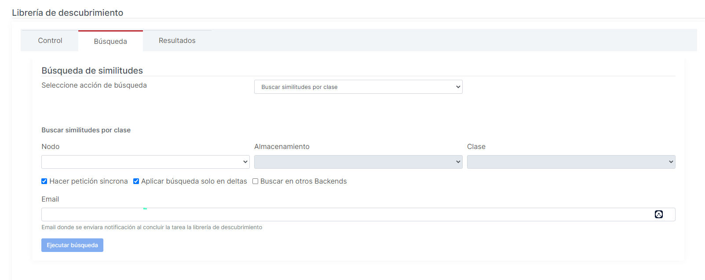

#### Búsqueda de similitudes por clase

Esto lanzará una búsqueda de similitudes, para comparar todas las instancias de una misma clase (o solo los deltas si el check esta activado).

No tiene parámetros adicionales a los ya explicados.


La respuesta es la descrita en la sección [Respuesta](#Respuesta).

#### Búsqueda de similitudes por instancia

Esto lanzará una búsqueda de similitudes, para comparar una determinada instancia, pasada como parámetro, con el resto de instancias de su misma clase almacenadas en el Triple Store.

Tiene algún parámetro adicional:

* **id de la entidad:** Sera usado para poder visualizar claramente en la respuesta, sobre que entidad se realizo la búsqueda.
* **Atributos del objeto en formato JSON:** Conjunto de atributos que se usaran en la comparación, en formato JSON.

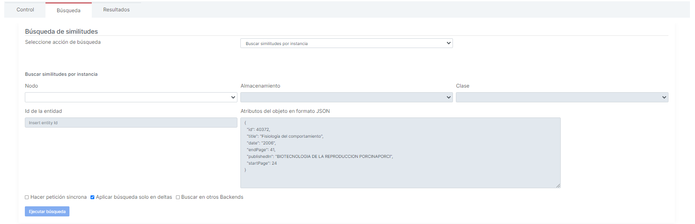

La respuesta es la descrita en la sección [Respuesta](#Respuesta).

#### Búsqueda de similitudes en la nube LOD

Esto lanzará una búsqueda de similitudes, entre las instancias de una determinada clase, en un determinado nodo, y en un determinado Triple Store, con las instancias similares que pudiese encontrar en la Nube LOD (dataset externos, definidos para el proyecto).

Tiene algún parámetro adicional:

* **Datasource:** Dataset externo donde se realizara la búsqueda de instancias similares. * (Wilcard --All--) indica que se realizara la búsqueda en todos los dataset definidos, obviamente esto implica un mayor tiempo de proceso.

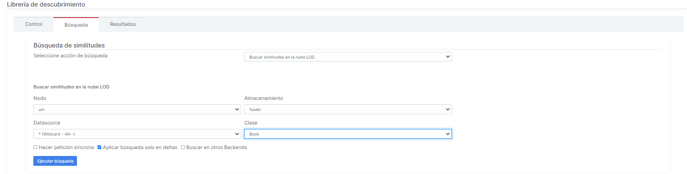

La respuesta es la descrita en la sección [Respuesta](#Respuesta).

#### Respuesta

La respuesta a una búsqueda de similitud, depende de si la petición se realiza de forma síncrona o asíncrona.

Para una petición asíncrona la respuesta será como la que se muestra en la imagen.

Los campos coloreados en verde, son aquellos que necesitaremos para recuperar la respuesta, cuando esta esta disponible, según se describe en la sección [Resultados](#Resultados-(Privado)).


Para una petición síncrona la respuesta será idéntica a la descrita en la sección [Resultados](#Resultados-(Privado))

### Resultados (Privado)

En esta pestaña se pueden recuperar cualquier tipo de respuesta a cualquier petición anterior hecha a la librería de descubrimiento.

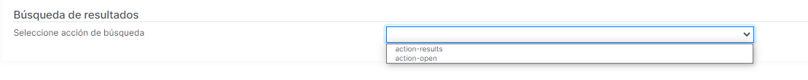

Estas pueden ser de dos tipos:

* **action-results:** Permite recuperar la respuesta de una petición concreta.
* **action-open:** Permite recuperar todas las respuestas que necesitan intervención del usuario para desambiguar una similitud.

#### Action Result

Permite recuperar la respuesta de una petición concreta.

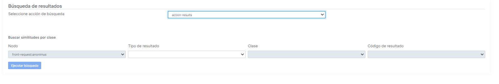

Para ello dispone de los siguientes parámetros:

* Usuario: Selecciona automáticamente el usuario que realiza la petición, por medio del login. No permite otra selección
* Tipo de resultado: 
  * CLASS SEARCH: Para búsqueda de resultados por clase.
  * INSTANCE SEARCH: Para búsqueda de resultados por instancia.
  * LOD SEARCH: Para búsqueda de resultados en la nube LOD.
* Clase: Clase donde se realizo la búsqueda.
* Código de resultado: Desplegable donde para los filtros anteriores, podemos ver las respuestas disponibles y seleccionarla. Se muestra información del codigo de petición (que se facilita al ejecutar una búsqueda y fecha y hora de la petición)

#### Action Open

Permite recuperar todas las similitudes que están es estado abierto, es decir, requieren una acción del usuario para desambiguar las similitudes.

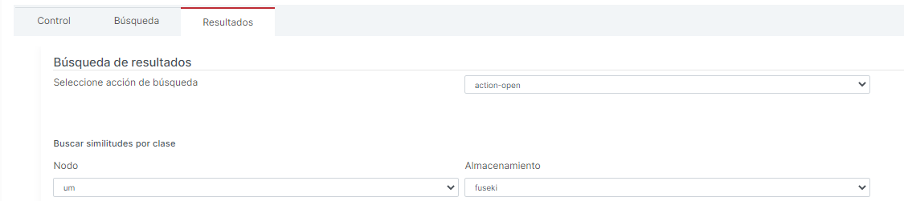

Para ello dispone de los siguientes parámetros:

* Nodo: Filtra por nodo
* Almacenamiento: Filtra por almacenamiento

#### Respuestas

Las respuestas suelen ser complejas, y tiene varios niveles, para que un usuario pueda ver solo la información que precise.

##### Sección de metadatos

En esta parte podemos visualizar metadatos de la propia petición, como por ejemplo, cuando fue hecha, sobre que triple store, para que clase, su estado, y el instante de comienzo y fin

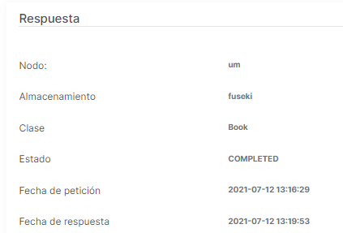

##### Sección de Resultados de similitudes

Podemos ver en una lista desplegable (al desplegar veremos el detalle de cada entidad), las similitudes para las cuales ha encontrado algun tipo de similitud.

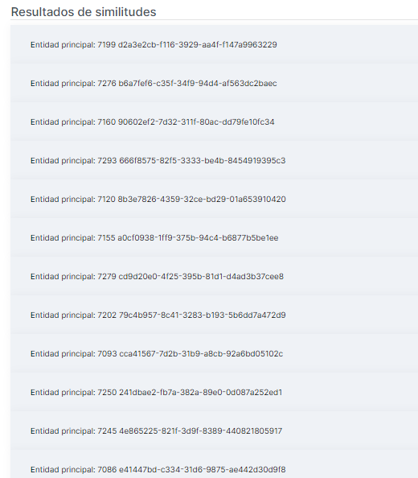

##### Detalle de Resultado de similitud para una entidad (al desplegar las anteriores)

Al seleccionar cada una de las anteriores podemos ver el detalle de la similitud

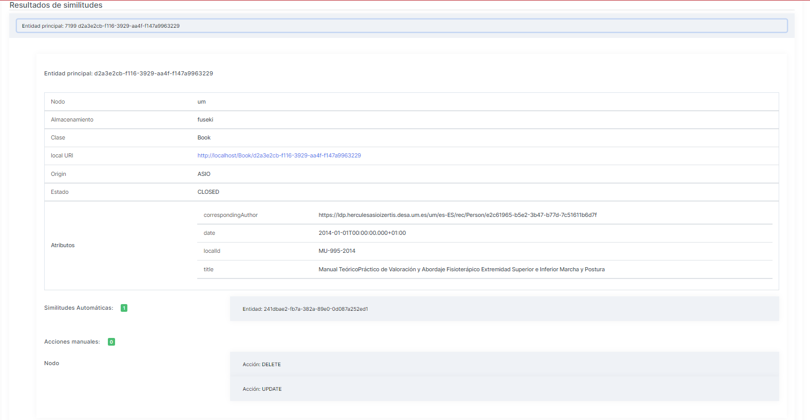

En la primera parte de la imagen se muestra detalle de la entidad principal que acabamos de desplegar, y también sus atributos.

En las siguientes secciones veremos tres secciones que describiremos a continuación:

* Detalle de la entidad relacionada: Común para todas las entidades relacionadas, ya sean en Similitudes automáticas, manuales o acciones, descrita en el apartado [Detalle de Resultado de entidad relacionada](#Detalle-de-Resultado-de-entidad-relacionada)

* Similitudes automáticas: Donde se muestra el detalle de la entidad relacionada, para aquellas similitudes con grado suficiente para desencadenar acciones automáticas.

* Similitudes manuales: Donde se muestra el detalle de la entidad relacionada, para aquellas similitudes que no tienen grado suficiente para desencadenar acciones automáticas. En este caso aparecerán dos botones para que el usuario pueda desechar la similitud o aceptarla. Esto desencadenara las acciones correspondientes en la librería de descubrimiento

  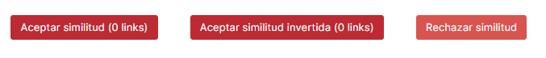

* Acciones: Listado de acciones realizadas por la librería de descubrimiento tras detectar la similitud

  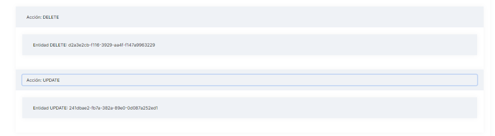

##### Detalle de Resultado de entidad relacionada

Básicamente muestra la misma información que la tabla anterior con algunos matices

* Similaridad: Grado de similaridad de esta entidad con respecto a la entidad principal relacionada
* Similaridad sin id: Grado de similaridad sin tener en cuenta el atributo id de esta entidad con respecto a la entidad principal relacionada
* Tabla de atributos: En esta caso muestra 3 columnas en vez de 2 como en el caso anterior, ya que además de mostrar el valor de el atributo para la entidad relacionada, también lo muestra para la principal, de forma que sea sencillo compararlas.

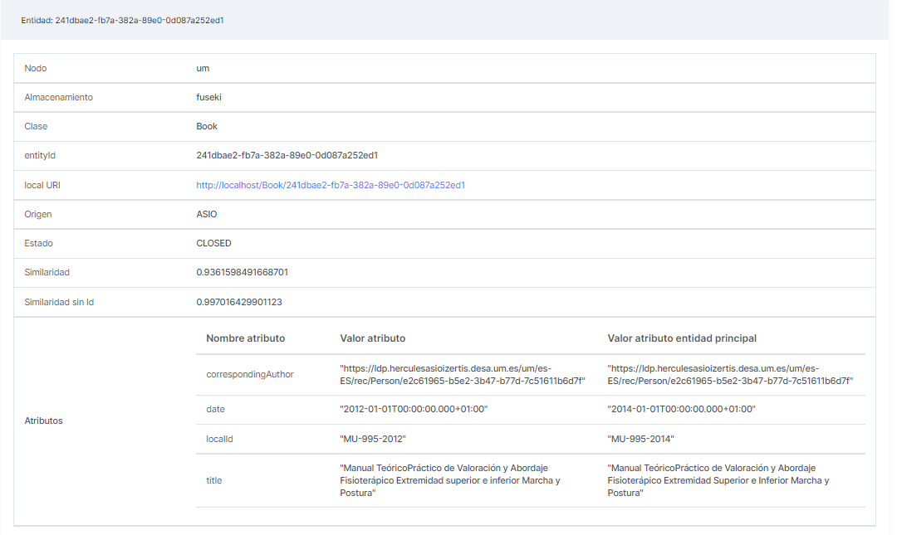

<a name="importador"></a>

## 4.3. Importador de datos

Esta nueva pantalla estará solamente accesible desde la parte privada.

Al acceder a la pantalla de importación de datos el usuario podrá visualizar el listado de ejecuciones de importación, así como detalles de quién lanzó la ejecución o con qué frecuencia es ejecutada esa tarea. Tal y como se muestra en la imagen de abajo.

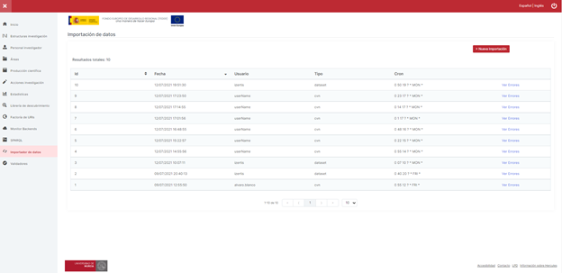

El usuario podrá visualizar un pop-up con un listado de errores en la ejecución, sí es que los hubo clicando en el enlace “Errores”.

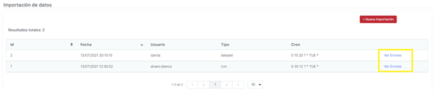

Desde la pantalla de importación de datos se podrán seleccionar el tipo de importación a realizar, así como sus parámetros de configuración. En caso de que el usuario no introduzca ningún parámetro la aplicación establecerá la configuración por defecto.

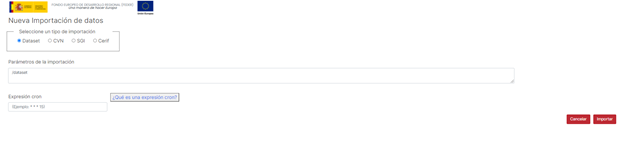

El usuario podrá definir una expresión cron, indicando la frecuencia de ejecución de la importación. Para usuarios no experimentados con las expresiones cron se ha habilitado un link explicativo de cómo funcionan las expresiones cron.

### Tipos de importadores

A continuación, se explican los 4 tipos de importaciones que se pueden realizar:
- Dataset: Importación de datos procedentes de Murcia, ficheros xml.
- CVN: Importación de datos procedentes de CVN.
- SGI: Importación de datos procedentes de SGI HERCULES.
- CERIF: Importación de datos procedentes de CERIF.

| **Importador** | **Configuración** **por** **defecto** |
| ------------------------------------------------------------ |
| **Dataset** | APP_DATA_PATH: /home/herculesizertis/resourcesFull/dataset |
| **CVN** | http://curriculumpruebas.um.es/curriculum/rest/v1/auth |
| **SGI** | http://herc-as-front-desa.atica.um.es/oai-pmh-xml/OAI_PMH |
| **CERIF** | https://cris.uns.ac.rs/OAIHandlerOpenAIRECRIS |

### Importación de datos Dataset

El usuario deberá previamente subir los ficheros xml que se quieran importar a una carpeta en el servidor, por defecto esta carpeta es /home/herculesizertis/resourcesFull/dataset. Si se quisiera cambiar esta ruta bastaría con indicarla en la sección parámetros de la importación en la variable: APP_DATA_PATH.
Para subir estos ficheros el usuario deberá conectarse a la máquina mediante FTP, utilizando cualquier cliente FTP disponible en el mercado por ejemplo WinSCP en entornos Windows o GIGOLO para entornos Linux.

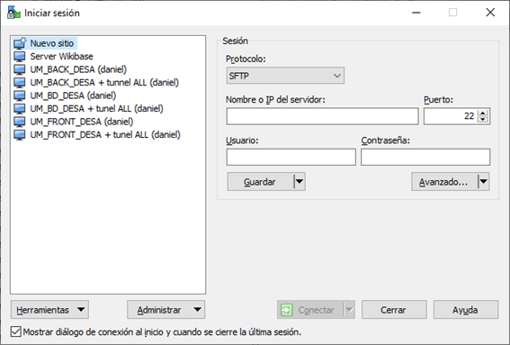

### Importación de datos CVN

Para la importación de este tipo de datos basta con especificar la ruta del endpoint que sirve los datos del CVN. Este planteamiento permite fácilmente cambiar el origen de importación de los CVN con tan solo modificar el parámetro de entrada del endpoint.

### Importación de datos SGI y CERIF
Al igual que el apartado anterior, para este tipo de importación basta con indicar la url del endpoint encargada de devolver los datos o utilizar en su defecto las ya preestablecidas.


<a name="borrado"></a>
## 4.4. Borrado de datos

A través de la sección de Borrado, se podrá restaurar los datos a una versión anterior, seleccionando una fecha. Para ello se debe seleccionar una fecha y pulsar en el botón Restaurar:


Esta funcionalidad envía un correo al área de sistemas con los pasos a seguir del backup.

Para realizar el borrado OAI-PMH, debe consultarse esta documentación: https://github.com/HerculesCRUE/ib-dataset-importer/blob/master/manual-borrado-oai-pmh.md


<a name="validadores"></a>
## 4.5. Validadores

Desde esta sección, un usuario logueado, podrá añadir Shapes que se aplicarán en el proceso de importación.
El proceso de importación usa las Shapes definidas por este mecanismo y se guardarán las trazas de dicho error de forma que un usuario pueda comprobar que elementos de la importación no han podido ser insertados por algún incumplimiento de lo definido en las Shapes, y su causa.

En definitiva, esta interfaz de Validación tiene las siguientes funcionalidades:
•	Crear, modificar y borrar shape expresión relacionadas con una entidad o propiedad.
•	Visualizar y tener una trazabilidad completa de las instancias que incumplen las shapes, y por lo tanto no son insertadas.

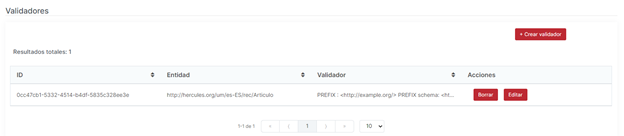

A través de esta pantalla, se podrán visualizar, editar o añadir las shapeEx que serán utilizadas posteriormente para validar cada una de las entidades. Si para alguna entidad no existe, no se realizará la validación.

Para crear un nuevo validador, se deberá pulsar en "Crear validador" y rellenar el siguiente formulario:


Durante el proceso de importación, una vez generado el RDF, se verificará si existe una ShapeEx definida para cada entidad. El usuario administrador, podrá visualizar el informe de errores de validación ocurridos en el proceso de importación, a través del histórico de importaciones, tal como se muestra en la siguiente imagen:


<a name="gestionusuarios"></a>

## 4.6. Gestión de usuarios

La gestión de usuarios se realiza a través de la herramienta keycloak. Para acceder a ella bastará con pulsar sobre el enlace que verá el administrador una vez autenticado en la plataforma.

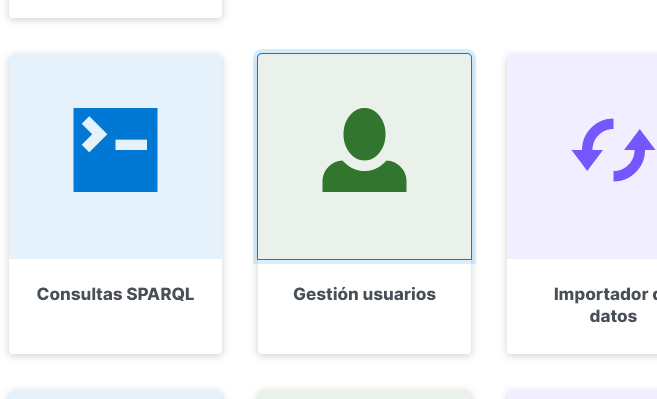

Nos llevará a keycloak donde tendremos que introducir el usuario de dicha herramienta.

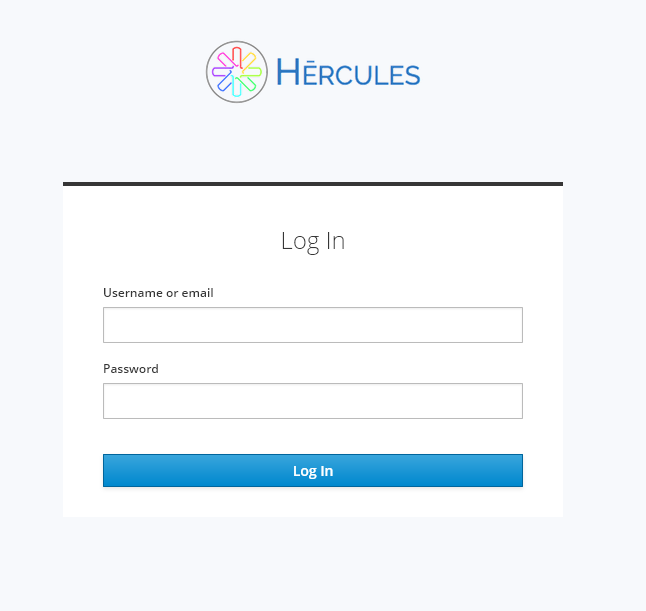

Una vez dentro podremos visualizar todas las opciones de configuración de keycloak. Para acceder a la gestión de usuarios bastará con pulsar sobre el enlace marcado.

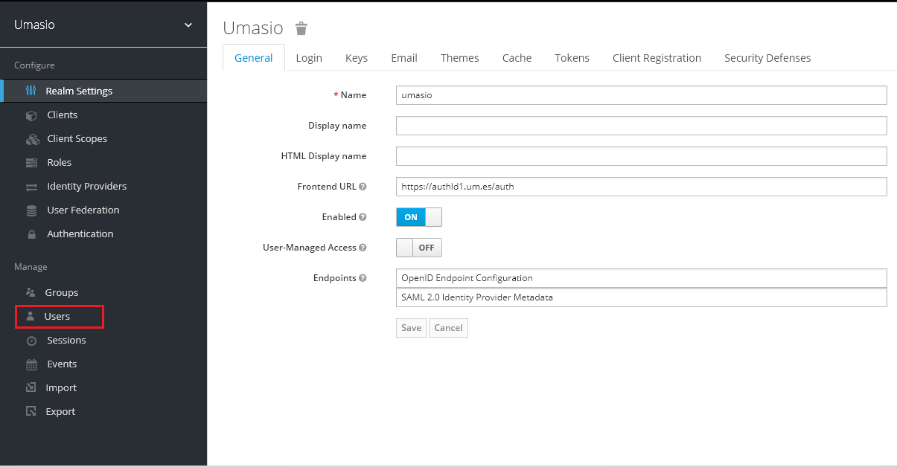


Desde esta pantalla se podrán filtrar los usuarios, editarlos, eliminarlos o añadir nuevos usuarios.


### Nuevos usuarios

Desde la opción de Add User accederemos al formulario de nuevo usuario

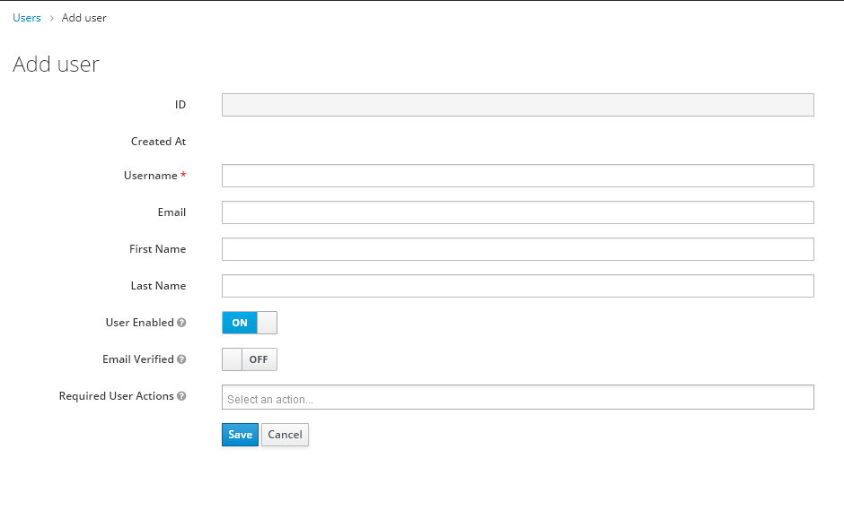

### Editar usuario

Para editar un usuario bastará con pulsar el enlace "Edit" que aparece en su registro.

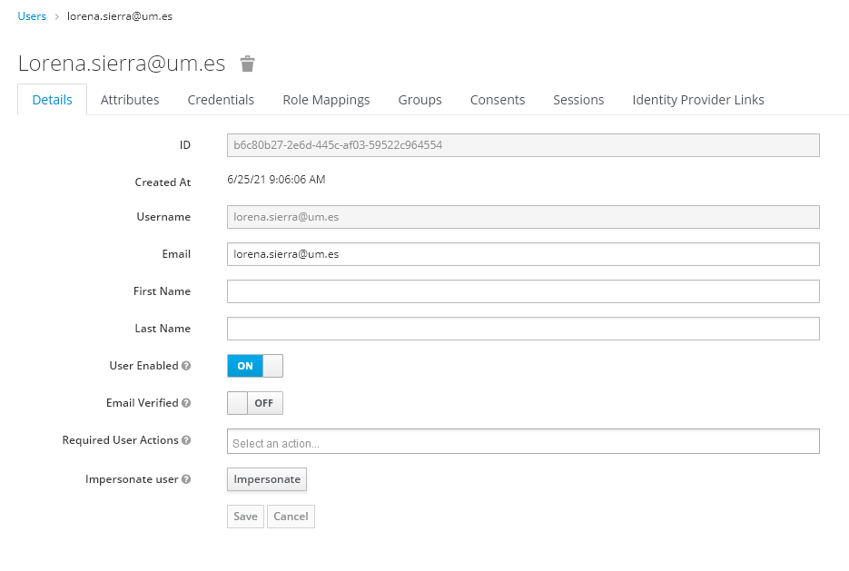

Podremos visualizar las propiedades que llegan desde SIR

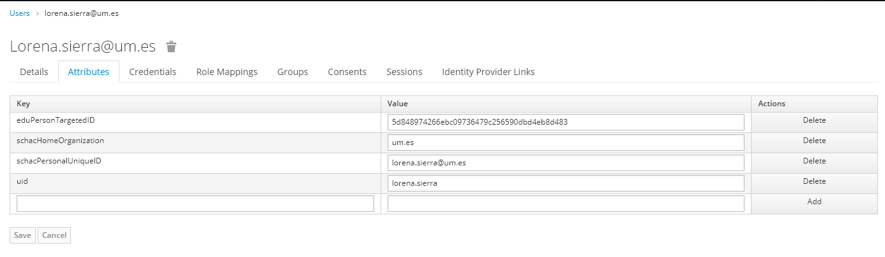

Tambien se podrá realizar el reseteo de la contraseña, pudiendo introducir una temporal que el usuario deberá cambiar, o dejando una establecida.

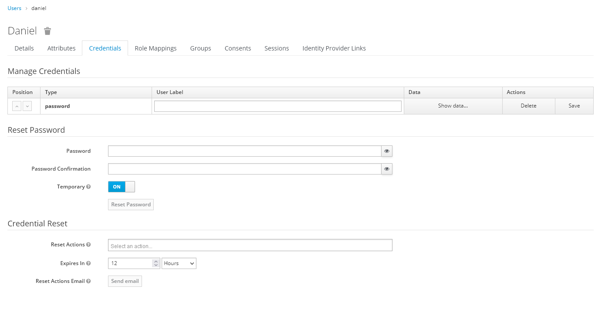

Para gestionar los roles de un usuario será necesario acceder a la pestaña "Role Mappings"


<a name="ETL"></a>

## 4.7. ETL

Es posible modificar o crear procesos de ETL desde la interface grafica por medio de la integración con la herramienta Spoon Web, que a su vez está conectada directamente con el servicio PDI, que ejecutara el proceso ETL.


Existe documentación detallada en el [manual de usuario](https://github.com/HerculesCRUE/ib-dataset-etl) de  el proyecto dataset-etl.

<a name="trellis"></a>

# 5. Trellis

Para acceder a la máquina de Trellis se necesita usuario y contraseña de la UM y se accede a través de la siguiente dirección:

- Entorno de desarrollo: https://ldpld1desa.um.es
- Entorno de preproducción: https://ldpld1.um.es


Al acceder a Trellis se nos muestra una pantalla con el listado de datos que tenemos en el Triplestore, como se puede ver en la siguiente imagen:


Al pulsar sobre cualquiera de las entradas, se muestra el detalle:


<a name="wikibase"></a>
# 6. Wikibase

A través de la plataforma de Wikibase podemos acceder también a los datos importados:
`http://wb.herculesasioizertis.desa.um.es/`


Desde la opción de "Cambios Recientes" se pueden consultar los últimos cambios en los datos y acceder a ellos.


Se pueden ver los detalles pulsando sobre estos datos, o sobre los resultados de una consulta SparQL.


A través de las consultas SparQL también se podrán obtener los datos que nos interesen:

`http://wbquery.herculesasioizertis.desa.um.es/`


## Ejemplos de consultas de Wikibase:

```
#Proyectos y su grupo de investigación
SELECT ?nombreProyecto ?descripcionGrupoInvestigacion
WHERE
{
   ?proyecto wdt:P3 "http://hercules.org/um/es-ES/rec/Proyecto/".
   OPTIONAL { ?proyecto wdt:P13/wdt:P4 ?descripcionGrupoInvestigacion }
   ?proyecto wdt:P11 ?nombreProyecto.
}
```

```
#Proyectos con y sin grupo de investigacion
SELECT ?proyectoLabel ?grupoInvestigacionLabel
WHERE
{
   ?proyecto wdt:P3 "http://hercules.org/um/es-ES/rec/Proyecto/".
   OPTIONAL { ?proyecto wdt:P13 ?grupoInvestigacion }
  SERVICE wikibase:label { bd:serviceParam wikibase:language "[AUTO_LANGUAGE]". }
}
```

```
#Número de proyectos por grupo de investigacion (incluye desconocidos)
#defaultView:BubbleChart
SELECT ?grupoInvestigacion (COUNT(?proyecto) AS ?count)
WHERE
{
   ?proyecto wdt:P3 "http://hercules.org/um/es-ES/rec/Proyecto/";
   OPTIONAL { ?proyecto wdt:P13/wdt:P4 ?grupoInvestigacion }.
   BIND(IF(BOUND(?grupoInvestigacion),?grupoInvestigacion,"Desconocido") AS ?grupoInvestigacion).
}
GROUP BY ?grupoInvestigacion
```

```
#Proyectos con grupo de investigacion
SELECT ?proyectoLabel ?grupoInvestigacionLabel
WHERE
{
   ?proyecto wdt:P3 "http://hercules.org/um/es-ES/rec/Proyecto/".
   ?proyecto wdt:P13 ?grupoInvestigacion
  SERVICE wikibase:label { bd:serviceParam wikibase:language "[AUTO_LANGUAGE]". }
}
```


Para más información sobre como manejar Wikibase se puede consultar la guía de [Wikidata](https://www.wikidata.org/wiki/Help:Contents).


