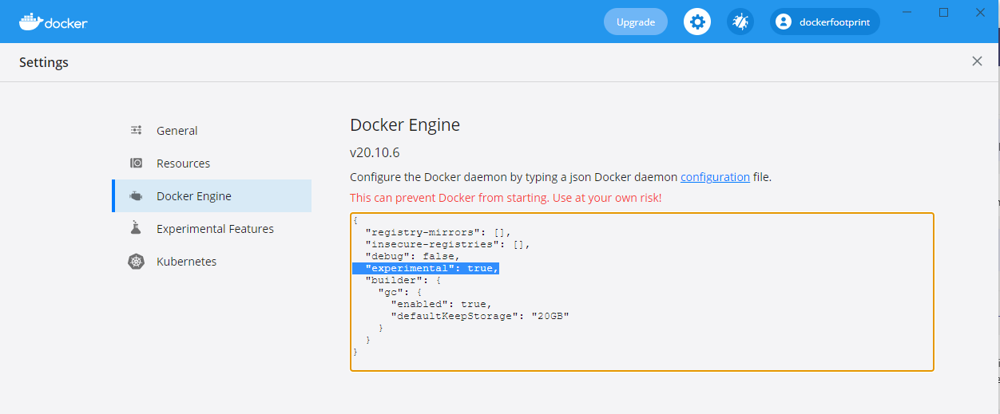
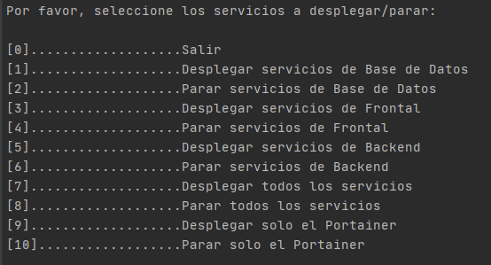
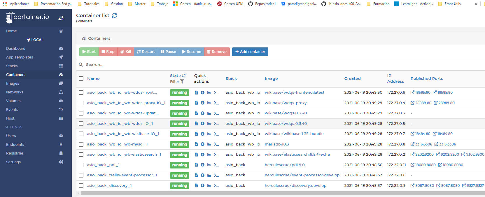

# Instalador ASIO

El presente documento, describe el Script de instalación implementado con python.

Se puede encontrar una documentación completa del proceso de instalación en el [Manual de despliegue](https://github.com/HerculesCRUE/ib-asio-docs-/blob/master/00-Arquitectura/Manual_de_despliegue/manual_de_despliegue.md), ya que dicho Script implementa los pasos aquí descritos, y en la presente documentación se referenciaran varios de los apartados aquí descritos.

En cualquier caso debe usarse para el completo entendimiento de las acciones aquí descritas la información contenida en el [Manual de despliegue](https://github.com/HerculesCRUE/ib-asio-docs-/blob/master/00-Arquitectura/Manual_de_despliegue/manual_de_despliegue.md). 

## Requisitos Hardware

Los requisitos hardware son obviamente los mismos que en el proceso de instalación manual, puede servir como referencia la estimación para los entornos de desarrollo y test que ha resultado ser bastante ajustada a la realidad, descrita en la sección [Hardware e infraestructura para los despliegues.](https://github.com/HerculesCRUE/ib-asio-docs-/blob/master/00-Arquitectura/Manual_de_despliegue/manual_de_despliegue.md#21-hardware-y-e-infraestructura-para-los-despliegues)

Básicamente se estima unos 16GB de RAM para los servicios de DB y de FRONT y 32GB para los servicios de BACK, es decir un total de 64 GB. 

## Requisitos Software

Los requisitos software son los mismos que los descritos en la sección [instalación de dependencias](https://github.com/HerculesCRUE/ib-asio-docs-/blob/master/00-Arquitectura/Manual_de_despliegue/manual_de_despliegue.md#31-instalaciones-de-dependencias).

Obviamente hay que adaptar lo aquí descrito (para una máquina Unix), a el tipo de máquina donde queremos realizar el despliegue: 

* [Docker](https://docs.docker.com/get-docker/)
* [docker-compose](https://docs.docker.com/compose/install/)
* [Python 3](https://www.python.org/downloads/)

Adicionalmente a esto, puede ser necesario configurar para algunos servicios la cantidad de memoria de la maquina virtual java dentro para los contenedores docker.

Para hacerlo en maquinas **Windows** puede ser necesario ejecutar los siguientes comandos:

```sh
wsl -d docker-desktop
sysctl -w vm.max_map_count=262144
```

Para **Linux**:

```sh
sudo sysctl -w vm.max_map_count=262144
sudo sysctl -w fs.file-max=65536
```

## 

Por otro lado en entornos Windows es necesario configurar Docker con configuración experiemental, que integra docker-compose en el motor de docker.





```{
  "registry-mirrors": [],
  "insecure-registries": [],
  "debug": false,
  "experimental": true,
  "builder": {
    "gc": {
      "enabled": true,
      "defaultKeepStorage": "20GB"
    }
  }
}
```

Por otro lado para instalar las dependencias en de el proyecto, antes de ejecutar el Script es necesario, ejecutar el comando`pip install -r requirements.txt` desde la raíz del instalador.

## Descripción del instalador

Para ejecutar el instalador, es necesario descargar **todos** los ficheros que se encuentran en el directorio [ASIO_Installer](https://github.com/HerculesCRUE/ib-asio-docs-/tree/master/00-Arquitectura/ASIO_Installer)

En dicho directorio podemos encontrar distintos tipos de ficheros entre los que se encuentran:

* Otros módulos Python que son necesarios para el proceso de instalación
* Ficheros de configuración yaml que describen el despliegue de los contenedores docker (en la ruta environments/nombre de maquina[DB | FRONT | BACK])
* Ficheros de configuración de variables de entorno usadas por los contenedores, (en la ruta environments/nombre de maquina[DB | FRONT | BACK]/env)

## Instalador

Podemos ejecutar el instalador mediante el comando

```Python deployer.py```

Tras lo cual podremos ver el menú de despliegue




Básicamente el menú ofrece opciones de despliegue y parada de los servicios relacionados con Front, DB, Backend, todos los servicios y Portanier.

El despliegue se realiza mediante la ejecución de distintos docker-compose  para orquestar el despliegue de los contenedores docker. Las imágenes publicas de dichos contenedores, están alojadas en [docker hub](https://hub.docker.com/search?q=herculescrue&type=image), por lo que la primera vez que se invoque el despliegue desde una determinada maquina, se procederá a la descarga de todas las imágenes definidas en el fichero docker-compose.yml.

Tal como se comenta en el documento [Manual de despliegue](https://github.com/HerculesCRUE/ib-asio-docs-/blob/master/00-Arquitectura/Manual_de_despliegue/manual_de_despliegue.md#21-hardware-y-e-infraestructura-para-los-despliegues), existen ciertas dependencias entre servicios, básicamente, a nivel de el instalador, es necesario seguir el siguiente orden:

1. Despliegue de servicios de DB
2. Despliegue de servicios de FRONT
3. Despliegue de servicio de BACK

### Despliegue de servicios BD

La ejecución de la opción 2 (Desplegar servicios de Base de Datos),  automatizara el despliegue de los servicios descritos en la sección [Servicios desplegados en DB](https://github.com/HerculesCRUE/ib-asio-docs-/blob/master/00-Arquitectura/Manual_de_despliegue/manual_de_despliegue.md#241-servicios-desplegados-en-db) , siguiendo los pasos que se describen en [Despliegue de Maquina DB](https://github.com/HerculesCRUE/ib-asio-docs-/blob/master/00-Arquitectura/Manual_de_despliegue/manual_de_despliegue.md#321-m%C3%A1quina-db) del manual de despliegue  (a excepción del servicio Portainer, que debe instalarse una vez por cada máquina física).

Los servicios desplegados, lo harán con un nombre de prefijo ASIO_DB_XXXX, por lo que  podemos visualizarlos mediante el comando 

`docker ps | grep ASIO_DB`

### Despliegue de servicios FRONT

La ejecución de la opción 2 (Desplegar servicios de Frontal),  automatizara el despliegue de los servicios descritos en la sección [Servicios desplegados en FRONT](https://github.com/HerculesCRUE/ib-asio-docs-/blob/master/00-Arquitectura/Manual_de_despliegue/manual_de_despliegue.md#242-servicios-desplegados-en-front) , siguiendo los pasos que se describen en [Despliegue de Maquina Front](https://github.com/HerculesCRUE/ib-asio-docs-/blob/master/00-Arquitectura/Manual_de_despliegue/manual_de_despliegue.md#322-m%C3%A1quina-front) del manual de despliegue (a excepción del servicio Portainer, que debe instalarse una vez por cada máquina física).

Los servicios desplegados, lo harán con un nombre de prefijo ASIO_FRONT_XXXX, por lo que  podemos visualizarlos mediante el comando 

`docker ps | grep ASIO_FRONT`

Los servicios desplegados para la maquina front requieren conocer la IP publica por la que pueden acceder a la maquina de DB y BACK y esta será solicitada durante el proceso de despliegue.

#### Servicio Gateway

El servicio Gateway es el encargado de exponer el resto de servicios (solo los que es necesario exponer), centralizándolos en un solo punto de acceso (un servidor nginx).

Para ellos es necesario gestionar adecuadamente los ficheros de configuración.

En los siguientes puntos, se enumeraran los pasos necesarios, para realizar la configuración (en este caso con un certificado auto firmado). Obviamente es necesario adaptar dichos pasos a la configuración deseada para un entorno real.

##### Generación de certificado auto firmado para pruebas (solo si no se dispone de otro tipo de certificado)

```
######################
# Become a Certificate Authority
######################

# Generate private key
openssl genrsa -des3 -out myCA.key 2048
# Generate root certificate
openssl req -x509 -new -nodes -key myCA.key -sha256 -days 825 -out myCA.pem

######################
# Create CA-signed certs
######################

NAME=mydomain.com # Use your own domain name
# Generate a private key
openssl genrsa -out $NAME.key 2048
# Create a certificate-signing request
openssl req -new -key $NAME.key -out $NAME.csr
# Create a config file for the extensions
>$NAME.ext cat <<-EOF
authorityKeyIdentifier=keyid,issuer
basicConstraints=CA:FALSE
keyUsage = digitalSignature, nonRepudiation, keyEncipherment, dataEncipherment
subjectAltName = @alt_names
[alt_names]
DNS.1 = $NAME # Be sure to include the domain name here because Common Name is not so commonly honoured by itself
DNS.2 = bar.$NAME # Optionally, add additional domains (I've added a subdomain here)
IP.1 = 192.168.0.13 # Optionally, add an IP address (if the connection which you have planned requires it)
EOF
# Create the signed certificate
openssl x509 -req -in $NAME.csr -CA myCA.pem -CAkey myCA.key -CAcreateserial \
-out $NAME.crt -days 825 -sha256 -extfile $NAME.ext

```

##### Ficheros de configuración

Los ficheros de configuración se encuentran en la ruta (relativa a ASIO_Installer) **./environtments/front/gateway/conf.d** 

Para gestionar los certificados, tenemos que usar el fichero **ssl.conf**

```
server {
  listen 80;
  listen [::]:80;
  return 301 https://$host$request_uri;
}

server {
  # listen 443            ssl;
  # listen [::]:443       ssl;
  listen 80;

  server_name hercules1testgrp.atica.um.es;

  ############ En esta Ruta establecemos los certificados
  ssl_certificate     /etc/nginx/certs/certificado.chain.pem;   ### Ruta a la clave publica
  ssl_certificate_key /etc/nginx/certs/privada.pem;             ### Ruta a la clave privada

  ssl_session_cache shared:SSL:50m;
  ssl_session_timeout  30m;

  # ssl_dhparam /etc/nginx/certs/dhparam.pem;

  ssl_protocols TLSv1 TLSv1.1 TLSv1.2;
  ssl_ciphers 'ECDHE-ECDSA-CHACHA20-POLY1305:ECDHE-RSA-CHACHA20-POLY1305:ECDHE-ECDSA-AES128-GCM-SHA256:ECDHE-RSA-AES128-GCM-SHA256:ECDHE-ECDSA-AES256-GCM-SHA384:ECDHE-RSA-AES256-GCM-SHA384:DHE-RSA-AES128-GCM-SHA256:DHE-RSA-AES256-GCM-SHA384:ECDHE-ECDSA-AES128-SHA256:ECDHE-RSA-AES128-SHA256:ECDHE-ECDSA-AES128-SHA:ECDHE-RSA-AES256-SHA384:ECDHE-RSA-AES128-SHA:ECDHE-ECDSA-AES256-SHA384:ECDHE-ECDSA-AES256-SHA:ECDHE-RSA-AES256-SHA:DHE-RSA-AES128-SHA256:DHE-RSA-AES128-SHA:DHE-RSA-AES256-SHA256:DHE-RSA-AES256-SHA:ECDHE-ECDSA-DES-CBC3-SHA:ECDHE-RSA-DES-CBC3-SHA:EDH-RSA-DES-CBC3-SHA:AES128-GCM-SHA256:AES256-GCM-SHA384:AES128-SHA256:AES256-SHA256:AES128-SHA:AES256-SHA:DES-CBC3-SHA:!DSS';
  ssl_prefer_server_ciphers on;

  add_header Strict-Transport-Security max-age=15768000;
}
```

El resto de ficheros, contienen la configuración para cada uno de los servicios expuestos por el servidor nginx

* app.conf: Configuración para exponer el frontal Web
* benchmarks.conf: Configuración para exponer los Bechmarks
* graylog.conf: Configuración para exponer Graylog (logs centralizados)
* keycloak.conf: Configuración para exponer Keycloak (autorización y autentificación)
* ldp.conf: Configuración para exponer el servidor LDP (Trellis)
* portainer.conf: Configuración para exponer el Portainer (monitorización de servicios)
* reports.conf: Configuración para exponer los resultados de los Test
* samltest.conf: Configuración para exponer test SAML

Para cada fichero de configuración hay que configurar:

* Mapeo entre servicio docker y ruta en nginx
* Protocolos y puertos
* Certificados

```
upstream docker-front { ## Servicio docker que mapearemos en nginx, con el formato (nombre de servicio en docker o ip expuesta y puerto)
  server web-publication-service:80;
}

upstream docker-backend {  ## Servicio docker que mapearemos en nginx, con el formato (nombre de servicio en docker o ip expuesta y puerto)
  server web-publication-backend:8080;
}

server {  ## Puertos que seran expuestos en este caso 443 o https. 
  listen 443            ssl;
  listen [::]:443       ssl;
  # listen 80;

  ### DNS Que se mapeara al servicio (debe coincidir con la que aparece en el certificado)
  server_name linkeddata1test.um.es;

  ### Rutas de certificados
  ssl_certificate     /etc/nginx/certs/certificado.chain.pem;
  ssl_certificate_key /etc/nginx/certs/privada.pem;

  location / { # Mapeo
    
    proxy_pass            http://docker-front;
    proxy_http_version 1.1;
    proxy_set_header Upgrade $http_upgrade;
    proxy_set_header Connection 'upgrade';
    proxy_set_header Host $host;
    proxy_set_header X-Forwarded-Host $host:$server_port;
    proxy_set_header X-Forwarded-For $proxy_add_x_forwarded_for;
    proxy_set_header X-Forwarded-Proto $scheme;
    proxy_cache_bypass $http_upgrade;

  }

  location /api/ { # Mapeo
    
    proxy_pass            http://docker-backend/api/;
    proxy_http_version 1.1;
    proxy_set_header Upgrade $http_upgrade;
    proxy_set_header Connection 'upgrade';
    proxy_set_header Host $host;
    proxy_set_header X-Forwarded-Host $host:$server_port;
    proxy_set_header X-Forwarded-For $proxy_add_x_forwarded_for;
    proxy_set_header X-Forwarded-Proto $scheme;
    proxy_cache_bypass $http_upgrade;

  }
}
```

Para que las rutas sean accesibles por DNS, hay que adquirir el dominio y estos deben de estar propagados. Para las pruebas, obviamente esto no sucederá y por lo tanto es necesario introducir los DNS en el fichero host local del cliente

### Despliegue de servicios BACK

La ejecución de la opción 2 (Desplegar servicios de Backend),  automatizara el despliegue de los servicios descritos en la sección [Servicios desplegados en Backend](https://github.com/HerculesCRUE/ib-asio-docs-/blob/master/00-Arquitectura/Manual_de_despliegue/manual_de_despliegue.md#243-servicios-desplegados-en-back) , siguiendo los pasos que se describen en [Despliegue de Maquina DB](https://github.com/HerculesCRUE/ib-asio-docs-/blob/master/00-Arquitectura/Manual_de_despliegue/manual_de_despliegue.md#323-m%C3%A1quina-back) del manual de despliegue (a excepción del servicio Portainer, que debe instalarse una vez por cada máquina física).

Los servicios desplegados, lo harán con un nombre de prefijo ASIO_FRONT_XXXX, por lo que  podemos visualizarlos mediante el comando 

`docker ps | grep ASIO_FRONT`

Los servicios desplegados para la maquina back requieren conocer la IP publica por la que pueden acceder a la maquina de DB y FRONT y esta será solicitada durante el proceso de despliegue.

## Ficheros relevantes para el instalador

Dentro del directorio environments, podemos ver todos los ficheros de configuración que afectan a el despliegue de los contenedores, donde podemos ver los directorios back, db, front y portainer, que obviamente, contienen los ficheros relativos a el cada uno de los despliegues del mismo nombre.

En cada uno de las carpetas podemos ver distintos tipos de dicheros:

### Ficheros docker-compose

Son los que orquestan el despliegue de los servicios, normalmente existen varios asociados al despliegue de una sola maquina.

Todos los que se invocaran están descritos en cada uno de los aparatados por maquinas en el apartados [despliegue de servicios](https://github.com/HerculesCRUE/ib-asio-docs-/blob/master/00-Arquitectura/Manual_de_despliegue/manual_de_despliegue.md#32-despliegue-de-servicios), del documento manual de despliegue.

### Ficheros para variables de entorno

Siempre se encuentran (de existir) en el directorio **env** y tienen la extensión **.env**.

En principio ya están configurados adecuadamente para funcionar, pero si se desea alterar el comportamiento de algún servicio puede ser necesario cambiar algunos valores, tal y como se describe en el documentación disponible en el repositorio de cada uno de los servicios.

### Ficheros de configuración

Adicionalmente, algunos servicios precisan de ficheros de configuración.

Podemos encontrarlos siempre dentro de la ruta de cada una de las maquinas, normalmente con el nombre del servicio.

En principio ya están configurados adecuadamente para funcionar, pero si se desea alterar el comportamiento de algún servicio puede ser necesario cambiar algunos valores, siendo conveniente para ello, consultar la documentación especifica del servicio.


## Servicios expuestos

Tras completar la instalación podemos visualizar el estado con el portainer (de cada maquina), los servicios, su estado, logs y puertos por los que estan expuestos




En cualquier caso en la presente tabla podemos ver un resumen de servicios y puertos

Expuestos configurados como públicos y expuestos por el gateway

| SERVICIO                 | Descripción                                | Maquina del servicio | DNS Gateway                               | Dirección y puerto expuesto |
| ------------------------ | ------------------------------------------ | -------------------- | ----------------------------------------- | --------------------------- |
| Web Publication Service  | Aplicación frontal Web                     | FRONT                | app.herculesasioizertis.desa.um.es        | ip_maquina_front:80         |
| Web Publication Backend  | Backend del frontal web                    | FRONT                | app.herculesasioizertis.desa.um.es/api    |                             |
| Benckmarks               | Aplicación Web Benchmarks                  | FRONT                | benchmarks.herculesasioizertis.desa.um.es | ip_maquina_front:8081       |
| Graylog                  | Monitorización de logs                     | BACK                 | graylog.herculesasioizertis.desa.um.es    | ip_maquina_back:9001        |
| Keycloak                 | Servicio de autorización y autentificación | FRONT                | auth.herculesasioizertis.desa.um.es       | ip_maquina_front:8080       |
| Trellis                  | Servidor LDP                               | FRONT                | ldp.herculesasioizertis.desa.um.es        | ip_maquina_front:8083       |
| Portainer                | Monitorización de Servicios                |                      | portainer.herculesasioizertis.desa.um.es  | ip_maquina_portainer:9001   |
| Reports                  | Informe de test                            | FRONT                | reports.herculesasioizertis.desa.um.es    |                             |
| Wikibase Frontal         | Aplicación frontal Wikibase                | FRONT                | wb.herculesasioizertis.desa.um.es         | ip_maquina_front:18181      |
| Wikibase SPARQL Endpoint | Aplicación frontal Wikibase                | FRONT                | wbquery.herculesasioizertis.desa.um.es    | ip_maquina_front:18282      |

Otros servicios relevantes expuestos al exterior

Para la máquina DB

| SERVICIO                 | Descripción                                           | Maquina del servicio | Frontal Web | Dirección y puerto expuesto |
| ------------------------ | ----------------------------------------------------- | -------------------- | ----------- | --------------------------- |
| Redis                    | Servicio Redis usado por la librería de descubimiento | DB                   | No          | ip_maquina_db:16379         |
| Kafkadrop                | Visualización de colas Kafka                          | DB                   | Si          | ip_maquina_front:19000      |
| Kafka                    | Servicio de colas Kafka                               | DB                   | No          | ip_maquina_front:9092       |
| Fuseki                   | Endpoint SPARQL                                       | DB                   | No          | ip_maquina_back:3030        |
| MariaDB                  | Base de datos Relacional                              | DB                   | No          | ip_maquina_front:3306       |
| MongoDB                  | Base de datos Orientada a Documentos                  | DB                   | No          | ip_maquina_front:27017      |
| Zookeper                 | Coordinación de servicios                             | DB                   | No          | ip_maquina_portainer:2181   |
| Reports                  | Informe de test                                       | DB                   | No          |                             |
| Elasticsearch            | Elastic Search para Wikibase Ontológico               | DB                   | No          | ip_maquina_front:18181      |
| Wikibase SPARQL Endpoint | Aplicación frontal Wikibase                           | DB                   | No          | ip_maquina_front:9200       |

Para la máquina FRONT

| SERVICIO          | Descripción                                                  | Maquina del servicio | Frontal Web | Dirección y puerto expuesto al exterior                      |
| ----------------- | ------------------------------------------------------------ | -------------------- | ----------- | ------------------------------------------------------------ |
| Service Discovery | Servicio Registry para gestionar la ubicación de nodos y servicios | FRONT                | No          | ip_maquina_front:8089 u para Swagger ip_maquina_front:8089/swagger-ui.html |
| Trellis           | Servidor LDP                                                 | FRONT                | Si          | ip_maquina_front:8083                                        |
| wdqs-frontend     | Endpoint SPARQL Wikibase para ontología                      | FRONT                | SI          | ip_maquina_front:18181                                       |
| wikibase          | Frontal Wikibase para ontología                              | FRONT                | Si          | ip_maquina_front:18282                                       |
| wdqs-updater      | Endpoint SPARQL Blazegraph de Wikibase para ontología        | FRONT                | No          | ip_maquina_front:18989                                       |

Para la máquina BACK

| SERVICIO        | Descripción                                                  | Maquina del servicio | Frontal Web | Dirección y puerto expuesto al exterior                      |
| --------------- | ------------------------------------------------------------ | -------------------- | ----------- | ------------------------------------------------------------ |
| pdi             | ETL (Pentaho)                                                | FRONT                | No          | ip_maquina_back:18080                                        |
| discovery       | Librería de descubrimiento                                   | FRONT                | NO          | API: ip_maquina_back:9327  SWAGGER: ip_maquina_back:9327/swagger-ui.html |
| Kibana          | Monitorización de datos en Elasticsearch (Librería de descubrimiento) | FRONT                | SI          | ip_maquina_back:5601                                         |
| federation      | Federación de consultas y acceso a la nube LOD               | FRONT                | No          | API: ip_maquina_back:9328  SWAGGER: ip_maquina_back:9328/swagger-ui.html |
| Elasticsearch   | Elasticsearch de datos ASIO                                  | FRONT                | No          | ip_maquina_back:9213                                         |
| wdqs-frontend   | Endpoint SPARQL Wikibase para datos                          | FRONT                | SI          | ip_maquina_front:18585                                       |
| wdqs-proxy      | Proxy para consultar SPARQL Wikibase para datos              | FRONT                | NO          | ip_maquina_front:28989                                       |
| quickstatements | Procesos por lotes en Wikibase para datos                    | FRONT                | NO          | ip_maquina_front:29191                                       |

## Problemas Comunes

En esta sección solo se detallan los errores más comunes relativos al ASIO_Installer. Puede encontrarse una descripción del errores mas generales en la [Manual de despliegue](https://github.com/HerculesCRUE/ib-asio-docs-/blob/master/00-Arquitectura/Manual_de_despliegue/manual_de_despliegue.md#6-posibles-problemas-y-soluciones)

| Tipo    | Descripción                                               | Solución                                                     |
| ------- | --------------------------------------------------------- | ------------------------------------------------------------ |
| General | Al ejecutar el instalador deployer.py, este falla         | Es necesario cumplir todas los [Requisitos Software](#Requisitos-Software) y ejecutar el instalador con todos los ficheros contenidos en la carpeta ASIO_Installer |
| General | La máquina se ralentiza durante el proceso de despliegue. | Es necesario cumplir todas los [Requisitos Hardware](#Requisitos-Hardware). Hay que tener en cuenta que el despliegue puede realizarse en varias maquinas (esta preparada para dividir los servicios en db, front y back) |
| General | Alguno de los servicios falla al desplegarse              | Es necesario monitorizar los logs para determinar la causa, esto puede hacerse por medio del servicio Graylog http://graylog.herculesasioizertis.desa.um.es o del servicio Portainer desplegado en la maquina donde el servicio fallo http://portainer.herculesasioizertis.desa.um.es . Nota las URL solo funcionaran si no se ha cambiado la configuración del gateway, este esta desplegado y se han añadido las URL al fichero host. |
| Front   | Las URIs del Gateway no son accesibles.                   | Para que estas URIs sean accesibles para cualquier cliente externo, los dominios deben de ser adquiridos y propagarse las DNS. Para pruebas, se recomienda introducirlas en el fichero host local, tal como se detalla en el apartado [Servicio Gateway](#Servicio-Gateway) |

