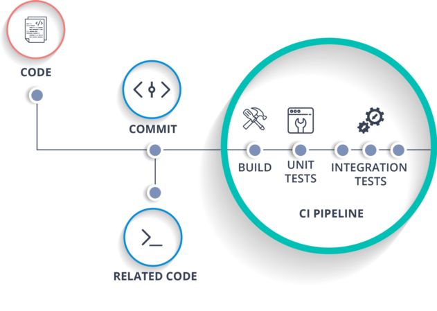
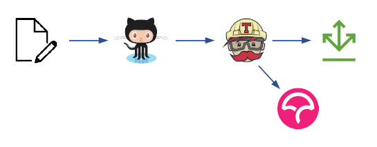
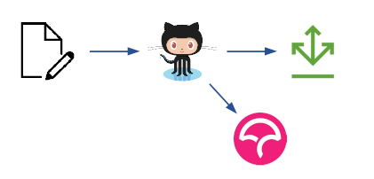

# Auditoría de calidad de código

## Introducción

Uno de los puntos principales para alcanzar los objetivos que marca DevOps, es la coordinación del trabajo realizado por el equipo de desarrolladores. Es en este momento cuando entra en juego el concepto de integración continuacuyo objetivo principal es coordinar e integrar el trabajo de todo el equipo de desarrollo de software de cada proyecto de forma frecuente, para así poder detectar los posibles fallos del software en una fase muy temprana, lo cual permite reducir drásticamente el número de posibles bugs que pueda contener la aplicación.

Con la integración continua, se evitan los problemas derivados de que un equipo de desarrolladores trabaje de forma simultánea sobre un mismo proyecto. Para ello es estrictamente necesario definir las tareas de forma concisa e intentando fraccionar y encapsular los cambios para que estos puedan ser integrados de forma regular, que permita ejecutar una serie de tareas de compilación, calidad y testeo para asegurar la calidad del producto.

Una vez los desarrolladores han terminado una nueva versión de la aplicación, pueden revisar todos los tests realizados, así como ver de forma detallada los puntos débiles del proyecto como errores potenciales en el código, escasez de comentarios, clases demasiado complejas, escasez de cobertura de las pruebas unitarias, etc. 

## Automatización

El proceso de CI para ser efectivo requiere que esté automatizado y no dependa del error humano. Al ser un proceso rutinario es muy fácilmente llevado a una máquina que lo ejecute y así no tener que invertir tiempo humano en llevarlo a cabo. 



Lo habitual es que este proceso se lance por cada push / commit que se haga al repositorio en cada una de sus ramas. De esta forma se consigue tener una métricas en near real time, lo cual es muy útil para los desarrolladores, pudiendo detectar:

- Posibles fallos de compilación
- Bugs
- Code smells
- Fallos en testing
- Cobertura

Herramientas de automatización hay muchas, algunas de las más conocidas son:

- Jenkins
- Travis CI
- GitHub Actions

### Jenkins

[Jenkins](https://www.jenkins.io/) es un servidor de automatización Open Source, que se puede encargar de automatizar contrucción, testing y despliegue facilitando así tanto la integración contínua (CI) como la entrega contínua (CD). 

Jenkins es muy potente ya que es fácilmente configurable y da soporte para la relización de tareas muy complejas, pero requiere de tener una instalación propia en un servidor (ya sea on-premise o IaaS).

### Travis CI

[Travis CI](https://travis-ci.org/) es un servicio de integración contínua cloud. Se integra fácilmente con GitHub, ejecutándo automáticametne las pipelines por cada push. Hasta hace unos meses era el servicio CI de facto para los proyectos opensource de GitHub.

Al ser un servicio SaaS, no requiere instalación, simplemente es necesario logarse usanso la cuenta de GitHub y con eso es suficiente para que esté escuchando los push. Las tareas se definen mediante el fichero `.travis.yml` hubicado en la raiz del repositorio.



En cuanto a precios, tiene planes free para proyectos opensource, aunque para finales de 2020 se eliminarán estos planes.

### GitHub Actions

[GitHub Actions](https://github.com/features/actions) es el servicio de GitHub para la automatización de workflows. Se trata de un servicio completamente integrado dentro de la plataforma GitHub, lo cual hace que no se dependa de componentes externos o de terceros para lanza las pipelines.



Tras las ultimas actualizaciones se ha ido añadido más y más características que hacen de GitHub Actions un sistema de automatización maduro y una alternativa muy fuerte a otros servicios como Travis CI, más teniendo en cuenta el cambio de planes de este último. Aunque es posible que Travis CI dispona de más funcionalidades, hoy día GitHub Actions es un servicio que será suficiente para la mayoría de los escenearios, siendo el recomendado en los proyectos OpenSource actuales.

En cuanto a la configuración, GitHub observará los ficheros en formato YAML que existan dentro de `.github/workflows`, donde se definirán todas las pipelines necesarias, por ejemplo:

```yml
name: Java CI

on: 
  push:
  pull_request:
  schedule:
    - cron: '0 0 * * 0' # weekly

jobs:
  build:
    runs-on: ubuntu-latest 

    steps:
      - uses: actions/checkout@v2
      - name: Set up JDK 1.8
        uses: actions/setup-java@v1
        with:
          java-version: 1.8 
      - name: Build with Maven
        run: ./mvnw -B verify 
```

### Conclusión

Una vez analizados los principales sistemas de automatización disponibles, se cree que la mejor opción sería GitHub Actions al tratarse de un servicio completamente integrado dentro de GitHub no teniendo que depender de terceros (Travis CI) ni de instalaciones propias (Jenkins). Como se comentó anteriormente, GitHub Actions ha ido ganando popularidad a medida que se han añadido funcionalidades siendo hoy día una muy fuerte alternativa a soluciones más usadas tradicionalmente.

## Análisis estático

Tener un sistema de CI aporta una serie de beneficios indudables, como puede ser garantizar que el código se integra correctamete o que pasan los tests, pero necesita un añadido que es es análisis estátido del código. Este tipo de herramientas permiten ejecutar una serie de reglas sobre el código detectando posibles bugs, code smells o si no se siguen los estándares de codificación, entre otras.

Las herramientas de análisis estático de código más usadas son las siguientes:

- SonarCloud
- Codacy

### SonarCloud

[SonarCloud](https://sonarcloud.io/) es una plataforma cloud, lider del sector, que permite gestionar la calidad del código controlando los 7 ejes principales:

- Arquitectura y diseño
- Errores potenciales
- Reglas de codificación
- Comentarios
- Duplicidades
- Pruebas unitarias
- Complejidad

Esta plataforma realiza varios análisis de nuestro código a través de otras herramientas (Checkstyle, PMD, Findbugs, JUnit, …) y presenta de manera unificada a través de su interfaz la información, generada por ellas en forma de métricas, donde podremos ver de forma detallada los puntos débiles de nuestro proyecto, como errores potenciales en el código, escasez de comentarios, clases demasiado complejas, escasez de cobertura de las pruebas unitarias, etc.

Las características principales son:

- +20 lenguajes: incluyendo Java, C#, C/C++, JS, Typescript, Python, Go, Swift, Cobol, Apex, PHP, Kotlin, Ruby, Scala, HTML5, CSS3, ABAP, Flex, Objective-C, PL/I, PL/SQL, RPG, T-SQL, VB.Net, VB6, XML
- Cientos de reglas definidas para validar la calidad del código, así como posibles bugs, mediante un análisis estático
- Integración con herramientas CI cloud, como Travis CI o GitHub Actions
- Gestión de la cobertura
- Gestión multirama
- Análisis de la complejidad ciclomática
- Duplicidades
- Definición de Quality Gates
- Escalable

En cuanto a planes de precios, para proyectos Open Source públicos es gratuita.

### Codacy

[Codacy](https://www.codacy.com/) es una herramienta de análisis estático de la calidad del código, que ayuda a los desarrolladores a crear mejor software. Se trata de una herramienta cloud, también integrable con otros sistemas de CI. Entre las características principales se puede enumerar:

- Análisis estático
- Complejidad ciclomática
- Duplicidades de código
- Cobertura de testing unitario
- 10 lenguajes soportados: Go, Java, JS, PHP, Python, Ruby, Scala, Shell, Swift y Typescript

En cuanto a planes de precios, para proyectos Open Source públicos es gratuita.

### Ontolo-CI

[Ontolo-CI](https://github.com/weso/ontolo-ci) es una herramienta implementada ad-hoc para realizar integración continua de ontologías. Gracias a esta integración continua se puede asegurar que la ontología que se está desarrollando cumple con los requisitos que se esperan de ella. Además, es fundamental para poder realizar un control de versiones efectivo sobre ontologías. Entre las características principales se puede enumerar:

- Ejecución de tests con Shape Expressions.
- Ejecución de preguntas de competencia con consultas SPARQL.
- Localización automática de errores de sintaxis en las ontologías.
- Informes visuales con el resultado de las pruebas realizadas.

### Conclusión

A priori, tanto Codacy como SonarCloud cummplen para las características del proyecto (lenguajes, OpenSource, ...). No obstante, es cierto que SonarCloud tiene mayor soporte de lenguajes y es el lider del sector, con lo que se propone la utilización de este analizador estático.

## Proceso de adaptación

Actualmente el análisis estático se está llevando utilizando herramientas propias de cada uno de los equipos. Esto puede implicar que en algunas ocasiones estas herramientas no tengan un acceso público para poder visualizar los resultados del análisis y por otro que no exista una homogeneización de las herramientas utilizadas. 

Se propone un proceso de adaptación para que todos los proyectos/repositorios utilicen las mismas herramientas, pasando por las siguientes fases:

1. Planificación y diseño de las herramientas a utilizar
2. Hacer públicos los resultados que se encuentran en herramientas privadas 
3. Estudio sobre unificación de herramientas  entre diferentes proyectos, ampliando las indicadas en este documento si es necesario
4. Implementación final

## Evidencias auditoría

| Proyecto                                                                                | Evidencias |
| --------------------------------------------------------------------------------------- | ---------- |
| [dataset-importer](https://github.com/HerculesCRUE/ib-dataset-importer)                 | [Análisis estático](https://sonarcloud.io/dashboard?id=HerculesCRUE_ib-dataset-importer)<br />[Testing](http://herc-iz-front-desa.atica.um.es:8070/dataset-importer/surefire/surefire-report.html)<br />[Cobertura](https://sonarcloud.io/component_measures?id=HerculesCRUE_ib-dataset-importer&metric=coverage&view=list) |
| [discovery](https://github.com/HerculesCRUE/ib-discovery)                               | [Análisis estático](https://sonarcloud.io/dashboard?id=HerculesCRUE_ib-discovery)<br />[Testing](http://herc-iz-front-desa.atica.um.es:8070/discovery/surefire/surefire-report.html)<br />[Cobertura](https://sonarcloud.io/component_measures?id=HerculesCRUE_ib-discovery&metric=coverage&view=list) |
| [event-processor](https://github.com/HerculesCRUE/ib-event-processor)                   | [Análisis estático](https://sonarcloud.io/dashboard?id=HerculesCRUE_ib-event-processor)<br />[Testing](http://herc-iz-front-desa.atica.um.es:8070/event-processor/surefire/surefire-report.html)<br />[Cobertura](https://sonarcloud.io/component_measures?id=HerculesCRUE_ib-event-processor&metric=coverage&view=list)<br />[BDD](http://herc-iz-front-desa.atica.um.es:8070/event-processor/cucumber/overview-features.html) |
| [input-processor](https://github.com/HerculesCRUE/ib-input-processor)                   | [Análisis estático](https://sonarcloud.io/dashboard?id=HerculesCRUE_ib-input-processor)<br />[Testing](http://herc-iz-front-desa.atica.um.es:8070/input-processor/surefire/surefire-report.html)<br />[Cobertura](https://sonarcloud.io/component_measures?id=HerculesCRUE_ib-input-processor&metric=coverage&view=list)<br />[BDD](http://herc-iz-front-desa.atica.um.es:8070/input-processor/cucumber/overview-features.html) |
| [management-system](https://github.com/HerculesCRUE/ib-management-system)               | [Análisis estático](https://sonarcloud.io/dashboard?id=HerculesCRUE_ib-management-system)<br />[Testing](http://herc-iz-front-desa.atica.um.es:8070/management-system/surefire/surefire-report.html)<br />[Cobertura](https://sonarcloud.io/component_measures?id=HerculesCRUE_ib-management-system&metric=coverage&view=list)<br />[BDD](http://herc-iz-front-desa.atica.um.es:8070/management-system/cucumber/overview-features.html) |
| [triples-storage-adapter](https://github.com/HerculesCRUE/ib-triples-storage-adapter)   | [Análisis estático](https://sonarcloud.io/dashboard?id=HerculesCRUE_ib-triples-storage-adapter)<br />[Testing](http://herc-iz-front-desa.atica.um.es:8070/triples-storage-adapter/surefire/surefire-report.html)<br />[Cobertura](https://sonarcloud.io/component_measures?id=HerculesCRUE_ib-triples-storage-adapter&metric=coverage&view=list)<br />[BDD](http://herc-iz-front-desa.atica.um.es:8070/triples-storage-adapter/cucumber/overview-features.html) |
| [uris-generator](https://github.com/HerculesCRUE/ib-uris-generator)                     | [Análisis estático](https://sonarcloud.io/dashboard?id=HerculesCRUE_ib-uris-generator)<br />[Testing](http://herc-iz-front-desa.atica.um.es:8070/uris-generator/surefire/surefire-report.html)<br />[Cobertura](https://sonarcloud.io/component_measures?id=HerculesCRUE_ib-uris-generator&metric=coverage&view=list) |
| [api-exchange](https://github.com/HerculesCRUE/ib-api-exchange)                         | [Análisis estático](https://sonarcloud.io/dashboard?id=HerculesCRUE_ib-api-exchange)<br />[Testing](http://herc-iz-front-desa.atica.um.es:8070/api-exchange/surefire/surefire-report.html)<br />[Cobertura](https://sonarcloud.io/component_measures?id=HerculesCRUE_ib-api-exchange&metric=coverage&view=list)<br />[BDD](http://herc-iz-front-desa.atica.um.es:8070/api-exchange/cucumber/overview-features.html) |
| [web-publication-backend](https://github.com/HerculesCRUE/ib-web-publication-backend)   | [Análisis estático](https://sonarcloud.io/dashboard?id=HerculesCRUE_ib-web-publication-backend  )<br />[Testing](http://herc-iz-front-desa.atica.um.es:8070/web-publication-backend/surefire/surefire-report.html)<br />[Cobertura](https://sonarcloud.io/component_measures?id=HerculesCRUE_ib-web-publication-backend&metric=coverage&view=list)<br />[BDD](http://herc-iz-front-desa.atica.um.es:8070/web-publication-backend/cucumber/overview-features.html) |
| [web-publication-service](https://github.com/HerculesCRUE/ib-web-publication-service)   | [Análisis estático](https://sonarcloud.io/dashboard?id=HerculesCRUE_ib-web-publication-service)<br />[Cobertura](https://sonarcloud.io/component_measures?id=HerculesCRUE_ib-web-publication-service&metric=coverage&view=list) |

\* Para poder acceder a los servicios alojados bajo `http://herc-iz-front-desa.atica.um.es:8070` se recomienda el uso de Firefox para evitar problemas con el certificado SSL. Esta circunstancia se solucionará cuando se configura SSL en el servidor.
