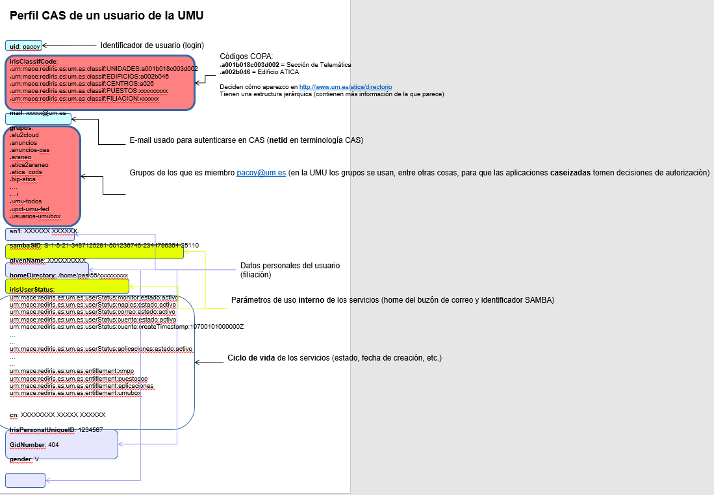
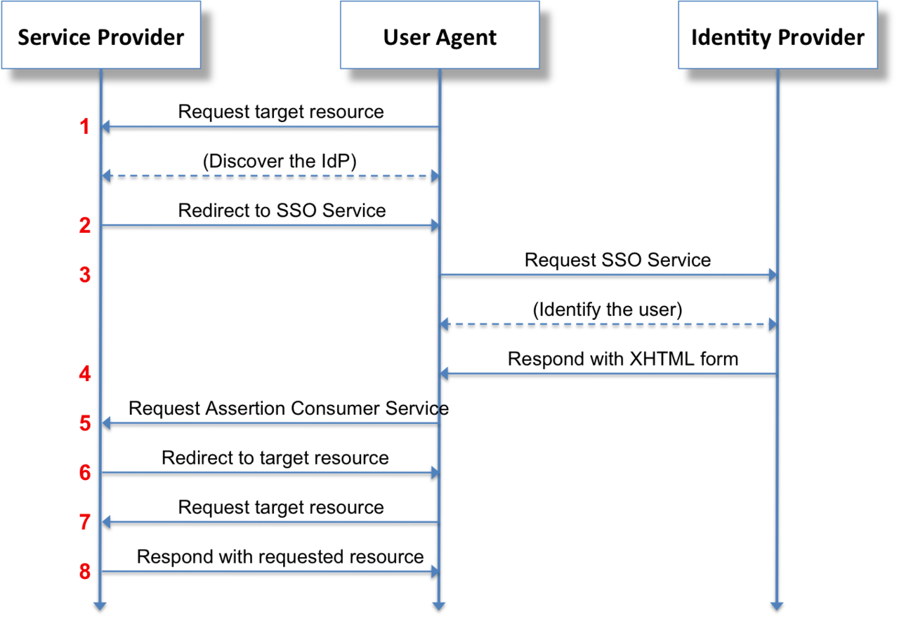
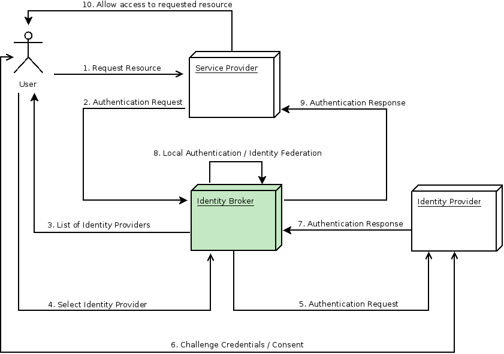

# Elección de infraestructura para Autenticación y Autorización

## Introducción

El proyecto ASIO require disponer de acceso de usuarios procedentes de siguientes lugares como puede ser SIR y usuarios locales. Se precisa aportar una solución adecuada para la autenticación y autorización.

## Necesidades

Las necesidades que tiene que cubrir el sistema son:

- Independizar aplicación de los sistemas de autenticación
- Unificar la autorización y roles independientemente del mecanismo de donde venga
- Conexión con IdPs externos
- Administración de usuarios
- Posibilidad de autorregistro
- Ofrecer facilidad para añadir nuevos mecanismos de autenticación en un futuro

## Tipos de autenticación

Como se comentó en la introducción, la aplicación va a disponer de usuarios procedentes de varias fuentes:

- [SIR](https://www.rediris.es/sir/): servicio de identidad de RedIRIS, el cual se basa en la federación de identidades, incluyendo diferentes proveedores de servicio a nivel nacional e internacional.
- Local: se trata de usuarios creados localmente en la aplicación ASIO.

### SIR

El Servicio de Identidad de RedIRIS (SIR) ofrece un servicio de autenticación federado para los servicios que proveen las entidades asociadas, tanto a nivel nacional como internacional. Tiene las siguientes características:

- La autenticación se realiza en la plataforma local de cada institución, ofreciendo la forma de autenticación a la que está acostumbrado cada usuario
- Ofrece una mayor seguridad, ya que las credenciales no salen del entorno local de la propia institución
- Cada institución aplica los mecanismos de control que estime convenientes

SIR2 sigue un modelo de federación `hub&spoke`. Esto significa que en el centro de la federación hay un hub central que pone en contacto a los proveedores de identidad y proveedores de servicio. Entre el hub y los IdPs, en la federación SIR2 se utiliza el perfil SAML2int.

Como protocolo de funcionamiento, SIR2 proporciona varios, ente los que se encuentran:

- PAPI v1
- SAML 1.1
- SAML 2
- eduGAIN
- OpenID

En el caso de SIR, a priori es posible recuperar toda aquella información que el IdP esté en condiciones de enviar. En el caso de la Universidad de Murcia, se deberá inclur en el perfil la información de autorizaicón

Vas a poder recuperar de SIR lo que cada IdP esté en condiciones de enviar a SIR. En el caso de la UMU podemos incluir en el perfil la información que os pasé en el perfil de ejemplo.



- Más información: https://www.rediris.es/sir/

### Local

Además de los usuarios procedentes de sistemas de SIR, es necesario poder dar soporte a otros usuarios que se crearán de forma local en el sistema, debiendo para ello:

- Poder asignar roles en función del nivel de acceso preciso
- Autorregistro
- Gestión y administración de usuarios

## Protocolos de autenticación y autorización

### SAML

SAML es el acrónimo de Security Assertion Markup Language, el cual es un estándar abierto de intercambio de datos de autorización y autenticación entre un proveedor de identidad y un proveedor de servicio. 

El formato que utiliza es basado en el lenguaje de marcado XML.

El caso de uso más comun es para el intercambio de información en un SSO. 



**1. Realización de la request del recurso al Service Provider (SP)**

Se realiza la petición al service provider:

    https://sp.example.com/myresource

El Service Provideer realizar la verificación de seguridad, si existe un contexto de seguridad válido se retorna el recurso solicitado.

**2. Redirección al servicio SSO (proveedor de identidad)**

El proveedor de servicio redirecciona al usuario al servicio SSO

    https://idp.example.org/SAML2/SSO/Redirect?SAMLRequest=request

El valor del parámetro `SAMLRequest` está codificado en Base64 y contiene el valor del elemento `<samlp:AuthnRequest>`.

**3. Realizar petición al servicio SSO**

El usuario realiza una reques a la URL obtenida del paso anterior. El servicio SSO procesa el parámetro `AuthRequest` y realiza la verifiación de seguridad. En caso que el usuario no disponga de una autenticación, lo identifica. 

**4. Respuesta vía formulario XHTML**

El servicio SSO valida la petición y responde vía un formulario XHTML:

```html
<form method="post" action="https://sp.example.com/SAML2/SSO/POST" ...>
    <input type="hidden" name="SAMLResponse" value="response" />
    ...
    <input type="submit" value="Submit" />
</form>
```

El valor del parámetro `SAMLResponse`es la codificación en Base64 del elemento `<samlp:Response>`.

**5. Request al servicio de validación de aserciones del Service Provider**

El usuario invoca vía POST al servicio de validación de aserciones del service provider.

**6. Redirección al recurso del SP**

El servicio de validación de aserciones procesa la respuesta, crea el contexto de seguridad y redirecciona al recurso solicitado en el paso 1.

**7. Solicitar el recurso del SP de nuevo**

Se realiza nuevamente la petición del recurso del service provider:

    https://sp.example.com/myresource

**8. Respuesta con el recurso solicitado**

Dado que existe un contexto de seguridad que permite acceder al recurso, finalmente se retorna al usuario.

### OAuth2

OAuth 2.0 es el protocolo estándar para la autorización. Los elementos lo componen son las siguientes:

- Propietario de recursos: Quien autoriza el acceso a los recursos, puede ser una persona
- Cliente: aplicación (o web) que accede a los recursos protegidos
- Proveedor
    - Servidor de autorización: encargado de validar el usuario y credenciales, generando tokens de acceso
    - Servidor de recursos: encargado de recibir las peticiones de acceso a los recursos protegidos, autorizando acceso solo si el token es válido


Las ventajas que proporciona OAuth son:

- Las credenciales de los usuarios no se ven comprometidas ya que el acceso a su información se hace a través de tokens que deberán ser validados cuando se consumen las APIs. 
- Indicado para el consumo de APIs, tanto por aplicaciones Front SPA como aplicaciones móviles
- Posibilidad de definición de scopes diferenciados para cada una de las aplicaciones, los cuales permiten delimitar el acceso a cada aplicación

##### Scopes

Los scopes de OAuth definen los permisos que tienen los clientes, es decir, permiten qué operaciones pueden realizar con los tokens generados para el cliente en cuestión. Por ejemplo, se puede definir "read", "write", etc., en función del scope cada cliente estará habilitado a realizar unas acciones u otras.
Por ejemplo, en el caso que se quiera utilizar Facebook desde una aplicación, se generará un cliente OAuth en el que se definen los permisos (scopes) para el mismo, como por ejemplo lectura, escribir publicaciones u obtener contactos.

El concepto "Scope" no se debe confundir con roles de usuario, ya que los scopes se definen a nivel de cliente, teniendo en cuenta que un cliente puede ser una aplicación, no sustituye el hecho de que puedan existir diferentes roles para cada usuario de la aplicación.

##### Tokens

OAuth genera 2 tipos de tokens:

- Access token: token que será enviado junto a las llamadas a las APIs para la validación de acceso.
- Refresh token: token de refresco que se encargará de renovar el token de acceso cuando este caduque

Cuando se utiliza cualquiera de estos tokens, se deberán validar previamente. Para ello se almacenan en un repositorio (BBDD, Redis, etc.) que permite la consulta de los mismos en las sucesivas llamadas. Uno de los posibles problemas que presenta, es la aparición de cuellos de botella en esta validación, ya que por cada llamada al API se deberá validar el token mediante consultas a BBDD. Si además estamos en una arquitectura de microservicios, cada microservicio que se vaya encadenando para obtener el resultado de la llamada al API, deberá validar el token. Como posible solución se podrían utilizar tokens JWT, los cuales no es necesario validar contra la BBDD.

En cuanto al propio formato de los tokens, es importante seleccionar el tipo que se va a utilizar. Por defecto, se utiliza el token de tipo `Reference`, el cual implica que este deba ser verificado contra el servidor de recursos por cada una de los microservicios, lo que ya se indicó anteriormente que conlleva un lag en la petición.


En el mundo de microservicios, debido a los problemas que presenta el tipo por defecto, lo más utilizado es JSON Web Tokens, más conocido como JWT. Mediante este sistema la verificación de los tokens se realizan localmente mediante una clave pública.


 #### JWT

 JSON Web Tokens, más conocidos como JWT, es el método estándar RGC 7519 de representación de tokens de seguridad para el intercambio de información. Es un estándar basado en JSON para crear tokens de acceso. Los tokens están firmados mediante una clave privada, teniendo todas las partes la clave pública que permite verificar la validez del token. 

Las ventajas que proporciona este sistema son:

- Posibilidad de creación de aplicaciones Stateless, que no tengan la necesidad de almacenar el estado de la sesión del usuario. El token contiene información de autenticación, expiración y otros datos que se definan
- Portable: el mismo token puede ser utilizado en múltiples backends
- No requiere cookies
- Buen rendimiento: no requiere validación contra ningún sistema de almacenamiento, simplemente con corroborar las firmas del token es suficiente para entender que el token es válido. 
- Muy adecuado para arquitectura de microservicios: se va pasando el token de microservicio en microservicio, sin necesidad de validaciones pesadas
- Desacoplamiento: el token puede ser generado en cualquier otro lugar, la autenticación puede ser realizada en el servidor de recursos o en un lugar totalmente ajeno.

##### Estructura

Un token suele estar formados por tres partes:

- Header: identifica el algoritmo que es utilizado para la firma, por ejemplo, HS256
- Payload: contiene la información de los "claims" del token, en el que se pueden incluir también marcas temporales para indicar el momento en el que el token fue generado
- Signature: encargada de validar el token, generada codificando la cabecera y el contenido utilizando Base64url Encoding

##### Claims

En el cuerpo del token se pueden definir claims o privilegios que pueden servir para definir datos del usuarios que sirvan para realizar la autenticación / autorización. Existen claims públicos que deben seguir el estándar RFC7519 (https://www.iana.org/assignments/jwt/jwt.xhtml), y claims privados que se pueden definir de forma custom.

Mediante una combinación de claims se pueden utilizar para definir los privilegios de acceso que tiene el token en una aplicación en concreto.

### OpenID Connect

OpenID Connect (OIDC) es una caopa de identidad añadida sobre OAuth 2.0, permitiendo a los clientes verificar la identidad de un usuario basado en la autenticación realizada por un IdP (Provedor de identidad)

## Unificación de métodos de acceso

Con el fin de que la aplicación esté desacoplada de cómo se realiza el acceso y autorización, se buscan soluciones que permitan integrar todos los mecanismos a los que sea necesario dar soporte en la actualida y en un futuro. Se valorarán los siguiente

- OpenAM
- KeyCloak

### OpenAM

Open AM es un IAM opensource que permite centralizar diferentes mecanismos de acceso. Cuenta con las siguientes características:

- Autenticación: soporte de 20 métodos de autenticación
- Autorización
- Federación: compartiendo identidad entre sistemas heterogéneos usando estándares como SAML, OpenID Connect, etc.
- SSO

- Más información: https://github.com/OpenIdentityPlatform/OpenAM/

#### Licenciamiento

OpenAM está licenciada bajo CDDL (Common Development and Distribution License), sobre la cual existe cierta controversia acerca de la copmatibilidad con GPL. Aunque en el año 2005 Open Source Initiative aprovó esta licencia, la Free Software Foundation (FSF) la considera una licencia free software, pero incompatible con GPL.

#### Conclusión

Aunque requiere cierta dificultad tanto en la configuración y administración, a priori cumple con los requisitos que debería tener un sistema de este tipo pero el problema viene del lado de la licencia ya que no es posible garantizar una compatibilidad con GPL.

### Keycloak

Keycloak, al igual que OpenAM es un un IAM opensource orientado a aplicaciones y servicios. Aunque es oepnsource, es un poroyecto que está bajo el paraguas de RedHat, lo cual es una garantía de mantenibilidad.

Entre las características que incluye se pueden encontrar:

- Registro de usuarios
- Integración y federación con sistemas de login de terceros, incluyendo Login social
- Uso de protocolos estándar: OpenID Connect, OAuth 2.0, SAML 2.0
- Brocker de identidad: IdPs OpenID Connect y SAML 2.0
- Cónfiguración de diferentes métodos de acceso
- Customización de pantallas de registro y login
- SSO
- Integración con LDAP y Active Directory
- Autenticación doble factor
- Broker Kerberos
- Multitenancy

También cabe resaltar que es bastante sencillo de configurar de forma gráfica mediante una interfaz de administración.

- Más información: https://www.keycloak.org/

#### Configuración de usuarios locales

Los usuarios locales podrán ser dados de alta desde dos caminos:

- Creados por un administrdor de Keycloak
- Autoregistro del usuario: en este caso el usuario tendrá un rol por defecto

En ambos casos el administrador podrá gestionar los datos del usuario incluyendo los roles de los mismos.

#### Integración con IdP externo

Keycloak permite integración con IdPs externos que usen SAML o OpenID Connect.

#### Idendity broker

Un Idendity Broker es un servicio intermediario que conecta a los proveedores de servicios con uno o varios proveedores de identidad. El broker es responsable de creaer una relación de confianza con el IdP externo para poder utilizar sus identidades para acceder a los servicios expuestos por el proveedor de servicio.

Desde la perspectiva del usuario, un broker de identidad proporciona una forma centralizada de administrar las identidades en diferentes dominios de seguridad. Una cuenta existente se puede vincular con una o más identidades de diferentes proveedores de identidad o incluso crearse basándose en la información de identidad obtenida de ellos.

Al usar Keycloak como broker de identidad, los usuarios no están obligados a proporcionar sus credenciales para autenticarse en un ámbito específico. En cambio, se les presenta una lista de proveedores de identidad desde los que pueden autenticarse. También puede configurar un proveedor de identidad predeterminado. En este caso, el usuario no tendrá la opción de elegir, sino que será redirigido directamente al proveedor predeterminado.



##### Mapeo de claims y atributos

Es posible importar los metadatos SAML y OpenID Connect proporcionados por el IdP externo con el que se autentica el suaurio. Esto permite extraer metadatos de perfil de usuario y otra información para que pueda ponerlos a disposición de las aplicaciones.

Cada nuevo usuario que inciie sesión a través del IdP externo tendrá una entrada creada en la base de datos local de Keycloak, basada en los metadatos de SAML y OIDC.

Para facilitar esta labor, Keycloak proporciona mappers que permiten completar la información del usuario:

- Hardcoded User Session Attribute
- Attribute Importer
- Advanced Claim to Role
- Hardcoded Role
- Claim to Role
- Hardcoded Attribute
- Username Template Importer

#### Licenciamiento

Keycloak está licenciado bajo la licencia Apache License 2.0, la cual es plenamente compatible con GPLv3.

#### Conclusión

Keycloak cumple con todas las [necesidades](#necesidades) indicadas y además aporta otra serie de ventajas adicionales indicadas anteriormente. El hecho de que disponga de una licencia compatible con GPLv3 es un punto a favor.

Es por ello que se considera este IAM el más adecuado para cumplir con el propósito del proyecto ASIO.
