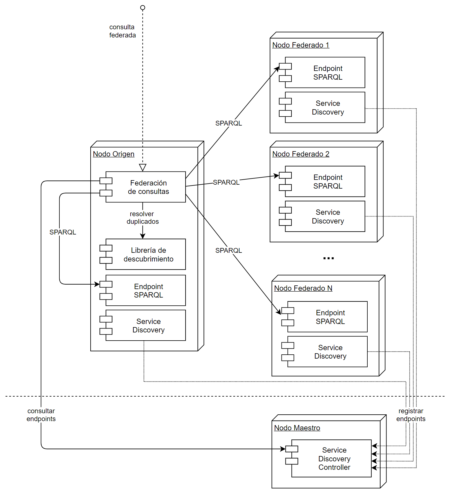

| Entregable     | Arquitectura Semántica - Federación de Consultas             |
| -------------- | ------------------------------------------------------------ |
| Fecha          | 16/12/2020                                                   |
| Proyecto       | [ASIO](https://www.um.es/web/hercules/proyectos/asio) (Arquitectura Semántica e Infraestructura Ontológica) en el marco de la iniciativa [Hércules](https://www.um.es/web/hercules/) para la Semántica de Datos de Investigación de Universidades que forma parte de [CRUE-TIC](https://www.crue.org/proyecto/hercules/) |
| Módulo         | Arquitectura Semántica                                       |
| Tipo           | Documento                                                    |
| Objetivo       | Este documento recoge el análisis de alternativas para la federación de consultas sobre una arquitectura de nodos distribuidos en la red HERCULES. |
| Estado         | **50%** Arquitectura y diseño, implementación preliminar integrada en [Librería de descubrimiento](../../24-Librer%C3%ADa_de_descubrimiento/ASIO_Libreria_de_descubrimiento.md#integraci%C3%B3n-del-proceso-dentro-de-la-arquitectura-general-de-la-aplicaci%C3%B3n). |
| Próximos pasos | Refactorización de Librería de descubrimiento, integración del módulo de Service discovery, e implementación final del agregador de resultados de consultas federadas. |

# Federación de consultas

El diseño de la arquitectura de federación de consultas pretende dar respuesta al requisito de respuesta conjunta de la red HERCULES ante una consulta sobre el sistema a nivel global.

A alto nivel, el planteamiento propuesto es la gestión, registro y consulta de endpoints desde el nodo maestro de la red, a través de un endpoint de *Service Discovery*. 

El módulo de Service Discovery tiene presencia también en los nodos federados de la red, para gestionar el registro del nodo y consultar los nodos disponibles y activos.

## Alternativas descartadas

Este documento asume que dicha federación se realizará a nivel de lectura (consultas), en contrapartida a la sincronización de datos durante la importación (replicación de datos). La sincronización de datos en todos los nodos queda descartada por los siguientes motivos:

- Mayor complejidad del módulo de importación de datos.
- Mayor coste de procesamiento durante la importación.
- Mayor coste de almacenamiento de la información.
- Restricciones de privacidad de datos entre nodos.

## Definición de subsistemas

El módulo de federación de consultas se subdivide a su vez en tres subsistemas clave:

1. **CONSULTA**: encargado de ejecutar la consulta de forma paralela en todos los nodos de la red y optimización del proceso.
2. **IDENTIFICACIÓN**: se apoya en la librería de descubrimiento para poder identificar entidades repetidas o similares.
3. **AGREGACIÓN**: una vez recibidos los resultados e identificadas las similitudes, se encargaría de unificar los datos de entidades equivalentes obtenidas de diferentes nodos.

### Consulta

Dado el volumen de información almacenada sería recomendable disponer de una capa intermedia que permitiese realizar consultas de forma más eficiente, en lugar de realizar la consulta desde el API de SPARQL estándar [Gombos and Kiss, 2016; Acosta et al., 2019], siguiendo diferentes enfoques planteados recientemente. 

Se descarta el uso de la federación provista por SPARQL por los siguientes motivos [Buil-Aranda et al., 2014]:

- El proceso de consulta federada no es robusto ante fallos de la red de endpoints adscritos.
- El proceso de agregación de datos es muy limitado y queda restringido a las funcionalidades expuestas por el propio lenguaje de consulta.
- La escalabilidad del proceso es limitada para grandes volúmenes de información y está restringido por los propios endpoints SPARQL.
- Se pierde control sobre el proceso y no permite obtener ventajas del modelo de datos común y la librería de descubrimiento.

Adicionalmente, se han identificado tres retos tecnológicos, aún por resolver en el ecosistema SPARQL [Oguz et al., 2015]:

* Gestión de metadatos: este reto implica la unificación y sincronización de un catálogo de metadatos común, que en el caso de ASIO se resuelve a través de la ontología común centralizada en el nodo maestro.
* Caché de resultados: actualmente este reto se está abordando mediante el uso de Elasticsearch y Redis, desde el módulo de [Libería de descubrimiento](../../24-Librer%C3%ADa_de_descubrimiento/ASIO_Libreria_de_descubrimiento.md#integraci%C3%B3n-del-proceso-dentro-de-la-arquitectura-general-de-la-aplicaci%C3%B3n). Como próximos pasos se refactorizará dicho módulo para compartir la funcionalidad con el módulo final de federación de consultas.
* Procesado adaptativo de consultas: principalmente vinculado a la planificación/optimización de consultas [Peng et al., 2019], quedando fuera del alcance del presente proyecto por ser parte del núcleo del planificador de consultas propio del triplestore empleado.

### Identificación

Este subsistema hace uso de la Librería de descubrimiento, a partir del módulo de [Reconciliación de entidades](../../24-Librer%C3%ADa_de_descubrimiento/ASIO_Libreria_de_descubrimiento.md#reconciliaci%C3%B3n-de-entidades), para poder identificar entidades repetidas o similares.

### Agregación

La versión más sencilla de la federación ofrece los resultados de forma directa, sin agregar. En caso de duplicados idénticos, se informa de todos los nodos que disponen de la entidad, sin repetirla. En caso de resultados similares (misma entidad, con diferente contenido) se listan todas las variantes y su procedencia.

Esta versión simplificada es de interés para poder analizar de forma explícita el contenido ofrecido por cada nodo, si bien sería muy recomendable poder contar con un módulo de unificación (*merge*) de entidades, reutilizado los servicios ya desarrollados en el módulo de importación de datos, concretamente el [Merge Event Processor](../../24-Librer%C3%ADa_de_descubrimiento/ASIO_Libreria_de_descubrimiento.md#integraci%C3%B3n-del-proceso-dentro-de-la-arquitectura-general-de-la-aplicaci%C3%B3n), empleado en la Librería de descubrimiento..

Las consultas federadas sin agregación se emplean en la Librería de descubrimiento con el objetivo de consultar las entidades albergadas en diferentes nodos de la red durante el proceso de importación, a través del [Data Fetcher](../../24-Librer%C3%ADa_de_descubrimiento/ASIO_Libreria_de_descubrimiento.md#integraci%C3%B3n-del-proceso-dentro-de-la-arquitectura-general-de-la-aplicaci%C3%B3n). Para la siguiente entrega, se prevé refactorizar la implementación de la Librería de descubrimiento, en la que existe actualmente un alto grado de acoplamiento entre las funcionalidades de ambos módulos.

## Referencias. 

[Acosta et al., 2019] Maribel Acosta, Olaf Hartig, and Juan Sequeda (2019). **Federated RDF Query Processing**. In: Sakr S., Zomaya A.Y. (eds) Encyclopedia of Big Data Technologies. Springer, Cham. 
https://doi.org/10.1007/978-3-319-77525-8_228

[Buil-Aranda et al., 2014] Carlos Buil-Aranda, Axel Polleres, and Jurgen Umbrich (2014). **Strategies for executing federated queries in SPARQL1.1**. International Semantic Web Conference (2), pp. 390-405. 
https://www.carlosbuil.com/2015-iswc-strategies.pdf

[Gombos and Kiss, 2016] Gergo Gombos and Attila Kiss (2016). **Federated Query Evaluation Supported by SPARQL Recommendation**. In: Yamamoto S. (eds) Human Interface and the Management of Information: Information, Design and Interaction. HIMI 2016. Lecture Notes in Computer Science, vol 9734. Springer, Cham. 
https://doi.org/10.1007/978-3-319-40349-6_25

[Oguz et al., 2015] Damla Oguz, Belgin Ergenc, Shaoyi Yin, Oguz Dikenelli and Abdelkader Hameurlain (2015). **Federated query processing on linked data: a qualitative survey and open challenges**. The Knowledge Engineering Review, 30:5, pp. 545–563. Cambridge University Press.
https://doi.org/10.1017/S0269888915000107

[Peng et al., 2019] Peng Peng, Qi Ge, Lei Zou, M. Tamer Özsu, Zhiwei Xu, and Dongyan Zhao (2019). **Optimizing Multi-Query Evaluation in Federated RDF Systems**. IEEE Transactions on Knowledge and Data Engineering (Early Access).
https://doi.org/10.1109/TKDE.2019.2947050
