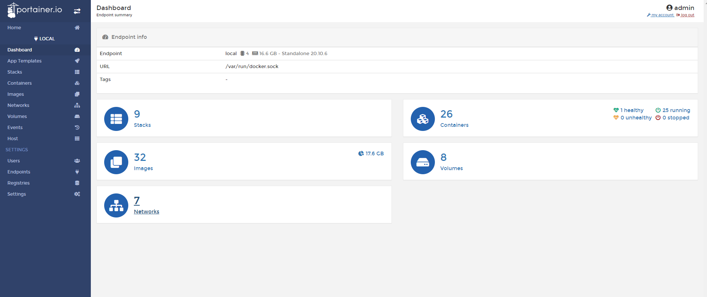
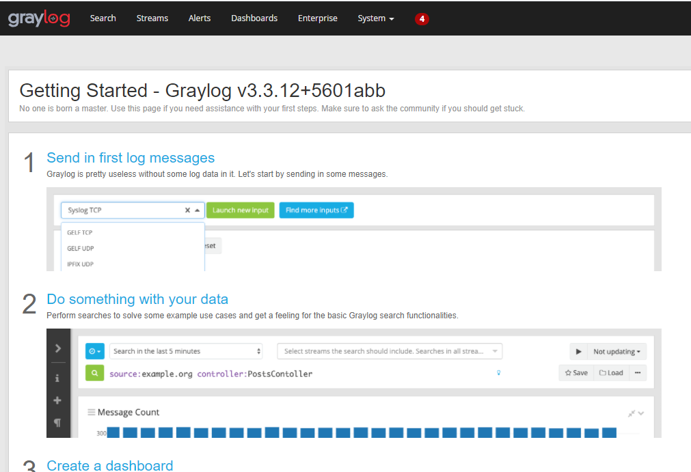
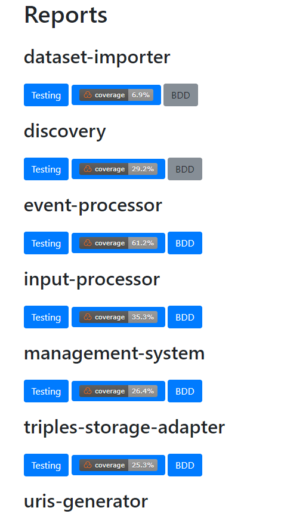

| Entregable     | Manual de usuario                                            |
| -------------- | ------------------------------------------------------------ |
| Fecha          | 03/05/2021                                                   |
| Revisado por   | Daniel Ruiz Santamaría                                       |
| Proyecto       | [ASIO](https://www.um.es/web/hercules/proyectos/asio) (Arquitectura Semántica e Infraestructura Ontológica) en el marco de la iniciativa [Hércules](https://www.um.es/web/hercules/) para la Semántica de Datos de Investigación de Universidades que forma parte de [CRUE-TIC](https://tic.crue.org/hercules/) |
| Módulo         | Manual de despliegue                                         |
| Tipo           | Documento                                                    |
| Objetivo       | Documento con el manual genérico para el despliegue          |
| Estado         | **100%**                                                     |
| Próximos pasos |                                                              |


# Manual de Despliegue

[TOC]

## 1 Introducción

Todo lo descrito en este documento, pretende actuar como un resumen donde se centralice toda la información relativa a el despliegue para el software implementado por Izertis para el proyecto Hércules.

Puede usarse como modelo para replicar el despliegue realizado en la Universidad de Murcia en cualquier futura universidad que pudiese incorporarse al proyecto Hércules ASIO.

Existe información mas exhaustiva en el repositorio [ib-asio-composet](https://github.com/HerculesCRUE/ib-asio-composeset)  que contiene información relativa a el despliegue. Asimismo en el repositorio [HerculesCRUE](https://github.com/HerculesCRUE/) , podemos encontrar los repositorios de todo  software desplegados. En la carpeta **docs** de cada repositorio, encontraremos la documentación especifica de cada componente de software y por lo tanto se podrán encontrar los documentos:

* **build:** Donde se describen los pasos para generar un artefacto del componente software en cuestión y ejecutarlo.
* **docker:** Donde se describen los pasos para construir una imagen docker del componente software en cuestión y ejecutarlo.
* **documentación-técnica:** Donde se describen la arquitectura e implementación del componente software a bajo nivel.
* **manual_de_usuario:** Donde se describen el componente software a alto nivel.
* **documentación_api_rest:** Donde se describen el API Rest del componente (si procede).

## 2 Descripción general

### 2.1 Hardware y e infraestructura para los despliegues

Todos los microservicios o servicios desplegados para la solución, han sido desplegados mediante imágenes [docker](https://www.docker.com/) y orquestados mediante [docker-compose](https://docs.docker.com/compose/).

Para el proyecto Hércules de la universidad de Murcia, se han desplegado todos los microservicios en 3 maquinas:

* **Front:** Maquina donde se desplegaran los componentes software que actúan como frontales para usuarios finales.
* **DB:** Maquina donde se desplegaran los componentes software orientados a la persistencia.
* **Back:** Maquina donde se desplegaran los microservicios que forman parte del Backend.

En cuanto a la dimensión y características de las maquinas, ahora mismo, para la universidad de Murcia, esta es la descripción del Hardware donde la solución ha sido desplegada.

| Nombre           | FRONT                                                        | BACK                                      | DB                                        |
| ---------------- | ------------------------------------------------------------ | ----------------------------------------- | ----------------------------------------- |
| **SO**           | CentOS Linux release 7.7.1908                                | CentOS Linux release 7.7.1908             | CentOS Linux release 7.7.1908             |
| **MEMORIA**      | 16GB                                                         | 32GB                                      | 16GB                                      |
| **PROCESADOR**   | Intel Core i7 9xx (Nehalem Class Core i7)                    | Intel Core i7 9xx (Nehalem Class Core i7) | Intel Core i7 9xx (Nehalem Class Core i7) |
| **CORES**        | 4                                                            | 8                                         | 4                                         |
| **ARQUITECTURA** | 64                                                           | 64                                        | 64                                        |
| **PUERTOS**      | 22, 443, 80, 55555, 3030, 8081, 8070, 80, 81, 8080, 9321, 9326 | 22, 9321                                  | 22, 80, 8282, 8181, 3030                  |

Obviamente es posible que según la volumetría de datos prevista para otros nodos, esta configuración pueda cambiar, por lo que será necesario adaptarla a cada caso.

Ahora mismo existen dos entornos desplegados en la Universidad de Murcia

| Entorno           | FRONT                                           | BACK                                           | DB                                           |
| ----------------- | ----------------------------------------------- | ---------------------------------------------- | -------------------------------------------- |
| **DESARROLLO**    | 155.54.239.207 o herc-iz-front-desa.atica.um.es | 155.54.239.208 o herc-iz-back-desa.atica.um.es | 155.54.239.209 o herc-iz-db-desa.atica.um.es |
| **PREPRODUCCIÓN** | 155.54.239.226 o herc-iz-front-prod.atica.um.es | 155.54.239.224 o herc-iz-back-prod.atica.um.es | 155.54.239.227 o herc-iz-db-prod.atica.um.es |

Es importante tener en cuenta, que hay cierta dependencia entre servicios, por lo que es necesario seguir un orden en el despliegue.

A nivel general podemos decir que el orden (según las maquinas descritas), es el siguiente

1. **Servicios desplegados en DB:** Ya que tanto aplicaciones del front como microservicios de back, necesitan persistencia, es necesario desplegarlos en primer lugar.
2. **Servicios desplegados en FRONT:** Algún servicio desplegado en Front (como por ejemplo servidores LDP o el Service Discovery) es usado por microservicios de Backend, por lo que es necesario desplegarlos en segundo lugar.
3. **Servicios desplegados en Back:** Al ser los servicios que más dependencias tienen, deben de ser desplegados en último lugar.

### 2.2 Repositorios

Todas los servicios propios descritos en los siguientes apartados tienen sus repositorios en https://github.com/HerculesCRUE. Dentro de cada uno de los repositorios podemos encontrar la sección releases con los artefactos generados.

Asimismo existen también imágenes docker publicas para todos los servicios descritos que pueden encontrarse en docker hub https://hub.docker.com/search?q=HerculesCRUE&type=image.

### 2.3 Rutas de despliegue y usuarios

Para todas las maquinas que se han descrito, se ha creado el usuario **herculesizertis** con el password **h3rcul3s1z3rt1s**.

En el home de dicho usuario, podemos encontrar todos los ficheros necesarios para realizar el despliegue de todos los servicios, tal y como se detallara en este mismo documento.

Para el caso de nuevos despliegues, se recomienda tomar como referencia, los despliegues por entornos descritos en el documento  [ib-asio-composet](https://github.com/HerculesCRUE/ib-asio-composeset) , y modificar aquellas partes que sean necesarias (si se mantiene la misma distribución de servicios desplegados en las maquinas, sería suficiente con cambiar las referencias explicitas IP´s o DNS´s  en docker-compose´s o ficheros de variables de entornos por las que correspondan para las nuevas maquinas).

### 2.4 Descripción de servicios

El el siguiente apartado se enumeraran los servicios desplegados en cada una de las maquinas, así como la información mas relevante de cada servicio.

En algunos casos se usara la variable **$entorno** en las imágenes docker, que representa la rama y por lo tanto el entorno donde son desplegados, que habitualmente será develop para el entorno de **desarrollo**, o master para el entorno de **producción**.

#### 2.4.1 Servicios desplegados en DB

Generalmente en esta maquina están desplegados todos los servicios relativos a la persistencia. Existen dependencias de otros servicios con los servicios desplegados en esta máquina (se detalla en cada caso), por lo tanto es conveniente desplegar en primer lugar los servicios aquí descritos.

##### MariaDB

* **Nombre del servicio:** mariadb.
* **Puertos:** 
  * **Externo:** 3306
  * **Interno:** 3306
* **Descripción:** Base de datos relacional, usada por muchos de los microservicios.
* **Tipo:** Esencial. Requerido por la mayor parte de servicios.
* **Dependencias:** No
* **Imagen-docker:**  mariadb:10.3
* **Ficheros (rutas relativas a la carpeta ./deploy):**
  * **Despliegue:** docker-compose.yml
  * **Variables de entorno:** Definidas en el docker-compose.yml
  * **Configuración:** mariadb/01.create_schemas.sql (script de creación de bases de datos)
* **Persistencia:** Volumen docker mysql_data.

##### Mongo

* **Nombre del servicio:** mongodb.
* **Puertos:** 
  * **Externo:** 27017
  * **Interno:** 27017
* **Descripción:** Base orientada a documentos, usada por Graylog.
* **Tipo:** Requerido si se centralizan los logs con [Graylog](#Graylog).
* **Dependencias:** No
* **Imagen-docker:**  bitnami/mongodb:4.4
* **Ficheros (rutas relativas a la carpeta ./deploy):**
  * **Despliegue:** docker-compose.yml
  * **Variables de entorno:** Definidas en el docker-compose.yml
  * **Configuración:** No
* **Persistencia:** Volumen docker mongo_data.

##### Kafka

* **Nombre del servicio:** kafka.
* **Puertos:** 
  * **Externos:** 9092, 29092
  * **Internos:** 9092, 29092
* **Descripción:** Bus de datos usado por múltiples microservicios.
* **Tipo:** Esencial. Gran número de servicios (especialmente los desplegados en la maquina Back) usan kafka como bus de datos para intercambio de información por los que es requerido por estos.
* **Dependencias:** [Zookeper](#Zookeper).
* **Imagen-docker:**  bitnami/kafka:2.4.1
* **Ficheros (rutas relativas a la carpeta ./deploy):**
  * **Despliegue:** docker-compose.yml
  * **Variables de entorno:** Definidas en el docker-compose.yml
  * **Configuración:** No
* **Persistencia:** Volumen docker kafka_data.

##### Zookeper

* **Nombre del servicio:** zookeper.
* **Puertos:** 
  * **Externos:** 2181
  * **Internos:** 2181
* **Descripción:** Actúa como broker para [Kafka](#Kafka).
* **Tipo:** Esencial. Requerido por [Kafka](#Kafka)
* **Dependencias:** No
* **Imagen-docker:**  bitnami/zookeeper:3.5.6
* **Ficheros (rutas relativas a la carpeta ./deploy):**
  * **Despliegue:** docker-compose.yml
  * **Variables de entorno:** Definidas en el docker-compose.yml
  * **Configuración:** No
* **Persistencia:** Volumen docker zookeper_data.

##### Elasticsearch

* **Nombre del servicio:** elasticsearch.
* **Puertos:** 
  * **Externos:** 9200, 9300
  * **Internos:** 9200, 9300
* **Descripción:** Elasticsearch usado por [Graylog](#Graylog).
* **Tipo:** Requerido si se centralizan los logs con [Graylog](#Graylog).
* **Dependencias:** No
* **Imagen-docker:**  bitnami/elasticsearch:6.8.8
* **Ficheros (rutas relativas a la carpeta ./deploy):**
  * **Despliegue:** docker-compose.yml 
  * **Variables de entorno:** Definidas en el docker-compose.yml
  * **Configuración:** No
* **Persistencia:** Volumen docker es_data.

##### Kafdrop

* **Nombre del servicio:** kafdrop.
* **Puertos:** 
  * **Externos:** 9000
  * **Internos:** 19000
* **Descripción:** Monitor de [Kafka](#Kafka).
* **Tipo:** Opcional. Útil para monitorizar [Kafka](#Kafka).
* **Dependencias:** No
* **Imagen-docker:**  obsidiandynamics/kafdrop:3.27.0
* **Ficheros (rutas relativas a la carpeta ./deploy):**
  * **Despliegue:** docker-compose.yml
  * **Variables de entorno:** Definidas en el docker-compose.yml
  * **Configuración:** No
* **Persistencia:** No.

##### Fuseki

* **Nombre del servicio:** jena-fuseki.
* **Puertos:** 
  * **Externos:** 3030
  * **Internos:** 3030
* **Descripción:** Endpoint SPARQL configurable para su uso con distintos Triple Store. También despliega una instancia de el triple store TDB que es usada para el proyecto.
* **Tipo:** Requerido. Fuseki contiene el Triple Store TDB2, y es necesario para interactuar con el, por lo que todos los servicios que interactúen con el Triple Store, tienen dependencia con Fuseki.
* **Dependencias:** No
* **Imagen-docker:**  umansioacr.azurecr.io/sparql/jena-fuseki:3.14.0
* **Ficheros (rutas relativas a la carpeta ./deploy):**
  * **Despliegue:** docker-compose.yml
  * **Variables de entorno:** Definidas en el docker-compose.yml
  * **Configuración:** Disponibles en la ruta ./fuseki/config.ttl (relativa al path deploy)
* **Persistencia:** Volumen docker fuseki_data para los datos almacenados en el Triple Store (TDB2) y fuseki-backup para los backups.

##### ActiveMQ

* **Nombre del servicio:** activemq.
* **Puertos:** 
  * **Externos:** 8161, 61616
  * **Internos:** 8161, 61616
* **Descripción:** Cola de mensajes usada para la comunicación entre el proceso **ETL** y el **event processor**.
* **Tipo:** Requerido. La comunicación entre el ETL ([PDI](#PDI)) y el servicio de procesado de eventos ([Event Processor](#Event-Processor)) requieren ActiveMQ, para garantizar entrega ordenada de mensajes, por lo que es necesario para el proceso de importación.
* **Dependencias:** No
* **Imagen-docker:**  umansioacr.azurecr.io/activemq:5.15.9
* **Ficheros (rutas relativas a la carpeta ./deploy):**
  * **Despliegue:** docker-compose.yml
  * **Variables de entorno:** Definidas en el docker-compose.yml
  * **Configuración:** No
* **Persistencia:** Volumen docker activemq_data para los datos y activemq_conf para las configuraciones.

##### Wikibase Elasticsearch for Wikibase

* **Nombre del servicio:** wiki-io-elasticsearch.
* **Puertos:** 
  * **Externos:** 9201, 9301
  * **Internos:** 9200, 9300
* **Descripción:** Elasticsearch para Wikibase de la Arquitectura Semántica.
* **Tipo:** Requerido para Wikibase. 
* **Dependencias:** No
* **Imagen-docker:**  wikibase/elasticsearch:6.5.4-extra
* **Ficheros (rutas relativas a la carpeta ./deploy):**
  * **Despliegue:** docker-compose-wikibase.yml
  * **Variables de entorno:** Definidas en el docker-compose-wikibase.yml
  * **Configuración:** No
* **Persistencia:** Volumen docker wikibase-as para los datos.

##### Redis

* **Nombre del servicio:** redis.
* **Puertos:**
  * **Externos:** 16379
  * **Internos:** 6379
* **Descripción:** Redis usado por el servicio [discovery](#Discovery).
* **Tipo:** Requerido por el servicio [discovery](#Discovery). 
* **Imagen-docker:**  bitnami/redis:latest
* **Ficheros (rutas relativas a la carpeta ./deploy):**
  * **Despliegue:** docker-compose-redis.yml
  * **Variables de entorno:** Definidas en el docker-compose-redis.yml
  * **Configuración:** No
* **Persistencia:** Volumen docker redis-data para los datos.

##### Portainer

* **Nombre del servicio:** portainer_agent.
* **Puertos:**
  * **Externos:** 9001,8001
  * **Internos:** 9000,8000
* **Descripción:** Servicio para monitorizar los contenedores docker desplegados en la misma maquina.
* **Tipo:** Opcional. 
* **Imagen-docker:**  portainer/portainer-ce:2.1.1-alpine
* **Ficheros (rutas relativas a la carpeta ./deploy):**
  * **Despliegue:** ./portainer/docker-compose-ce.yml
  * **Variables de entorno:** No
  * **Configuración:** No
* **Persistencia:** Volumen docker portainer-data para los datos.

#### 2.4.2 Servicios desplegados en FRONT

Generalmente en esta maquina están desplegados todos los servicios relativos a frontales o servicios expuestos. Existen dependencias de otros servicios con los servicios desplegados en esta maquina (se detalla en cada caso), por lo tanto es conveniente desplegar los servicios aquí descritos, después de desplegar los servicios de [DB](#Servicios-desplegados-en-DB) y antes de desplegar los servicios de [Back](#Servicios-desplegados-en-BACK).

##### Nginx

* **Nombre del servicio:** nginx.
* **Puertos:** 
  * **Externos:** 80,443,9999
  * **Internos:** 80,443,9000
* **Descripción:** Servidor Nginx que actúa como gateway dando acceso a todos los servicios públicos, como por ejemplo keycloak (para autentificación y autorización), Graylog (Monitorización), Frontal ....
* **Tipo:** Esencial
* **Dependencias:** No
* **Imagen-docker:**  nginx:alpine
* **Ficheros (rutas relativas a la carpeta ./deploy):**
  * **Despliegue:** gateway/docker-compose.yml
  * **Variables de entorno:** Definidas en el docker-compose.yml
  * **Configuración:** gateway/conf.d, donde podemos encontrar los ficheros default.conf (configuración por defecto del servidor nginx), ssl.conf (configuración para los certificados) y un fichero {$nombre_del_servicio}.conf para cada una de las configuraciones de los servicios expuestos tras el gateway.  También son necesarios los directorios gateway/certsm (para los certificados de Murcia) y gateway/certs.ss (para los certificados auto-firmados (si los hubiera) )
* **Persistencia:** No.

##### Trellis

* **Nombre del servicio:** trellis.
* **Puertos:** 
  * **Externos:** 8083
  * **Internos:** 8080
* **Descripción:** Servidor LDP para exponer los recursos semánticos.
* **Repositorio:** https://github.com/HerculesCRUE/ib-asio-ldp
* **Tipo:** Esencial
* **Dependencias:** Necesita el servicio [Fuseki](#Fuseki) desplegado para acceder al Triple Store. También necesita de [Keycloak](#Keycloak) para gestionar autorización y autentificación.
* **Imagen-docker:** herculescrue/asio-ldp:1.0
* **Ficheros (rutas relativas a la carpeta ./deploy):**
  * **Despliegue:** docker-compose.yml
  * **Variables de entorno:** Definidas en el docker-compose.yml
  * **Configuración:** /trellis/config.yml para la configuración y trellis/users.auth para la autentificación y la autorización.
* **Persistencia:** Volumen docker trellis_data.

##### Keycloak

* **Nombre del servicio:** keycloak.
* **Puertos:** 
  * **Externos:** -
  * **Internos:** 8080
* **Descripción:** Servicio para gestionar autentificación y autorización.
* **Tipo:** Esencial
* **Dependencias:** -
* **Imagen-docker:** quay.io/keycloak/keycloak:12.0.3 
* **Ficheros (rutas relativas a la carpeta ./deploy):**
  * **Despliegue:** docker-compose.yml
  * **Variables de entorno:** Definidas en el docker-compose.yml
  * **Configuración:** No.
* **Persistencia:** -

##### Service Discovery

* **Nombre del servicio:** nginx.
* **Puertos:**
  * **Externos:** 9329,8089
  * **Internos:** 9329,8080
* **Descripción:** Servicio registry centralizado , para permitir descubrir el resto de servicios desplegados de la solución.
* **Repositorio:** https://github.com/HerculesCRUE/ib-service-discovery
* **Documentación:** https://github.com/HerculesCRUE/ib-service-discovery/tree/master/docs
* **Tipo:** Esencial
* **Dependencias:** -
* **Imagen-docker:** herculescrue/service-discovery:$entorno
* **Ficheros (rutas relativas a la carpeta ./deploy):**
  * **Despliegue:** docker-compose-service-discovery.yml
  * **Variables de entorno:** ./env/global-api.env (para variables de aplicación en APIs) y ./env/service-discovery.env (para variables especificas del servicio)
  * **Configuración:** No
* **Persistencia:** -

##### Web Publication Backend

* **Nombre del servicio:** web-publication-backend.
* **Puertos:** 
  * **Externos:** -
  * **Internos:** 9321, 8080
* **Descripción:** Backend expuesto en forma de API, que será usado por el frontal para acceder a los datos.
* **Repositorio:** https://github.com/HerculesCRUE/ib-web-publication-backend
* **Documentación:** https://github.com/HerculesCRUE/ib-web-publication-backend/tree/master/docs
* **Tipo:** Esencial
* **Dependencias:** Depende de [Federation](#Federation)  para acceder a los datos almacenados los Triple Stores.
* **Imagen-docker:** herculescrue/web-publication-backend:$entorno
* **Ficheros (rutas relativas a la carpeta ./deploy):**
  * **Despliegue:** docker-compose.yml
  * **Variables de entorno:** ./env/global.env (para variables de aplicación global), ./env/global-api.env (para variables de aplicación en APIs) y ./env/web-publication-backend.env (para variables especificas del servicio)
  * **Configuración:** No
* **Persistencia:** -

##### Web Publication Service

* **Nombre del servicio:** web-publication-service.
* **Puertos:** 
  * **Externos:** -
  * **Internos:** 80
* **Descripción:** Frontal.
* **Repositorio:** https://github.com/HerculesCRUE/ib-web-publication-service
* **Tipo:** Esencial
* **Dependencias:** Depende de [Web Publication Backend](#Web-Publication-Backend)  para acceder a los datos.
* **Imagen-docker:** herculescrue/web-publication-service:$entorno
* **Ficheros (rutas relativas a la carpeta ./deploy):**
  * **Despliegue:** docker-compose.yml
  * **Variables de entorno:**./env/web-publication-service.env (para variables especificas del servicio)
  * **Configuración:** No
* **Persistencia:** -

##### Benchmarks

* **Nombre del servicio:** benchmarks.
* **Puertos:**
  * **Externos:** 8081
  * **Internos:** 80
* **Descripción:** Aplicación Angular que actúa como frontal para benchmarks.
* **Repositorio:** https://github.com/HerculesCRUE/ib-benchmarks
* **Tipo:** Opcional
* **Dependencias:** No.
* **Imagen-docker:** Se construye a partir del fichero Dockerfile disponible en la ruta ./deploy-benchmarks/benchmarks/Dockerfile
* **Ficheros (rutas relativas a la carpeta ./deploy-benchmarks):**
  * **Despliegue:** ./benchmarks/docker-compose.yml
  * **Variables de entorno:** No
  * **Configuración:** No
* **Persistencia:** -

##### Wikibase

* **Nombre del servicio:** wikibase.
* **Puertos:**
  * **Externos:** -
  * **Internos:** 80
* **Descripción:** Servicio de Wikibase.
* **Repositorio:** -
* **Tipo:** Opcional (si se utiliza Wikibase en el proyecto)
* **Dependencias:** No.
* **Imagen-docker:** wikibase/wikibase:1.34-bundle
* **Ficheros (rutas relativas a la carpeta ./deploy):**
  * **Despliegue:** ./wikibase/docker-compose.yml
  * **Variables de entorno:** Definidas en el docker-compose.yml
  * **Configuración:** No
* **Persistencia:** Volúmenes docker mediawiki-images-data para el almacenamiento de imágenes  relativas a la customización del frontal y quickstatements-data para la persistencia de queries SPARQL.

##### Wikibase wdqs

* **Nombre del servicio:** wdqs.
* **Puertos:**
  * **Externos:** 
  * **Internos:** 9999
* **Descripción:** Endpoint SPARQL Wikibase (Blazegraph).
* **Repositorio:** -
* **Tipo:** Opcional (si se utiliza Wikibase en el proyecto)
* **Dependencias:** [Wikibase](#Wikibase).
* **Imagen-docker:** wikibase/wdqs:0.3.10
* **Ficheros (rutas relativas a la carpeta ./deploy):**
  * **Despliegue:** ./wikibase/docker-compose.yml
  * **Variables de entorno:** Definidas en el docker-compose.yml
  * **Configuración:** No
* **Persistencia:** -

##### Wikibase wdqs Updater

* **Nombre del servicio:** wdqs-updater.
* **Puertos:**
  * **Externos:** -
  * **Internos:** -
* **Descripción:** Proxy para gestionar Jobs de escritura.
* **Repositorio:** -
* **Tipo:** Opcional (si se utiliza Wikibase en el proyecto)
* **Dependencias:** [Wikibase wdqs](#Wikibase-wdqs), [Wikibase](#Wikibase).
* **Imagen-docker:** wikibase/wdqs:0.3.10
* **Ficheros (rutas relativas a la carpeta ./deploy):**
  * **Despliegue:** ./wikibase/docker-compose.yml
  * **Variables de entorno:** Definidas en el docker-compose.yml
  * **Configuración:** No
* **Persistencia:** -

##### Wikibase wdqs-proxy

* **Nombre del servicio:** wdqs-proxy.
* **Puertos:**
  * **Externos:** 
  * **Internos:** 80
* **Descripción:**  Proxy nginx para lanzar queries de solo lectura.
* **Repositorio:** -
* **Tipo:** Opcional (si se utiliza Wikibase en el proyecto)
* **Dependencias:** [Wikibase wdqs](#Wikibase-wdqs), [Wikibase](#Wikibase).
* **Imagen-docker:** wikibase/wdqs-proxy
* **Ficheros (rutas relativas a la carpeta ./deploy):**
  * **Despliegue:** ./wikibase/docker-compose.yml
  * **Variables de entorno:** No
  * **Configuración:** No
* **Persistencia:** -

##### Wikibase Quick Statements

* **Nombre del servicio:** quickstatements.
* **Puertos:**
  * **Externos:** -
  * **Internos:** 80
* **Descripción:** Herramientas para la edición de datos en Wikibase.
* **Repositorio:** -
* **Tipo:** Opcional (si se utiliza Wikibase en el proyecto)
* **Dependencias:** [Wikibase](#Wikibase).
* **Imagen-docker:** wikibase/quickstatements:latest
* **Ficheros (rutas relativas a la carpeta ./deploy):**
  * **Despliegue:** ./wikibase/docker-compose.yml
  * **Variables de entorno:** Definidas en el docker-compose.yml
  * **Configuración:** No
* **Persistencia:** Volumen docker quickstatements-data para la persistencia de queries SPARQL (Compartido con [Wikibase](#Wikibase)).

##### Wikibase Frontend

* **Nombre del servicio:** quickstatements.
* **Puertos:**
  * **Externos:** -
  * **Internos:** 80
* **Descripción:** Frontal para servicio SPARQL .
* **Repositorio:** -
* **Tipo:** Opcional (si se utiliza Wikibase en el proyecto)
* **Dependencias:** [Wikibase Proxy](#Wikibase-wdqs-proxy), [Wikibase](#Wikibase).
* **Imagen-docker:** wikibase/wdqs-frontend:latest
* **Ficheros (rutas relativas a la carpeta ./deploy):**
  * **Despliegue:** ./wikibase/docker-compose.yml
  * **Variables de entorno:** Definidas en el docker-compose.yml
  * **Configuración:** No
* **Persistencia:** -.

##### SAML Test

* **Nombre del servicio:**  samltest.
* **Puertos:**
  * **Externos:** 8080
  * **Internos:** 80
* **Descripción:** Servicio de Test para SAML.
* **Repositorio:** -
* **Tipo:** Opcional.
* **Dependencias:** [Wikibase Proxy](#Wikibase-wdqs-proxy), [Wikibase](#Wikibase).
* **Imagen-docker:** umansioacr.azurecr.io/saml-test
* **Ficheros (rutas relativas a la carpeta ./deploy):**
  * **Despliegue:** ./samltest/docker-compose.yml
  * **Variables de entorno:** Definidas en el docker-compose.yml
  * **Configuración:** No
* **Persistencia:** -.

##### Portainer

* **Nombre del servicio:** portainer_agent.
* **Puertos:**
  * **Externos:** 9001,8001
  * **Internos:** 9000,8000
* **Descripción:** Servicio para monitorizar los contenedores docker desplegados en la misma maquina.
* **Tipo:** Opcional. 
* **Imagen-docker:**  portainer/portainer-ce:2.1.1-alpine
* **Ficheros (rutas relativas a la carpeta ./deploy):**
  * **Despliegue:** ./portainer/docker-compose-ce.yml
  * **Variables de entorno:** No
  * **Configuración:** No

##### Reports

* **Nombre del servicio:** reports.
* **Puertos:**
  * **Externos:** 9000
  * **Internos:** 80
* **Descripción:** Servicio para exponer test de cobertura de los microservicios desplegados.
* **Tipo:** Opcional. 
* **Imagen-docker:**  umansioacr.azurecr.io/reports:41
* **Ficheros (rutas relativas a la carpeta ./deploy):**
  * **Despliegue:** ./reports/docker-compose.yml
  * **Variables de entorno:** No
  * **Configuración:** No

##### Ontoloci Back

* **Nombre del servicio:** ontoloci-back:.
* **Puertos:**
  * **Externos:** 8070
  * **Internos:** 8090
* **Descripción: ** Back del Sistema de integración continua para ontologías.
* **Tipo:** Opcional. 
* **Imagen-docker:**  Construida a partir del Dockerfile, disponible en la ruta ./deploy_ontoloci/.
* **Ficheros (rutas relativas a la carpeta ./deploy):**
  * **Despliegue:** ../deploy_ontoloci/docker/docker-compose.yml
  * **Variables de entorno:** Definidas en el docker-compose.yml
  * **Configuración:** No

##### Ontoloci Web

* **Nombre del servicio:** ontoloci-web.
* **Puertos:**
  * **Externos:** 9321
  * **Internos:** 3000
* **Descripción: ** Frontal del Sistema de integración continua para ontologías.
* **Tipo:** Opcional. 
* **Imagen-docker:**  Construida a partir del Dockerfile, disponible en la ruta ./deploy_ontoloci/ontoloci-web.
* **Ficheros (rutas relativas a la carpeta ./deploy):**
  * **Despliegue:** ../deploy_ontoloci/docker/docker-compose.yml
  * **Variables de entorno:** Definidas en el docker-compose.yml
  * **Configuración:** No

#### 2.4.3 Servicios desplegados en BACK

Generalmente en esta maquina están desplegados todos los servicios relativos a microservicios que ejecutan tareas Backend. Los servicios aquí descritos dependen los servicios desplegados en  [DB](#Servicios-desplegados-en-DB) y en menor medida, pueden depender de algunos servicios desplegados en [Front](#Servicios-desplegados-en-FRONT).

##### Graylog

* **Nombre del servicio:** graylog.
* **Puertos:** 
  * **Externos:** 9000 (Interface WEB), 514 (Syslog TCP),514/udp (Syslog UPD),12201 (GELF TCP)
  * **Internos:** 9000 (Interface WEB), 514 (Syslog TCP),514/udp (Syslog UPD),12201 (GELF TCP)
* **Descripción:** Servicio Graylog para la captura y monitorización de log de los microservicios.
* **Tipo:** Importante
* **Dependencias:** [Mongo](#Mongo) y [Elasticsearch](#Elasticsearch)
* **Imagen-docker:**  graylog/graylog:3.3
* **Ficheros (rutas relativas a la carpeta ./deploy):**
  * **Despliegue:** docker-compose.yml
  * **Variables de entorno:** Definidas en el docker-compose.yml
  * **Configuración:** -
* **Persistencia:** No.

##### Input Processor

* **Nombre del servicio:** input-processor.
* **Puertos:** 
  * **Externos:** 
  * **Internos:** 9321 y 8080
* **Descripción:**  Procesador de datos del módulo de entrada para el proyecto Backend SGI (ASIO). Recibe los datos del importador y los guarda en una base de datos intermedia.
* **Repositorio:** https://github.com/HerculesCRUE/ib-input-processor
* **Documentación:** https://github.com/HerculesCRUE/ib-input-processor/tree/master/docs
* **Tipo:** Esencial
* **Dependencias:** [Graylog](#Graylog).
* **Imagen-docker:**  herculescrue/input-processor:{$entorno}
* **Ficheros (rutas relativas a la carpeta ./deploy):**
  * **Despliegue:** docker-compose.yml
  * **Variables de entorno:** ./env/global.env (para variables globales) ./env/global-api.env (para variables de aplicación en APIs) y ./env/input-service.env (para variables especificas del servicio)
  * **Configuración:** -
* **Persistencia:** No.

##### Management System

* **Nombre del servicio:** management-system.
* **Puertos:** 
  * **Externos:** 
  * **Internos:** 9321 y 8080
* **Descripción:**  Sistema de gestión de datos del módulo de procesamiento para el proyecto Backend SGI.
* **Repositorio:** https://github.com/HerculesCRUE/ib-management-system
* **Documentación:** https://github.com/HerculesCRUE/ib-management-system/tree/master/docs
* **Tipo:** Esencial
* **Dependencias:** [Graylog](#Graylog), [URIs Generator](#URIs-Generator), [Kafka](#Kafka), [ActiveMQ](#ActiveMQ).
* **Imagen-docker:**  herculescrue/management-system:{$entorno}
* **Ficheros (rutas relativas a la carpeta ./deploy):**
  * **Despliegue:** docker-compose.yml
  * **Variables de entorno:** ./env/global.env (para variables globales) ./env/global-api.env (para variables de aplicación en APIs) y ./env/management-system.env (para variables especificas del servicio)
  * **Configuración:** -
* **Persistencia:** No.

##### URIs Generator

* **Nombre del servicio:** management-system.
* **Puertos:** 
  * **Externos:** 
  * **Internos:** 9321 y 8080
* **Descripción:**  Sistema de gestión de datos del módulo de procesamiento para el proyecto Backend SGI.
* **Repositorio:** https://github.com/HerculesCRUE/ib-uris-generator
* **Documentación:** https://github.com/HerculesCRUE/ib-uris-generator/tree/master/docs
* **Tipo:** Esencial
* **Dependencias:** [Graylog](#Graylog), [MariaDB](#URIs-Generator), [Service Discovery](#Service-Discovery).
* **Imagen-docker:**  herculescrue/uris-generator:{$entorno}
* **Ficheros (rutas relativas a la carpeta ./deploy):**
  * **Despliegue:** docker-compose.yml
  * **Variables de entorno:** ./env/global.env (para variables globales) ./env/global-api.env (para variables de aplicación en APIs) y ./env/uris-generator.env (para variables especificas del servicio)
  * **Configuración:** -
* **Persistencia:** No.

##### Federation

* **Nombre del servicio:** federation.
* **Puertos:** 
  * **Externos:** 9328 y 8088
  * **Internos:** 9328 y 8080
* **Descripción:**  Módulo de federación para realizar consultas federadas.
* **Repositorio:** https://github.com/HerculesCRUE/ib-federation
* **Documentación:**https://github.com/HerculesCRUE/ib-federation/tree/master/docs
* **Tipo:** Esencial
* **Dependencias:** [Graylog](#Graylog), [MariaDB](#URIs-Generator), [Service Discovery](#Service-Discovery), [Trellis](#Trellis), [Fuseki](#Fuseki).
* **Imagen-docker:**  herculescrue/federation:{$entorno}
* **Ficheros (rutas relativas a la carpeta ./deploy):**
  * **Despliegue:** docker-compose.yml
  * **Variables de entorno:** ./env/global.env (para variables globales) ./env/global-api.env (para variables de aplicación en APIs) y ./env/federation.env (para variables especificas del servicio)
  * **Configuración:** -
* **Persistencia:** No.

##### Discovery

* **Nombre del servicio:** discovery.
* **Puertos:** 
  * **Externos:** 9327 y 8087
  * **Internos:** 9327 y 8080
* **Descripción:**  Librería de descubrimiento.
* **Repositorio:** https://github.com/HerculesCRUE/ib-discovery
* **Documentación:** https://github.com/HerculesCRUE/ib-discovery/tree/master/docs
* **Tipo:** Esencial
* **Dependencias:** [Graylog](#Graylog), [MariaDB](#URIs-Generator), [Service Discovery](#Service-Discovery), [URIs Generator](#URIs-Generator), [Federation](#Federation), [Elasticsearch (discovery)](#Elasticsearch-(discovery)), [Redis](#Redis), [Kafka](#Kafka).
* **Imagen-docker:**  herculescrue/discovery:{$entorno}
* **Ficheros (rutas relativas a la carpeta ./deploy):**
  * **Despliegue:** docker-compose.yml
  * **Variables de entorno:** ./env/global.env (para variables globales) ./env/global-api.env (para variables de aplicación en APIs) y ./env/discovery.env (para variables especificas del servicio)
  * **Configuración:** -
* **Persistencia:** No.

##### Elasticsearch (discovery)

* **Nombre del servicio:** elasticsearch.
* **Puertos:** 
  * **Externos:** 9200 y 9300
  * **Internos:** 9200 y 9300
* **Descripción:**  Elasticsearch para uso de la librería de descubrimiento.
* **Tipo:** Esencial para la librería de descubrimiento
* **Dependencias:** No.
* **Imagen-docker:**  docker.elastic.co/elasticsearch/elasticsearch:6.5.1
* **Ficheros (rutas relativas a la carpeta ./deploy):**
  * **Despliegue:** docker-compose.yml
  * **Variables de entorno:** Definidas en el fichero docker-compose.yml
  * **Configuración:** -
* **Persistencia:** Volumen docker elasticsearch-data.

##### Kibana

* **Nombre del servicio:** kibana.
* **Puertos:** 
  * **Externos:** 5601
  * **Internos:** 5601
* **Descripción:**  Frontal para acceso a datos almacenados en Elasticsearch
* **Tipo:** Opcional
* **Dependencias:** [Elasticsearch (discovery)](#Elasticsearch-(discovery)).
* **Imagen-docker:**  docker.elastic.co/kibana/kibana:6.5.1
* **Ficheros (rutas relativas a la carpeta ./deploy):**
  * **Despliegue:** docker-compose.yml
  * **Variables de entorno:** Definidas en el fichero docker-compose.yml
  * **Configuración:** -

##### Event Processor Wikibase

* **Nombre del servicio:** trellis-event-processor:.
* **Puertos:** 
  * **Externos:** -
  * **Internos:** 9321
* **Descripción:**  Procesador de eventos para Trellis
* **Repositorio:** https://github.com/HerculesCRUE/ib-event-processor
* **Documentación:** https://github.com/HerculesCRUE/ib-event-processor/tree/master/docs
* **Tipo:** Esencial
* **Dependencias:** [Graylog](#Graylog), [Kafka](#Kafka), [Trellis Storage Adapter](#Trellis-Storage-Adapter).
* **Imagen-docker:**  herculescrue/event-processor:{$entorno}
* **Ficheros (rutas relativas a la carpeta ./deploy):**
  * **Despliegue:** docker-compose.yml
  * **Variables de entorno:** ./env/global.env (para variables globales) ./env/global-api.env (para variables de aplicación en APIs) y ./env/wikibase-event-processor.env (para variables especificas del servicio)
  * **Configuración:** -

##### Storage Adapter Wikibase

* **Nombre del servicio:** trellis-storage-adapter.
* **Puertos:** 
  * **Externos:** -
  * **Internos:** 9321, 8080
* **Descripción:**  Adaptador para persistir datos en Trellis.
* **Tipo:** Esencial
* **Dependencias:** [Graylog](#Graylog), [Trellis](#Trellis), [URIs Generator](#URIs-Generator), [Discovery](#Discovery), [ActiveMQ](#Redis), [Kafka](#Kafka).
* **Imagen-docker:** herculescrue/triples-storage-adapter:{$entorno}
* **Ficheros (rutas relativas a la carpeta ./deploy):**
  * **Despliegue:** docker-compose.yml
  * **Variables de entorno:** ./env/global.env (para variables globales) ./env/global-api.env (para variables de aplicación en APIs) y ./env/wikibase-storage-adapter.env (para variables especificas del servicio)
  * **Configuración:** -

##### Event Processor Trellis

* **Nombre del servicio:** trellis-event-processor:.
* **Puertos:** 
  * **Externos:** -
  * **Internos:** 9321
* **Descripción:**  Procesador de eventos para Trellis
* **Repositorio:** https://github.com/HerculesCRUE/ib-event-processor
* **Documentación:** https://github.com/HerculesCRUE/ib-event-processor/tree/master/docs
* **Tipo:** Esencial
* **Dependencias:** [Graylog](#Graylog), [Kafka](#Kafka), [Trellis Storage Adapter](#Trellis-Storage-Adapter).
* **Imagen-docker:**  herculescrue/event-processor:{$entorno}
* **Ficheros (rutas relativas a la carpeta ./deploy):**
  * **Despliegue:** docker-compose.yml
  * **Variables de entorno:** ./env/global.env (para variables globales) ./env/global-api.env (para variables de aplicación en APIs) y ./env/trellis-event-processor.env (para variables especificas del servicio)
  * **Configuración:** -

##### Storage Adapter Trellis

* **Nombre del servicio:** trellis-storage-adapter.
* **Puertos:** 
  * **Externos:** -
  * **Internos:** 9321, 8080
* **Descripción:**  Adaptador para persistir datos en Trellis.
* **Tipo:** Esencial
* **Dependencias:** [Graylog](#Graylog), [Trellis](#Trellis), [URIs Generator](#URIs-Generator), [Discovery](#Discovery), [ActiveMQ](#Redis), [Kafka](#Kafka).
* **Imagen-docker:** herculescrue/triples-storage-adapter:{$entorno}
* **Ficheros (rutas relativas a la carpeta ./deploy):**
  * **Despliegue:** docker-compose.yml
  * **Variables de entorno:** ./env/global.env (para variables globales), ./env/global-api.env (para variables de aplicación en APIs), ./env/storage-adapter.env (para generales para el almacenamineto) y ./env/trellis-storage-adapter.env (para variables específicas del servicio)
  * **Configuración:** -

##### PDI

* **Nombre del servicio:** pdi.
* **Puertos:** 
  * **Externos: ** 8080
  * **Internos:**  8080
* **Descripción:**  Servicio Pentaho para ETLs.
* **Tipo:** Esencial
* **Dependencias:** -
* **Imagen-docker:**  herculescrue/pdi:9.0
* **Ficheros (rutas relativas a la carpeta ./deploy):**
  * **Despliegue:** docker-compose.yml
  * **Repositorios:** En ruta /home/herculesizertis/pdi/repositories
  * **Variables de entorno:** Definidos en ./pdi/docker-compose.yml
  * **Configuración:** ./pdi/kettle.properties para configuración

##### Portainer

* **Nombre del servicio:** portainer_agent.
* **Puertos:**
  * **Externos:** 9001,8001
  * **Internos:** 9000,8000
* **Descripción:** Servicio para monitorizar los contenedores docker desplegados en la misma maquina.
* **Tipo:** Opcional. 
* **Imagen-docker:**  portainer/portainer-ce:2.1.1-alpine
* **Ficheros (rutas relativas a la carpeta ./deploy):**
  * **Despliegue:** ./portainer/docker-compose-ce.yml
  * **Variables de entorno:** No
  * **Configuración:** No

##### Wikibase

* **Nombre del servicio:** wikibase.
* **Puertos:**
  * **Externos:** 8181
  * **Internos:** 80
* **Descripción:** Servicio de Wikibase para almacenar ontología.
* **Repositorio:** -
* **Tipo:** Opcional (si se utiliza Wikibase en el proyecto)
* **Dependencias:**  [MySQL](#MySQL) y [Elasticsearch (Wikibase)](#Elasticsearch (Wikibase)) .
* **Imagen-docker:** wikibase/wikibase:1.35-bundle
* **Ficheros (rutas relativas a la carpeta /home/herculesizertis/wikibase-IO):**
  * **Despliegue:** docker-compose.yml
  * **Variables de entorno:** Definidas en el docker-compose.yml
  * **Configuración:** No
* **Persistencia:** Volúmenes docker mediawiki-images-data para el almacenamiento de imágenes  relativas a la customización del frontal y quickstatements-data para la persistencia de queries SPARQL.

##### Wikibase wdqs

* **Nombre del servicio:** wdqs.
* **Puertos:**
  * **Externos:** 
  * **Internos:** 9999
* **Descripción:** Endpoint SPARQL Wikibase (Blazegraph).
* **Repositorio:** -
* **Tipo:** Opcional (si se utiliza Wikibase en el proyecto)
* **Dependencias:** [Wikibase](#Wikibase).
* **Imagen-docker:** wikibase/wdqs:0.3.10
* **Ficheros (rutas relativas a la carpeta /home/herculesizertis/wikibase-IO):**
  * **Despliegue:** docker-compose.yml
  * **Variables de entorno:** Definidas en el docker-compose.yml
  * **Configuración:** No
* **Persistencia:** Volumen docker query-service-data para la persistencia el Triple Store Blazegraph

##### Wikibase wdqs Updater

* **Nombre del servicio:** wdqs-updater.
* **Puertos:**
  * **Externos:** -
  * **Internos:** -
* **Descripción:** Proxy para gestionar Jobs de escritura.
* **Repositorio:** -
* **Tipo:** Opcional (si se utiliza Wikibase en el proyecto)
* **Dependencias:** [Wikibase wdqs](#Wikibase-wdqs), [Wikibase](#Wikibase).
* **Imagen-docker:** wikibase/wdqs:0.3.10
* **Ficheros (rutas relativas a la carpeta /home/herculesizertis/wikibase-IO):**
  * **Despliegue:** docker-compose.yml
  * **Variables de entorno:** Definidas en el docker-compose.yml
  * **Configuración:** No
* **Persistencia:** -

##### Wikibase wdqs-proxy

* **Nombre del servicio:** wdqs-proxy.
* **Puertos:**
  * **Externos:** 
  * **Internos:** 80
* **Descripción:**  Proxy nginx para lanzar queries de solo lectura.
* **Repositorio:** -
* **Tipo:** Opcional (si se utiliza Wikibase en el proyecto)
* **Dependencias:** [Wikibase wdqs](#Wikibase-wdqs), [Wikibase](#Wikibase).
* **Imagen-docker:** docker-compose.yml
* **Ficheros (rutas relativas a la carpeta /home/herculesizertis/wikibase-IO):**
  * **Despliegue:** ./wikibase/docker-compose.yml
  * **Variables de entorno:** No
  * **Configuración:** No
* **Persistencia:** -

##### Wikibase Quick Statements

* **Nombre del servicio:** quickstatements.
* **Puertos:**
  * **Externos:** -
  * **Internos:** 80
* **Descripción:** Herramientas para la edición de datos en Wikibase.
* **Repositorio:** -
* **Tipo:** Opcional (si se utiliza Wikibase en el proyecto)
* **Dependencias:** [Wikibase](#Wikibase).
* **Imagen-docker:** wikibase/quickstatements:latest
* **Ficheros (rutas relativas a la carpeta /home/herculesizertis/wikibase-IO):**
  * **Despliegue: **docker-compose.yml
  * **Variables de entorno:** Definidas en el docker-compose.yml
  * **Configuración:** No
* **Persistencia:** Volumen docker quickstatements-data para la persistencia de queries SPARQL (Compartido con [Wikibase](#Wikibase)).

##### Wikibase Frontend

* **Nombre del servicio:** quickstatements.
* **Puertos:**
  * **Externos:** -
  * **Internos:** 80
* **Descripción:** Frontal para servicio SPARQL .
* **Repositorio:** -
* **Tipo:** Opcional (si se utiliza Wikibase en el proyecto)
* **Dependencias:** [Wikibase Proxy](#Wikibase-wdqs-proxy), [Wikibase](#Wikibase).
* **Imagen-docker:** wikibase/wdqs-frontend:latest
* **Ficheros (rutas relativas a la carpeta /home/herculesizertis/wikibase-IO):**
  * **Despliegue:** docker-compose.yml
  * **Variables de entorno:** Definidas en el docker-compose.yml
  * **Configuración:** No
* **Persistencia:** -.

##### MySQL

* **Nombre del servicio:** mysql.
* **Puertos:**
  * **Externos:** -
  * **Internos:** 3306
* **Descripción:** Base de datos MySQL para el almacenamiento de tripletas en una base de datos relacional.
* **Repositorio:** -
* **Tipo:** Esencial
* **Dependencias:** No
* **Imagen-docker:** mariadb:10.3
* **Ficheros (rutas relativas a la carpeta /home/herculesizertis/wikibase-IO):**
  * **Despliegue:** ./wikibase/docker-compose.yml
  * **Variables de entorno:** Definidas en el docker-compose.yml
  * **Configuración:** No
* **Persistencia:** -.

##### **Elasticsearch (Wikibase)**

* **Nombre del servicio:** elasticsearch.
* **Puertos:**
  * **Externos:** -
  * **Internos:** -
* **Descripción:** Elasticsearch para uso interno de Wikibase.
* **Repositorio:** -
* **Tipo:** Esencial
* **Dependencias:** No
* **Imagen-docker:** wikibase/elasticsearch:6.5.4-extra
* **Ficheros (rutas relativas a la carpeta /home/herculesizertis/wikibase-IO):**
  * **Despliegue:** ./docker-compose.yml
  * **Variables de entorno:** Definidas en el docker-compose.yml
  * **Configuración:** No
* **Persistencia:** -.

## 3 Despliegue

En esta sección se enumeraran los pasos necesarios para realizar un despliegue en un nuevo entorno o volver a realizarlo en alguno de los entornos disponibles.

Para esta documentación se asumirá un despliegue desde un nuevo nodo, es decir, para todos los servicios enumerados sin que se haya realizado ninguno de los pasos previos, es decir, desde cero.

### 3.1 Instalaciones de dependencias

#### 3.1.1 Docker

Instalar dependencias (en todas las máquinas DB, FRONT y BACK)

```
sudo yum install -y yum-utils device-mapper-persistent-data lvm2
```

Añadir repositorio

```
sudo yum-config-manager --add-repo https://download.docker.com/linux/centos/docker-ce.repo
```

Instalar docker-ce

```
sudo yum install docker-ce
```

Añadir el usuario actual el grupo docker

```
sudo usermod -aG docker $(whoami)
```

Configurar el servicio Docker para comenzar automáticamente en cada reinicio

```
sudo systemctl enable docker.service
```

Arrancar servicio

```
sudo systemctl start docker.service
```

También opcionalmente es interesante modificar el driver de logging de docker para que no crezca indiscriminadamente. Para ello se modificará o creara si es necesario el fichero `/etc/docker/daemon.json`.

```
{
  "log-driver": "json-file",
  "log-opts": {
    "max-size": "10m",
    "max-file": "3"
  }
}
```

#### 3.1.2  Creación de usuario

Crear grupo de usuario

```
sudo groupadd herculesizertis
```

Crear  usuario **herculesizertis**

```
sudo useradd -g herculesizertis  -d /home/herculesizertis -m -p h3rcul3s1z3rt1s herculesizertis
```

Añadir grupos **herculesizertis**

```
# Para incluir añadir el grupo docker al usuario herculesizertis
sudo usermod -a -G docker herculesizertis
# (Opcional) Para incluir el grupo de sistemas (sustituir "sistemas" por el nombre del grupo de administración usado para tareas de administración)
sudo usermod -a -G sistemas herculesizertis
```

Cambiar el grupo

```
sudo usermod -a -G sistemas herculesizertis
sudo usermod -a -G docker herculesizertis
```

Dar los permisos a usuario

```
usermod -a -G wheel herculesizertis
```

Cambiar de usuario

```
su herculesizertis
```

Dar los permisos a usuario

```
usermod -a -G wheel herculesizertis
```

Cambiar grupo principal

```
newgrp docker
```

#### 3.1.3  Instalar docker-compose

Seguir las [instrucciones de instalación](https://docs.docker.com/compose/install/) la pagina oficial, según el sistema operativo.

#### 3.1.4 Actualización vm.max_map_count 

Elasticsearch (al menos en BD y BACK donde existen instancias de Elasticsearch) precisa que el valor de la variable `vm.max_map_count` sea de al menos 262144, para ello se precisa ejecutar el siguiente comando:

```
sudo sysctl -w vm.max_map_count=262144
```

### 3.2 Despliegue de servicios

El repositorio [ib-asio-composet](https://github.com/HerculesCRUE/ib-asio-composeset) contiene documentación exhaustiva de los despliegues realizados en los entornos disponibles en la UM.

Dentro de la ruta [entornos](https://github.com/HerculesCRUE/ib-asio-composeset/tree/master/entornos) podemos encontrar lo actualmente desplegado para el entorno de [Desarrollo](https://github.com/HerculesCRUE/ib-asio-composeset/tree/master/entornos/desarrollo) y de [Pre-Producción](https://github.com/HerculesCRUE/ib-asio-composeset/tree/master/entornos/preproduccion) donde se encuentra todo lo necesario para desplegar los servicios en cada entorno.

Todos los servicios, están disponibles como imágenes docker, por lo tanto el despliegue esta orquestado por medio de docker-compose.

A continuación para todas las maquinas, se describirán los pasos necesarios para desplegar todos los componentes de la aplicación.

#### 3.2.1 Máquina DB

Se recomienda trabajar desde el home del usuario [**herculesizertis**](#Crear-usuario), creado anteriormente.

```bash
cd /home/herculesizertis
```

Una vez posicionados en esta ruta, se recomienda copiar el contenido de [db/deploy](https://github.com/HerculesCRUE/ib-asio-composeset/tree/master/entornos/preproduccion/db) de uno de los entornos, a la ruta local del usuario  [**herculesizertis**](#Crear-usuario) en la máquina.

El despliegue de los distintos [Servicios desplegados en FRONT](#Servicios-desplegados-en-FRONT) antes enumerados, esta definido en distintos ficheros docker-compose según su agrupación lógica.

1. El primer grupo de servicios que debemos desplegar será el que esta definido en el fichero [docker-compose.yaml](https://github.com/HerculesCRUE/ib-asio-composeset/blob/master/entornos/preproduccion/db/docker-compose.yml)

   Nos posicionamos en la ruta deploy

   ```bash
   cd deploy
   ```

   Ejecutamos el fichero .env para construir el prefijo de los contenedores docker

   ```bash
   . .env
   ```

   Invocamos a docker-compose con el fichero docker-compose.yml

   ```bash
   docker-compose -f ./docker-compose.yml up -d
   ```

   Esto desplegara los siguientes servicios:

   * [Zookeper](#Zookeper)
   * [Kafka](#Kafka)
   * [MariaDB](#MariaDB)
   * [Mongo](#Mongo)
   * [Elasticsearch](#Elasticsearch)
   * [Kafkadrop](#Kafkadrop)
   * [Fuseki](#Fuseki)
   * [ActiveMQ](#ActiveMQ)

2. El segundo grupo de servicios que debemos desplegar será el que esta definido en el fichero [docker-compose-redis.yml](https://github.com/HerculesCRUE/ib-asio-composeset/blob/master/entornos/preproduccion/db/docker-compose-redis.yml) que desplegara Redis, que es necesario para la librería de descubrimiento.

   Desde la ruta deploy invocamos a docker-compose con el fichero docker-compose-redis.yml

   ```bash
   docker-compose -f ./docker-compose-redis.yml up -d
   ```

   Esto desplegara los siguientes servicios:

   * [Redis](#Redis)

3. El tercer grupo de servicios que debemos desplegar será el que esta definido en el fichero [docker-compose-wikibase.yml](https://github.com/HerculesCRUE/ib-asio-composeset/blob/master/entornos/preproduccion/db/docker-compose-wikibase.yml) que desplegara ElasticSearch para su uso en Wikibase.

   Desde la ruta deploy invocamos a docker-compose con el fichero docker-compose-wikibase.yml

   ```bash
   docker-compose -f ./docker-compose-wikibase.yml up -d
   ```

   Esto desplegara los siguientes servicios:

   * [Wikibase Elasticsearch for Wikibase](#Wikibase Elasticsearch for Wikibase)

4. El último grupo de servicios que debemos desplegar será el que esta definido en el fichero [docker-compose-ce.yml](https://github.com/HerculesCRUE/ib-asio-composeset/blob/master/entornos/preproduccion/db/portainer/docker-compose-ce.yml) disponible en la ruta **./deploy/portainer** que desplegara el servicio Portainer para monitorizar los contenedores Docker.

   Desde la ruta **./deploy/portainer** invocamos a docker-compose con el fichero docker-compose-ce.yml

   ```bash
   docker-compose -f ./deploy/docker-compose-ce.yml up -d
   ```

   Esto desplegara los siguientes servicios:

   * [Portainer](#Portainer)

#### 3.2.2 Máquina FRONT

Se recomienda trabajar desde el home del usuario [**herculesizertis**](#Crear-usuario), creado anteriormente.

```bash
cd /home/herculesizertis
```

Una vez posicionados en esta ruta, se recomienda copiar el contenido de [front/deploy](https://github.com/HerculesCRUE/ib-asio-composeset/tree/master/entornos/preproduccion/front/deploy) de uno de los entornos, a la ruta local del usuario  [**herculesizertis**](#Crear-usuario) en la máquina.

Las variables de entorno usadas por los servicios están disponibles en la ruta [env](https://github.com/HerculesCRUE/ib-asio-composeset/tree/master/entornos/preproduccion/front/deploy/env). Es necesario revisarlas para sustituir en ellas llamadas explicitas por IP o DNS a otras máquinas. Aunque en la mayoría de los casos, las llamadas se realizan entre contenedores desplegados en la misma máquina, y por lo tanto se invocan por nombre de servicio, cuando las invocaciones son a distintas máquinas es necesario cambiar en la variable de entorno correspondiente la dirección de la máquina.

El despliegue de los distintos [Servicios desplegados en FRONT](#Servicios-desplegados-en-FRONT) antes enumerados, esta definido en distintos ficheros docker-compose según su agrupación lógica.

1. El primer grupo de servicios que debemos desplegar será el que esta definido en el fichero [docker-compose.yaml](https://github.com/HerculesCRUE/ib-asio-composeset/blob/master/entornos/preproduccion/front/deploy/docker-compose.yml)

   Nos posicionamos en la ruta deploy

   ```bash
   cd deploy
   ```

   Ejecutamos el fichero .env para construir el prefijo de los contenedores docker

   ```bash
   . .env
   ```

   Invocamos a docker-compose con el fichero docker-compose.yml

   ```bash
   docker-compose -f ./docker-compose.yml up -d
   ```

   Esto desplegara los siguientes servicios:

   * [Trellis](#Trellis)
   * [Keycloak](#Keycloak)
   * [Web Publication Backend](#Web-Publication-Backend)
   * [Web Publication Service](#Web-Publication-Service)

2. El segundo grupo de servicios que debemos desplegar será el que esta definido en el fichero [docker-compose-service-discovery.yml](https://github.com/HerculesCRUE/ib-asio-composeset/blob/master/entornos/preproduccion/front/deploy/docker-compose-service-discovery.yml) que desplegara servicio [Service Discovery](#Service-Discovery).

   Desde la ruta deploy invocamos a docker-compose con el fichero docker-compose-service-discovery.yml

   ```bash
   docker-compose -f ./docker-compose-service-discovery.yml up -d
   ```

   Esto desplegara los siguientes servicios:

   * [Service Discovery](#Service-Discovery)

3. El tercer grupo de servicios que debemos desplegar será el que esta definido en el fichero [docker-compose.yml](https://github.com/HerculesCRUE/ib-asio-composeset/blob/master/entornos/preproduccion/front/deploy/wikibase/docker-compose.yml) disponible en la ruta **[./deploy/wikibase](https://github.com/HerculesCRUE/ib-asio-composeset/tree/master/entornos/preproduccion/front/deploy/wikibase)** que desplegara los servicios necesarios para el despliegue de Wikibase.

   Desde la ruta ./deploy/wikibase invocamos a docker-compose con el fichero docker-compose.yml

   ```bash
   docker-compose -f ./deploy/wikibase/docker-compose.yml up -d
   ```

   Esto desplegara los siguientes servicios:

   * [Wikibase](#Wikibase)
   * [Wikibase Frontend](#Wikibase-Frontend)
   * [Wikibase wdqs](#Wikibase-wdqs)
   * [Wikibase wdqs-proxy](#Wikibase-wdqs-proxy)
   * [Wikibase wdqs Updater](#Wikibase-wdqs-Updater)
   * [Wikibase Quick Statements](#Wikibase-Quick-Statements)

4. El cuarto grupo de servicios que debemos desplegar será el que esta definido en el fichero [docker-compose.yml](https://github.com/HerculesCRUE/ib-asio-composeset/blob/master/entornos/preproduccion/front/deploy/portainer/docker-compose.yml) disponible en la ruta **./deploy/portainer** que desplegara el servicio Portainer para monitorizar los contenedores Docker.

   Desde la ruta **./deploy/portainer** invocamos a docker-compose con el fichero docker-compose-ce.yml

   ```bash
   docker-compose -f ./deploy/portainer/docker-compose.yml up -d
   ```

   Esto desplegara los siguientes servicios:

   * [Portainer](#Portainer)

5. El quinto grupo de servicios que debemos desplegar será el que esta definido en el fichero [docker-compose.yml](https://github.com/HerculesCRUE/ib-asio-composeset/blob/master/entornos/preproduccion/front/deploy/samltest/docker-compose.yml) disponible en la ruta **./deploy/samltest** que desplegara el servicio [SAML Test](#SAML-Test) que permite realizar test SAML.

   Desde la ruta **./deploy/samltest** invocamos a docker-compose con el fichero docker-compose.yml

   ```bash
   docker-compose -f ./deploy/samltest/docker-compose.yml up -d
   ```

   Esto desplegara los siguientes servicios:

   * [SAML Test](#SAML Test)

6. Último grupo de servicios que debemos desplegar será el que esta definido en el fichero [docker-compose.yml](https://github.com/HerculesCRUE/ib-asio-composeset/blob/master/entornos/preproduccion/front/deploy/gateway/docker-compose.yml) disponible en la ruta **./deploy/gateway** que desplegara el servicio [Gateway](#Nginx) que permite exponer varios de los servicios configurados a través del Servicio Nginx.

   Desde la ruta deploy invocamos a docker-compose con el fichero docker-compose.yml

   ```bash
   docker-compose -f ./gateway/docker-compose-wikibase.yml up -d
   ```

   Esto desplegara los siguientes servicios:

   * [Nginx](#Nginx)

   Es necesario tener en cuenta la configuración del servidor Nginx para poder exponer los servicios.

   Lo primero a tener en cuenta, es la configuración de certificados. Existen dos rutas [certsm](https://github.com/HerculesCRUE/ib-asio-composeset/tree/master/entornos/preproduccion/front/deploy/gateway/certsm) para los certificados y [certs.ss](https://github.com/HerculesCRUE/ib-asio-composeset/tree/master/entornos/preproduccion/front/deploy/gateway/certs.ss) para los certificados auto firmados.

   En la ruta [conf.d](https://github.com/HerculesCRUE/ib-asio-composeset/tree/master/entornos/preproduccion/front/deploy/gateway/conf.d), podemos localizar la configuración del servidor Nginx. Destacan los siguientes ficheros

   * [default.conf](https://github.com/HerculesCRUE/ib-asio-composeset/blob/master/entornos/preproduccion/front/deploy/gateway/conf.d/default.conf): Configuración por defecto.
   * [ssl.conf](https://github.com/HerculesCRUE/ib-asio-composeset/blob/master/entornos/preproduccion/front/deploy/gateway/conf.d/ssl.conf): Configuración de certificados SSL
   * [app.conf](https://github.com/HerculesCRUE/ib-asio-composeset/blob/master/entornos/preproduccion/front/deploy/gateway/conf.d/app.conf): Configuración para exponer el frontal.
   * [benchmarks.conf](https://github.com/HerculesCRUE/ib-asio-composeset/blob/master/entornos/preproduccion/front/deploy/gateway/conf.d/benchmarks.conf): Configuración para exponer el [Benchmarks](#Benchmarks).
   * [graylog.conf](https://github.com/HerculesCRUE/ib-asio-composeset/blob/master/entornos/preproduccion/front/deploy/gateway/conf.d/graylog.conf): Configuración para exponer [Graylog](#Graylog).
   * [portainer.conf](https://github.com/HerculesCRUE/ib-asio-composeset/blob/master/entornos/preproduccion/front/deploy/gateway/conf.d/portainer.conf): Configuración para exponer  [Portainer](#Portainer).
   * [reports.conf](https://github.com/HerculesCRUE/ib-asio-composeset/blob/master/entornos/preproduccion/front/deploy/gateway/conf.d/reports.conf): Configuración para exponer  [Reports](#Reports).
   * [wikibase.conf](https://github.com/HerculesCRUE/ib-asio-composeset/blob/master/entornos/preproduccion/front/deploy/gateway/conf.d/reports.conf): Configuración para exponer  [Wikibase](#Wikibase).

   

#### 3.2.3 Máquina BACK

Se recomienda trabajar desde el home del usuario [**herculesizertis**](#Crear-usuario), creado anteriormente.

```bash
cd /home/herculesizertis
```

Una vez posicionados en esta ruta, se recomienda copiar el contenido de [back/deploy](https://github.com/HerculesCRUE/ib-asio-composeset/tree/master/entornos/preproduccion/back) de uno de los entornos, a la ruta local del usuario  [**herculesizertis**](#Crear-usuario) en la máquina.

Las variables de entorno usadas por los servicios están disponibles en la ruta [env](https://github.com/HerculesCRUE/ib-asio-composeset/tree/master/entornos/preproduccion/back/env). Es necesario revisarlas para sustituir en ellas llamadas explicitas por IP o DNS a otras máquinas. Aunque en la mayoría de los casos, las llamadas se realizan entre contenedores desplegados en la misma máquina, y por lo tanto se invocan por nombre de servicio, cuando las invocaciones son a distintas máquinas es necesario cambiar en la variable de entorno correspondiente la dirección de la máquina.

El despliegue de los distintos [Servicios desplegados en BACK](#Servicios-desplegados-en-DB) antes enumerados, esta definido en distintos ficheros docker-compose según su agrupación lógica.

1. El primer grupo de servicios que debemos desplegar será el que esta definido en el fichero [docker-compose.yaml](https://github.com/HerculesCRUE/ib-asio-composeset/blob/master/entornos/preproduccion/back/docker-compose.yml)

   Nos posicionamos en la ruta deploy

   ```bash
   cd deploy
   ```

   Ejecutamos el fichero .env para construir el prefijo de los contenedores docker

   ```bash
   . .env
   ```

   Invocamos a docker-compose con el fichero docker-compose.yml

   ```bash
   docker-compose -f ./docker-compose.yml up -d
   ```

   Esto desplegara los siguientes servicios:

   * [Graylog](#Graylog)
   * [Input Processor](#Input-Processor)
   * [Management System](#Management-System)
   * [URIs Generator](#URIs-Generator)
   * [Federation](#Federation)
   * [Discovery](#Discovery)
   * [Elasticsearch (discovery)](#Elasticsearch-(discovery))
   * [Kibana](#Kibana)
   * [Event Processor Trellis](#Event-Processor-Trellis)
   * [Event Processor Wikibase](#Event-Processor-Wikibase)
   * [Storage Adapter Trellis](#Storage-Adapter-Trellis)
   * [Storage Adapter Wikibase](#Storage-Adapter-Wikibase)

2. El segundo grupo de servicios que debemos desplegar será el que esta definido en el fichero [**docker-compose-pdi.yml**](https://github.com/HerculesCRUE/ib-asio-composeset/blob/master/entornos/preproduccion/back/docker-compose-pdi.yml) que desplegara servicio [PDI](#PDI).

   Desde la ruta deploy invocamos a docker-compose con el fichero docker-compose-service-discovery.yml

   ```bash
   docker-compose -f ./docker-compose-service-pdi.yml up -d
   ```

   Esto desplegara los siguientes servicios:

   * [PDI](#PDI)

3. El tercer grupo de servicios que debemos desplegar será el que esta definido en el fichero [**docker-compose.yml**](https://github.com/HerculesCRUE/ib-asio-composeset/blob/master/entornos/preproduccion/back/wikibase-IO/docker-compose.yml) en la ruta [wikibase-IO](https://github.com/HerculesCRUE/ib-asio-composeset/tree/master/entornos/preproduccion/back/wikibase-IO) que desplegara servicios relativos a Wikibase para los datos.

   Desde la ruta deploy/wikibase-IO invocamos a docker-compose con el fichero docker-compose-service-discovery.yml

   ```bash
   docker-compose -f ./wikibase-IO/docker-compose.yml up -d
   ```

   Esto desplegara los siguientes servicios:

   * [Wikibase](#Wikibase)
   * [Wikibase Frontend](#Wikibase-Frontend)
   * [Wikibase wdqs](#Wikibase-wdqs)
   * [Wikibase wdqs-proxy](#Wikibase-wdqs-proxy)
   * [Wikibase wdqs Updater](#Wikibase-wdqs-Updater)
   * [Wikibase Quick Statements](#Wikibase-Quick-Statements)

4. El cuarto grupo de servicios que debemos desplegar será el que esta definido en el fichero [**docker-compose-pdi.yml**](https://github.com/HerculesCRUE/ib-asio-composeset/blob/master/entornos/preproduccion/back/docker-compose-pdi.yml) que desplegara servicio [PDI](#PDI).

   Desde la ruta deploy invocamos a docker-compose con el fichero docker-compose-pdi.yml

   ```bash
   docker-compose -f ./docker-compose-pdi.yml up -d
   ```

   Esto desplegara los siguientes servicios:

   * [PDI](#PDI)

5. El último grupo de servicios que debemos desplegar será el que esta definido en el fichero [docker-compose-ce.yml](https://github.com/HerculesCRUE/ib-asio-composeset/blob/master/entornos/preproduccion/back/portainer/docker-compose-ce.yml) disponible en la ruta **./deploy/portainer** que desplegara el servicio Portainer para monitorizar los contenedores Docker.

   Desde la ruta **./deploy/portainer** invocamos a docker-compose con el fichero docker-compose-ce.yml

   ```bash
   docker-compose -f ./deploy/portainer/docker-compose-ce.yml up -d
   ```

   Esto desplegara los siguientes servicios:

   * [Portainer](#Portainer)

##### 3.2.3.1 Procesos en Batch

Hay que tener en cuenta que hay algunos procesos que se ejecutan en batch y se programan vía crontab

- Dataset importer
  - Nombre del servicio: dataset-importer
  - Cron expression: */5 * * * *
  - Descripción: Importador de dataset de UM
- CVN importer
  - Nombre del servicio: cvn-importer
  - Cron expression: */10 * * * *
  - Descripción: Importador de CVN

##### 3.2.3.2  Configuración de procesos batch

Para configurar los procesos batch se opta por la configuración mediante crontab. Para ello, desde el usuario que se desea ejecutar el proceso se deberá ejecutar el comando:

crontab -e

Se deberá configurar mediante una cron expresión la frecuencia de ejecución del proceso. Como sugerencia, será necesario moverse al directorio en el que se encuentra el script para que pueda acceder de forma relativa a los recursos necesarios.

Para configurar la expresión cron, existen herramientas que lo facilitan como por ejemplo https://crontab-generator.org/

Por ejemplo, en caso de querer ejecutar cada 5 minutos:

```
*/5 * * * * cd /home/herculesizertis/deploy/scripts && ./launch_dataset_importer.sh >/dev/null 2>&1
*/10 * * * * cd /home/herculesizertis/deploy/scripts && ./launch_cvn_importer.sh >/dev/null 2>&1
```

Los Script para invocar los servicios en batch, se encuentran en la ruta [./script](https://github.com/HerculesCRUE/ib-asio-composeset/tree/master/entornos/preproduccion/back/scripts)

## 4 Escalabilidad y alta disponibilidad

Todo el proyecto Hércules, esta desplegado usando arquitectura de microservicios mediante contenedores Docker.

Esto hace posible que dado que los servicios están débilmente acoplados entre ellos, puedan escalarse tanto horizontalmente como verticalmente según demanda.

Para **escalar un servicio**, es suficiente con invocar el comando 

```docker-compose -f docker-compose-donde-esta-definid-el-servicio up --scale nombre-del-dervicio-a-escalar=número_de_isntancias -d```

Para hacerlo es necesario cambiar el fichero de configuración docker-compose donde esta definido el servicio, cambiando el puerto que expone por un rango de puertos (al menos uno para cada replica), de forma que cada instancia del servicio pueda exponerse en un puerto distinto.

Probablemente para hacerlo, necesitaremos añadir un balanceador de carga para repartir las peticiones entre las instancias del servicio replicado. Podemos ver un ejemplo de ello en el siguiente [enlace](https://pspdfkit.com/blog/2018/how-to-use-docker-compose-to-run-multiple-instances-of-a-service-in-development/) o usar el servidor [nginx](#Nginx) como balanceador de carga, tal y como se muestra en el siguiente [enlace](https://picodotdev.github.io/blog-bitix/2016/07/configurar-nginx-como-balanceador-de-carga/).

Otra opción podría ser configurar un cluster de Kubernetes a partir de la configuración disponible en los docker-compose ya que podemos tanto escalar dinámicamente los servicios en función de la carga como de forma manual en función de la previsión, y usar el balanceador de carga que nativamente proporciona Kubernetes.

Cabe recordar también que los servicios, al estar orquestados mediante docker-compose, tienen de facto una alta tolerancia a fallos (todos los servicios tienen configurado restart: unless-stopped), y por lo tanto una alta disponibilidad, es decir, cualquier servicio que sufra cualquier tipo de fallo, se reiniciara automáticamente, y reiniciándose en un corto espacio de tiempo (cuestión de segundos) minimizando de esta forma el impacto que un posible fallo pueda suponer a los usuarios.

En la siguiente tabla se enumeraran los servicios que pudiese ser interesante escalar y el método aconsejado para hacerlo, ya sea por razones de volumetría o alta disponibilidad. Para el resto de servicios consideramos que no seria ni necesario ni conveniente replicarlos, ya que por un lado no son servicios expuestos al exterior, por otro lado la propia tolerancia a fallos ofrecida por la orquestación docker-compose garantizan su correcto reinicio en caso de fallo, y por último, son servicios conectados a asíncronamente a una cola de mensajes, por lo que en ningún caso se perderá información, sino que esta será procesada, cuando el sistema este en condiciones de hacerlo (es decir, una vez completado el reinicio).


| Maquina                                       | Servicio                                | Recomendable                                                 | Consecuencia en caso de fallo                                | Método                                                       |
| --------------------------------------------- | --------------------------------------- | ------------------------------------------------------------ | ------------------------------------------------------------ | ------------------------------------------------------------ |
| [DB](#241-servicios-desplegados-en-db)        | [Fuseki](#Fuseki)                       | No, salvo gran volumetría                                    | Reinicio automático, segundos de inactividad                 | [Replicar Fuseki](#412-Fuseki)                               |
| [DB](#241-servicios-desplegados-en-db)        | [Kafka](#Kafka)                         | No, salvo gran volumetría                                    | Reinicio automático, segundos de inactividad                 | [Replicar Kafka](#412-Fuseki)                                |
| [Front](#242-servicios-desplegados-en-front)  | [Trellis](#Trellis)                     | Si, aunque la volumetría actual no lo justifica.             | Reinicio automático, segundos de inactividad                 | [Escalado con docker-compose](#4111-Escalado-usando-docker-compose (recomendado)) |
| [Front](#242-servicios-desplegados-en-front)  | [Frontal](#web-publication-service)     | Si, aunque el desarrollo en Angular hace que el servidor soporte muy poca carga y sea capaz de soportar miles o millones de peticiones | El Front dejaría de estar disponible temporalmente, hasta reinicio automático | [Escalado con docker-compose](#4111-Escalado-usando-docker-compose (recomendado)) |
| [Front](#242-servicios-desplegados-en-front)  | [Keycloak](#Keycloak)                   | Si, aunque una sola instancia soporta millones de peticiones, puede ser conveniente configurarlo en alta disponibilidad. | Reinicio automático, segundos de inactividad. Durante ese periodo afectara a otros servicios. | [Escalado Keycloak](#413-Keycloak)                           |
| [Front](#242-servicios-desplegados-en-front)  | [Service Discovery](#Service-Discovery) | Si. Realmente no soporta una gran carga de trabajo, pero es un componente critico para la Federación de consultas. | Reinicio automático, segundos de inactividad. Durante ese periodo afectara especialmente a la Federación. | [Escalado con docker-compose](#4111-Escalado-usando-docker-compose (recomendado)) |
| [Backend](#243-servicios-desplegados-en-back) | [URIs Generator](#uris-generator)       | Si. Realmente no soporta una gran carga de trabajo, salvo en las importaciones masivas, pero siendo un componente del que dependen otros, puede ser conveniente. | Reinicio automático, segundos de inactividad. Durante ese periodo afectara a la importación. | [Escalado con docker-compose](#4111-Escalado-usando-docker-compose (recomendado)) |
| [Backend](#243-servicios-desplegados-en-back) | [Discovery](#discover)                  | No. En caso de fallo, se auto desplegara automáticamente y reintentara el mismo proceso de forma asíncrona, por lo que no es necesario. Por otro lado, la carga de trabajo es muy intensa aunque  puntual, | Reinicio automático, segundos de inactividad. Durante ese periodo afectara a la importación. | [Escalado con docker-compose](#4111-Escalado-usando-docker-compose (recomendado)) |

### 4.1 Modos de escalado

#### 4.1.1 Servicios replicables en múltiples instancias

Son aquellos servicios que por su implementación, función y diseño, pueden ser replicados en múltiples instancias, no viéndose por ello afectados el resto de los servicios de la solución. Como norma general, prácticamente todos los servicios desarrollados ad-hoc para este proyecto, han sido diseñados como microservicios, y por lo tanto son replicables en múltiples instancias. Para replicar estos servicios existen varios métodos:

##### 4.1.1.1 Escalado usando docker-compose (recomendado)

Para **escalar un servicio**, es suficiente con invocar el comando 

```docker-compose -f docker-compose-donde-esta-definid-el-servicio up --scale nombre-del-dervicio-a-escalar=número_de_isntancias -d```

Para hacerlo es necesario cambiar el fichero de configuración docker-compose donde esta definido el servicio, cambiando el puerto que expone por un rango de puertos (al menos uno para cada replica), de forma que cada instancia del servicio pueda exponerse en un puerto distinto.

Probablemente para hacerlo, necesitaremos añadir un balanceador de carga para repartir las peticiones entre las instancias del servicio replicado. Podemos ver un ejemplo de ello en el siguiente [enlace](https://pspdfkit.com/blog/2018/how-to-use-docker-compose-to-run-multiple-instances-of-a-service-in-development/) o usar el servidor [nginx](#Nginx) como balanceador de carga, tal y como se muestra en el siguiente [enlace](https://picodotdev.github.io/blog-bitix/2016/07/configurar-nginx-como-balanceador-de-carga/).

##### 4.1.1.2 Escalado usando kubernetes

Otra opción podría ser configurar un [cluster de Kubernetes](https://kubernetes.io/es/docs/concepts/) a partir de la configuración disponible en los docker-compose ya que podemos tanto escalar dinámicamente los servicios en función de la carga como de forma manual en función de la previsión, y usar el balanceador de carga que nativamente proporciona Kubernetes. Sin embargo esta opción implica una complejidad añadida al tener que configurar un cluster de kubernetes, en las maquinas disponibles, y adicionalmente perderíamos el control de que componente ha sido desplegado en que máquina, por lo que por el momento se desaconseja para este caso de uso.

#### 4.1.2 Servicios no replicables en múltiples instancias

Otro tipo de servicios son los que por su implementación, función y diseño, **no pueden** ser replicados en múltiples instancias.

Por ejemplo las bases de datos, necesitan coherencia entre los datos almacenados en una u otra instancia, o otras herramientas (por ejemplo kafka), están diseñadas de facto para desplegarse como un cluster, y otras por ejemplo Fuseki, no están diseñadas para ello, por lo tanto para ser replicadas, necesitan alguna herramienta adicional.

En definitiva para estos servicios, la escalabilidad, es ad-hoc siendo normalmente necesario seguir los pasos indicados para dicha servicio, preferiblemente en su documentación oficial.

Expondremos a continuación los casos que creemos mas relevantes:

##### 4.1.2 Fuseki

A priori, tal como esta diseñado el servicio, este no es desplegable a modo de cluster

Afortunadamente existen herramientas como [RDF Delta](https://afs.github.io/rdf-delta/ha-system.html), que proporcionan coherencia entre los datos de distintas instancias de Apache Jena Fuseki, y esta podría ser usada en el proyecto, aunque habría que sopesar el coste-beneficio de hacerlo, ya que introducir un nuevo servicio, aumentará considerablemente la complejidad de la arquitectura, y probablemente añadirá algo de latencia.

Según las pruebas realizadas el los [Bechmarks](https://github.com/HerculesCRUE/ib-benchmarks), se han testado hasta con 20 Millones de registros (en una sola instancia), tanto en escritura con lectura, con resultados aceptables. A priori **no se recomienda** escalar este componente, sin una volumetría que lo justifique, ya que el coste beneficio es discutible, debido a un previsible aumento de la complejidad introducida y al probable aumento de latencias al garantizar consistencia. 

##### 4.1.2 Kafka

Kafka actúa como bus de datos, para todos los microservicios de la solución.  Si la volumetría lo justifica (no lo hace en este momento), seria aconsejable disponer de un cluster con mas de un nodo.   

En este caso es muy sencillo ya que kafka usa zookeper como broker para conocer la ubicación del resto de nodos, solo seria necesario copiar tantas veces el servicio kafka como replicas queramos el contenido del fichero docker-compose.yml de la maquina DB, cambiando nombre de servicio y puertos externos

Actualmente para una instancia el contenido seria el siguiente: 

```
kafka:
  image: bitnami/kafka:2.4.1
  restart: unless-stopped
  ports:
    - 9092:9092
    - 29092:29092
  volumes:
    - kafka_data:/bitnami
  environment:
    - KAFKA_CFG_ZOOKEEPER_CONNECT=zookeeper:2181
    - ALLOW_PLAINTEXT_LISTENER=yes
    - KAFKA_CFG_LISTENER_SECURITY_PROTOCOL_MAP=PLAINTEXT:PLAINTEXT,PLAINTEXT_HOST:PLAINTEXT
    - KAFKA_CFG_LISTENERS=PLAINTEXT://:9092,PLAINTEXT_HOST://:29092
    - KAFKA_CFG_ADVERTISED_LISTENERS=PLAINTEXT://kafka:9092,PLAINTEXT_HOST://db.um.es:29092
    # - KAFKA_CFG_ADVERTISED_LISTENERS=PLAINTEXT://kafka:9092,PLAINTEXT_HOST://host.docker.internal:29092
    - KAFKA_MESSAGE_MAX_BYTES=10000000
  depends_on:
    - zookeeper
```

Para por ejemplo 3 instancias podría ser el siguiente: 

```
kafka1:
  image: bitnami/kafka:2.4.1
  restart: unless-stopped
  ports:
    - 9092:9092
    - 29092:29092
  volumes:
    - kafka_data:/bitnami
  environment:
    - KAFKA_CFG_ZOOKEEPER_CONNECT=zookeeper:2181
    - ALLOW_PLAINTEXT_LISTENER=yes
    - KAFKA_CFG_LISTENER_SECURITY_PROTOCOL_MAP=PLAINTEXT:PLAINTEXT,PLAINTEXT_HOST:PLAINTEXT
    - KAFKA_CFG_LISTENERS=PLAINTEXT://:9092,PLAINTEXT_HOST://:29092
    - KAFKA_CFG_ADVERTISED_LISTENERS=PLAINTEXT://kafka:9092,PLAINTEXT_HOST://db.um.es:29092
    # - KAFKA_CFG_ADVERTISED_LISTENERS=PLAINTEXT://kafka:9092,PLAINTEXT_HOST://host.docker.internal:29092
    - KAFKA_MESSAGE_MAX_BYTES=10000000
  depends_on:
    - zookeeper
    
kafka2:
  image: bitnami/kafka:2.4.1
  restart: unless-stopped
  ports:
    - 9093:9092
    - 29093:29092
  volumes:
    - kafka_data:/bitnami
  environment:
    - KAFKA_CFG_ZOOKEEPER_CONNECT=zookeeper:2181
    - ALLOW_PLAINTEXT_LISTENER=yes
    - KAFKA_CFG_LISTENER_SECURITY_PROTOCOL_MAP=PLAINTEXT:PLAINTEXT,PLAINTEXT_HOST:PLAINTEXT
    - KAFKA_CFG_LISTENERS=PLAINTEXT://:9093,PLAINTEXT_HOST://:29092
    - KAFKA_CFG_ADVERTISED_LISTENERS=PLAINTEXT://kafka:9093,PLAINTEXT_HOST://db.um.es:29093
    # - KAFKA_CFG_ADVERTISED_LISTENERS=PLAINTEXT://kafka:9093,PLAINTEXT_HOST://host.docker.internal:29093
    - KAFKA_MESSAGE_MAX_BYTES=10000000
  depends_on:
    - zookeeper
    
kafka3:
  image: bitnami/kafka:2.4.1
  restart: unless-stopped
  ports:
    - 9094:9092
    - 29094:29092
  volumes:
    - kafka_data:/bitnami
  environment:
    - KAFKA_CFG_ZOOKEEPER_CONNECT=zookeeper:2181
    - ALLOW_PLAINTEXT_LISTENER=yes
    - KAFKA_CFG_LISTENER_SECURITY_PROTOCOL_MAP=PLAINTEXT:PLAINTEXT,PLAINTEXT_HOST:PLAINTEXT
    - KAFKA_CFG_LISTENERS=PLAINTEXT://:9093,PLAINTEXT_HOST://:29092
    - KAFKA_CFG_ADVERTISED_LISTENERS=PLAINTEXT://kafka:9094,PLAINTEXT_HOST://db.um.es:29094
    # - KAFKA_CFG_ADVERTISED_LISTENERS=PLAINTEXT://kafka:9094,PLAINTEXT_HOST://host.docker.internal:29094
    - KAFKA_MESSAGE_MAX_BYTES=10000000
  depends_on:
    - zookeeper
```


##### 4.1.3 Keycloak

Keycloak gestiona la autentificación y autorización de la solución.

A pesar de que soporta millones de peticiones, podría ser conveniente configurar un cluster.

Para hacerlo es suficiente seguir los pasos descritos en la documentación de la [imagen docker](https://hub.docker.com/r/bitnami/keycloak)


## 5 Backups y recuperación

Tal como se ha comentado, la solución ha sido desplegada en contenedores Docker, y el almacenamiento, ha sido definido mediante volúmenes lógicos Docker.

Esto implica que el sistema operativo (virtualizado) , esta desacoplado de los datos, es decir, podríamos cambiarlo y/o actualizarlo, sin afectar a los mismos.

Obviamente docker también desacopla el sistema operativo del host, del sistema operativo virtualizado de cada uno de los contenedores, lo que en principio, permite hacer modificaciones (aplicación de parches de seguridad, actualizaciones...) sobre el sistema operativo host, sin afectar a los servicios que en el están desplegados.

Por otra parte, pensamos que esto también facilita las labores de backups y respaldo, ya que bastaría aplicar las políticas de respaldo y backups que se definían par el proyecto, sobre los volúmenes de persistencia que están definidos para el proyecto.

A continuación se realiza el inventario los volúmenes definidos, para facilitar a los propietarios de la información (cada una de las universidades), la tarea de definir e implementar políticas de recuperación y respaldo.


| Máquina/s | Servicio                                                     | Volumen               | Descripción                                                  | Consecuencia perdida información                             | Criticidad                                                   |
| --------- | ------------------------------------------------------------ | --------------------- | ------------------------------------------------------------ | ------------------------------------------------------------ | ------------------------------------------------------------ |
| DB        | [MariaDB](#MariaDB)                                          | mysql_data            | Datos almacenados por MariaDB, usados por múltiples servicios de la solución | Perdida de datos y de estado en múltiples servicios          | Alta                                                         |
| DB        | [Mongo](#Mongo)                                              | mongo_data            | Datos almacenados por MongoDB, usado por Graylog para la persistencia de logs | Perdidas en histórico de  logs de aplicaciones               | Baja                                                         |
| DB        | [Zookeper](#Zookeper)                                        | zookeper_data         | Datos relativos a uso de colas kafka                         | Perdida en histórico en accesos Kafka                        | Baja                                                         |
| DB        | [Elasticsearch](#Elasticsearch)                              | es_data               | Datos almacenados en elasticsearch, usado por Graylog para la persistencia de logs | Perdidas en histórico de  logs de aplicaciones               | Baja                                                         |
| DB        | [Fuseki](#Fuseki)                                            | fuseki_data           | Datos almacenados en el Triple Store TDB2.                   | Perdidas en las tripletas almacenadas en TDB2                | Alta                                                         |
| DB        | [Fuseki](#Fuseki)                                            | fuseki-backup         | Datos de backups, bien por accione de backups periódicas (según configuración en el fichero ./fuseki/config.ttl o bien backups manuales). | Perdidas de Backups anteriores                               | Alta                                                         |
| DB        | [ActiveMQ](#ActiveMQ)                                        | activemq_data         | Datos enviados por colas de mensajes ActiveMQ                | Perdidas en histórico de  mensajes procesados y mensajes por procesar | Alta                                                         |
| DB        | [ActiveMQ](#ActiveMQ)                                        | activemq_conf         | Configuración de ActiveMQ                                    | Perdidas en cambios de la configuración                      | Media                                                        |
| BD        | [Wikibase Elasticsearch](#Wikibase-Elasticsearch-for-Wikibase) | wikibase-as           | Datos usados por la instancia de Elasticsearch usada por Wikibase | Perdidas en indexación de datos en Elasticsearch             | Media                                                        |
| BD        | [Redis](#Redis)                                              | redis-data            | Datos almacenados en Redis                                   | Perdidas de información el la cache de la librería de descubrimiento | Medio (puede ser recargada la cache invocando el API)        |
| DB        | [Portainer](#Portainer)                                      | portainer-data        | Datos históricos almacenados en el Portainer                 | Perdida de históricos en la monitorización de contenedores   | Baja                                                         |
| FRONT     | [Trellis](#Trellis)                                          | trellis_data          | Metadatos de Trellis                                         | Perdida de datos de auditoría y versiones anteriores de los datos (mementos) | Alta                                                         |
| FRONT     | [Portainer](#Portainer)                                      | portainer-data        | Datos históricos almacenados en el Portainer                 | Perdida de históricos en la monitorización de contenedores   | Baja                                                         |
| FRONT     | [Wikibase](#Wikibase)                                        | mediawiki-images-data | Personalizaciones del frontal de Wikidata                    | Perdida de personalizaciones en el frontal de Wikidata       | Media                                                        |
| FRONT     | [Wikibase](#Wikibase)                                        | quickstatements-data  | Queries SPARQL guardadas por los usuarios                    | Perdida de queries almacenadas por los usuarios              | Baja                                                         |
| FRONT     | [Wikibase wdqs](#Wikibase-wdqs)                              | query-service-data    | Persistencia de tripletas en el triple store Blazegraph      | Perdidas en las tripletas almacenadas en Blazegraph          | Alta                                                         |
| BACK      | [Elasticsearch (discovery)](#Elasticsearch-(discovery))      | elasticsearch-data    | Persistencia de datos indexados para el uso de la librería de descubrimiento | Perdidas en índices                                          | Media (Puede restaurarse invocando el API de la librería de descubrimiento) |
| BACK      | [Portainer](#Portainer)                                      | portainer-data        | Datos históricos almacenados en el Portainer                 | Perdida de históricos en la monitorización de contenedores   | Baja                                                         |

Para cualquier recuperación, seria suficiente con cambiar el contenido de el volumen almacenado localmente, por el contenido recuperado del backups y reiniciar el contenedor mediante el comando

```bash
docker-compose -f ruta_al_fichero_docker_compose_donde_esta_definido_el_servicio restart nombre_servicio 
```

Por otra parte si se siguen el protocolo definido para los despliegues, convendría disponer de copias de seguridad para todos los ficheros docker-compose definidos en el proyecto.

Para ello se recomienda usar el repositorio  [ib-asio-composet](https://github.com/HerculesCRUE/ib-asio-composeset) definido para tal efecto, donde es posible mantener versiones de despliegues en distintos nodos y entornos.


## 6 Monitorización

En todas las máquinas definidas anteriormente, existe una instancia de Portainer que permite monitorizar los servicios desplegados como contenedores docker

Podemos acceder mediante el siguiente enlace: http://portainer.hercules1testgrp.atica.um.es/

Como resultado (tras logarnos), podemos ver la siguiente pantalla



En este frontal, podemos monitorizar:

* Contenedores desplegados
* Imágenes usadas por los contenedores
* Redes definidas
* Volúmenes definidos
* Stacks (Ficheros docker-compose que definen conjuntos de servicios)
* Eventos producidos
* Datos del Host

Es posible también en combinación con otras herramientas, por ejemplo Prometheus, generar alertas en base a los criterios que definamos (ya sea por comportamiento individual de cada microservicio como por estadísticas generales del host), para ello se puede seguir el ejemplo en este [enlace](https://www.anovaapps.com/lets-talk-how-to-configure-portainer-and-prometheus-in-containers/).

La herramienta Graylog disponible en la maquina de Front mediante el siguiente enlace https://monitorld1test.um.es/ , nos ofrece la posibilidad de:

* Monitorizar los logs de las aplicaciones en tiempo real
* Crear alarmas en base a patrones de comportamiento en los logs
* Crear dashboards personalizados



Por otro lado todas las nuevas versiones de software, han de pasar el test suite que tienen asociado, de forma que no se generara una nueva imagen docker, si el software desarrollado, no tiene la calidad suficiente y por tanto, no podrá ser desplegado en el entorno.

Podemos monitorizar los test implementados y los resultados de los mismos en el siguiente [enlace](http://reports.hercules1testgrp.atica.um.es/)




## 6 Posibles problemas y soluciones

Docker-compose proporciona ciertas capacidades de orquestación de los microservicios.

Todos los servicios están definidos (en sus respectivos docker-compose.yml), con política de redespliegue en caso de falla del contenedor (salvo en el caso de pararlo explícitamente), lo que implica que la mayor parte de los problemas se solucionaran (si es posible solucionarlos con un reinicio), por si solos.

En este apartado se tipifican alguno de los problemas mas comunes y posibles soluciones a los mismos


| Problema                                                     | Posible solución                                             |
| ------------------------------------------------------------ | ------------------------------------------------------------ |
| Alguno de los servicios desplegados, siempre falla y se reinicia constantemente. | Probablemente falla alguna de las dependencias del servicio. Se recomienda verificar los logs de la aplicación (usando Portainer o Graylog) para determinar la dependencia que falla, cambiar configuración en la dependencia (si procede), y reiniciar ambos servicios. |
| Memoria insuficiente                                         | Se recomienda monitorizar el uso de memoria mediante el comando `docker stats` para asegurar que ningún servicio esta haciendo uso excesivo de la misma. Si algún servicio hiciese uso excesivo, se recomienda reiniciarlo. En caso de que el problema persista, habría que determinar la cusa. |
| Disco insuficiente                                           | Se recomienda monitorizar el uso de disco mediante el comando `docker stats` para asegurar que ningún servicio esta haciendo uso excesivo del mismo. Si algún servicio hiciese uso excesivo, se recomienda reiniciarlo. En caso de que el problema persista, habría que determinar la cusa. |
| Uso se red excesivo de algún servicio                        | Se recomienda monitorizar el uso de red mediante el comando `docker stats` para asegurar que ningún servicio esta haciendo uso excesivo del mismo. Si algún servicio hiciese uso excesivo, se recomienda reiniciarlo. En caso de que el problema persista, habría que determinar la cusa. |
| Es necesario el reinicio de una máquina                      | En principio, esto no genera ningún problema, ya que docker-compose orquestara el redespliegue de servicios de forma automática. Si no lo hiciera correctamente, en principio seria suficiente la ejecución del comando `docker-compose restart nombre_servcio` desde la dura donde se encuentra el docker-compose.ylm que define el servicio. |

