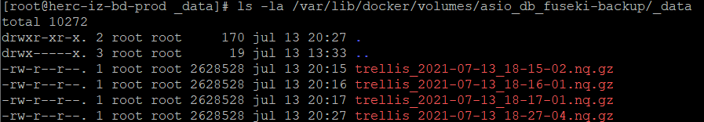
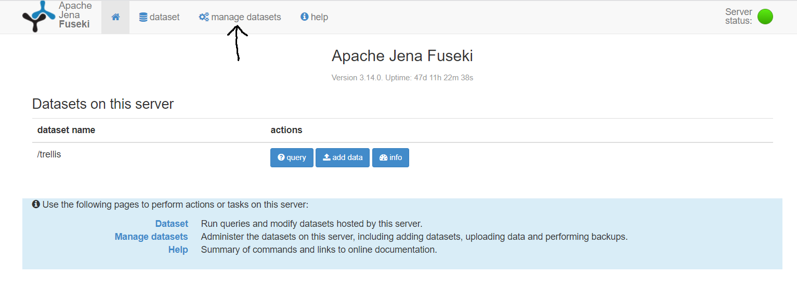
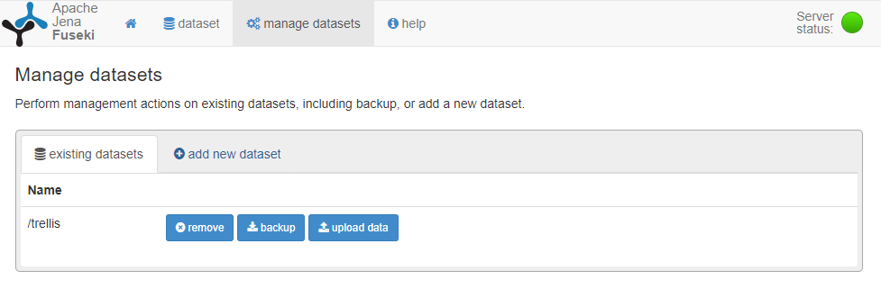
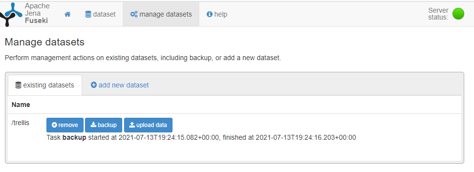
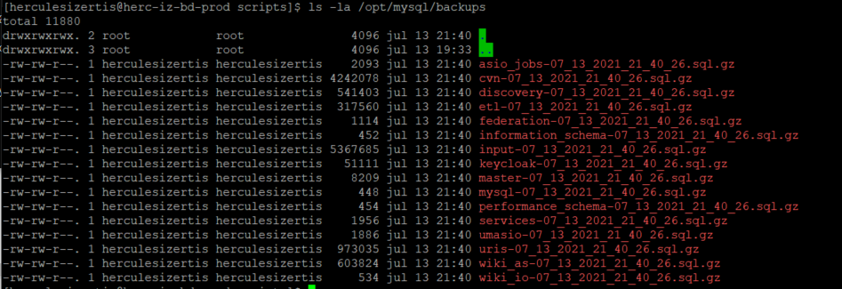
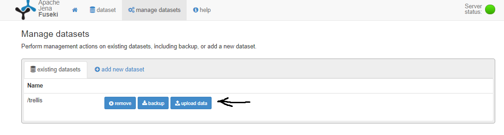
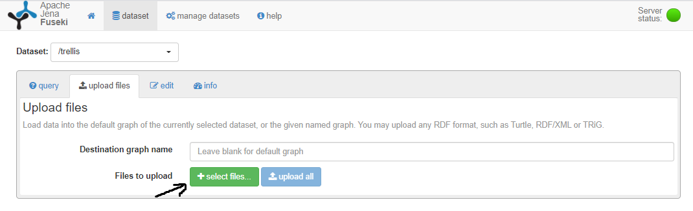
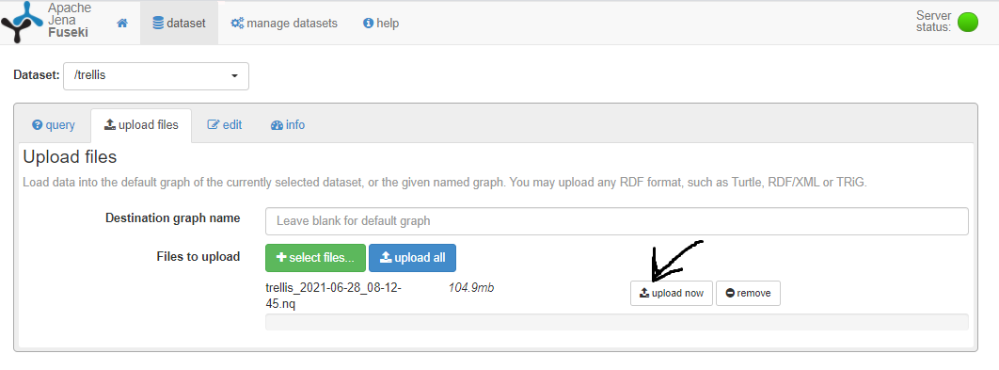
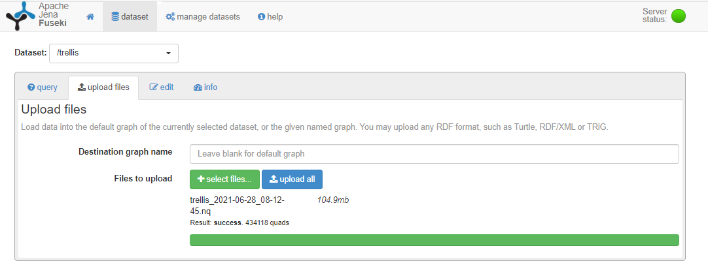

# Backups y restauraciones

El objetivo del presente documento es detallar los pasos necesarios para programar o realizar backups de las bases de datos del proyecto y describir asimismo los pasos necesarios para recuperar la información del sistema, en base a estos mismos backups de forma que sea siempre posible, recuperar un estado anterior del sistema, para un instante concreto en el tiempo.

## Bases de datos

A continuación se describen las bases de datos usadas para el proyecto:

### Almacenamiento

#### Fuseki (TDB2)

Es el Triple Store usado para el proyecto.

En todos los entornos esta desplegado en la máquina DB:

Para el entorno de DESARROLLO: http://herc-iz-bd-desa.atica.um.es

Para el entorno de PRE: http://herc-iz-bd-prod.atica.um.es

##### Volúmenes

Tanto los datos como los backups son accesibles por medio de volúmenes docker en el host donde esta desplegado [Fuseki](#Fuseki (TDB2)), comentado en el punto anterior. Estos volúmenes son:

* **fuseki-data**: Donde podemos encontrar los ficheros relativos a los datos almacenados en el triple store
  * ruta linux: /var/lib/docker/volumes/asio_db_fuseki-data
  * ruta windows (power shell): \\wsl$\docker-desktop-data\version-pack-data\community\docker\volumes\asio_db_fuseki-data
* **fuseki-backup**: Donde podemos encontrar los ficheros relativos a los backups realizados sobre los datos
  * ruta linux: /var/lib/docker/volumes/asio_db_fuseki-backup 
  * ruta windows (power shell): \\wsl$\docker-desktop-data\version-pack-data\community\docker\volumes\asio_db_fuseki-backup


#### BBDD Relacional (MariaDB)

Es la base de datos relacional, común para todos los servicios.

En todos los entornos esta desplegado en la máquina DB:

Para el entorno de DESARROLLO: http://herc-iz-bd-desa.atica.um.es

Para el entorno de PRE: http://herc-iz-bd-prod.atica.um.es

##### Directorios

Tanto los datos como los backups son accesibles por medio de volúmenes docker en el host donde esta desplegado [MariaDB](#BBDD-Relacional-(MariaDB)), comentado en el punto anterior. Estos volúmenes son:

* **mysql-data (volumen docker)**: Donde podemos encontrar los ficheros relativos a los datos almacenados en el triple store
  * ruta linux: /var/lib/docker/volumes/asio_db_mysql-data
  * ruta windows (power shell): \\wsl$\docker-desktop-data\version-pack-data\community\docker\volumes\asio_db_mysql-data
* **/opt/mysql/backups**: Ruta donde podemos encontrar los backups, en cualquiera de las máquinas donde la solución este desplegada

## Backups

Para poder retornar el sistema a un instante dado en el tiempo se han creado Scripts que de forma automatizada, generan los backups necesarios para restaurar el sistema.

### Fuseki

#### Script de creación de Backup

En estos momentos existe un Script **launch_fuseki_backup.sh**, en la ruta **/home/herculesizertis/deploy/scripts**, para gestionar la petición a Fuseki de realización de Backup

```bash
#!/bin/bash

echo "Doing backup in Fuseki"
echo $(curl --location --request POST 'https://sparqlld1.um.es/$/backup/trellis')
echo "Completed backup"
```

Para cualquier otro entorno futuro, será necesario usar este Script u otro similar para automatizar la tarea

Esto generara un fichero con el siguiente patrón en el nombre:

**dataset-año(yyyy)-mes(MM)-dia(dd)_hora(HH)-minuto(mm)-segundo(ss)**, por ejemplo para el registro **trellis_2021-07-13_18-15-02.nq.gz**

* dataset: en el ejemplo trellis
* Año: en el ejemplo 2021
* Mes: 07
* Día: 13
* Hora: 18
* Minuto: 15
* Segundo: 02



#### Programación de lanzamiento del Script

Se ha creado también una tarea programada en cron en la maquina DB donde se encuentra desplegado [Fuseki](#Fuseki-(TDB2)).

Dicha tarea ha sido programada usando el usuario **herculesizertis**. Podemos cambiar de usuario mediante el siguiente comando:

```bash
su herculesizertis
```

Podemos acceder a el editor de cron, por medio del siguiente comando

```bash
crontab -e
```

Y añadir la siguiente línea (a continuación de las anteriores si las hubiera)

```bash
0 3 * * * cd /home/herculesizertis/deploy/scripts && ./launch_fuseki_backup.sh >/dev/null 2>&1
```

Para el ejemplo (que muestra la programación actual), se puede apreciar que se programa la generación del backup, de forma diaria, a las 3 AM.

Para otras configuraciones, es recomendable si no se esta familiarizado con la sintaxis de cron, es recomendable apoyarse en alguna herramienta para la generación de la expresión por ejemplo [cron-expression-generator-quartz](https://www.freeformatter.com/cron-expression-generator-quartz.html).

#### Backups manuales

Existen varias formas de lanzar usa solicitud para realizar un backup manual

* Por medio de una ejecución manual del [Script](Script-de-creación-de-Backup) antes descrito. Desde la ruta  **/home/herculesizertis/deploy/scripts** ejecutar el siguiente comando:

```bash
sh launch_fuseki_backup.sh
```

* Por medio de la interface gráfica: Para los distintos entornos, podemos acceder a Fuseki, y lanzar la solicitud desde la interface.

  * DESARROLLO: [https://sparqlld1desa.um.es](https://sparqlld1desa.um.es)
  * PREPRODUCCIÓN: [https://sparqlld1.um.es](https://sparqlld1.um.es)

  Seleccionamos **manage datasets** 

  

  

  ​	Pulsamos el botón **backups** 

  ​	

  ​	Y la interface después de pedirnos confirmación, nos dará un mensaje confirmando que la tarea se ha llevado a cabo con 	éxito.

  ​	

* Por medio del API, haciendo una petición CURL

  ```bash
  curl --location --request POST 'https://sparqlld1.um.es/$/backup/trellis'
  ```

  Donde según el entorno las URL a las que debemos hacer la petición son:

  * DESARROLLO: [https://sparqlld1desa.um.es](https://sparqlld1desa.um.es)
  * PREPRODUCCIÓN: [https://sparqlld1.um.es](https://sparqlld1.um.es)

#### Borrado de Backups

Con el fin de no saturar el sistema de ficheros de las máquinas donde se almacenan los backups se recomienda establecer una política de borrado, de forma que se borren de forma automática a partir de la antigüedad que se defina.

Para ello se propone este Script, que puede ser programado en cron de la misma forma antes descrita

``````bash
#!/bin/bash

for i in `find /ruta_a_los_backups -maxdepth 1 -type d -mtime +dias_maximos_de_antiguedad -print`
do 
  echo -e "Borrando el directorio $i"; 
   rm -rf $i; 
done
``````


### BBDD Relacional

#### Script de creación de Backup

En estos momentos existe un Script **launch_database_backup.sh**, en la ruta **/home/herculesizertis/deploy/scripts**, para gestionar la petición a MariaDB de realización de Backup para todas las bases de datos

```bash
#!/bin/sh

BACKUP_FOLDER=/opt/mysql/backups
NOW=$(date +"%m_%d_%Y_%H_%M_%S")
echo $NOW
GZIP=$(which gzip)
echo $GZIP
MYSQLDUMP=$(which mysqldump)
echo $MYSQLDUMP

### MySQL Server Login info ###
MHOST=127.0.0.1
cho "MHOST=${MHOST}"
MPASS=1z3rt1s
echo "MPASS=${MPASS}"
MUSER=root
echo "MUSER=${MUSER}"
MPORT=3306

[ ! -d "$BACKUP_FOLDER" ] && mkdir --parents $BACKUP_FOLDER

for DB in $(mysql -h $MHOST -P $MPORT -u $MUSER -p${MPASS} -e 'show databases' -s --skip-column-names); do
    FILE=${BACKUP_FOLDER}/${DB}-${NOW};
    #echo "${MYSQLDUMP} -h ${MHOST} -P 3307 -u ${MUSER} -p${MPASS}"
    #echo "File: ${FILE}"
    $MYSQLDUMP -h $MHOST -P 3306 -u $MUSER -p${MPASS} --add-drop-database --databases $DB | gzip > $FILE.sql.gz
    echo "saved backup of ${DB}"
   # > $FILE;
done
echo "DONE"

```

Para cualquier otro entorno futuro, será necesario usar este Script u otro similar para automatizar la tarea

Esto generara un fichero con el siguiente patrón en el nombre:

**baseDeDatos-mes(MM)-dia(dd)-año(yyyy)_hora(HH)_minuto(mm)_segundo(ss).sql.gz**, por ejemplo para el registro **cvn-07_13_2021_21_40_26.sql.gz**

* baseDeDatos: en el ejemplo cvn
* Mes: en el ejemplo 07
* Día: en el ejemplo 13
* Año: en el ejemplo 2021
* Hora: 21
* Minuto: 40
* Segundo: 26



#### Programación de lanzamiento del Script

Se ha creado también una tarea programada en cron en la maquina DB donde se encuentra desplegado [Fuseki](#Fuseki-(TDB2)).

Dicha tarea ha sido programada usando el usuario **herculesizertis**. Podemos cambiar de usuario mediante el siguiente comando:

```bash
su herculesizertis
```

Podemos acceder a el editor de cron, por medio del siguiente comando

```bash
crontab -e
```

Y añadir la siguiente línea (a continuación de las anteriores si las hubiera)

```bash
0 3 * * * cd /home/herculesizertis/deploy/scripts && ./launch_database_backup.sh >/dev/null 2>&1
```

Para el ejemplo (que muestra la programación actual), se puede apreciar que se programa la generación del backup, de forma diaria, a las 3 AM.

Para otras configuraciones, es recomendable si no se esta familiarizado con la sintaxis de cron, es recomendable apoyarse en alguna herramienta para la generación de la expresión por ejemplo [cron-expression-generator-quartz](https://www.freeformatter.com/cron-expression-generator-quartz.html).

#### Backups manuales

En este caso solo se propone una forma de lanzar usa solicitud para realizar un backup manual

* Por medio de una ejecución manual del [Script](Script-de-creación-de-Backup) antes descrito. Desde la ruta  **/home/herculesizertis/deploy/scripts** ejecutar el siguiente comando:

```bash
sh launch_database_backup.sh
```

#### Borrado de Backups

Con el fin de no saturar el sistema de ficheros de las máquinas donde se almacenan los backups se recomienda establecer una política de borrado, de forma que se borren de forma automática a partir de la antigüedad que se defina.

Para ello se propone este Script, que puede ser programado en cron de la misma forma antes descrita

``````bash
#!/bin/bash

for i in `find /ruta_a_los_backups -maxdepth 1 -type d -mtime +dias_maximos_de_antiguedad -print`
do 
  echo -e "Borrando el directorio $i"; 
   rm -rf $i; 
done
``````

## Recuperación de Backups

### Parada de servicios y borrado de datos

Se recomienda usar docker-compose para parar los servicios y borrar los datos, para ello:

Posicionarse en la ruta **/home/herculesizertis/deploy/**

```bash
cd /home/herculesizertis/deploy/
```

Y ejecutar el siguiente comando para parar todos los servicios y borrar los volúmenes

```bash
docker-compose -f docker-compose.yml down -v
```

Tras parar todos los servicios, ha que volver a desplegarlos usando el comando

```
docker-compose -f docker-compose.yml up -d
```

Y con esto, tendremos todos los servicios activos y sin datos

### Cargar datos a partir de los Backups

#### Fuseki

La forma más sencilla de cargar los datos a partir de los Backup es a traves de la interface gráfica

Seleccionamos  otra vez el botón **manage datasets** 


​	Seleccionamos ahora el botón **upload data**

​	

​	Seleccionamos ahora el botón **select files** y seleccionamos el fichero de Backup de Fuseki

​	

​		Y por ultimo pulsamos el botón de **upload now**



​	Tras lo cual veremos una barra de progreso y al final del proceso nos informara de cuantas tripletas ha actualizado y cual es el 	estado final



#### Data Base

Para restaurar la base de datos relacional a partir de los ficheros de backup, es necesario siguientes los siguientes pasos:

1. Localizar los ficheros a partir de los cuales queremos recuperar el estado de la base de datos. Es necesario recuperar todas las bases de datos, y restaurarlas, para ello selecionaremos los ficheros de backup de la fecha que estemos interesados en restaurar. Tal y como se indico estos están disponibles en la ruta  **/opt/mysql/backups**.

   Podemos filtrarlos aprovechando el patrón de nombrado usando el siguiente comando

   ```bash
   ls /opt/mysql/backups | grep -07_13_2021 # Esto filtraria todos los ficheros del dia 13 del mes 7 de 2021
   ```

   

   

2. Se recomienda copiarlos en una ruta a nuestra elección para trabajar con ellos de forma mas sencilla

3. Para cada uno de esos ficheros ejecutamos el siguiente comando descomprimirlos

   ```bash
   tar xvf nombre_archivo.tar
   ```

4. Para cada fichero descomprimido podemos ejecutar el siguiente comando para restaurar la base de datos

   ```
   mysql -u usuario -p basededatos < fichero_backup_a_restaurar.sql
   ```

   