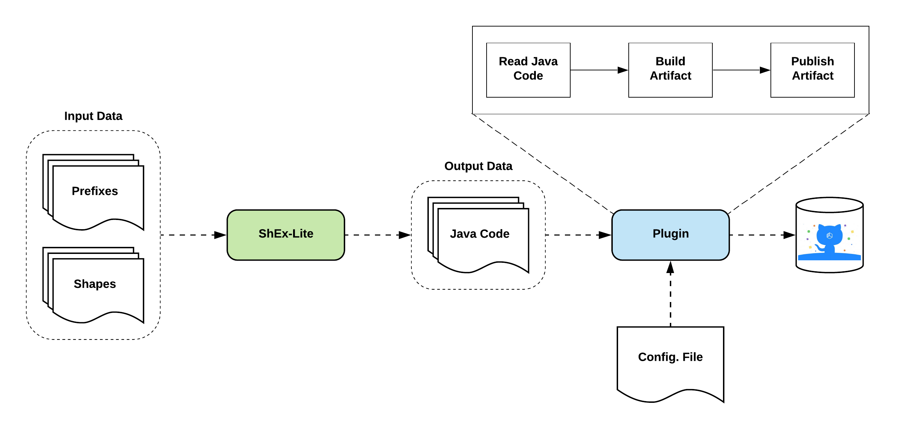

| Fecha        | 29/04/2021                                                   |
| ------------ | :----------------------------------------------------------- |
| Revisado por | Paloma Terán Pérez                                           |
| Módulo       | Módulo de calculo de deltas entre modelos de dominio en Java |
| Tipo         | Documento                                                    |
| Objetivo     | Documento con el módulo de calculo de deltas entre modelos de dominio en Java |

# Módulo Domain Model Creation

## Resumen
Este módulo será el encargado de generar y desplegar de manera automática artefactos java (.jar) compilados sobre un repositorio de GitHub previamente configurado, de tal manera que estos puedan distribuirse.

ShEx-Lite es una aplicación que permite generar clases Java (POJOs) que representan un modelo de dominio. El sistema Hércules ASIO emplea ShEx-Lite para generar los modelos de dominio de la Arquitectura Semántica. Para tal fin se propone que los modelos de dominio correspondientes a cada versión de la ontología se puedan distribuir también compilados. De esta forma se pueden configurar instantáneas del proyecto. Una instantánea está compuesta por la ontología, sus shapes y el modelo de dominio correspondiente. La ontología se versiona por medio de GitHub. Sin embargo esto no se puede llevar al modelo de dominio compilado. Para versionar los artefactos se recomienda emplear un repositorio de GitHub haciendo uso del servicio GitHub Packages.

## Diagrama del módulo

Previamente a la obtención de artefactos Java, la librería ShEx-Lite recibirá una serie de Shapes y se encargará de generar los POJOs escritos en código Java plano correspondientes. A continuación, un plugin para está librería sera las responsable de transformar dichos POJOs a artefactos de Java compilados para su distribución.
Una vez generados los artefactos,estos serán desplegados en este caso sobre un repositorio de GitHub donde serán publicados a modo de paquete utilizando el servicio GitHub Packages, permitiendo así el versioneado de los mismos.

### ShEx-Lite Plugin
Este plugin para ShEx-Lite permitiría que, automáticamente, se transforme la salida de ShEx-Lite de POJOs escritos en código Java plano a artefactos de Java compilados que puedan distribuirse.
Recibirá como entrada las clases Java que genera ShEx-Lite. Estas clases Java se encuentran como texto plano o código fuente. ShEx-Lite las genera todas en un mismo directorio pre-configurado.
### GitHub Packages
Un paquete representa un software autocontenido y reutilizable que incluye código y metadatos. 
El servicio GitHub Packages es un servicio de alojamiento de paquetes, totalmente integrado con GitHub, que combina el código fuente junto con los paquetes en un mismo lugar, de manera que facilita la centralización del software. Entre otras funcionalidades, permite alojar múltiples paquetes en un repositorio y ver más información acerca de cada paquete al ver el README del paquete, las estadísticas de descarga, y el historial de la versión. Además, estos paquetes pueden ser publicados en repositorios públicos (paquetes públicos) para compartir con todo GitHub, o en un repositorio privado (paquetes privados) para compartirlos con colaboradores o con una organización

## Datos de entrada
Los datos de entrada serán las Shapes y Prefijos que reciba la librería ShEx-Lite para su transformación a POJOs y posteriormente a artefactos Java a través de un plugin para la librería.
## Salidas esperadas
Los datos de salida del módulo, para este caso, se corresponden con una versión del artefacto de modelo de dominio subida a un repositorio de GitHub haciendo uso del servicio GitHub Packages con el versionado correcto.
## Posibles impedimentos
Dentro del ámbito de posibles impedimentos se enmarcan también los patrones de diseño que puedan bloquear decisiones futuras como el conocido "vendor-lock". En este caso el único impedimento que se halla es el de que si se implementa de forma incorrecta puede resultar complicado cambiar el tipo de repositorio a donde se sube el artefacto.
Por otro lado, respecto a GitHub Packages, cabe destacar que se trata de un servicio gratuito para los paquetes públicos. Sin embargo, para los paquetes privados, cada cuenta de GitHub recibe una cantidad determinada de almacenamiento gratuito y de transferencia de datos, dependiendo del producto que se utilice en la cuenta. En caso de necesitar un mayor almacenamiento, se deberá abonar el importe requerido [(Acerca de la facturación para GitHub Packages)](https://docs.github.com/es/github/setting-up-and-managing-billing-and-payments-on-github/about-billing-for-github-packages).

## Sistemas existentes similares
Como alternativa a GitHub Pacakges para el versioneado y almacenamiento de artefactos podríamos hacer uso de [Maven Repository](https://mvnrepository.com/), que se trata del repositorio central de maven donde los artefactos pueden ser almacenados y ser usados por Maven de manera sencilla. Otra posible solución podría ser la combinación de Maven Repository junto con GitHub Packages.
## Links
* [ShEx-Lite](https://github.com/weso/shex-lite)
* [GitHub Packages](https://docs.github.com/es/packages/learn-github-packages/about-github-packages)
* [Maven Repository](https://mvnrepository.com/)