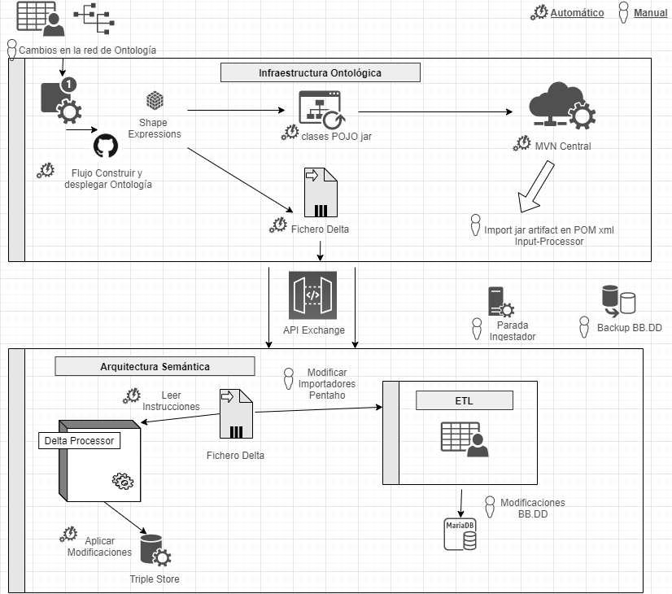
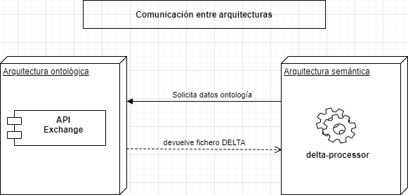
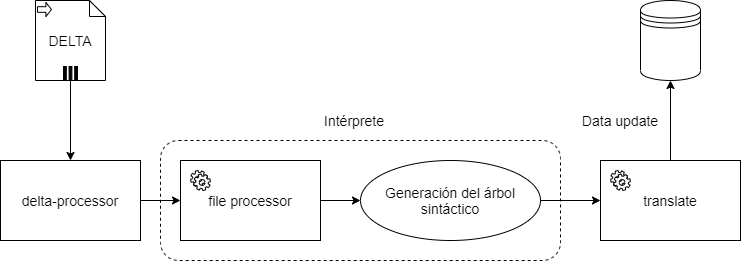
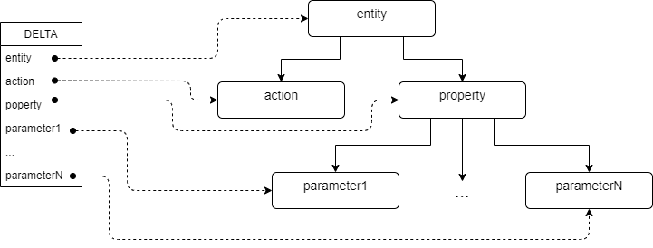
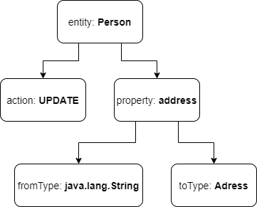
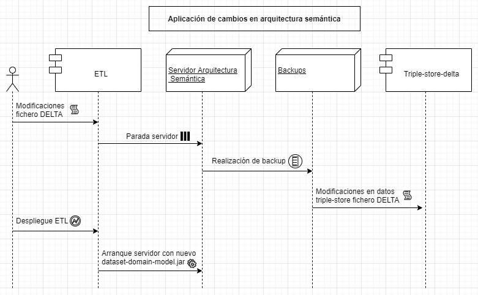

# Integración entre la arquitectura ontológica y la arquitectura semántica

## Introducción

El objetivo de este documento es explicar el diseño arquitectónico entre la infraestructura ontológica y la infraestructura semántica, describiendo los procesos que se tienen que llevar a cabo tras los cambios que pueden surgir en la red de ontologías.

## Requisito

Se precisa que la integración entre ambas infraestructuras requieran del menor esfuerzo manual posible, automatizando la mayoría de los escenarios que surgen de los cambios en las ontologías.

> Es necesario informar que aunque se busque la máxima automatización posible, habrá puntos en los que esta no se podrá llevar acabo como por ejemplo el proceso de creación/actualización de ontologías y la adaptación de estos cambios al proceso de ETL.

## Descripción general

A continuación se muestra un gráfico con la visión global entre las distintas partes.



El proceso comienza con cambios en la red de ontologías, estos desembocan en flujos de trabajo automáticos de GitHub los cuales construyen y despliegan la ontologia. Como resultado de estas modificaciones se genera un artefacto jar con las classes java que posteriormente la arquitectura semántica utilizará. Este artefacto se subirá al repositorio Maven Central.

Además de este artefacto se crea un fichero de instrucciones Delta con los cambios producidos.

La comunicación entre la Infraestructura Ontológica y la Arquitectura Semántica, para recuperar esos ficheros Delta se realizará a través de una API rest `Exchange`.

Cuando el número de cambios en la ontología es suficientemente maduro, un factor humano, se encargará de la parada del servidor y posterior realización de backup de los datos existentes. El siguiente paso sería hacer de forma manual los cambios en la ETL para la importación de datos.

El último paso este de forma automática sería el procesamiento del fichero Delta por parte del módulo `Triple Store Delta` para modificar los datos almacenados en el Triple Store (Wikibase y Trellis).

## Despliegue inicial ontología (primera instalación)

- Generación de clases POJO a partir de shape expressions con la herramienta [ShEx Lite](#ShEx)

- Empaquetado de las clases java en un artefacto **dataset-domain-model-X.X.X.jar** donde X.X.X es su correspondiente versionado.

- Subida del artefacto al repositorio [MVN Central](https://mvnrepository.com/repos/central) para su posterior consumo por parte de la arquitectura semántica.

## Despliegue inicial arquitectura semántica

No requiere de acciones adicionales a las ya descritas en el documento [despliegue_inicial](../arquitectura_semantica/despliegues/entorno_desarrollo/despliege_inicial.md).

## Cambios en la red de ontología (sucesivas iteraciones)

### Modificaciones en la infraestructura ontológica

Cualquier modificación en la ontología implica modificaciones en las shape expressions, las cuales tienen por un lado la tarea de definir un esquema para los datos a partir de la ontología y por tanto tienen la capacidad de validarlos, y por otro, permite definir el dominio de datos compartido por toda la solución, a partir de la generación de POJOs. Estos cambios también provocan modificaciones a realizar en la arquitectura semántica (ETL y adaptación de los datos existentes en Trellis y Wikibase).

#### Procesos manuales

Estas modificaciones en la ontología dan como resultado un listado de cambios a aplicar en las Shape Expressions.

| Modificación                                                                               | Protocolo a aplicar                      |
| ------------------------------------------------------------------------------------------ | ---------------------------------------- |
| Creación de nueva clase C                                                                  | Modificar directamente shape expression  |
| Borrado de clase C                                                                         | Modificar directamente shape expression  |
| Crear una propiedad p                                                                      | Modificar directamente shape expression  |
| Eliminar la propiedad p                                                                    | Modificar directamente shape expression  |
| Eliminar una propiedad p de una clase C                                                    |  Modificar directamente shape expression |
| Añadir una relación de subclase-superclase entre la subclase SubC y la superclase SuperC   | Modificar directamente shape expression  |
| Eliminar una relación de subclase-superclase entre la subclase SubC y la superclase SuperC | Modificar directamente shape expression  |
| Declarar clases C1 y C2 como disjoint                                                      | Modificar directamente shape expression  |
| Definir una propiedad p como transitiva o simétrica                                        | Modificar directamente shape expression  |
| Mover una propiedad p de una subclase a una superclase                                     | Modificar directamente shape expression  |
| Mover una propiedad p de una superclase a una subclase                                     | Modificar directamente shape expression  |
| Reducir las restricciones de una propiedad p                                               | Modificar directamente shape expression  |
| Añadir restricciones a una propiedad p                                                     | Modificar directamente shape expression  |
| Modificar la descripción de una clase (label, comment, alias)                              | Modificar directamente shape expression  |

#### Procesos automáticos

La construcción y el despliegue de la ontología están controlados a traves de [workflows de integración continua](https://docs.github.com/en/actions/configuring-and-managing-workflows/configuring-a-workflow) de GitHub. Son las que se encargan de mantener actualizada la ontología en Wikibase.


La generación de clases POJO a partir de shape expressions con la herramienta [ShEx Lite](#ShEx) se realizará de forma automática cada vez que la rama [master](https://github.com/HerculesCRUE/ib-hercules-ontology/tree/master/scripts) donde se ubican las Shape Expressions detecta que ha habido cambios.

El resultado de esta iteración es la regeneración de **todo el modelo de dominio**, posterior empaquetado y subida al repositorio [MVN Central](https://mvnrepository.com/repos/central).

> El motivo por el que es necesario la regeneración de todo el modelo de dominio es debido a que la herramienta ShEx Lite no es consciente de que ha cambiado y que no en la ontología.

## ShEx

[ShEx Lite](https://github.com/weso/shex-lite) es un subconjunto de una especificación de Shape Expressions que ofrece un API para generar las clases de dominio a partir de unos datos de entrada, y el resultado se enviará a donde indique el parámetro de salida de este método.

## Comunicación entre la infraestructura ontológica e infraestructura semántica

Para que la infraestructura semántica sea consciente de que han habido cambios en la red de ontologías, la infraestructura ontológica ofrece un nuevo módulo API **exchange** con los siguientes métodos:

| Operación | EndPoint                                           | Descripción                                                                                           |
| --------- | -------------------------------------------------- | ----------------------------------------------------------------------------------------------------- |
| `GET`     | /versions                                          | Devuelve un listado de todas las versiones de ontologías existentes ordernadas por fecha descendente. |
| `GET`     | /ontology/{**currentVersion**}/{**targetVersion**} | Devuelve el fichero [DELTA](#DELTA) generado entre `currentVersion` y `targetVersion`.                |

La siguiente tabla muestra ejemplos de posibles respuestas a las peticiones anteriormente descritas.

| Operación | EndPoint                                           | Descripción                                                                                                                                            |
| --------- | -------------------------------------------------- | ------------------------------------------------------------------------------------------------------------------------------------------------------ |
| `GET`     | /versions                                          | { 1.0.3, 1.0.2, 1.0.1, 1.0.0}                                                                                                                          |
| `GET`     | /ontology/{**currentVersion**}/{**targetVersion**} | { ADD Outsourcing PROPERTY employees TYPE Number, ADD Universidad PROPERTY numeroAlumnos TYPE Number, DELETE GrupoInvestigacion PROPERTY descripcion } |

Este módulo será un servicio REST autenticado accesible desde **triple-store-delta** ubicado en la arquitectura semántica.



## DELTA

Los ficheros delta son objetos JSON cuya información contiene las modificaciones a realizar en la ETL tras cambios en la ontología. Estos ficheros son interpretables por el nuevo módulo de la arquitectura semántica **triple-store-delta** de tal forma que es capaz de modificar el contenido de los datos actuales en Trellis y Wikibase de forma automática para adaptarlos a la nueva semántica de la ontología.

### Definición de la gramática

Los ficheros DELTA constan de una gramática sencilla en la que cada objeto a procesar está compuesto por un conjunto de elementos tipo

```
propiedad ::= valor
```

El conjunto de propiedades que se pueden utilizar está claramente definido:

* action
* entity
* property
* toName
* type
* fromType
* toType

Las propiedades **action** y **entity** siempre estarán presentes en cada elemento del fichero. El resto de propiedades serán necesarias en función de los valores de la propiedad **action** (ver Instrucciones DELTA).

### Estructura del fichero

Los ficheros DELTA siguen una nomenclatura a la hora de ser nombrados, consistente en concatenar las versiones que se van procesar:

```
XXXYYY
```

Por ejemplo:

```
000001
002003
005008
```

Internamente, los ficheros constan de un array de elementos en formato JSON, en los que cada elemento forma parte de la gramática definida:

```
[
    {
        propiedad: valor,
        …
    },
    …
]
```

Como se puede ver en el siguiente ejemplo:

```
[
    {
        “action”: “UPDATE”,
         “entity”: “asio.Person”,
        ”property”: “address”,
        ”fromType”: “java.lang.String”,
         “toType”: “asio.Address”
    }, 
    {
         “action”: “DELETE”,
        ”entity”: “asio.Student”,
        ”property”: “name”
    }
]
```

Como se puede observar, cada elemento a procesar contiene propiedades de definidas en la gramática que necesita.

### Instrucciones DELTA

Operaciones soportadas:

- Creaciones de entidades o propiedades. `ADD`
- Actualización de entidades o propiedades. `UPDATE`
- Borrado de entidades o propiedades. `DELETE`
- Renombrado de entidades. `RENAME`

#### ADD

```js
ADD Entidad [PROPERTY] [value] TYPE [value]
```

#### Ejemplos:

`Añadir una nueva entidad 'Outsourcing'`

```js
ADD Outsourcing PROPERTY employees TYPE Number
```

`Añadir una nueva propiedad 'numeroAlumnos' a la entidad 'Universidad'`

```js
ADD Universidad PROPERTY numeroAlumnos TYPE Number
```

`Añadir una nueva entidad 'localización' a la entidad 'Universidad'`

```js
ADD Localidad PROPERTY nombre TYPE String
ADD Universidad PROPERTY localizacion TYPE Localizacion
```

#### UPDATE

```js
UPDATE Entidad [PROPERTY] [value] TYPE [value]
```

#### Ejemplos:

`Actualizar una entidad 'Persona'`

```js
UPDATE Persona PROPERTY departamento TYPE String 'Medicina Interna'
UPDATE Persona PROPERTY codDepartamento TYPE String 'E037'
```

#### DELETE

```js
DELETE Entidad [PROPERTY] [value] REFERENCES [value]
```

#### Ejemplos:

`Borrar una nueva entidad 'GrupoInvestigacion'`

```js
DELETE GrupoInvestigacion
```

`Borrar una propiedad 'descripcion' de la entidad 'GrupoInvestigacion'`

```js
DELETE GrupoInvestigacion PROPERTY descripcion
```

### Creación de ficheros DELTA

#### ShEx Lite

Desde la aparición del Shape Expressions Language (ShEx), las demandas de la comunidad sobre nuevas herramientas basadas en el ShEx han crecido. Una de esas demandas, nacida durante el desarrollo del Proyecto Europeo Hércules ASIO3, fue la creación de una herramienta que pueda transformar automáticamente las ShEx en modelos de dominio de objetos representados por medio de un lenguaje de programación orientada a objetos. El modelo de dominio generado será parte de una solución basada en una arquitectura limpia. ShEx-Lite fue creado como un subconjunto de ShEx que permite la generación automática de modelos de dominio desde esquemas expresados con ella.

#### Generación del schema.json

Junto con la generación del modelo de dominio en el lenguaje correspondiente, se genera un fichero schema.json que contiene la estructura de dicho modelo de dominio en formato JSON. El fichero tiene la siguiente estructura:

```
{
    generationDate,
    classes: [
        {
            className
            atributes: [
                {
                    attributeName
                    attributeType
                },
                …
            ]
        },
        …
    ]
}
```

La información de este fichero, durante la primera ejecución del proceso, se almacena en base de datos, añadiendo además la versión que se está procesando (000 al ser la primera). El hecho de almacenar esta información en base de datos facilitará que en las siguientes ejecuciones se pueda realizar una comparación con un nuevo schema.json, así como actualizar las versiones almacenadas y la generación de los ficheros DELTA correspondientes.

#### Generación de ficheros DELTA

Un fichero DELTA contiene las operaciones a realizar fruto de la comparación de datos entre versiones del modelo de dominio. Suponemos, por ejemplo, que tenemos la siguiente estructura almacenada en base de datos:

```
className: ExampleClass
atributes: [
    {
        attributeName: width
        attributeType: String
    },
]
```

En nueva ejecución del proceso de generación del dominio comprobamos que la estructura recibida para esa clase es la siguiente:

```
className: ExampleClass
atributes: [
    {
        attributeName: width
        attributeType: Integer
    },
]
```

El tipo de la propiedad **width** ha cambiado, por lo que será necesario generar una instrucción DELTA que indique que se debe actualizar el tipo de ese campo. El resultado sería el siguiente:

```
[
    {
        action: UPDATE,
        entity: EXampleClass,
        property: width,
        fromType: java.lang.String,
        toType: java.lang.Integer
    } 
]
```

Una vez generado el fichero DELTA con todas las modificaciones a realizar, se nombra dicho fichero concatenando la versión actual con la nueva.

#### Procesamiento en triple-store

El procesamiento de los ficheros DELTA se realizará dentro de un módulo específico denominado delta-processor, que recibirá un fichero, procesará su contenido y aplicará los cambios. Para procesar el contenido se hará uso del patrón Intérprete (ver [patrón Intérprete](./patron_interprete.md)), que ayudará a traducir la gramática definida para los ficheros e instrucciones que permitan aplicar los cambios solicitados.



A la hora de procesar el contenido de los ficheros DELTA se debe crear una estructura, tal y como establece el patrón Intérprete, de tipo árbol que posteriormente permita transformarlo en instrucciones concretas que apliquen los cambios.



Supongamos la solicitud de un cambio de nombre de una de las propiedades de un objeto. Esto generaría un árbol con la siguiente estructura:



A partir de este árbol, es posible generar una consulta, o la lógica que corresponda,

### Modificaciones en la infraestructura semántica

Tras modificaciones en la red de ontologías, como ya se ha mencionado anteriormente es necesario realizar las siguientes acciones:

- Cambios en la ETL
- Adaptación de los datos existentes en el triple-store-adapter (Trellis, Wikibase)

#### Secuencia de cambios a aplicar y entorno.

Para llevar a cabo los cambios procedentes de la red de ontologías, es necesario realizar los siguientes pasos en el orden indicado:



1. Modificación en la ETL según las especificaciones del fichero DELTA

   > Estas modificaciones no se despliegan hasta no completar los pasos 2 y 3.

2. Parada del ingestador de datos `dataset-importer` que se encarga de alimentar el `triple-store` con información.

3. Invocación del proceso para la realización de backups.

   > Desde que se detiene el ingestador de información `dataset-importer` hasta que se inicia el proceso de backup debe pasar un tiempo lo suficientemente largo como para que se vacíen las colas kafka con los datos de entrada del módulo **management-system** encargado de la generación de ficheros RDF.

   > Para verificar que no hay información pendiente de procesar, el módulo `delta-processor` dispondrán de un método actuator para verificar que las colas _management-data_ y _general-data_ están vacías.

4. Invocación a un método REST del **triple-store-adapter** con un fichero DELTA como parámetro. Esta invocación se hará a través de un comando curl dentro de un fichero sh.

5. Despliegue de la ETL

   > Previamente al arranque del ingestador es necesario verificar que el paso 4 ha finalizado correctamente, para ello el módulo `delta processor` dispondrá de un método que indique el estado de la ejecución.

6. Arranque del ingestador de datos `dataset-importer`, con los microservicios apuntando a la nueva versión del **domain-model-X.X.X.jar**

Los pasos anteriormente descritos se ejecutarán en un entorno no productivo y posteriormente se promocionarán al entorno final de producción.

#### Procesos automáticos

La adaptación de los datos del triple store (Trellis, Wikibase) se harán de forma automática a partir de los ficheros [DELTA](#DELTA) procedentes de la arquitectura ontológica.

Para poder implementar esta funcionalidad es necesario crear un nuevo componente **delta-processor** el cual contendrá un algoritmo capaz de interpretar las instrucciones procedentes de los ficheros DELTA para modificar los datos del **triple-store-adapter** adaptándolos a los nuevos cambios en las ontologías.

Este nuevo módulo surge como substitución de la idea original **scripts ad-hoc** para la adaptación de los datos del triple-store-adapter. De esta forma, se consigue una automatización del proceso de transformación de datos procedentes del **triple-store-adapter** con la correspondiente reducción de errores en la ejecución manual de scripts.

#### Procesos manuales

- Determinación del momento en que se deben aplicar las modificaciones que surgen de cambios en la red de ontologías.
- Modificaciones en la ETL a partir de la generación de los ficheros [DELTA](#DELTA).
