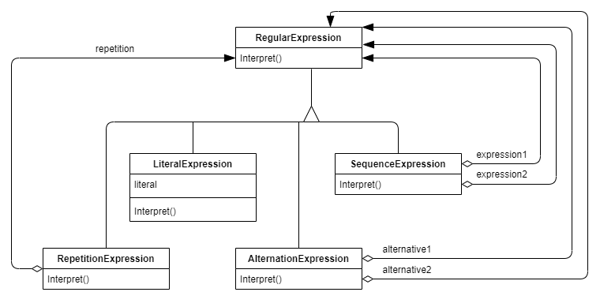
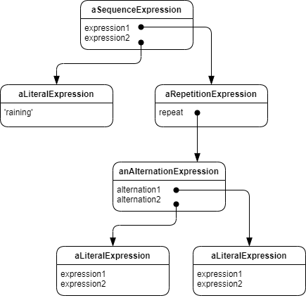
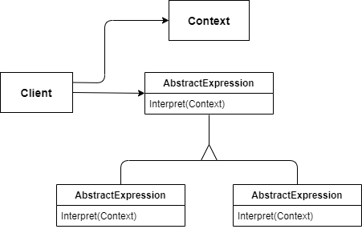

# Patrón intérprete

## Objetivo

Dado un lenguaje, define una representación para su gramática junto con un intérprete que utiliza la representación para interpretar sentencias del lenguaje.

## Motivación

Si un tipo concreto de problema ocurre con suficiente frecuencia, entonces podría merecer la pena expresar instancias del problema como sentencias en un lenguaje más simple. Después, será posible construir un intérprete que solucione el problema interpretando dichas sentencias.

Por ejemplo, la búsqueda de cadenas de texto que coincidan con un patrón es un problema habitual. Las expresiones regulares son un lenguaje estándar para definir patrones de texto. En lugar de construir algoritmos específicos que coincidan con cada patrón de texto, se utilizan algoritmos de búsqueda que puedan interpretar una expresión regular que especifique le conjunto de cadenas de texto a encontrar.

El patrón Intérprete describe cómo definir una gramática para lenguajes sencillos, representar sentencias en dicho lenguaje e interpretarlas. En este ejemplo, el patrón describe cómo definir una gramática para expresiones regulares, representar una expresión concreta y cómo interpretarla.

Supongamos que la siguiente gramática define las expresiones regulares:

```
expression ::= literal | alternation | sequence | repetition | ‘(‘ expression ‘)’
alternation ::= expression ‘|’ expression
sequence ::= expression ‘&’ expression
repetition ::= expression ‘*’
literal ::= ‘a’ | ‘b’ | ‘c’ | … { ‘a’ | ‘b’ | ‘c’ | … }*
```

El símbolo **expression** es el símbolo de comienzo, y **literal** es un símbolo terminal, dicho en palabras sencillas.

El patrón Intérprete utiliza una clase para representar cada regla gramatical. Los símbolos en la parte derecha de la regla son variables de dichas clases. La gramática anterior se representa con 5 clases: una clase abstracta **RegularExpression** y sus cuatro subclases **LiteralExpression**, **AlternationExpression**, **SequenceExpression** y **RepetitionExpression**. Las tres últimas clases definen variables que contienen subexpresiones.



Cada expresión regular definida por su gramática se representa mediante un árbol sintáctico abstracto con estas clases. Por ejemplo, el árbol sintáctico abstracto



representa la expresión regular

```
raining & (dogs | cats) *
```

Podemos crear un intérprete para estas expresiones regulares definiendo la operación **Interpret** para cada una de las subclases de RegularExpression. **Interpret** recibe como argumento el contexto en el cual interpretar la expresión. El contexto contiene la cadena de entrada e información de cuántas coincidencias han ocurrido hasta el momento. Cada subclase de **RegularExpression** implementa **Interpret** para encontrar la siguiente parte de la cadena de entrada del contexto actual. Por ejemplo:

* **LiteralExpression** comprobará si la entrada coincide con el literal que define.

* **AlternationExpression** comprobará si la entrada coincide con alguna de sus alternativas.

* **RepetitionExpression** comprobará si la entrada tiene múltiples copias de la expresión.

## Aplicación

Se utiliza el patrón Intérprete cuando hay un lenguaje que interpretar, y se pueden representar sentencias del lenguaje como árboles sintácticos abstractos. El patrón funciona mejor cuando:

* **La gramática es simple**. Para gramáticas complejas, la jerarquía de clases para la gramática se vuelve grande e inmanejable. Herramientas como analizadores son una alternativa mejor en dichos casos. Pueden interpretar expresiones sin construir árboles sintácticos abstractos, lo cual puede ahorrar espacio y, probablemente, tiempo.
* **La eficiencia no es un factor crítico**. Los intérpretes más eficientes, normalmente, no implementan directamente los árboles, sino que los traducen primero a otra forma. Por ejemplo, las expresiones regulares se suelen transformar en máquinas de estados. Pero, aun así, el traductor puede ser implementado con el patrón Intérprete, por lo que el patrón sigue siendo aplicable.

## Estructura



## Participantes

* **AbstractExpression**
  * Declara la operación abstracta **Interpret** que es común en todos los nodos del árbol.

* **TerminalExpression**
  * Implementa la operación **Interpret** asociada con los símbolos terminales de la gramática.
  * Se necesita una instancia para cada símbolo terminal en una sentencia.

* **NonterminalExpression**

  * Se necesita una clase para cada regla R ::= R1 R2 … Rn en la gramática.

  * Contiene variables de tipo **AbstractExpression** para cada uno de los símbolos entre R1 y Rn.
  * Implementa la operación **Interpret** para símbolos no terminales en la gramática. Suele invocarse de forma recursiva en las variables representadas entre R1 y Rn.

* **Context**
  * Contiene información global del intérprete.

* **Cliente**

  * Construye (o se le proporciona) un árbol sintáctico abstracto que representa una sentencia concreta en el leguaje definido por la gramática. El árbol se compone de instancias de **NonterminalExpression** y **TerminalExpression**.

  * Realiza llamadas a la operación **Interpret**.

## Colaboraciones

* El cliente construye (o se le proporciona) la sentencia como un árbol sintáctico abstracto con instancias de **NonterminalExpression** y **TerminalExpression**. Después el cliente inicializa el contexto y llama la operación **Interpret**.

* Cada nodo **NonterminalExpression** define **Interpret** en función del **Interpret** de cada subexpresión. La operación **Interpret** de cada nodo **TerminalExpression** define el caso base de la recursión.

* La operación **Interpret** de cada nodo utiliza el contexto para almacenar y acceder al estado del intérprete.

## Consecuencias

El patrón Intérprete tiene las siguientes fortalezas y debilidades:

1. Es fácil cambiar y extender la gramática. Dado que el patrón utiliza clases para representar las reglas gramaticales, es posible utilizar herencia para cambiar o extender la gramática. Las expresiones existentes pueden ser modificadas de forma incremental, y nuevas expresiones pueden ser definidas como variaciones de otras más antiguas.

2. Implementar la gramática es fácil. Las clases definidas en los nodos del árbol sintáctico abstracto tienen implementaciones similares. Estas clases son fáciles de generar, y, habitualmente, su generación puede se puede automatizar con un compilado o un analizador.

3. Las gramáticas complejas son difíciles de mantener. El patrón Intérprete define al menos una clase por cada regla de la gramática. Por lo tanto, gramáticas con múltiples reglas pueden ser difíciles de gestionar y mantener. Es posible utilizar otros patrones para mitigar el problema. Pero cuando la gramática es muy compleja, el uso de otras técnicas como analizadores o compiladores son más apropiados.

4. Añadir nuevas formas de interpretar expresiones. El patrón Intérprete facilita la evaluación de expresiones de nuevas formas. Por ejemplo, se puede dar soporte a ‘pretty printing’ o comprobación de tipos en una expresión definiendo una nueva operación en las clases de expresión.

## Implementación

El patrón Intérprete tiene ciertos problemas de implementación:

* Creación del árbol sintáctico abstracto. El patrón no explica como crear un árbol. En otras palabras, no aborda el análisis. El árbol puede ser creado por un analizador basado en tablas, un analizador hecho a mano (normalmente con un proceso recursivo), o directamente por el cliente.

* Definición de la operación **Interpret**. No es necesario definir la operación **Interpret** en las clases expresión. Si es habitual crear un nuevo intérprete, es mejor utilizar el patrón Visitor para poner el Intérprete en un objeto **visitor** separado. Por ejemplo, una gramática para un lenguaje de programación tendrá muchas operaciones en árboles sintácticos abstractos, como comprobación de tipos, optimización, generación de código, etc. Es recomendable utilizar un **visitor** para evitar definir estas operaciones en cada clase gramática.

* Compartir símbolos terminales con el patrón Flyweight. Gramáticas cuyas sentencias contienen múltiples ocurrencias de un símbolo terminal se podrían beneficiar de compartir una simple copia de dicho símbolo. Las gramáticas para programas de ordenador son un buen ejemplo, cada variable puede aparecer varias veces a lo largo del código. 
   Los nodos terminales generalmente no almacenan información sobre su posición en el árbol. Los nodos padres les pasan el contexto que necesitan durante la interpretación. Por lo tanto, hay diferencia entre estados compartidos (intrínseco) y estados pasados (extrínseco), y lo que aplica el patrón Flyweight. Por ejemplo, cada instancia de **LiteralExpression** para ‘dog’ recibe un contexto que contiene la subcadena encontrada hasta el momento. Y cada **LiteralExpression** recibe los mismo en su operación **Interpret** (comprueba qué parte de la entrada contiene ‘dog’), sin importar en qué parte del árbol aparece la instancia.