# Pruebas de rendimiento

[1. Introducción](#introducción)

[2. Metodología](#metodología)

[2. Tipos de pruebas](#tipos-de-pruebas)

[2.1. Pruebas de carga](#pruebas-de-carga)

[2.2. Pruebas de estrés](#pruebas-de-estrés)

[2.2. Pruebas de estabilidad](#pruebas-de-estabilidad)

[2.2. Pruebas de pico](#pruebas-de-pico)

[3. Resultados de las pruebas](#resultados-de-las-pruebas)

[3.1. Configuración de jMeter](#configuración-de-jmeter)

[3.2. Resultados de las pruebas de carga](#resultados-de-las-pruebas-de-carga)

[4. Anexo](#anexo)

[4.1. Endpoints](#endpoints)

## Introducción

En paralelo a las pruebas funcionales de la aplicación se realizarán una serie de pruebas de rendimiento del sistema. 

De cara a la obtención de unos buenos resultados será conveniente realizar las pruebas en un entorno lo más parecido al entorno real de producción.

Estas pruebas de rendimiento servirán, entre otras cosas, para: 

·    Demostrar que el sistema cumple los criterios de rendimiento.

·    Validar y verificar atributos de la calidad del sistema: escalabilidad, fiabilidad, uso de los recursos.

·    Medir qué partes del sistema o de carga de trabajo provocan que el conjunto rinda mal

Para la realización de las pruebas se utilizará JMeter, esta herramienta nos permitirá testear los distintos endpoints de la plataforma que dan soporte a las distintas funcionalidades.

En **JMeter**, un plan de pruebas es una jerarquía de componentes en forma de árbol. Cada nodo del árbol es un componente. A su vez, un componente es una instancia de un tipo de componente en el que se podrán ir realizando configuraciones con el fin de ajustar la prueba a un comportamiento de uso lo más real posible, para luego poder ir “jugando” con dichas configuraciones para “presionar” al sistema.

Otro de los puntos a testear en la plataforma, además de los endpoints que dan soporte al frontend, por ejemplo, serán las importaciones de datos. En ASIO dichas **importaciones** son ejecutadas por Jobs, lanzados mediante un programador de tareas. En este aparto las pruebas consistirán en el lanzamiento de distintas importaciones, variando tanto la concurrencia de las mismas, como el volumen de datos a importar.

## Metodología

De cara a la realización de las pruebas se realizarán las siguientes fases:

 

1. **Identificar el entorno de pruebas**. Identificar el entorno físico de pruebas y el entorno de producción, así como las herramientas y recursos de que dispone el equipo de prueba. El entorno físico incluye hardware, software y configuraciones de red. Tener desde el principio un profundo conocimiento de todo el entorno de prueba permite diseños de pruebas más eficientes. Facilita también la planificación y ayuda a identificar problemas en las pruebas en fases tempranas del proyecto. En algunas situaciones, este proceso debe ser revisado periódicamente durante todo el ciclo de vida del proyecto.
2. **Identificar los criterios de aceptación de rendimiento**. Determinar el tiempo de respuesta, el rendimiento, la utilización de los recursos y los objetivos y limitaciones. En general, el tiempo de respuesta concierne al usuario, el rendimiento al negocio, y la utilización de los recursos al sistema. Identificar cuáles serían criterios de éxito de rendimiento del proyecto para evaluar qué combinación de la configuración da lugar a un funcionamiento óptimo.
3. **Planificar y diseñar las pruebas**. Identificar los principales escenarios, determinar la variabilidad de los usuarios y la forma de simular esa variabilidad, definir los datos de las pruebas y establecer las métricas a recoger. Consolidar esta información en uno o más modelos de uso del sistema a implantar, ejecutarlo y analizarlo.
    En el caso de ASIO los principales escenarios serán los descritos anteriormente API e Importadores.
4. **Configurar el entorno de prueba**. Preparar el entorno de prueba, las herramientas y recursos necesarios para ejecutar cada una de las estrategias, así como las características y componentes disponibles para la prueba. Asegurarse de que el entorno de prueba se ha preparado para la monitorización de los recursos según sea necesario.
5. **Aplicar el diseño de la prueba**. Desarrollar las pruebas de rendimiento de acuerdo con el diseño del plan.
6. **Ejecutar la prueba**. Ejecutar y monitorizar las pruebas. Validar las pruebas, los datos de las pruebas y recoger los resultados. Ejecutar pruebas válidas para analizar, mientras se monitoriza la prueba y su entorno.
7. **Analizar los resultados**, realizar un informe y repetirlo. Consolidar y compartir los resultados de la prueba. Analizar los datos, tanto individualmente como con un equipo multidisciplinario. Volver a priorizar el resto de las pruebas y a ejecutarlas en caso de ser necesario. Cuando todas las métricas estén dentro de los límites aceptados, ninguno de los umbrales establecidos haya sido rebasados y toda la información deseada se ha reunido, las pruebas han acabado para el escenario definido por la configuración.

## Tipos de pruebas

### Pruebas de Carga

Permitirá observar el comportamiento del sistema bajo una cantidad esperada de peticiones. Esta carga puede ser el número esperado de usuarios concurrentes, utilizando la aplicación y realizando un número determinado de acciones, durante un tiempo establecido.

Esta prueba puede mostrar los **tiempos de respuesta** de cada una de las acciones importantes del sistema.

#### Pruebas de Carga sobre el API

Sobre los distintos endpoints detallados en el Anexo se configurarán llamadas mediante JMeter. Dichas llamadas simularán el flujo de un usuario realizando consultas a través del frontal:

- Acceso a Categoría X
- Filtrado de la Categoría X
- Acceso al detalle de la entidad X

Cada uno de los usuarios (hilos) configurados en JMeter realizará un total de 15 acciones de las detalladas anteriormente.

- Usuarios Concurrentes: 100
- Acciones Por Usuario: 15
- Tiempo de la prueba: 15 min

De cara a la realización de las pruebas de carga, se ejecutará una primera prueba con un único usuario concurrente que nos ervería como _baseline_ ayudando a comprobar que todo el sistema es correcto.

Para la siguiente prueba se incrementará el número de usuarios a 20 y tras esta se irá incrementando un 20% de cada vez, hasta llegar al máximo de usuarios concurrentes establecidos (100)

Se obtendrá una tabla con los siguientes parámetros

- Nº de usuarios: Nº de usuarios concurrentes en la prueba
- Tiempo total de la prueba:
- Tiempo máximo(ms) de respuesta:
- Mediana de respuesta(ms)
- Latencia(ms)
- Fallos Totales
- Fallos (%)

Con la información obtenida en cada una de las pruebas se podrá pintar una gráfica de los distintos indicadores en función de la carga de usuarios.

#### Pruebas de Carga sobre el Importadores

Para las pruebas de carga de los importadores se ejecutarán tres importaciones consecutivas

Importación 1: Importará 100 elementos

Importación 2: importará 200 elementos

Importación 3: Importará 300 elementos

### Pruebas de Estrés

Las pruebas de estrés se utilizan para &quot;romper&quot; el sistema. Se irá doblando el número de usuarios que se agregan a la aplicación, ejecutando las pruebas hasta que se detecte la rotura del sistema. Con este tipo de prueba se podrá determinar la solidez del sistema en momentos de carga máxima

#### Pruebas de Estrés sobre el API

Sobre los distintos endpoints detallados en el Anexo se configurarán llamadas mediante JMeter. Dichas llamadas simularán el flujo de un usuario realizando consultas a través del frontal:

- Acceso a Categoría X
- Filtrado de la Categoría X
- Acceso al detalle de la entidad X

Cada uno de los usuarios (hilos) configurados en JMeter realizará un total de 15 acciones de las detalladas anteriormente.

- Usuarios Concurrentes: 100
- Acciones Por Usuario: 15
- Tiempo de la prueba: 15 min

Se irá doblando el número de usuarios en sucesivas pruebas hasta que se detecte el punto de ruptura.

Se obtendrá una tabla con los siguientes parámetros

- Nº de usuarios: Nº de usuarios concurrentes en la prueba
- Tiempo total de la prueba:
- Tiempo máximo(ms) de respuesta:
- Mediana de respuesta(ms)
- Latencia(ms)
- Fallos Totales
- Fallos (%)

#### Pruebas de Estrés sobre Importadores

Para las pruebas de carga de los importadores se ejecutarán sucesivas importaciones en las que se irá duplicando el número de datos, así como aumentando la concurrencia de las importaciones

Importación 1: Importará 100 elementos

Importación 2: Dos importadores con 200 elementos cada uno

Importación 3: Cuatro importadores con 400 elementos cada uno

### Pruebas de Estabilidad

Las pruebas de estabilidad se realizarán para comprobar si el sistema puede soportar una carga esperada continuada. Son útiles para determinar, por ejemplo, si hay alguna fuga de memoria.

#### Pruebas de Estabilidad sobre el API

Sobre los distintos endpoints detallados en el Anexo se configurarán llamadas mediante JMeter. Dichas llamadas simularán el flujo de un usuario realizando consultas a través del frontal:

- Acceso a Categoría X
- Filtrado de la Categoría X
- Acceso al detalle de la entidad X

Cada uno de los usuarios (hilos) configurados en JMeter realizará un total de 15 acciones de las detalladas anteriormente.

- Usuarios Concurrentes: 100
- Acciones Por Usuario: 15
- Tiempo de la prueba: 2 horas

Las ejecuciones de cada hilo se establecerán en bucle para de esta forma establecer un flujo constante durante el tiempo de la prueba.

Se obtendrá una tabla con los siguientes parámetros

- Nº de usuarios: Nº de usuarios concurrentes en la prueba
- Tiempo total de la prueba:
- Tiempo máximo(ms) de respuesta:
- Mediana de respuesta(ms)
- Latencia(ms)
- Fallos Totales
- Fallos (%)

#### Pruebas de Estabilidad sobre el Importadores

Se concatenarán sucesivas importaciones en un periodo de 4 horas, durante este periodo, cada una de las importaciones a lanzar cargará un total de 200 registros.

### Pruebas de Pico

Como su nombre indica las pruebas de pico sirven para observar el comportamiento del sistema variando el número de usuarios, tanto cuando bajan como cuando tiene cambios drásticos en su carga.

#### Pruebas de Pico sobre el API

Como en las anteriores pruebas cada usuario (hilo) realizará las siguientes acciones:

- Acceso a Categoría X
- Filtrado de la Categoría X
- Acceso al detalle de la entidad X

Cada uno de los usuarios (hilos) configurados en JMeter realizará un total de 15 acciones de las detalladas anteriormente.

- Usuarios Concurrentes: 100
- Acciones Por Usuario: 15
- Tiempo de la prueba: 30 min

Para poder establecer los picos, tanto de máxima carga como de carga baja, se configurará el JMeter para generar en determinados momentos picos máximos de llamadas y momentos de baja carga.

Se obtendrá una tabla con los siguientes parámetros

- Nº de usuarios: Nº de usuarios concurrentes en la prueba
- Tiempo total de la prueba:
- Tiempo máximo(ms) de respuesta:
- Mediana de respuesta(ms)
- Latencia(ms)
- Fallos Totales
- Fallos (%)

#### Pruebas de Pico sobre el Importadores

Para las pruebas de pico en los importadores, se configurarán en un periodo de tiempo determinado hasta un máximo de 4 importaciones simultaneas, así como momentos en que sólo se realice una importación.

## Resultados de las pruebas

### Configuración de Jmeter

Se han establecido una serie de llamadas agrupadas por sección de la web, todas estas secciones corresponden con pantallas que hacen llamadas a servicios consultas SPARQL. Se han configurado las llamadas a las apis que se realizan en las siguientes pantallas:

- Estructuras de investigación:
  - Detalle de una estructura de investigación.
- Personal investigador:
  - Detalle de personal invertigador.
- Producción científica:
  - Detalle de un documento.
- Producción científica:
  - Detalle de un evento.
- Acciones de investigación:
  - Detalle de una patente.
- Acciones de investigación:
  - Detalle de un proyecto.
- Estadísticas.
- SPARQL.

En la siguiente imagen se pueden ver estas categorías en el árbol de Jmeter:

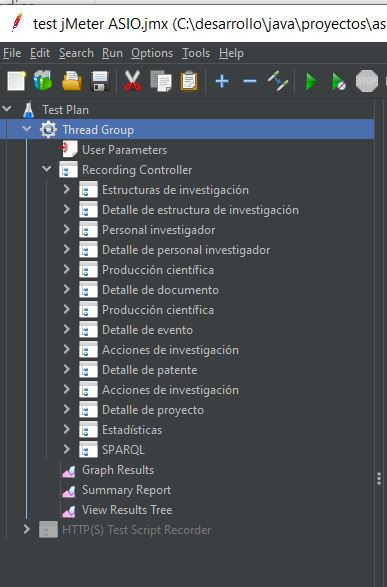

En esta otra imagen, se pueden ver las llamadas configuradas en algunas de estas categorías en el árbol de Jmeter y la configuración de una de ellas:

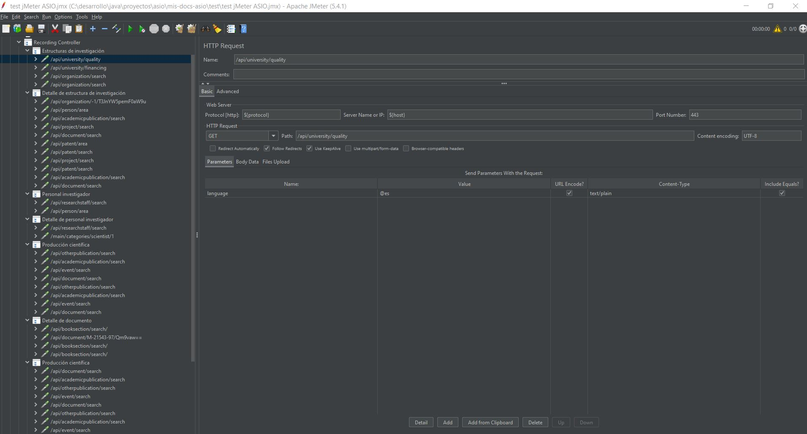

Sobrecada una de las apis se ha añadido un timer aleatorio con máximo 3 segundos, para ejecutar los servicios con un tiempo entre ellos, como si se tratase de usuarios normales ejecutando la aplicación:

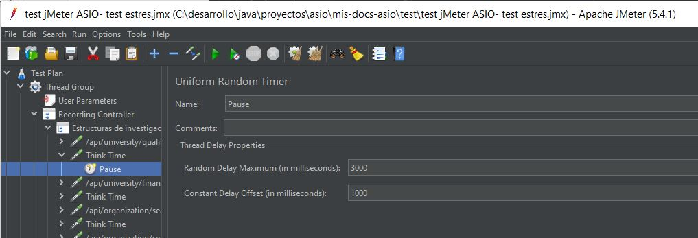

Se ha dejado el fichero creado para pruebas en el repositorio en el siguiente [link](./test-jMeter-ASIO.jmx).

## Resultados de las pruebas de Carga

Se han configurado, tal y como se explica en el apartado [pruebas de carga sobre el API](#pruebas-de-carga-sobre-el-api), los siguientes parámetros:

- Número de hilos (usuarios): 100
- Ramp-up period: 1 segundo
- Loop count: 15
- Se ha marcado la casilla "Especify threat lifetime" para limitar el tiempo que se va a estar ejecutando el hilo y se han marcado los valores:
  - Duration:  900 seconds
  - Startup delay: 0 seconds

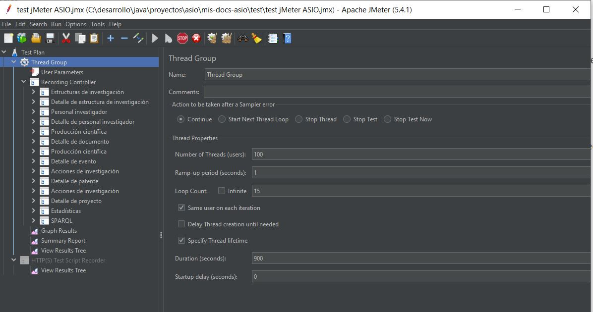

Los resultados han sido satisfactorios, ya que, tras las pruebas de carga, en las imagenes que se muestran a continuación se puede observar que las llamadas se han podido ejecutar satisfactoriamente, de una forma bastante estable.

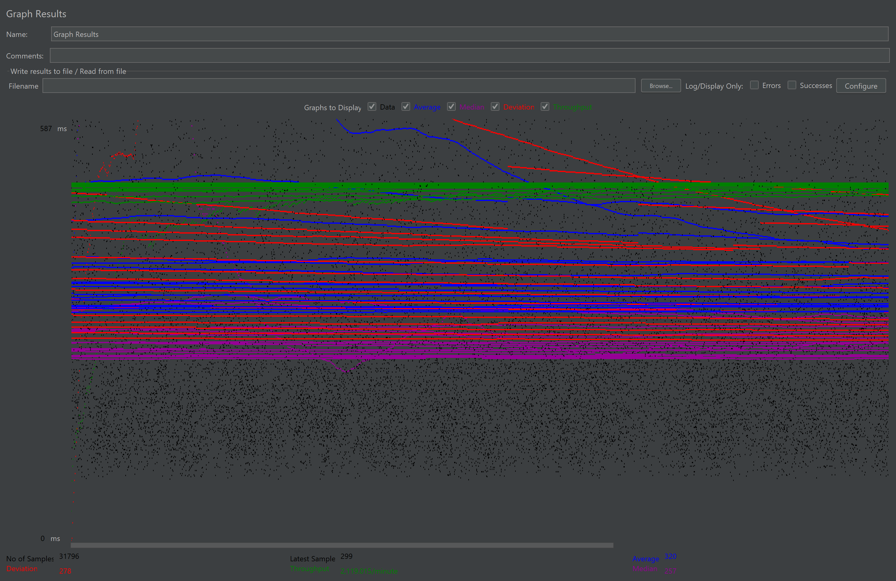

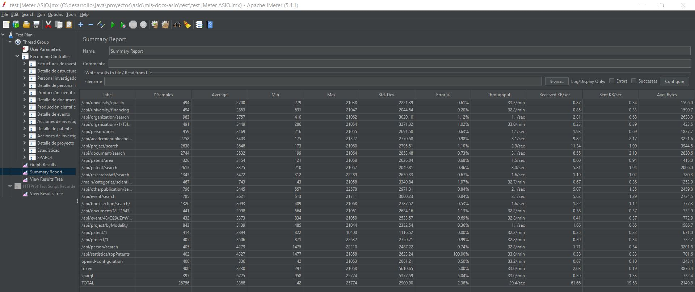

Los resultados obtenidos se pueden ver en la siguiente tabla:

| Label                                 | # Samples | Average | Min  | Max   | Std. Dev. | Error %  | Throughput | Received KB/sec | Sent KB/sec | Avg. Bytes |
| ------------------------------------- | --------- | ------- | ---- | ----- | --------- | -------- | ---------- | --------------- | ----------- | ---------- |
| /api/university/quality               | 494       | 2700    | 279  | 21038 | 2221.39   | 0.607%   | .55543     | 0.87            | 0.34        | 1596.0     |
| /api/university/financing             | 494       | 2853    | 631  | 21047 | 2044.54   | 0.202%   | .54623     | 0.85            | 0.33        | 1590.7     |
| /api/organization/search              | 983       | 3757    | 410  | 21062 | 3020.10   | 1.119%   | 1.09177    | 2.81            | 0.68        | 2638.0     |
| /api/organization/-1/T3JnYW5pemF0aW9u | 491       | 3449    | 286  | 21054 | 3271.32   | 1.018%   | .55067     | 0.23            | 0.39        | 423.5      |
| /api/person/area                      | 959       | 3169    | 216  | 21055 | 2691.58   | 0.626%   | 1.07583    | 1.93            | 0.69        | 1837.7     |
| /api/academicpublication/search       | 2758      | 3403    | 175  | 21327 | 2770.58   | 0.979%   | 3.09199    | 9.82            | 2.17        | 3251.6     |
| /api/project/search                   | 2638      | 3648    | 173  | 21060 | 2795.51   | 1.099%   | 2.94302    | 11.34           | 1.90        | 3944.5     |
| /api/document/search                  | 2744      | 3532    | 199  | 21064 | 2853.48   | 0.729%   | 3.09382    | 8.55            | 2.10        | 2830.6     |
| /api/patent/area                      | 1326      | 3154    | 121  | 21058 | 2626.04   | 0.679%   | 1.48941    | 0.60            | 0.94        | 415.0      |
| /api/patent/search                    | 2613      | 3325    | 210  | 21057 | 2049.81   | 0.459%   | 2.96469    | 5.81            | 1.94        | 2006.0     |
| /api/researchstaff/search             | 1343      | 3472    | 312  | 22289 | 2639.33   | 0.670%   | 1.55977    | 1.19            | 1.02        | 780.3      |
| /main/categories/scientist/1          | 467       | 743     | 43   | 21058 | 3340.84   | 1.071%   | .54542     | 0.67            | 0.36        | 1252.9     |
| /api/otherpublication/search          | 1796      | 3445    | 557  | 22578 | 2971.31   | 0.835%   | 2.11013    | 5.07            | 1.35        | 2459.8     |
| /api/event/search                     | 1785      | 3621    | 513  | 21711 | 3000.23   | 0.840%   | 2.10303    | 5.62            | 1.29        | 2734.5     |
| /api/booksection/search/              | 1326      | 3093    | 489  | 21068 | 2787.52   | 0.528%   | 1.60681    | 1.22            | 1.12        | 777.3      |
| /api/document/M-21543-97/Qm9vaw==     | 441       | 2998    | 564  | 21061 | 2624.16   | 1.134%   | .53723     | 0.38            | 0.37        | 732.9      |
| /api/event/48/Q29uZmVyZW5jZQ==        | 432       | 3373    | 834  | 21050 | 2533.57   | 0.694%   | .54725     | 0.41            | 0.37        | 772.9      |
| /api/project/byModality               | 843       | 3139    | 485  | 21044 | 2332.54   | 0.356%   | 1.07206    | 1.66            | 0.65        | 1586.7     |
| /api/patent/1                         | 414       | 2894    | 822  | 10400 | 1116.52   | 0.000%   | .53708     | 0.35            | 0.32        | 671.0      |
| /api/project/1                        | 405       | 3506    | 871  | 22632 | 2750.71   | 0.988%   | .54669     | 0.39            | 0.34        | 732.7      |
| /api/person/search                    | 405       | 4279    | 1475 | 22210 | 2487.22   | 0.741%   | .54688     | 1.71            | 0.34        | 3201.8     |
| /api/statistics/topPatents            | 402       | 4327    | 1477 | 21858 | 2623.24   | 100.000% | .54959     | 0.38            | 0.33        | 701.6      |
| openid-configuration                  | 400       | 336     | 42   | 21053 | 2061.21   | 0.500%   | .55355     | 0.67            | 0.10        | 1243.4     |
| token                                 | 400       | 3230    | 297  | 21058 | 5610.65   | 5.000%   | .54999     | 2.08            | 0.19        | 3876.4     |
| sparql                                | 397       | 6725    | 958  | 25774 | 5377.59   | 5.038%   | .54936     | 0.39            | 1.33        | 732.4      |
| TOTAL                                 | 26756     | 3368    | 42   | 25774 | 2900.90   | 2.377%   | 29.37105   | 61.66           | 19.58       | 2149.8     |

## Resultados de las pruebas de Estrés

Se han configurado, tal y como se explica en el apartado [pruebas de estrés sobre el API](#pruebas-de-estrés-sobre-el-api), los siguientes parámetros:

- Número de hilos (usuarios): 100/200/400/800/1600
- Ramp-up period: 1 segundo
- Loop count: 15
- Se ha marcado la casilla "Especify threat lifetime" para limitar el tiempo que se va a estar ejecutando el hilo y se han marcado los valores:
  - Duration:  900 seconds
  - Startup delay: 0 seconds

Se van duplicando el valor del número de hilos conforme se van ejecutando los test hasta obtener el valor al que "rompen" los servicios.

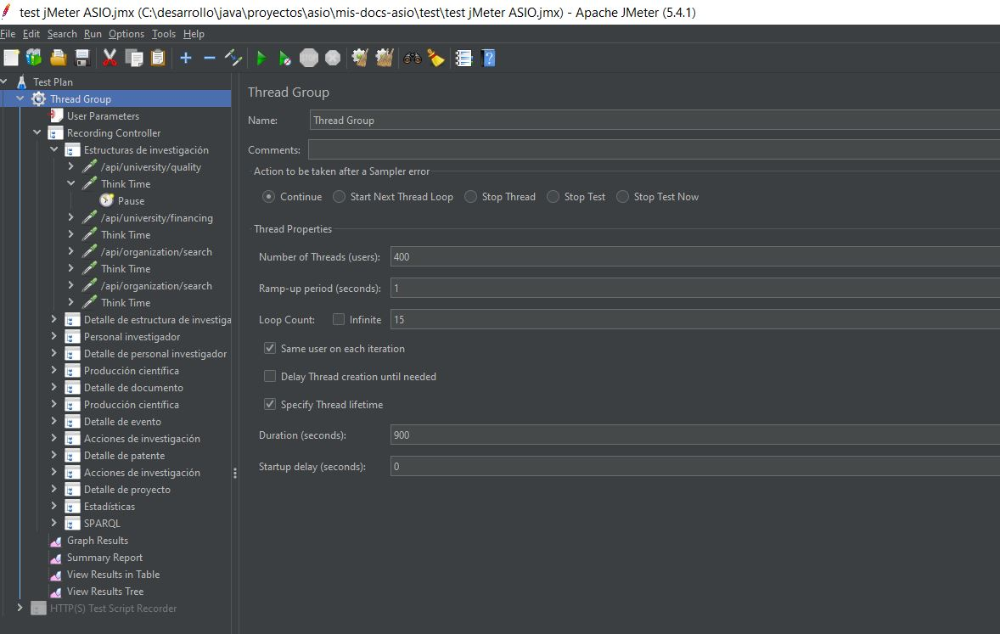

En las siguientes imágenes se peuden ver los resultados con 400 usuarios, que en este caso es al que han fallado servicios con valores entre un 20% de fallos y un 45% de fallos en los servicios, dado que las consultas SPARQL con las que se realizan las pruebas son un tanto complejas:

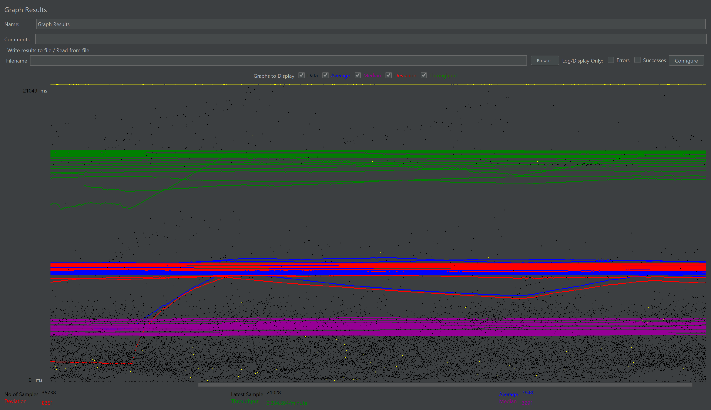

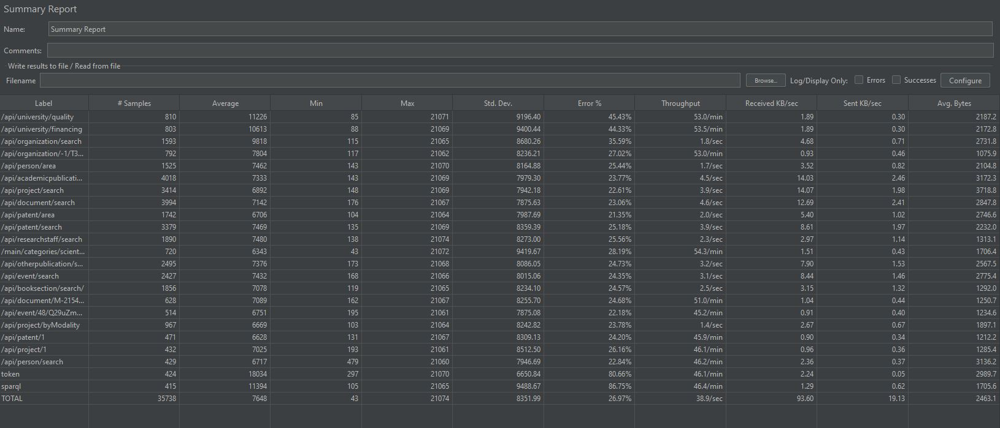

Los resultados obtenidos se pueden ver en la siguiente tabla:

| Label                                 | # Samples | Average | Min  | Max   | Std. Dev. | Error % | Throughput | Received KB/sec | Sent KB/sec | Avg. Bytes |
| ------------------------------------- | --------- | ------- | ---- | ----- | --------- | ------- | ---------- | --------------- | ----------- | ---------- |
| /api/university/quality               | 810       | 11226   | 85   | 21071 | 9196.40   | 45.432% | .88329     | 1.89            | 0.30        | 2187.2     |
| /api/university/financing             | 803       | 10613   | 88   | 21069 | 9400.44   | 44.334% | .89150     | 1.89            | 0.30        | 2172.8     |
| /api/organization/search              | 1593      | 9818    | 115  | 21065 | 8680.26   | 35.593% | 1.75556    | 4.68            | 0.71        | 2731.8     |
| /api/organization/-1/T3JnYW5pemF0aW9u | 792       | 7804    | 117  | 21062 | 8236.21   | 27.020% | .88344     | 0.93            | 0.46        | 1075.9     |
| /api/person/area                      | 1525      | 7462    | 143  | 21070 | 8164.88   | 25.443% | 1.71256    | 3.52            | 0.82        | 2104.8     |
| /api/academicpublication/search       | 4018      | 7333    | 143  | 21069 | 7979.30   | 23.768% | 4.52894    | 14.03           | 2.46        | 3172.3     |
| /api/project/search                   | 3414      | 6892    | 148  | 21069 | 7942.18   | 22.613% | 3.87495    | 14.07           | 1.98        | 3718.8     |
| /api/document/search                  | 3994      | 7142    | 176  | 21067 | 7875.63   | 23.060% | 4.56141    | 12.69           | 2.41        | 2847.8     |
| /api/patent/area                      | 1742      | 6706    | 104  | 21064 | 7987.69   | 21.355% | 2.01400    | 5.40            | 1.02        | 2746.6     |
| /api/patent/search                    | 3379      | 7469    | 135  | 21069 | 8359.39   | 25.185% | 3.94930    | 8.61            | 1.97        | 2232.0     |
| /api/researchstaff/search             | 1890      | 7480    | 138  | 21074 | 8273.00   | 25.556% | 2.31800    | 2.97            | 1.14        | 1313.1     |
| /main/categories/scientist/1          | 720       | 6343    | 43   | 21072 | 9419.67   | 28.194% | .90498     | 1.51            | 0.43        | 1706.4     |
| /api/otherpublication/search          | 2495      | 7376    | 173  | 21068 | 8086.05   | 24.729% | 3.15006    | 7.90            | 1.53        | 2567.5     |
| /api/event/search                     | 2427      | 7432    | 168  | 21066 | 8015.06   | 24.351% | 3.11560    | 8.44            | 1.46        | 2775.4     |
| /api/booksection/search/              | 1856      | 7078    | 119  | 21065 | 8234.10   | 24.569% | 2.49735    | 3.15            | 1.32        | 1292.0     |
| /api/document/M-21543-97/Qm9vaw==     | 628       | 7089    | 162  | 21067 | 8255.70   | 24.682% | .84940     | 1.04            | 0.44        | 1250.7     |
| /api/event/48/Q29uZmVyZW5jZQ==        | 514       | 6751    | 195  | 21061 | 7875.08   | 22.179% | .75293     | 0.91            | 0.40        | 1234.6     |
| /api/project/byModality               | 967       | 6669    | 103  | 21064 | 8242.82   | 23.785% | 1.44180    | 2.67            | 0.67        | 1897.1     |
| /api/patent/1                         | 471       | 6628    | 131  | 21067 | 8309.13   | 24.204% | .76446     | 0.90            | 0.34        | 1212.2     |
| /api/project/1                        | 432       | 7025    | 193  | 21061 | 8512.50   | 26.157% | .76820     | 0.96            | 0.36        | 1285.4     |
| /api/person/search                    | 429       | 6717    | 479  | 21060 | 7946.69   | 22.844% | .76945     | 2.36            | 0.37        | 3136.2     |
| token                                 | 424       | 18034   | 297  | 21070 | 6650.84   | 80.660% | .76780     | 2.24            | 0.05        | 2989.7     |
| sparql                                | 415       | 11394   | 105  | 21065 | 9488.67   | 86.747% | .77254     | 1.29            | 0.62        | 1705.6     |
| TOTAL                                 | 35738     | 7648    | 43   | 21074 | 8351.99   | 26.974% | 38.91490   | 93.60           | 19.13       | 2463.1     |

## Resultados de las pruebas de Estabilidad

Se han configurado, tal y como se explica en el apartado [pruebas de estabilidad sobre el API](#pruebas-de-estabilidad-sobre-el-api), los siguientes parámetros:

- Número de hilos (usuarios): 100
- Ramp-up period: 1 segundo
- Loop count: 15
- Se ha marcado la casilla "Especify threat lifetime" para limitar el tiempo que se va a estar ejecutando el hilo y se han marcado los valores:
  - Duration:  900 seconds
  - Startup delay: 0 seconds

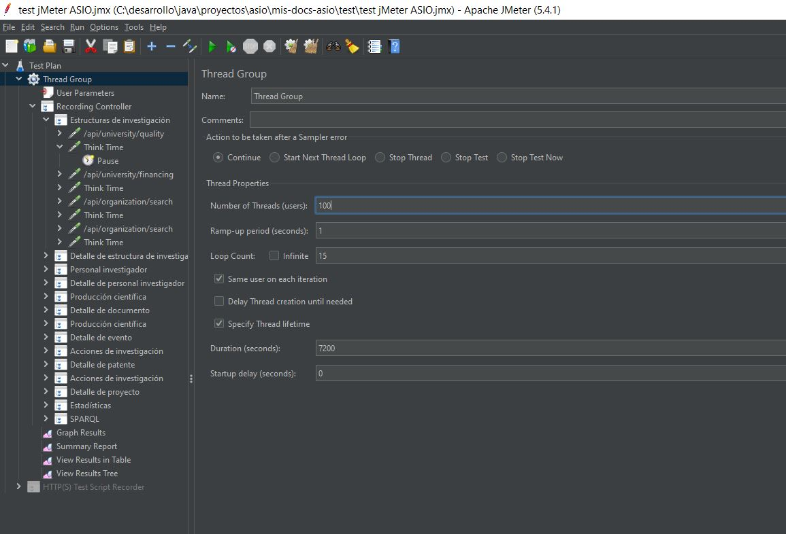

En las siguientes imágenes se peuden ver los resultados con 400 usuarios, que en este caso es al que han fallado servicios con valores entre un 20% de fallos y un 45% de fallos en los servicios, dado que las consultas SPARQL con las que se realizan las pruebas son un tanto complejas:

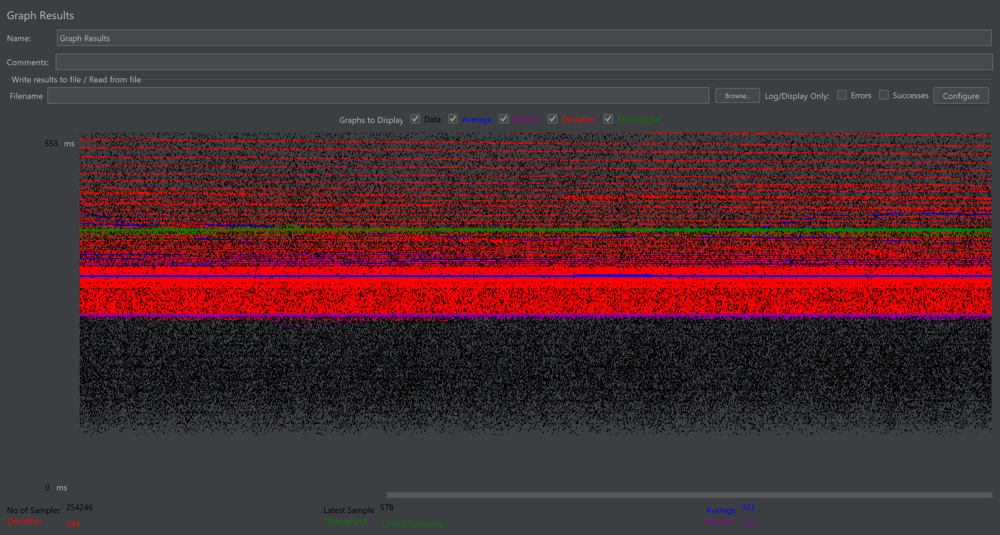

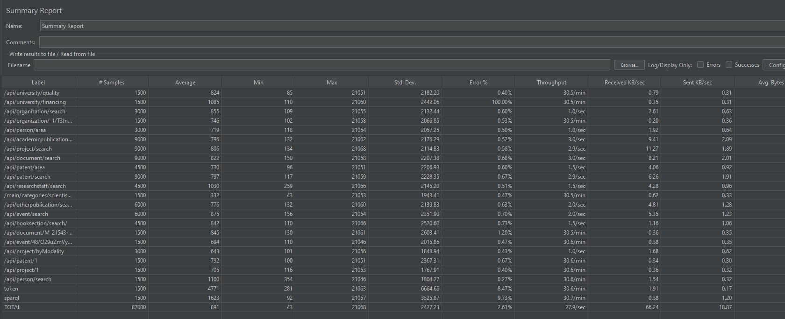

Los resultados obtenidos se pueden ver en la siguiente tabla:

## Resultados de las pruebas de Pico

Se han configurado, tal y como se explica en el apartado [pruebas de pico sobre el API](#pruebas-de-pico-sobre-el-api), los siguientes parámetros:

- Número de hilos (usuarios): 100
- Ramp-up period: 1 segundo
- Loop count: 15
- Se ha marcado la casilla "Especify threat lifetime" para limitar el tiempo que se va a estar ejecutando el hilo y se han marcado los valores:
  - Duration:  1800 seconds
  - Startup delay: 0 second

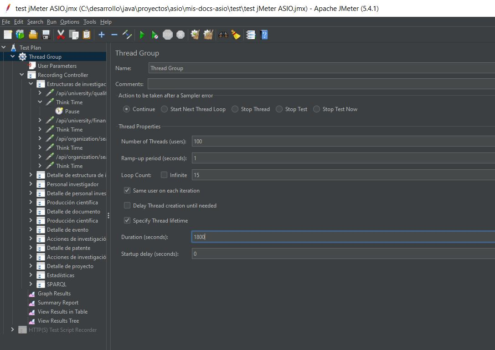

En las siguientes imágenes se peuden ver los resultados con 400 usuarios, que en este caso es al que han fallado servicios con valores entre un 20% de fallos y un 45% de fallos en los servicios, dado que las consultas SPARQL con las que se realizan las pruebas son un tanto complejas:

Los resultados obtenidos se pueden ver en la siguiente tabla:

## Anexo

### Endpoints

- article-Article
- book-Book
- conference-Conference
- doctoral-thesis-Doctoral
- document-Document
- dossier-Dossier
- exhibit-Exhibit
- funding-Funding
- funding-source-Funding
- international-project-International
- invoice-Invoice
- master-thesis-Master
- patent-Patent
- person-Person
- project-Project
- project-expense-Project
- research-accreditation-Research Accreditation
- research-group-Research
- sparql-Sparql
- university-University
- article-Article
- book-Book
- document-Document
- patent-Patent
- person-Person
- project-Project

