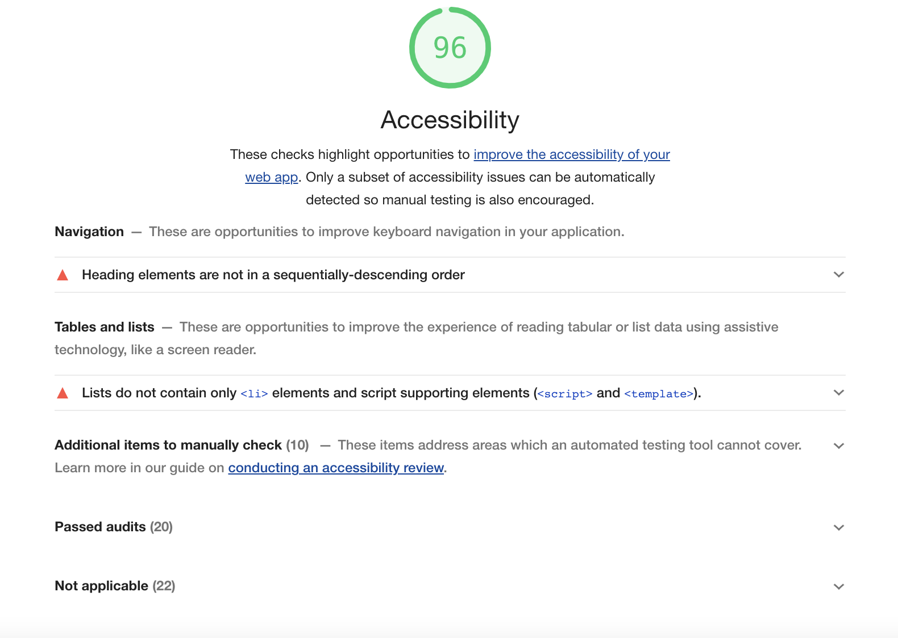

| Fecha        | 31/05/2021                                                   |
| ------------ | ------------------------------------------------------------ |
| Revisado por | Hugo Pintado Pérez                                       |
| Módulo       | Pruebas de accesibilidad                                       |
| Tipo         | Documento                                                    |
| Objetivo     | Documento con la información sobre las pruebas de accesibilidad realizadas |

# Accesibilidad

Para la validación de la accesibilidad del front de Hércules-Asio se han utilizado tanto medios automáticos como medios manuales apoyados en este caso por herramientas externas.

## Validaciones Automáticas

Para las validaciones automáticas se ha utilizado la herramienta [lighthouse](https://developers.google.com/web/tools/lighthouse)

La ejecución de dicha herramienta arroja el siguiente informe sobre accesibilidad de Asio:

## Validaciones Manuales

Para las validaciones manuales se ha utilizado la herramienta [Accessibility Insights for Web](https://accessibilityinsights.io/docs/en/web/overview/)

Mediante esta herramienta se genera un informe con los resultados de la validación de accesibilidad.

[Informe Accessibility Insights](./AccessibilityInsightsWeb)