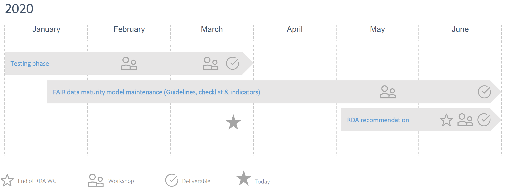
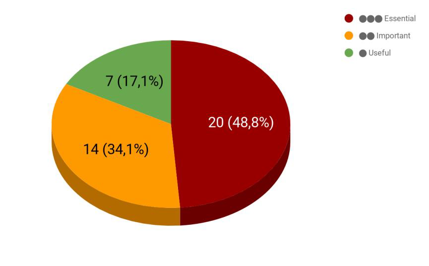
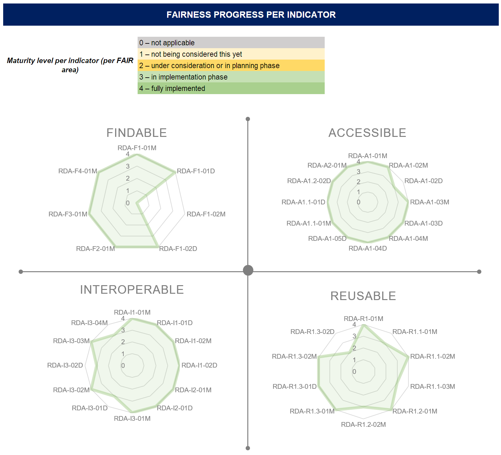
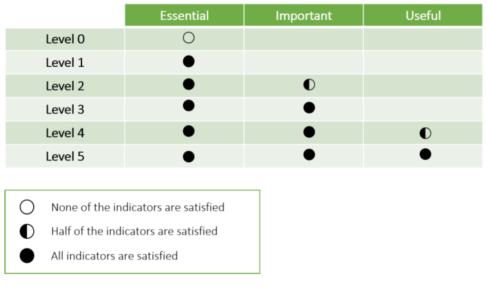
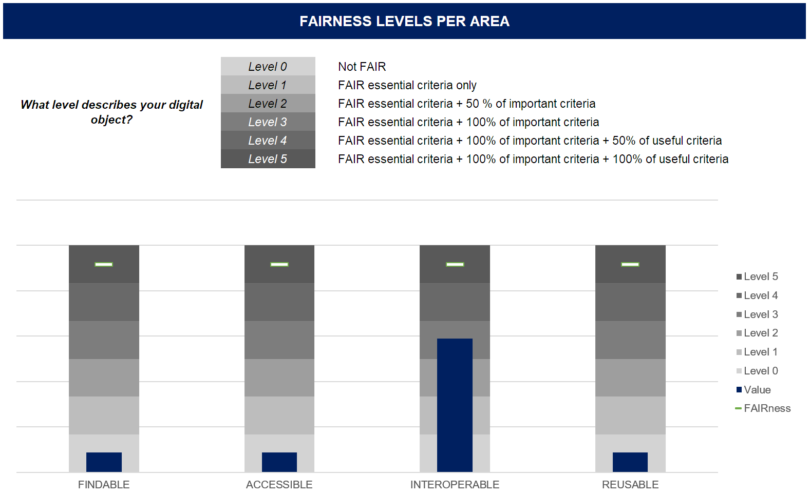

| Entregable     | Análisis de Métodos FAIR                                     |
| -------------- | ------------------------------------------------------------ |
| Fecha          | 19/06/2020                                                   |
| Proyecto       | [ASIO](https://www.um.es/web/hercules/proyectos/asio) (Arquitectura Semántica e Infraestructura Ontológica) en el marco de la iniciativa [Hércules](https://www.um.es/web/hercules/) para la Semántica de Datos de Investigación de Universidades que forma parte de [CRUE-TIC](https://tic.crue.org/hercules/) |
| Módulo         | Infraestructura Ontológica                                   |
| Tipo           | Documento                                                    |
| Objetivo       | Este documento recoge el análisis de métodos FAIR disponibles y establece las métricas y la metodología propuesta para la evaluación de métricas FAIR del proyecto, descrita en el entregable de [Métricas FAIR](../06-M%C3%A9tricas_FAIR). |
| Estado         | **100%**  |
| Próximos pasos | Se podría estudiar KPIs alternativos para la presentación de resultados por áreas y/o un índice global FAIR mediante ponderación de indicadores FAIR por prioridad. |

# Análisis de métodos FAIR

Los principios FAIR (Findable, Accesible, Interoperable, Reusable) surgieron como una iniciativa para **mejorar la interoperabilidad de los datos científicos publicados** [Wilkinson, 2016; Wilkinson, 2016b; Rodriguez Iglesias, 2016; Mons, 2017]. 

El uso de principios FAIR está teniendo una rápida expansión en los últimos años [Mons 2017]. En Europa, la Comisión Europea pide que los [Data Management Plans de los proyectos financiados se guíen por los principios FAIR](http://ec.europa.eu/research/participants/data/ref/h2020/grants_manual/hi/oa_pilot/h2020-hi-oa-data-mgt_en.pdf). En Estados Unidos, la iniciativa [Big Data to Knowledge (BD2K)](https://commonfund.nih.gov/bd2k), del National Institute of Health, tiene como objetivo en su segunda fase publicar los resultados obtenidos en la primera de acuerdo a los principios FAIR y [todos los recursos desarrollados por BD2K](https://commonfund.nih.gov/bd2k/resources) se publican de forma abierta para la comunidad investigadora. Incluso el G20, en su [encuentro de 2016 en Hangzhou (China)](http://europa.eu/rapid/press-release_STATEMENT-16-2967_en.htm), mencionó los principios FAIR. 

Además, revistas de gran prestigio como [Nature Genetics](https://www.nature.com/ng/) o [Scientific Data](https://www.nature.com/sdata/) promueven el uso de principios FAIR en los datasets que reciben [Nature Genetics, 2017] . A su vez, hay cada vez más, proyectos que se rigen por principios FAIR [Wilkinson 2016]: [Dataverse](https://dataverse.org/), [FAIRDOM](https://fair-dom.org/), [ISA](https://www.isacommons.org/), [Open Phacts](http://www.openphacts.org/index.php), [wwPDB](http://www.wwpdb.org/), [UniProt](http://insideuniprot.blogspot.com/2016/11/being-fair-at-uniprot.html), [DataGraft](https://datagraft.io/) y [BlueBrain](https://bluebrainnexus.io/) entre otros.

Los principios FAIR **no son un estándar, ni una especificación, y tampoco definen una implementación tecnológica concreta**; más bien, los principios FAIR son una guía general de cómo deberían publicarse los datos (los datos no *cumplen* con FAIR, siempre se puede mejorar en la escala FAIR). 

Dicho esto, hoy en día, **la mejor manera de publicar datos FAIR es hacerlo mediante Linked Data**, teniendo especial cuidado de generar datos y metadatos de alta calidad, mejorando así la reusabilidad de los datos para máquinas, y, como consecuencia y en última instancia, para humanos. 

La utilización de research objects está también muy alineada con los principios FAIR y un objetivo del presente proyecto será profundizar en esta línea. De hecho, actualmente se está desarrollando la herramienta [Ro-curate](https://github.com/ResearchObject/ro-curate) para validar *research objects* utilizando Shapes.

## Principios FAIR

A continuación se describen los principios FAIR en detalle:

**FINDABLE** (encontrable): Los datos y metadatos pueden ser encontrados por la comunidad después de su publicación, mediante herramientas de búsqueda.

-  F1. Asignarles un identificador único y persistente a los datos y los metadatos.
-  F2. Describir los datos con metadatos de manera prolija (*rich metadata*).
-  F3. Registrar/Indexar los datos y los metadatos en un recurso de búsqueda.
-  F4. En los metadatos se debe especificar el identificador de los datos que se describen.

**ACCESSIBLE** (accesible): Los datos y metadatos están accesibles y por ello pueden ser descargados por otros investigadores utilizando sus identificadores.

-  A1 Los datos y los metadatos pueden ser recuperados por sus identificadores mediante protocolos estandarizados de comunicación.
-  A1.1 Los protocolos tienen que ser abiertos, gratuitos e implementados universalmente.
-  A1.2 El protocolo debe de permitir procedimientos para la autentificación y la autorización.
-  A2 Los metadatos deben de estar accesibles, incluso cuando los datos ya no estuvieran disponibles.

**INTEROPERABLE** (interoperable): Tanto los datos como los metadatos deben de estar descritos siguiendo las reglas de la comunidad, utilizando estándares abiertos, para permitir su intercambio y su reutilización.

-  I1. Los datos y los metadatos deben de usar un lenguaje formal, accesible, compartible y ampliamente aplicable para representar el conocimiento.
-  I2. Los datos y los metadatos usan vocabularios que sigan los principios FAIR.
-  I3. Los datos y los metadatos incluyen referencias cualificadas a otros datos o metadatos.

**REUSABLE** (reutilizable): Los datos y los metadatos pueden ser reutilizados por otros investigadores, al quedar clara su procedencia y las condiciones de reutilización.

-  R1. Los datos y los metadatos contienen una multitud de atributos precisos y relevantes.
-  R1.1. Los datos y los metadatos se publican con una licencia clara y accesible sobre su uso y reutilización.
-  R1.2. Los datos y los metadatos se asocian con información sobre su procedencia.
-  R1.3. Los datos y los metadatos siguen los estándares relevantes que usa la comunidad del dominio concreto.

## Metodología de evaluación de principios FAIR

Los principios se refieren a tres tipos de entidades: **datos** (o cualquier objeto digital), **metadatos** (información sobre ese objeto digital) e **infraestructura**. Por ejemplo, el principio F4 define que tanto los metadatos como los datos se registran o indexan en un recurso de búsqueda (el componente de infraestructura).

En general, el **uso de datos enlazados favorece el cumplimiento de los principios FAIR**. Por ejemplo, el uso de URIs para identificar recursos encaja con el principio F1 de que los metadatos tengan asignados identificadores únicos y persistentes. Los enunciados RDF permiten asociar datos con metadatos (F3). La utilización del protocolo HTTP en Linked Data encaja con los principios A1, RDF puede considerarse un lenguaje formal, accesible, compartido y ampliamente aplicable para la representación del conocimiento (I1), Linked Data permite la asociación entre conceptos de diferentes vocabularios (I2) así como entre diferentes datos y metadatos (I3).

Los principios FAIR **no deben considerarse como algo binario que se cumplen o no se cumplen**, sino como un espectro a lo largo del cual hay sistemas que ofrecerán un mayor grado de cumplimiento que otros [Wilkinson, 2016]. En [Wilkinson, 2018], se propone un marco para la creación de métricas FAIR en el que se define una plantilla de métricas y la [Research Data Alliance (RDA)](https://www.rd-alliance.org/about-rda) ha establecido un grupo de trabajo específico para el análisis y evaluación de métricas FAIR denominado [FAIR data maturity model Working Group](https://www.rd-alliance.org/groups/fair-data-maturity-model-wg).

Un aspecto interesante es considerar la diferencie entre datos FAIR, datos abiertos y datos enlazados. Aunque una gran cantidad de datos FAIR sean abiertos, pueden existir datos de experimentos científicos que deban estar protegidos por temas de privacidad. **Los principios FAIR no están en contradicción con el acceso controlado a ese tipo de datos**, restringido a personas o instituciones que sí puedan manipular dichos datos. 

El informe "*Turning FAIR into reality*" [Collins, 2018] tiene una serie de consejos para la adopción de FAIR en la Unión Europea, cabe destacar la inclusión de Wikidata como un ejemplo a seguir en cuanto al cumplimiento de los principios FAIR (p.42). Siguiendo esa línea, **se recomienda la utilización de un modelo similar al de Wikidata en este proyecto**.

**Todos los proyectos de la iniciativa Hércules se orientan hacia el cumplimiento de los principios FAIR**, ya que estos principios ofrecen un incentivo para publicar datos de la manera más interoperable posible. Por lo tanto, todo el trabajo realizado en este proyecto también irá en esa dirección. En el caso de las ontologías de la ROH, no sólo conforman un elemento esencial para implementar principios FAIR de cara a la publicación de datos (F2, F3, F4, A1, A2, I1, I3, R1), sino que además la publicación de las ontologías también debe seguir los principios FAIR (I2).

Como objetivo principal, se realizará un **análisis detallado de los procedimientos a seguir para publicar las ontologías de la ROH de acuerdo a los principios FAIR**, incluyendo la implementación de dichos métodos o la extensión de los métodos descritos en el Anexo V del PPT para cumplir tal fin. 

Adicionalmente, se implementará un **método de evaluación automatizado de los recursos** que se publiquen, sean éstos ontologías de la Infraestructura Ontológica o datos de la Arquitectura Semántica de Datos, para concluir el nivel FAIR de los recursos92, basado en las métricas FAIR descritas en el [proyecto FAIR Metrics](https://github.com/FAIRMetrics/Metrics) [Wilkinson, 2016; 2016b, 2018], y en las posibles métricas adicionales definidas por el equipo del proyecto y/o la UM. 

**Los resultados de la evaluación serán a su vez ser publicados cumpliendo los principios FAIR** e incluirán versión y sello de tiempo; proveyendo documentación de cómo añadir nuevas métricas y ejecutar los test automáticos para obtener las métricas, por ejemplo, siguiendo las líneas descritas en el proyecto [FAIR Metrics Evaluator](https://www.slideshare.net/markmoby/fair-metrics-presentation-to-nih-kc1), la iniciativa [GO FAIR](https://www.go-fair.org/) y su [RDM Starter Kit](https://www.go-fair.org/resources/rdm-starter-kit/), u otros proyectos afines.

## Modelo de madurez FAIR (RDA)

El modelo de madurez FAIR propuesto por la RDA establece una serie de **criterios esenciales para evaluar el nivel de implementación de los principios FAIR**. En particular, se define un modelo genérico y extensible para la auto-evaluación del nivel de madurez de un conjunto de datos.

### Contexto

Según las conclusiones de la RDA, **los principios no son estrictos, ofreciendo una alta ambigüedad y un amplio rango de interpretaciones**. Esto da lugar a la existencia de múltiples frameworks de evaluación FAIR, con diferentes métricas, dificultado la comparación de resultados.

**El objetivo no es redefinir los criterios ya establecidos**, si no desarrollar el modelo sobre las iniciativas existentes, buscando elementos comunes e identificando los criterios clave para la evaluación FAIRness. De este modo se aumenta la coherencia y la interoperabilidad entre iniciativas y frameworks de validación, favoreciendo la compatibilidad y la comparación de resultados.

El grupo de trabajo se compone de participantes de diferentes disciplinas científicas, empresas, sector público y otros interesados o contribuidores proactivos en los principios FAIR, en especial con respecto a los **criterios y la metodología de evaluación** del nivel de madurez o implementación de los mismos. 

Para la unificación de criterios y como foro de discusión de indicadores se emplea un [repositorio GitHub](https://github.com/RDA-FAIR/FAIR-data-maturity-model-WG/issues), y se realizan workshops de forma periódica. El resultado principal de esta iniciativa es un **informe comparativo de diferentes herramientas de auto-evaluación** [RDA, 2019], todas de tipo cuestionario manual o semi-automatizado, que en la actualidad no han sido automatizadas o que previsiblemente no puedan automatizarse al 100%.

A continuación se muestra el cronograma previsto para 2020, actualizado el 23 de Marzo durante el **octavo workshop del grupo de trabajo** [RDA, 2020b]. Actualmente se ha publicado ya la propuesta de recomendación RDA con la especificación y directrices del modelo de madurez FAIR [RDA, 2020] y se espera consolidar dicha recomendación a finales de Junio.

### Indicadores y prioridades

Según la recomendación de c [RDA, 2020] y con el objetivo de mejorar la trazabilidad, l**os indicadores se subdividen en varios indicadores de detalle y se organizan por prioridades**.

Las prioridades se fundamentan en el hecho de que algunos indicadores resultan más importantes que otros desde el punto de vista de un proveedor de datos, principalmente en términos de esfuerzo frente a beneficio. **La propuesta incluye 3 niveles de prioridad**:

- **Essential** (⬤⬤⬤): indicadores de mayor relevancia para cumplir FAIR bajo el mayor abanico de circunstancias, o que harían prácticamente imposible alcanzar un nivel mínimo de *FAIRness* en caso de no cumplirse.
- **Important** (⬤⬤): indicadores no son tan relevantes bajo algunas circunstancias, pero que de cumplirse incrementarían sustancialmente el nivel de *FAIRness*.
- **Useful** (⬤): indicadores de tipo *nice-to-have*, pero que no son necesariamente indispensables.

El resultado se detalla en la siguiente lista de métricas:

| FAIR | Código RDA | Descripción | Prioridad |
| :--: | :--------------: | ----------- | :-------: |
| F1   | F1-01M   | Metadata is identified by a persistent identifier           | ⬤⬤⬤  |
| F1   | F1-01D   | Data is identified by a persistent identifier               | ⬤⬤⬤  |
| F1   | F1-02M   | Metadata is identified by a globally unique identifier      | ⬤⬤⬤  |
| F1   | F1-02D   | Data is identified by a globally unique identifier          | ⬤⬤⬤  |
| F2   | F2-01M   | Rich metadata is provided to allow discovery                | ⬤⬤⬤  |
| F3   | F3-01M   | Metadata includes the identifier for the data               | ⬤⬤⬤  |
| F4   | F4-01M   | Metadata is offered in such a way that it can be harvested and indexed | ⬤⬤⬤  |
| A1   | A1-01M   | Metadata contains information to enable the user to get access to the data | ⬤⬤   |
| A1   | A1-02M   | Metadata can be accessed manually (i.e. with human intervention) | ⬤⬤⬤  |
| A1   | A1-02D   | Data can be accessed manually (i.e. with human intervention) | ⬤⬤⬤  |
| A1   | A1-03M   | Metadata identifier resolves  to a metadata record           | ⬤⬤⬤  |
| A1   | A1-03D   | Data identifier resolves to a digital object                | ⬤⬤⬤  |
| A1   | A1-04M   | Metadata is accessed through standardised protocol          | ⬤⬤⬤  |
| A1   | A1-04D   | Data is accessible through standardised protocol            | ⬤⬤⬤  |
| A1   | A1-05D   | Data can be accessed automatically (i.e. by a computer program) | ⬤⬤   |
| A1.1 | A1.1-01M | Metadata is accessible through a free access protocol       | ⬤⬤⬤  |
| A1.1 | A1.1-01D | Data is accessible through a free access protocol           | ⬤⬤   |
| A1.2 | A1.2-02D | Data is accessible through an access protocol that supports authentication and authorisation | ⬤    |
| A2   | A2-01M   | Metadata is guaranteed to remain available after data is no longer available | ⬤⬤⬤  |
| I1   | I1-01M   | Metadata uses knowledge representation expressed in standardised format | ⬤⬤   |
| I1   | I1-01D   | Data uses knowledge representation expressed in standardised format | ⬤⬤   |
| I1   | I1-02M   | Metadata uses  machine-understandable knowledge representation | ⬤⬤   |
| I1   | I1-02D   | Data uses  machine-understandable knowledge representation   | ⬤⬤   |
| I2   | I2-01M   | Metadata uses FAIR-compliant vocabularies                   | ⬤⬤   |
| I2   | I2-01D   | Data uses FAIR-compliant vocabularies                        | ⬤    |
| I3   | I3-01M   | Metadata includes references to other metadata              | ⬤⬤   |
| I3   | I3-01D   | Data includes references to other data                      | ⬤    |
| I3   | I3-02M   | Metadata includes references to other data                  | ⬤    |
| I3   | I3-02D   | Data includes qualified references to other data            | ⬤    |
| I3   | I3-03M   | Metadata includes qualified references to other metadata    | ⬤⬤   |
| I3   | I3-04M   |          | ⬤    |
| R1   | R1-01M   | Plurality of accurate and relevant attributes are provided to allow reuse | ⬤⬤⬤  |
| R1.1 | R1.1-01M | Metadata includes information about the licence under which the data can be reused | ⬤⬤⬤  |
| R1.1 | R1.1-02M | Metadata refers to a standard reuse licence                 | ⬤⬤   |
| R1.1 | R1.1-03M | Metadata refers to a machine-understandable reuse licence   | ⬤⬤   |
| R1.2 | R1.2-01M | Metadata includes provenance information according to community-specific standards | ⬤⬤   |
| R1.2 | R1.2-02M | Metadata includes provenance information according to a cross-community language | ⬤    |
| R1.3 | R1.3-01M | Metadata complies with a community standard                 | ⬤⬤⬤  |
| R1.3 | R1.3-01D | Data complies with a community standard                     | ⬤⬤⬤  |
| R1.3 | R1.3-02M | Metadata is expressed in compliance with a machine-understandable community standard | ⬤⬤⬤  |
| R1.3 | R1.3-02D | Data is expressed in compliance with a machine-understandable community standard | ⬤⬤   |

En total, hay 20 indicadores clasificados como Essential, 14 Important y 7 Useful:

La distribución de prioridades por áreas sería la siguiente:

| PRIORIDAD           | FINDABLE | ACCESIBLE | INTEROPERABLE | REUSABLE | TOTAL  |
| ------------------- | -------- | --------- | ------------- | -------- | ------ |
| **ESSENTIAL** (⬤⬤⬤) | 7        | 8         | 0             | 5        | **20** |
| **IMPORTANT** (⬤⬤)  | 0        | 3         | 7             | 4        | **14** |
| **USEFUL**(⬤)      | 0        | 1         | 5             | 1        | **7**  |
| **TOTAL**           | **7**    | **12**    | **12**        | **10**   | **41** |

El detalle sobre cómo evaluar cada indicador está recogido en la propuesta de recomendación [RDA, 2020].

### Evaluación

Se proponen **tres métodos de evaluación complementarios**, de los cuales se descarta la evaluación de un índice global de *FAIRness*, debido principalmente a que se pierde el detalle del nivel de implementación por cada área e indicador. Si bien, podría llegar a ser un índice interesante para ASIO, a modo de métrica comparativa global, por lo que no se descarta su uso de cara al hito 2.

El primer método propuesto consiste en la **evaluación de 5 niveles de madurez por cada indicador**, mostrando el resultado mediante Radar Charts. Los niveles establecidos son los siguientes:

> 0 – not applicable
>
> 1 – not being considered this yet
>
> 2 – under consideration or in planning phase
>
> 3 – in implementation phase
>
> 4 – fully implemented

Esta propuesta permite **visualizar de forma rápida y sencilla el estado de implementación concreto**, admite la opción de "no aplicable" y permite identificar vías de mejora visualmente a modo de auto-evaluación:

El segundo método se centra en mostrar el **nivel de madurez por cada una de las áreas**, teniendo en cuenta los 3 niveles de prioridad identificados (esencial, importante y útil), que actúan a modo de pesos en la evaluación, que en este caso es binaria (cumple o no cumple). El nivel de cumplimiento sería equivalente al nivel 4 de madurez del método de evaluación por indicadores (*fully implemented*), dando lugar a 5 nuevos niveles de cumplimiento por área:

En esta alternativa se puede comprobar fácilmente el nivel de *FAIRness* por área a través de un Bullet Chart, siendo **especialmente útil para la evaluación por parte de revisores externos**, además de ser fácilmente extensible para el diseño de un indicador global de *FAIRness* (descartado por RDA):

La evaluación conjunta de ambas alternativas puede realizarse a través de un [fichero Excell recientemente publicado por la RDA](https://drive.google.com/file/d/125jD_IWEbbLcwyw83HfMc8oEsILlVdPn/view). Adicionalmente pueden consultarse otros indicadores alternativos que han sido descartados en el octavo workshop del grupo de trabajo [RDA, 2020b] y otros indicadores adicionales a FAIR incluidos en el informe de evaluación de frameworks de evaluación [RDA, 2019].

## Publicación de Ontologías

En concreto, y en referencia al criterio definido de forma explícita en el Anexo V del PPT de ASIO, sobre el principio I2, la publicación de ontologías recoge todos los metadatos de Dublin Core y RDF Schema, quedando pendiente los de la ontología FDP.

La publicación de ontologías se rije por el [modelo de cinco niveles de apertura de datos](http://5stardata.info) y el modelo Wikidata propuesto como contenedor de Ontologías en el nodo central de la arquitectura ASIO. 

Los procedimientos propuestos para publicar las ontologías de la ROH de acuerdo a los principios FAIR se detallan, métrica a métrica, en el documento de [Métricas FAIR](../06-M%C3%A9tricas_FAIR/README.md). De modo general, dicha publicación sigue las siguientes pautas:
- Todos los datos y metadatos están identificados mediante URIs PURL ([http://purl.org](http://purl.org/)).
- Los metadatos incluyen referencias expícitas a los datos que describen.
- Se proveen metadatos tanto a nivel de ontología como de los datos importados (OWL/SKOS, Wikibase, Trellis y Memento).
- Los datos y metadatos están publicados mediante un grafo linked data 5 estrellas (HTTP/LDP) y expresados mediante tecnología linked data (OWL, SKOS, DC, RDF, etc).
- La combinación de Trellis y Memento permite llevar un registro histórico de modificaciones que garantiza que los metadatos pervivan más allá del ciclo de vida del dato asociado.
- La ontología referencia otras ontologías, como por ejemplo [PROV-O](https://www.w3.org/TR/prov-o/).
- Se referencian datos externos, como por ejemplo el uso de DOIs para enlazar documentos y artículos de investigación.
- Uso de [PROV-O](https://www.w3.org/TR/prov-o/) para especificar información sobre el origen.
- Uso de licencia [Creative Commons](https://creativecommons.org/publicdomain/zero/1.0/).

## Referencias. 

[Collins, 2018] Collins S., et al. (2018). **Turning FAIR into a reality, Final Report and Action Plan on FAIR Data**. European Commission, Directorate General  for Research and Innovation, Bruselas, 2018. 
https://ec.europa.eu/info/sites/info/files/turning_fair_into_reality_1.pdf

[Nature Genetics, 2017] Nature Genetics, (2017). **Data models to GO-FAIR**. Nature Genetics, 49, p. 971. 
https://doi.org/10.1038/ng.3910

[Mons, 2017] B. Mons, C. Neylon, J. Velterop, M. Dumontier, L.O.B. da Silva Santos, M.D. Wilkinson (2017). **Cloudy, increasingly FAIR; revisiting the FAIR Data guiding principles for the European Open Science Cloud**. Information Services & Use, 37 (1), pp. 49-56

[RDA, 2019] Christophe Bahim, Makx Dekkers, Brecht Wyns (2019). **Results of an Analysis of Existing FAIR assessment tools**. Research Data Alliance. ****
[https://doi.org/10.15497/RDA00035](https://doi.org/10.15497/RDA00035)

[RDA, 2020] RDA FAIR Data Maturity Model Working Group (2020). **FAIR Data Maturity Model: specification and guidelines**. Research Data Alliance, proposed recommendation (version for public review, CC BY 4.0).
https://doi.org/10.15497/rda00045

[RDA, 2020b] RDA FAIR Data Maturity Model Working Group (2020). **FAIR Data Maturity Model Workshop #8**. Research Data Alliance. 
https://www.rd-alliance.org/workshop-8

[Rodríguez-Iglesias, 2016] Rodríguez-Iglesias A, Rodríguez-González A, Irvine AG, Sesma A, Urban M, Hammond-Kosack KE, Wilkinson MD (2016). **Publishing FAIR Data: An Exemplar Methodology Utilizing PHI-Base**. Front Plant Science, 7 (641).
https://doi.org/10.3389/fpls.2016.00641

[Wilkinson, 2016] M. D. Wilkinson, M. Dumontier, I. Aalbersberg, G. Appleton and E. Al (2016). **The FAIR Guiding Principles for scientific data management and stewardship**. Scientific Data, 3. 
https://www.nature.com/articles/sdata201618

[Wilkinson, 2016b] Wilkinson, Mark D., Verborgh, Ruben, da Silva Santos, Luiz Olavo Bonino, Clark, Tim, Swertz, Morris A., Kelpin, Fleur D. L., Gray, Alasdair J. G., Schultes, Erik A., van Mulligen, Erik M., Ciccarese, Paolo, Thompson, Mark, Kaliyaperumal, Rajaram, Bolleman, Jerven T. Dumontier, Michel (2016). **Interoperability and FAIRness through a novel combination of Web technologies**, Tech report, PeerJ Inc.

[Wilkinson, 2018] Wilkinson, Mark D., Sansone, Susanna-Assunta, Schultes, Erik, Doorn, Peter, Bonino da Silva Santos, Luiz O. Dumontier, Michel (2018). **A design framework and exemplar metrics for FAIRness**. Scientific Data, 5.
https://doi.org/10.1038/sdata.2018.118.