| Entregable     | Documentación de la librería de descubrimiento               |
| -------------- | ------------------------------------------------------------ |
| Fecha          | 17/12/2020                                                   |
| Proyecto       | [ASIO](https://www.um.es/web/hercules/proyectos/asio) (Arquitectura Semántica e Infraestructura Ontológica) en el marco de la iniciativa [Hércules](https://www.um.es/web/hercules/) para la Semántica de Datos de Investigación de Universidades que forma parte de [CRUE-TIC](https://www.crue.org/proyecto/hercules/) |
| Módulo         | Discovery                                                    |
| Tipo           | Documentación                                                |
| Objetivo       | Librería de descubrimiento para el proyecto Backend SGI (ASIO) |
| Estado         | **100%**                                                 |
| Próximos pasos |         |
| Documentación  | [Implementación de librería de descubrimiento](https://github.com/HerculesCRUE/ib-discovery/tree/master/docs) |

# Librería de descubrimiento

## Objetivo y alcance

El presente documento pretende abordar la solución implementada para la librería de descubrimiento partiendo de el análisis de requerimientos y ofreciendo soluciones desde el marco teórico y su justificación. Podemos encontrar documentación complementaria, sobre todos los aspectos relativos a su implementación en los documentos disponibles en el enlace [Implementación de librería de descubrimiento](https://github.com/HerculesCRUE/ib-discovery/tree/master/docs).

El modulo debe abordar tres funcionalidades independientes pero relacionadas. Todas ellas se abordaran en profundidad en el presente documento:

* Reconciliación de entidades.
* Descubrimiento de enlaces.
* Detección de equivalencias.

## Requisitos

| Requisito                                                    | Descripción                                                  | Pag.  Pliego | Bloque  Funcional |
| ------------------------------------------------------------ | ------------------------------------------------------------ | ------------ | ----------------- |
| **REQ 8.3** Descubrimiento                                   | Apartado 17.3 del pliego que describe los requisitos relativos al módulo de descubrimiento. | 71           | Descubrimiento    |
| **REQ 8.3.1** Reconciliación de entidades                    | Apartado 17.3.1 del pliego que describe los requisitos relativos a la reconciliación de entidades, dentro del módulo de descubrimiento. | 71           | Descubrimiento    |
| **REQ 8.3.1.1** Detección de entidades duplicadas en el triple store | La ingesta de datos, puede referenciar a instancias ya almacenadas en el triple store, por lo que este módulo tiene que tener la capacidad de detectar y evitar duplicados. | 71           | Descubrimiento    |
| **REQ 8.3.1.2** Detección de entidades duplicadas con umbral de confianza | Este módulo analizara los datos de origen y presentará al usuario entidades ya existentes en el triple store, que podrían tratarse de una misma entidad, con un umbral de confianza. | 71           | Descubrimiento    |
| **REQ 8.3.1.3** Umbral de confianza configurable             | El usuario configurará el umbral de confianza, buscando un equilibrio entre minimizar la intervención humana y minimizar las entidades duplicadas pero con URI diferente presentes en la Triple Store. | 71           | Descubrimiento    |
| **REQ 8.3.1.4** Detección de equivalencias entre instancias de otros Backend SGI | Este proceso también será aplicable a distintas instancias del Backend SGI, que puedan referenciar a una misma entidad, teniendo como objetivo, descubrir datos nuevos y complementar así los almacenados. | 71           | Descubrimiento    |
| **REQ 8.3.2** Descubrimiento de enlaces                      | Apartado 17.3.2 del pliego que describe los requisitos relativos a el descubrimiento de enlaces, dentro del módulo de descubrimiento. | 72           | Descubrimiento    |
| **REQ 8.3.2.1** Fuentes de descubrimiento de enlaces potenciales | Descubrir enlaces potenciales, dentro del propio Backend SGI, otros Backend SGI y/o otros datasets de la nube LOD. | 72           | Descubrimiento    |
| **REQ 8.3.2.2** Descubrimiento de enlaces                    | Descubrir enlaces entre entidades propias, y las fuentes mencionadas en el punto 8.3.2.1 | 72           | Descubrimiento    |
| **REQ 8.3.2.3** Lista de Datasets                            | Presentar lista de datasets de la nube LOD u otras infraestructuras que en principio podrían enlazar lo datos del Backend SGI. | 72           | Descubrimiento    |
| **REQ 8.3.2.4** Ejemplos concretos de enlaces                | Cada dataset propuesto incluira ejemplos concretos de posibles enlaces | 72           | Descubrimiento    |
| **REQ 8.3.2** Detección de equivalencias                     | Apartado 17.3.3 del pliego que describe los requisitos relativos a la detección de equivalencias, dentro del módulo de descubrimiento | 72           | Descubrimiento    |
| **REQ 8.3.2.1** Razonamiento automático                      | Uso del Razonamiento automático para buscar equivalencias semánticas entre entidades de diferentes Backend SGI | 72           | Descubrimiento    |
| **REQ 8.3.2.2** Adición de equivalencias al Triple Store     | Las equivalencias descubiertas se añadirán como axiomas/triples al Backend SGI en el que se esté trabajando, para que puedan ser explotadas en el futuro. | 72           | Descubrimiento    |

## Módulos

### Reconciliación de entidades

#### Estado del arte

El problema de reconciliación de entidades (record linkage) ha sido profundamente estudiado debido a su gran aplicación, y a pesar de ello, a día de hoy, es una rama de investigación activa y abierta. 

La proliferación de bases de datos con grandes volúmenes de datos de diversa naturaleza por la World Wide Web, conduce a un interés generalizado de encontrar técnicas precisas y eficientes de detección de entradas equivalentes en aquellos escenarios en los que no se dispone de identificadores únicos confiables. 

Esto es deseable tanto para la detección de duplicados dentro de la base de datos como para el reconocimiento de entradas en diferentes bases de datos que hacen referencia a la misma entidad. 

Sin embargo esto dista de ser un problema trivial, ya que es común que dentro de una misma base de datos, una misma entidad, sea referenciada de múltiples formas, como por ejemplo, mediante distintas convenciones a lo largo del tiempo (por ej: nombre apellido1 apellido 2 o apellido1 apellido2 nombre), introducción de caracteres extra (por ejemplo Don, doña, doctor....), erratas ortográficas....

Por otro lado, un problema tradicionalmente asociado a la reconciliación de entidades son los aspectos relativos a la complejidad implícita.

Potencialmente, buscar duplicados dentro de una determinada clase, nos conduce a tener que compara cada entidad (n), con el resto de entidades de su mismo tipo (n-1), es decir nos encontramos con un problema donde la complejidad es de tipo $O = n*(n-1)$, es decir $ O \sim n^2 \rightarrow O(n^2)$, es decir una complejidad de tipo cuadrática.

Tradicionalmente en computación, una complejidad cuadrática implica un problema de escalado. 

Tal y como se puede apreciar bajo estas líneas, el número de evaluaciones necesarias crece a valores muy elevados incluso con valores relativamente bajos de elementos. Obviamente uno de los grandes  retos asociados a la reconciliación de entidades, al menos en lo concerniente a la escalabilidad, es intentar llevar esa complejidad cuadrática a algo semejante a una complejidad lineal. 

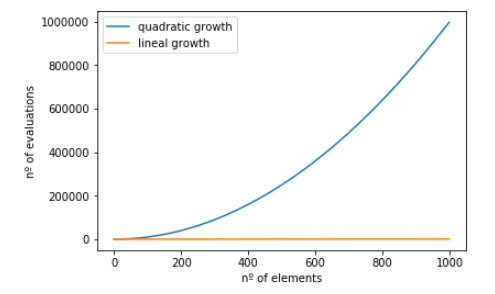

Este tema, y las soluciones implementadas se trataran en profundidad, en la sección [Reducción de la complejidad](Reducción de la complejidad) presente en este mismo documento.

#### Objetivo en el proyecto ASIO

Dentro del proyecto ASIO, la librería de descubrimiento, dando por sentada su capacidad para evaluar similitudes, ha de dar solución a los siguientes aspectos

* **Reconciliación de entidades:** 

  Existen distintos contextos, donde la resolución de este problema, puede ser de especial utilidad

  * **Al insertar una nueva entidad en el sistema:**

    Una aplicación evidente de la librería de descubrimiento, es evitar generar nuevos duplicados durante el proceso de importación o inserción de nuevos recursos por cualquier otro medio.

    Para cada nueva inserción, es necesario determinar si dicho recurso fue insertado ya con anterioridad con el fin de evitar crear una nueva URI para el recurso (siguiendo las recomendaciones [FAIR](https://github.com/HerculesCRUE/ib-asio-docs-/blob/master/05-An%C3%A1lisis_de_m%C3%A9todos_FAIR/ASIO_Izertis_AnalisisDeMetodosFAIR.md)), e insertarlo nuevamente.

    La acción correcta en este caso, debería de ser recuperar la URI del recurso insertado anteriormente, y actualizar el recurso existente. 

    Esto implica en el contexto de el proyecto ASIO, una integración de la [Factoría de URIS](https://github.com/HerculesCRUE/ib-uris-generator), que es el componente encargado de crear nuevas URIs para los nuevos recursos o usar URIs existentes para recursos ya insertados en el sistema.

  * **Realizar un proceso periódico de búsqueda y limpieza de duplicados:**

    Es conveniente que la librería de descubrimiento, tenga la capacidad de realizar también un proceso periódico que evalué si existen duplicados dentro del sistema, y en este caso realizar las acciones de fusión entre dichas entidades que puedan ser oportunas. 

    Es también deseable un alto grado de automatización en el proceso, pero sin embargo es un proceso sensible, y que podría generar errores. Este aspecto se describirá ampliamente en el apartado [Automatización en la reconciliación de entidades](#automatización-en-la-reconciliación-de-entidades).

* **Descubrimiento de enlaces:**

  Podemos entender que dos entidades son en realidad la misma entidad, cuando existe un alto grado de similitud entre los atributos de dicha entidad, por lo tanto, para establecer la similitud entre entidades, es  necesario, establecer definir previamente la algoritmia para evaluar la similitud entre atributos, ampliamente descrito en el apartado [métricas_de_similitud_para_atributos](#Métricas-de-similitud-para-atributos). En cualquier caso la solución para el contexto de el proyecto ASIO, debe de ser capaz de:

  * **Detectar posibles enlaces entre entidades (de la misma clase), presentes en otros Backend SGI:**

    En este caso, las entidades disponibles en otros Backend SGI, comparten arquitectura del Backend y Ontología, por lo que es un caso muy similar al caso de búsqueda de enlaces dentro del propio backend SGI, pero eso si, aumentando considerablemente el espacio de búsqueda. Por lo tanto, los problemas y soluciones enumeradas en el aparatado [Reducción de la complejidad](Reducción de la complejidad), son relevantes para esta funcionalidad. Para el resto de aspectos, casi todo lo enumerado en la comparación de similitudes, es aplicable en este caso.

  * **Detectar posibles enlaces con entidades externas (Nube LOD):**

    En este caso, los distintos datasets disponibles en la nube LOD, ni comparten esquema, ni comparten arquitectura, por lo que a priori la solución es diferente. Esta se abordara en profundidad, en el apartado [Descubrimiento de enlaces entre entidades en la nube LOD](#Descubrimiento-de-enlaces-entre-entidades-en-la-nube-LOD).

#### Justificación de la solución elegida

Se opta por implementar una solución ad hoc, para la reconciliación de entidades,  a pesar de que hay implementaciones de triple stores que de algún modo lo soportan, por ejemplo [Stardog (entity linkig in knowledge graph)](https://www.stardog.com/blog/entity-linking-in-the-knowledge-graph/) o [BalzeGraph (link all the entities)](https://www.stardog.com/blog/link-all-the-entities/) .

La principal motivación para implementar una solución propia, es que las soluciones mencionadas anteriormente (al margen de su idoneidad para el proyecto, que se discutirá a continuación), contradicen frontalmente el requisito expresado en el pliego de que ha de ser posible cambiar el triple store. La selección de uno y otro,  implicaría la existencia de un vendor lock-in, hacia estas soluciones, de forma que seria imposible cambiar el triple store y seguir ofreciendo la funcionalidad asociada a la reconciliación de entidades, proporcionada por estos. 

Por otro lado estos no parecen cubrir del todo las necesidades de el proyecto, por ejemplo la solución aportada por BlazeGraph requiere proporcionar una lista de variaciones  para los atributos, obviamente conocer eso, es conocer también de antemano que entidades están duplicadas y que valores tienen dichos atributos. 

En el caso de Stardog, este proceso esta orientado mas bien a la asociación de entidades externas con entidades dentro del grafo de conocimiento, que siendo interesante, no cubre todos los requisitos expresados en el pliego para este componente.

Por todo ello, pese a la complejidad asociada, se opta por la opción de realizar una implementación propia, que maximice el cumplimiento de los requisitos del proyecto, y reduzca el vendor lock-in asociado a la elección de una de las soluciones antes comentadas.

#### Descripción de la algoritmia empleada para evaluar la similitud de entidades

##### Métricas de similitud para atributos

Antes de plantear la similitud de entidades, es necesario plantear la similitud de los atributos que forman dichas entidades.

La similitud entre atributos, en principio, es dependiente del tipo de datos de dicho atributo (cadena de texto, número, booleano, Objeto, Lista, Link, etc), es decir, evaluar el grado de similitud entre dos cadenas de caracteres, es un problema diferente a evaluar la similitud entre dos números. 

En un ejemplo de la clase persona, podemos ver que el nombre en este caso es String, la edad es un entero, y la altura un número decimal

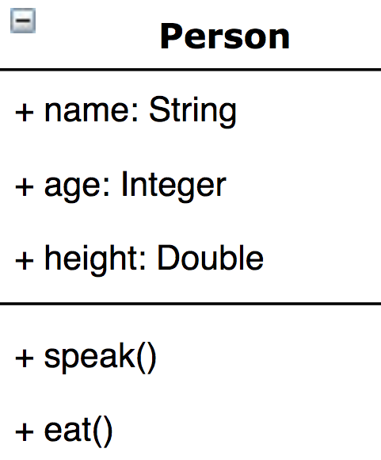

Esto deriva en distintas implementaciones y algoritmos para el calculo de similitud, que habrá que emplear en función de similitud adaptada a el tipo de datos al que pertenece cierto atributo.

###### Atributos de tipo String (cadena de texto)

Estos son el tipo de atributo más común, ya que cualquier otro atributo, puede convertirse en una cadena de texto, por ejemplo el numero 23, puede representarse también como la cadena de texto "23", o cualquier objeto, puede ser representado también como una cadena de texto, por ejemplo en formato JSON o XML.

Esto sin embargo no es recomendable, ya que esta conversión de tipos hace que se pierda la semántica del propio dato, es decir la diferencia entre las cadenas de texto "23" y "32", desde el punto de vista de cadenas de texto es mínima, ya que se ambas contienen el mismo juego de caracteres, (ya que en este caso solo cambia el orden de dichos caracteres), de forma que algoritmos que no sean sensibles al orden, podrían determinar que tienen un alto grado de similitud. Si embargo desde un punto de vista numérico, son valores muy diferentes.

También es probablemente la comparativa mas difícil de implementar, ya que podemos encontrar múltiples variaciones comunes para un mismo texto.

Existen distintos tipos de alteraciones comunes entre distintas cadenas de texto (en ocasiones pueden producirse las tres simultáneamente), que en realidad referencian al mismo concepto, por ejemplo:

* **Cambio de orden en los tokens**: Por ejemplo, un nombre, tal como: "Daniel Ruiz Santamaría", en ocasiones, es representado en distinto orden, por ejemplo: "Ruiz Santamaría Daniel".  Sin embargo el grado de similitud al comparar dichas cadenas de texto, debería de ser muy alto. 
* **Trucado de caracteres**: En ocasiones, un mismo dato, es representado truncando alguna de sus partes. Por ejemplo es muy común, que en la representación de una dirección, se exprese la misma información con distintas abreviaturas, por ejemplo la dirección "Avenida de España" podría representarse típicamente como "Avda. de España" o "A. de España". Como en el ejemplo anterior, seria deseable que el grado de similitud entre estas cadenas, fuese alto.
* **Cambio de caracteres**: También es frecuente encontrar errores ortográficos o de introducción del dato o varias formas validas de escribir una misma palabra , por ejemplo, el nombre "Elena" es frecuente encontrarlo también escrito como "Helena" o "Ester" puede ser escrito frecuentemente como "Esther". También en este caso seria deseable que la métrica de similitud entre las dos cadenas de texto, fuese elevada.

Es conveniente tener en cuenta que las variaciones de texto enunciadas en el punto anterior pueden producirse de forma simultanea, por ejemplo la dirección "Calle Elena de Troya" podría representarse como "Helena de Troya C.", y también en este caso  desearíamos que la métrica para el calculo de el grado de similitud, fuese lo mas alta posible.

También es necesario, simplificar en la medida de lo posible la comparativa, para ello, se realizara una **normalización** de  la cadena de texto siempre antes de evaluar el grado de similitud, para ello:

* No se distinguirá entre mayúsculas y minúsculas: Es decir las cadenas, siempre serán comparadas, en minúsculas.
* Se eliminaran signos de puntuación: Acentos, comas, puntos....
* Se eliminaran espacios: antes del primer carácter y después del ultimo.

Otra técnica comúnmente empleada en la comparación de cadenas de texto es la eliminación de [Stop Words](https://es.wikipedia.org/wiki/Palabra_vac%C3%ADa).  Estas palabras no añaden semántica a la información, y sin embargo, hacer añaden complejidad al proceso. Podría incluso darse el caso que en frases que contengan un numero elevado de de Stop Words, con respecto a las palabras que aportan significado, se pueda encontrar (si no se eliminan), un alto grado de similitud entre dichos Stop Words que derive en una similitud aparentemente alta, pero no real.

Por todos estos motivos, se opta por la eliminación de dichos Stop Words antes de la comparación de cadenas de texto (siempre y cuando el corpus a evaluar no quede vacío),  usando para ello diccionarios (en aproximadamente 20 idiomas, que pueden ampliarse por configuración).

Existen multitud de algoritmos de similitud de cadenas de texto, pero hay que tener en cuenta los siguientes aspectos

* Cada algoritmo, esta diseñado para funcionar de una forma más eficiente con algún tipo de las alteraciones enunciadas anteriormente, por lo tanto tiende a no funcionar de forma tan eficiente con el resto de alteraciones.
* Aunque las métricas de similitud de cada algoritmo, tienen el mismo rango [0,1], estas parecen seguir distribuciones distintas, siendo que:
  * Algunas tienen a una distribución lineal, es decir, se distribuyen uniformemente dentro del rango expuesto, es decir, pequeñas modificaciones en las cadenas de texto, suponen pequeñas alteraciones de la similitud.
  * Algunas tienden a una distribución exponencial, siendo que pequeñas modificaciones, suponen grandes cambios en las métricas.
  * Algunas tienden a distribuciones logarítmicas, es decir, pequeñas modificaciones suponen muy pequeños cambios en el valor de la métrica.

Para evaluar la bondad de los algoritmos, **se han generado conjuntos de datos sintéticos** de 10000 elementos, donde se compara una cadena generada de forma aleatoria original (sin sentido semántico, solo como concatenación de caracteres),  con cadenas que sufren las siguientes modificaciones:

* Cadenas iguales: Como grupo de control, donde el resultado de la métrica de similitud debería ser exactamente 1.

* Cadenas generadas a partir de otras cadenas:
  * Mezclado de palabras: Se generan secuencias de un numero aleatorio de palabras (entre 3 y 6), cambiando  el orden de las estas de forma aleatoria.
  * Cambio de caracteres: Se generan secuencias de un numero aleatorio de palabras (entre 3 y 6), con un numero aleatorio de caracteres (entre 6 y 12) , y se cambian aleatoriamente para cada palabra entre 2 y 1/2 del número de caracteres de la palabra.
  * Truncado de caracteres: Se generan secuencias de un numero aleatorio de palabras (entre 3 y 6), con un numero aleatorio de caracteres (entre 6 y 12) , y se cambian truncan aleatoriamente para cada palabra entre 1 y 1/2 del número de caracteres de la palabra. También aleatoriamente se trunca solo una palabra o en todas las palabras.
  * Todos los cambios: Se generan secuencias donde se aplican todas las modificaciones antes expuestas.
* Cadenas distintas: Como grupo de control, se crean cadenas totalmente aleatorias, donde una cadena no es generada en forma alguna a partir de la otra cadena, y por lo tanto la similitud debería tender a 0.

Para facilitar la interpretación los resultados se han discretizado en los siguientes valores

* Malo: < 0.25
* Insuficiente: < 0.4
* Medio: < 0.6
* Alto: < 0.8
* Excelente: <= 1

Dada la heterogeneidad de los resultados de los distintos algoritmos, se han implementado los siguientes algoritmos, representados en la siguiente tabla, donde se presenta la precisión media para cada uno de los casos (cadenas iguales, mezcladas, truncadas, con cambios en caracteres, al aplicar todos los cambios de forma simultanea, o cuando las cadenas son distintas):

| Algoritmo                  | Descripción                                                  | Iguales   | Mezcladas | Cambios   | Truncado     | Todas     | Distintas |
| -------------------------- | ------------------------------------------------------------ | --------- | --------- | --------- | ------------ | --------- | --------- |
| Block Distance             | Mide la distancia entre bloques de texto de n caracteres     | Excelente | Excelente | Malo      | Insuficiente | Malo      | Excelente |
| Cosine Distance            | Mide la distancia coseno entre dos vectores de texto         | Excelente | Excelente | Malo      | Insuficiente | Malo      | Excelente |
| Dice Distance              | Determina la distancia entre dos muestras dividiendo el doble de los elementos coincidentes entre las dos muestras entre el numero total de elementos de las dos muestras | Excelente | Excelente | Malo      | Insuficiente | Malo      | Excelente |
| Euclidian Distance         | Se define como la distancia mas corta entre los vectores de los dos textos | Excelente | Excelente | Alto      | Alto         | Medio     | Medio     |
| Jaccard Generalizado       | Se obtiene al dividir la intersección de términos entre la unión de los mismos. | Excelente | Excelente | Malo      | Insuficiente | Malo      | Excelente |
| Jaccard                    | Se obtiene al dividir la intersección de términos entre la unión de los mismos. | Excelente | Excelente | Malo      | Insuficiente | Malo      | Excelente |
| Jaro Winkler               | Esta medida utiliza el número de caracteres que comparten ambas palabras, tomando en cuenta los caracteres que están en la misma posición y los que están transpuestos | Excelente | Excelente | Excelente | Excelente    | Excelente | Medio     |
| Levenshtein                | También conocido como distancia de edición. El resultado de este algoritmo dinámico es el número mínimo de operaciones requeridas para transformar una palabra en otra. | Excelente | Excelente | Alto      | Excelente    | Alto      | Excelente |
| Longest Common Subsequence | Se trata de encontrar una subsecuencia más larga que es común en un conjunto de secuencias (Aunque en la mayor parte solamente se toman dos secuencias) | Excelente | Excelente | Alto      | Excelente    | Excelente | Alto      |
| Longest Common SubString   | Igual que el anterior, pero no importa el orden.             | Excelente | Excelente | Medio     | Excelente    | Alto      | Excelente |
| Overlap Coefficients       | Medida de similitud que mide la superposición de dos conjuntos finitos, como el coeficiente de la intersección de ambos conjuntos, entre el numero mínimo de caracteres de ambas cadenas | Excelente | Excelente | Malo      | Insuficiente | Malo      | Excelente |
| Simon White                | Diseñado originalmente para encontrar secuencias de ADN, coincidentes entre dos muestras. | Excelente | Excelente | Malo      | Insuficiente | Malo      | Excelente |
| Smith Weterman Gotoh       | Este algoritmo, al igual que el de Needleman-Wunch, es para alinear secuencias, con la diferencia de que este algoritmo trata de encontrar el mejor segmento local de uno de los textos en el otro. | Excelente | Excelente | Medio     | Excelente    | Alto      | Excelente |
| Smith Weterman             | Este algoritmo, al igual que el de Needleman-Wunch, es para alinear secuencias, con la diferencia de que este algoritmo trata de encontrar el mejor segmento local de uno de los textos en el otro. | Excelente | Excelente | Alto      | Excelente    | Alto      | Excelente |

Como se puede apreciar en la tabla, los algoritmos que presentan en general mejores resultados (como por ejemplo el algoritmo de Jaro Winkler), tienden a tener problemas al identificar cadenas de caracteres totalmente distintas (en la cual una no deriva de la otra), es decir, pecan de optimistas.

Por otro lado los algoritmos que en general presentan peores resultados, tienden a separa eficientemente las cadenas derivadas, de las no derivadas.

Por otro lado, tal como se comento anteriormente, algunos algoritmos, identifican bien, por ejemplo los cambios de caracteres pero mal los truncados, o viceversa.

Esto hace conveniente la estrategia de evaluar cada cadena de texto con múltiples algoritmos, y desarrollo de un algoritmo de consenso,  para a partir de resultados parciales no demasiado precisos, aumentar la precisión.

**El algoritmo de consenso** implementado , intenta tener en cuenta de alguna forma todos los valores de métricas de similitud proporcionados por todos los algoritmos, pero a su vez, intenta dar mayor peso a los algoritmos optimistas, en caso de que mayoritariamente los algoritmos detecten algún grado de similitud, o a los algoritmos mas pesimistas, en caso de que no se detecte mayoritariamente ningún tipo de similitud. 

**Descripción del Algoritmo de consenso**

1. Ordenar los resultados de similitud de cada algoritmo de la siguiente forma:

   * Si del resultado mayoritario se infiere similitud (por encima de un cierto umbral configurable), se ordenan de mayor a menor similitud.

   * En caso contrario se ordenan de menor a mayor

2. Se establece el peso restante (**PR**), como el peso en el rango [0,1] que aun no ha sido asignado. Para la primera iteración $PR = 1$;

3. Se establecen los valores

   * Se calcula el **peso a aplicar** al elemento como: $ \alpha_{i} = \frac{1}{3} * PR $, es decir, un tercio de lo que quede por asignar. En la primera iteración $ \alpha_{1} = \frac{1}{3} * 1 = \frac{1}{3}$ 

   * Se actualiza el restante:  $PR = (1- \alpha_{i})*PR$ . En la primera iteración $PR = (1- \frac{1}{3})*1 = \frac{2}{3}$.
   * Se calcula el valor de **similitud ponderada** (SP) a aplicar para la similitud de el algoritmo i, como $SP_{i}=\alpha_{i}*S_{i}$ siendo $S_{i}$ el valor de la similitud dada por el algoritmo enésimo (en la posición i), según el orden de algoritmos establecido en el punto 1. 

4. Se repite el punto 3, hasta alcanzar los 2 últimos elementos de la lista, para dichos elementos se repartirá el sobrante: $SP_{n-1,2}=\frac{1}{2}*PR*S_{i}$

5. Se sumaran todos los valores ponderados de modo que  $similitudConsensuada =\sum_{i=1}^{n}SP_{i}$.

Básicamente una vez ordenada la lista, cada nueva métrica se ponderara de forma decreciente, es decir, tendrá menos peso que la métrica anterior. Esto tiende a acentuar las diferencias, cuando las cadenas de texto son diferentes    

| Iteración | Peso restante | Peso a aplicar = Peso restante * 1/3 |      |
| --------- | ------------- | ------------------------------------ | ---- |
| 0         | 1             |                                      |      |
| 1         | 0.6666        | 0.33333333                           |      |
| 2         | 0.44444444    | 0.22222222                           |      |
| 3         | 0.2962963     | 0.14814815                           |      |
| 4         | 0.19753086    | 0.09876543                           |      |
| 5         | 0.13168724    | 0.06584362                           |      |
| 6         | 0.0877915     | 0.04389575                           |      |
| 7         | 0.05852766    | 0.02926383                           |      |
| 8         | 0.03901844    | 0.01950922                           |      |
| 9         | 0.02601229    | 0.01300615                           |      |
| 10        | 0.01734153    | 0.00867076                           |      |
| 11        | 0.01156102    | 0.00578051                           |      |
| 12        | 0.00770735    | 0.00385367                           |      |
| 13        | 0.00385367    | 0.00385367                           |      |
| 14        | 0.00385367    | 0.00385367                           |      |

###### Atributos de tipo Numérico

Para calcular la similitud entre atributos de tipo numérico, interesa seguir una distribución exponencial inversa

En la grafica se puede apreciar que los mayores valores de la similitud, se producen cuando mas pequeña es la diferencia, y estos valores disminuyen rápidamente de forma exponencial cuando la diferencia crece, es decir, cuando dos números son iguales su similitud es 1.

También interesa relativizar las diferencias, es decir no es lo mismo una diferencia de 1 unidad en una comparativa entre valores bajos (por ejemplo entre 5 y 6), que la misma diferencia (1 unidad) entre números altos, por ejemplo entre 1.000.000 y 1.000.001, ya en el segundo caso, la diferencia relativa es menor. Para ello se aplicara la normalización numérica, que básicamente consiste en dividir ambos números, por el mayor de ellos en valor absoluto.

Además es interesante discretizar las similitudes, ya que una similitud del 0.99999, aunque numéricamente esta cercana a 1, el uno indica que ambos números son exactamente iguales y sin embargo el valor 0.99999,  indica que existe cierta diferencia por cercana que esta sea. por lo que se discretizara redondeando el numero normalizado a si valor inferior mas cercano con un solo decimal, es decir, se aproximara a 0.9

En temimos generales para calcular la similitud entre dos números se aplica la siguiente formula:
$$
similitud = ({1\over 2})^{nMax-nMin}
$$
Donde nMax es el máximo normalizado, es decir el redondeo floor(max/max), es decir 1 y nMin es el mínimo normalizado según la formula floor(min/max), que podrá tomar los siguientes valores discretos [0.0, 0.1, 0.2, 0.3, 0.4, 0.5, 0.6, 0.7, 0.8, 0.9 y 1]. Para valores iguales, la similitud será siempre 1, en otro caso la similitud oscilara en el rango [0,0.5].

###### Atributos de tipo Booleano

La mayor dificultad de este tipo de atributos, es que comúnmente pueden ser representados en distintos formatos.

* Según el lenguaje de programación
  * 0|1 -> C
  * true| false -> Java
  * YES| NO -> Objetive-c
* Según bases de datos
  * Bit
  * Tynint
* Según idioma
  * Si|No o S|N
  * YES|NO

Por lo tanto es necesario detectar todas las posibles variaciones.

La evaluación de la similitud es la mas sencilla de implementar, y es en realidad una operación XAND, es decir tiene una similitud 1 cuando ambos atributos son iguales (caso de true y true o false y false), y 0 cuando son distintos (caso de true y false o false y true).

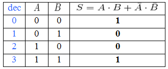

###### Atributos de tipo fecha

Como en el caso anterior, la principal complejidad deriva de las distintas convenciones para expresar una fecha

* Según la precisión
  * Solo fecha
  * Solo instante de tiempo
  * Fecha e instante de tiempo
* En cualquier orden
  * yyyy-MM-dd
  * dd-MM-yyyy
* Cualquier separador
  * yyyy-MM-dd
  * Yyyy/MM/dd
* En cualquier idioma
  * Viernes, 12 de Febrero de 2021
  * Friday, 12 of Febrary of 2021
* En distintas longitudes
  * Viernes, 12 de Febrero de 2021
  * Vie, 12 de Feb de 2021

Para ello es necesario manejar la detección de una fecha, de forma que sea tolerante a todas las casuísticas mencionadas.

La evaluación en si, también es muy sencilla 0, en caso de no coincidencia, 1 en caso contrario. En la evaluación hay que tener en cuenta que puede darse el caso en que sea necesario comparar fechas con distintos grados de precisión. Por ejemplo en la comparación entre la fecha 2021-02-12 y la fecha 2021-02-12 10:23:33.123, debemos comparar solo hasta la precisión de la menos precisa, por lo tanto en el ejemplo, se consideraran fechas similares, es decir en este caso la similitud será de 1. 

###### Atributos de tipo enlace

Los enlaces son un tipo especial.

Para evaluar la similitud entre enlaces, es necesario tener en cuenta el contexto de búsqueda de similitud

* Si se evalúa dentro del mismo nodo, si ambas URIs son iguales, obviamente referencian al mismo objeto, y por lo tanto la similitud será 1. Dado que la librería de descubrimiento busca periódicamente duplicados para todas las clases, y que también se evita  la generación de duplicados en la fase de inserción, el resultado de las acciones llevadas a cabo, debe de derivar en la ausencia de duplicados, y por tanto las URIs de los enlaces, que en algún momento pueden haber apuntado a dos objetos similares, tras esas acciones, deben terminar por apuntar a un mismo objeto, y por lo tanto, es suficiente con comprobar la URI, que en ese caso será idéntica.
* En caso de una evaluación entre enlaces en distintos nodos, hay tres posibles situaciones:
  * Si en el objeto destino del enlace, aparece una tripleta con la propiedad sameAs, (que indica que dos objetos almacenados en distintos nodos son en realidad el mismo), que referencie al otro objeto almacenado en el otro nodo, entonces el objeto es el mismo, y por tanto la similitud es 1. (propiedad de simetría, A = B à B = A) ), en alguno de los nodos.
  * En caso de no existir enlaces de ese tipo si existirá la misma tripleta o propiedad de tipo closeMatch (que indica un enlace a una entidad externa al backendSGI, por ejemplo a la nube LOD), con el mismo enlace, significa que ambos son iguales a un objeto externo y por lo tanto iguales entre si (propiedad transitiva, A = C, B = C --> A=B). 
  * En caso contrario es necesario evaluar las entidades a la que apuntan los enlaces (de forma recursiva si fuese necesario), aplicando la evaluación de entidades que veremos mas adelante.

###### Atributos de tipo Lista

Las listas no es un tipo por si mismo, si no que contienen elementos que son de un tipo determinado.

Para evaluarlas se aplica la siguiente algoritmia:

1. Se elige el primer elemento de la lista mas larga (elemento a), en lo sucesivo lista A
2. Se busca el elemento con mayor grado de similitud (elemento b) en la lista mas corta, en lo sucesivo, la lista B.
3. Se almacena la similitud encontrada y se eliminan de las listas los elementos a y b.
4. Se repite la operación hasta que en a lista B, no queden elementos.
5. Se calcula la similitud total, de la forma $S=\frac{\sum_{i=0}^{nº~elem.~lista~menor} similitud~del~tipo~comun~a~los~elementos(A_{i},B_{i}) }{nº~elementos~lista~mayor}$
6. Se aplica la similitud ponderada por su importancia, para el atributo de la lista, según las estadísticas de la entidad.

###### Atributos de tipo objeto

Para los atributos de tipo objeto, se pueden aplicar las métricas descritas en la sección [Métricas de similitud en comparación de entidades](#métricas-de-similitud-en-comparación-de-entidades) descrita en el siguiente punto. En caso de existir objetos anidados, se aplicara lo descrito recursivamente.

##### Variabilidad de atributos para una entidad

Es necesario identificar de alguna forma, la relevancia de los atributos de una entidad en el contexto de ser o no determinantes para identificar dicha entidad.

En cualquier entidad podemos encontrar atributos de distintos tipos:

* **Identificadores:** Identificadores provenientes de la BBDD de origen, que deberían identificar inequívocamente una determinada instancia.
* **Semi-Identificadores:** Atributos que sin ser identificadores, tienden a ser únicos entre las instancias, por ejemplo, el nombre, DNI, correo electrónico... 
* **Atributos de información:** No son determinantes a la hora de discernir si dos entidades, son en realizad la misma, pero el conjunto de ellos, también da información relevante sobre la probabilidad de que en realidad sea la misma entidad, por lo que no conviene desecharlos.

Partiendo del desconocimiento inicial del rol que ejercen los atributos presentes en los triple stores, se plantea la premisa de que aquellos atributos que ejerzan de identificadores o de semi-identificadores, tendrán una mayor variabilidad dentro de la base de datos, es decir 

$variabilidad(V)=\frac{nº~valores~distintos~para~el~atributos}{Total~de~instancias~de~la~clase}$

Donde obtendremos un resultado de variabilidad en el rango [0,1], estando los identificadores mas próximos a 1, y los atributos, menos relevantes se aproximaran a 0.

De este valor se obtendrá el peso que aplicaremos a el valor de similitud del atributo es decir, el factor de similitud para un atributo dado, quedara determinado por

$Similitud~Ponderada (SP) = V*S$, siendo S, la similitud del atributo calculada según su tipo.

Para calcular el valor final de similitud (normalizado entre 0 y 1) entre entidades se aplicara la siguiente formula:
$$
similitudEntidad = \frac{\sum_{i=1}^{nAtributos} SP_i}{\sum_{i=1}^{nAtributos}V_i}
$$
##### Métricas de similitud en comparación de entidades

Las métricas de similitud para entidades no son mas que la aplicación de similitud para todos los atributos y la aplicación de las estadísticas de variabilidad de los atributos de una clase.

Para ello se seguirá el siguiente algoritmo:

1. Se generara una lista de atributos únicos presentes en la entidad A o en la entidad B
2. Para cada atributo, se obtendrá el tipo, y se calculara la métrica dependiente del tipo, descrita en el punto anterior  ([Métricas de similitud para atributos](#métricas-de-similitud-para-atributos)). 
   1. En caso de no coincidir los tipos, se realizara siempre la comparación en forma de cadena de texto, ya que este es el tipo mas general posible.
   2. En caso de ser un objeto, se aplicara el algoritmo para la comparación de entidades aquí descrito recursivamente.
3. Se ponderara y normalizara la métrica obtenida (según lo descrito en el apartado [Variabilidad de atributos para una entidad](#variabilidad-de-atributos-para-una-entidad), de forma que el resultado de similitud, siempre estará en el rango [0,1]

#### Escalabilidad

##### Reducción de la complejidad

Este como se comento es uno de los factores claves que van a limitar la escalabilidad, y por lo tanto la viabilidad de la solución elegida.

Poniéndonos en contexto del problema podemos estimar la complejidad, como

$Complejidad = nº~de~nodos * nº~de~clases * nº~instancias~(entidades~a~comparar) * nº~instancias-1~(resto~de~instancias)$

Dado que el número de nodos (C1) y el número de clases (C2), potencialmente será de otra magnitud que el número de instancias, podemos tratarlos como constantes. Quedando la complejidad definida como

$Complejidad = C1 * C2 * nº~instancias~(entidades~a~comparar) * nº~instancias-1~(resto~de~instancias)$

Sabiendo que en cada iteración solo buscaremos similitudes, dentro de un mismo nodo y un misma clase, estas constantes tendrán el valor 1, entonces

$Complejidad = 1 * 1 * nº~instancias~(entidades~a~comparar) * nº~instancias-1~(resto~de~instancias) \sim nº~instancias^2 $ 

Es decir la complejidad asociada a ese proceso, es una complejidad de tipo cuadrático $O(n^2)$

Esta complejidad de facto, es un gran problema para la escalabilidad, es fácil ver que para números de instancias relativamente altas, debemos de realizar un numero de evaluaciones de similitud demasiado elevado, por ejemplo para 1.000 instancias hay que realizar aprox 1.000.000 de comprobaciones. 

Es decir, si no conseguimos reducir de alguna manera los dos últimos términos, el problema será pronto inabordable.  

###### Reducción del espacio de búsqueda

Cualquier búsqueda de similitud implica comparar el elemento, con el resto de elementos de su tipo, esto implica una complejidad n(n-1), es decir $O(n^2)$, es decir exponencial. 

Es necesario encontrar mecanismos para **reducir** la complejidad. En este caso buscamos reducir el numero de entidades con las que comparar, es decir **(n-1),** buscado algo que se asemeje a una constante, pasando de orden exponencial a orden polinomial O(n∗m), siendo n el numero de elementos a comparar, y m, el número de elementos similares encontrados en el espacio (n-1) que para obtener ganancia debe ser muy inferior en numero a n-1 (lograremos un máximo 50 elementos pero idealmente menos de 5).

Para ello, la librería de descubrimiento, hará uso de la herramienta [Elasticsearch](https://www.elastic.co/es/).  Las búsqueda en Elasticsearch es muy rápida, debido al uso de índices inversos ( [Lucene](https://lucene.apache.org/) ).  

Esto implica aumentar la complejidad de la solución, ya que es necesario mantener replicas de las estructuras de datos disponibles en los triple stores, en los índices de Elasticsearch, pero permite disminuir sensiblemente el espacio de búsqueda como se vera a continuación.

La estrategia consistirá en no realizar la búsqueda en todas las entidades que pertenecen a la misma clase, sino a solo con aquellas entidades que ya presentan un cierto grado de similitud.

Para ello buscaremos construir una query dinámicamente en elasticsearch basándonos en los atributos mas relevantes de la entidad, para ello seguiremos el siguiente **algoritmo**:

1. Buscaremos una coincidencia exacta en los atributos sobre los metadatos que indican el nodo, el triple store y la clase de la instancia (operación AND)

2. Admitiremos una coincidencia parcial, para los atributos mas relevantes de la entidad:

   1. La forma de determinar que atributos son mas relevantes para la construcción de la query, viene dada por distintas variables de entorno, disponibles en la configuración:

      * Para las entidades simples (sin un grafo de entidades anidadas):
        * **elasticsearchAttributesThresholdSimple:** Ratio sobre la importancia relativa de los atributos que participaran en la query.
        * **elasticsearchAttributesNumberRatioSimple:** Ratio sobre el número de los atributos que participaran en la query.
      * Para las entidades complejas (con un grafo de entidades anidadas):
        * **elasticsearchAttributesThresholdComplex:** Ratio sobre la importancia relativa de los atributos que participaran en la query.
        * **elasticsearchAttributesNumberRatioComplex:** Ratio sobre el número de los atributos que participaran en la query.

   2. El algoritmo que determina que sobre que atributos se realiza la query es el siguiente.

      1. Ordenamos los atributos según su ratio ponderado de relevancia de mayor a menor.
      2. Sobre la lista de atributos ordenados, los seleccionamos hasta alcanzar el umbral de importancia (suelen seguir una distribución de Pareto) o alcanzar el limite establecido por numero de atributos.

   3. Con los atributos seleccionados completaremos la query descrita en el punto 1, pasando el valor de importancia relativa como parámetro para calcular el valor de similitud en elasticsearch, y realizando operaciones OR entre ellos

   4. Las similitudes en elasticsearch, suelen seguir una exponencial inversa, es decir los valores son muy altos en los primeros elementos, y caen rápidamente. Buscaremos el punto de inflexión donde la grafica se aplana, es decir donde los valores permanecen mas o menos constantes, en valores bajos, tal y como se aprecia en la figura. También limitaremos los valores máximos por medio de la constante **elasticSearchMaxDesirableNumbersOfResults**, que en la configuración esta definida a 50.

      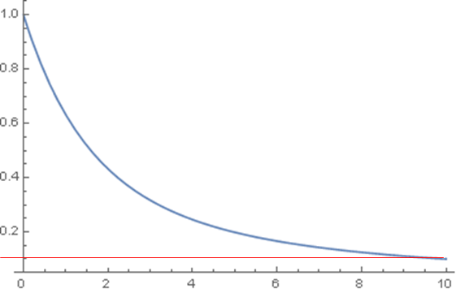

Tras todos estos paso,  habremos reducido considerablemente las instancias donde buscar similitud, (empíricamente, la mayoría de las veces ronda las 5 evaluaciones y sabemos por que asi lo hemos limitado, que nunca deben de superar las 50).

Esto convierte el segundo ultimo termino de la formula de calculo de complejidad en una constante, que sabemos que oscilara entre un promedio de 5 instancias a un máximo de 50. En lo sucesivo lo llamaremos EBR (Espacio de búsqueda reducido).

Por lo que ahora tenemos que la complejidad es 

$Complejidad = 1 * 1 * nº~instancias~(entidades~a~comparar) * EBR $ 

Es decir la complejidad asociada a ese proceso, es una complejidad de tipo lineal $O(EBR*n)$, al menos para los valores altos de n, que son en realizad los que nos preocupan.

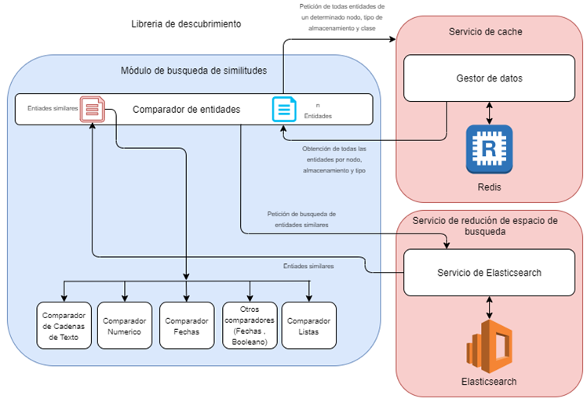

###### Reducción del número de entidades a comparar

Ahora que hemos reducido el numero de entidades con las que comparamos todas las instancias de una clase (el último termino de en el calculo de complejidad), tenemos que la complejidad ya es de tipo lineal $O(EBR*n)$, por lo tanto abarcable, pero aun tenemos que n (entidades a comparar), siendo lineal, pude ser un valor alto, y por lo tanto una comprobación costosa.

En este caso podemos aprovechar la propiedad de simetría entre las similitudes, ya que la similitud de A con respecto a B es la misma que la similitud de B con respecto a A.

Esto implica que cuando añadimos una nueva instancia y esto genera un duplicado, solo con evaluar la nueva instancia, ya estaríamos teniendo en cuenta la similitud con las anteriores.

Basándonos en esto, podemos pensar que en cada iteración, sería suficiente con evaluar solamente los deltas, es decir las entidades que han cambiado desde la ultima evaluación. 

Esta claro que en primera evaluación de la librería de descubrimiento, los deltas, serian todas las instancias de una determinada clase, ya que esta nunca fue evaluada, pero también es cierto, que probablemente esa primera evaluación se realice en el momento que existen menos entidades en el sistema.

En el resto de evaluaciones, siempre deberemos de realizarlas únicamente sobre el conjunto de datos que ha sufrido alguna variación, y por lo tanto el peso de la búsqueda de similitud se debería de mantener siempre en unos valores manejables.

Volviendo a el calculo de la complejidad, tendríamos que ahora quedaría definido como

$Complejidad = 1 * 1 * \delta * EBR $ , siendo $\delta$ el número de entidades que han cambiado, y en todos los casos $\delta <= Total~de~instancias$

Existen metadatos en los triple stores, que permiten conocer la fecha de ultima actualización, por lo que para implementarlo, bastara con manejar una auditoria de evaluaciones por nodo, triple store y clase, en la librería de descubrimiento

La nueva complejidad entonces será del tipo $O(\delta *EBR)$ donde $\delta$ es igual o mucho menor que el total de instancias y EBR es muchísimo menor que el resto de instancias (máximo 50).

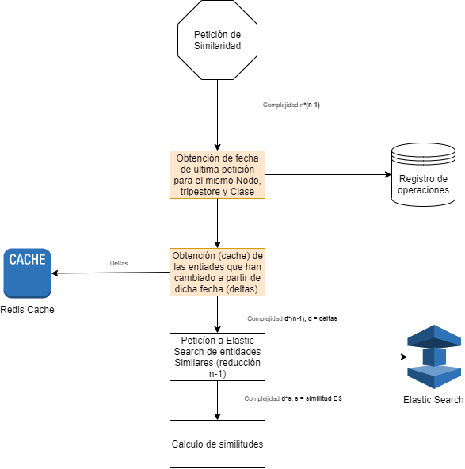

##### Reducción del acoplamiento a la fuente de datos

El proyecto impone que pueden existir mas de una fuente de datos, y estas pueden ser intercambiables. Ahora mismo coexisten Fuseki y Wikibase ambos accesibles por Endpoint SPARQL o API, debido a la que estas fuentes de datos pueden variar, es necesario reducir el acoplamiento.

Al fin y al cabo, la **federación** ha de conocer las fuentes de datos e interactuar con ellas, asi que ¿Por qué no delegar esta responsabilidad en ella?

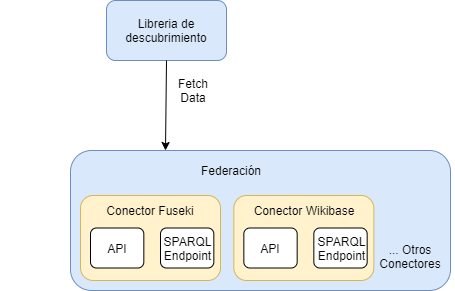

##### Reducción del acoplamiento a el modelo de datos

Hay que partir de la premisa de que el modelo de datos, es decir la ontología, es un modelo de datos vivo, y por lo tanto es esperable un cierto grado de cambios para dar cabida a los datos de todas las universidades o instituciones que en algún momento puedan adherirse al proyecto.

Por ello la librería de descubrimiento implementa un modelo de datos lo sufrientemente abstracto, para poder dar soporte a cualquier fuente de datos sin perdida de información (en adelante lo llamaremos **TripleObject**).

Este modelo de datos, tiene dos grandes partes diferenciadas:

* **Metadatos:** Relativos a datos de ubicación de la información, auditoría, etc...

  * **entityId:** Identificador de la instancia.
  * **localURI:** URI local de acceso al recurso en el triple store
  * **className:** Clase a la que pertenece.
  * **lastModification:** Fecha de última modificación.
  * **tripleStore:** Sistema de almacenamiento donde se encuentra alojado la instancia, modelada con el objeto **TripleStore**

* **Datos:**

  * **attributes:**  Atributos propios de la entidad, modelados como un Map<String,Object>, donde la key, es el nombre del atributo, y el value de tipo object, puede ser un tipo valor final (String, integer, boolean, Date...) o puede ser otra estructura Map<String,Object> que modelaría otro objeto anidado.

    

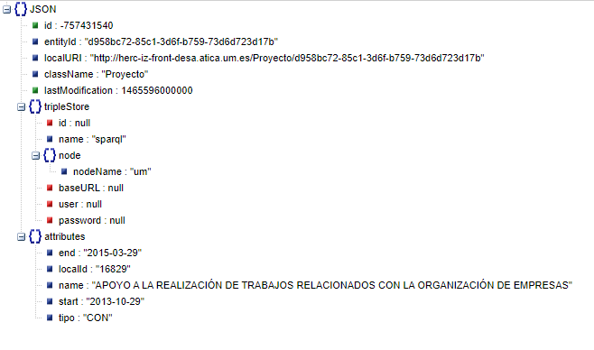

Este tipo de estructura es lo suficientemente flexible, para modelar cualquier tipo de objeto, con cualquier tipo de complejidad (cualquier dato que pueda ser expresado por medio de Json, puede ser expresado por esta estructura).

Esto hace que la librería de descubrimiento pueda ser agnóstica de la ontología, ya que en ultima instancia, esta derivara en un objeto TripleObject, que implícitamente la modele. 

Por otro lado, este modelado genérico de información, permite el movimiento de datos, entre los componentes de la arquitectura, por ejemplo con el modulo de Federación, que da acceso a los datos.

También al ofrecer una traducción inmediata a Json, permite ser usada como modelo de datos en Elasticsearch, con pequeñas modificaciones en los metadatos (en adelante las llamaremos **TripleObjectES**) y en la captura de datos de fuentes externas en la nube LOD (en adelante las llamaremos **TripleObjectLink**), también con alguna modificación en los metadatos. Esto hace siempre posible (y sencilla) las conversiones entre los tipos enumerados.

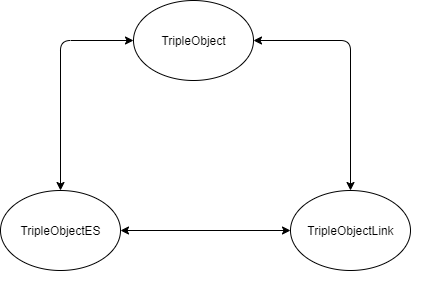

Ciertamente el carácter recursivo en el modelado de los datos, hace algo mas compleja su explotación, pero creemos que las ventajas de una estructura dinámica, superan ampliamente los inconvenientes de aumento de complejidad en su explotación.

##### Reducción de tiempo necesario para acceder a los datos

Los datos almacenados en los triple stores deben de estar disponibles en el menor intervalo de tiempo posible (recuperación desde el triple store). La librería no estará plenamente operativa hasta obtener los datos, por lo que el tiempo necesario es muy importante. 

Al desplegarse la aplicación obtendrá los datos desde la cache REDIS, de esa forma la aplicación estará operativa en un intervalo de tiempo bastante corto. De forma paralela, la aplicación obtendrá los datos actuales desde el triple store a través de la federación, y actualizara la cache y las estructuras de datos en memoria.

Las entidades a evaluar deben de estar en memoria para minimizar el tiempo de proceso, por ello existirán estructuras de datos en memoria, para los datos necesarios para las evaluaciones que la librería este realizando en ese momento. Pasada la evaluación las estructuras serán vaciadas.

Los datos disponibles, que no estén en memoria, deben ser accesibles en el menor intervalo de tiempo posible (recuperación desde cache). Por ello el acceso a la cache se realiza de forma concurrente, de forma que se minimice el tiempo necesario para actualizar las estructuras desde la cache.

Cualquier cambio en el triple store, debe de actualizar la cache. Existe un endpoint y una cola Kafka a/los que se notifica cada vez que se modifica una entidad en el triple store, lo cual deriva en una actualización de la chache y de las estructuras de datos.

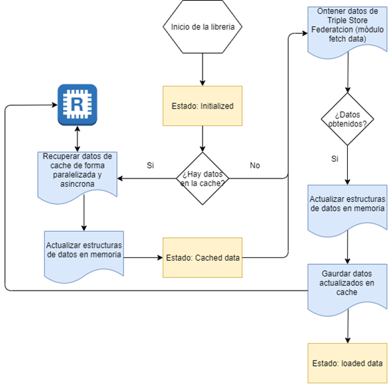

Logica de obtención de datos en la librería de descubrimiento

##### Reducción de tiempo de acceso durante el proceso de evaluación

Las entidades a evaluar deben de estar en memoria para minimizar el tiempo de proceso. El servicio CacheService, gestiona la interacción con la cache y mantiene los datos necesarios siempre en memoria, en estructuras de datos que garanticen accesos y búsquedas de elementos con complejidad de O(1) de modo que el tiempo necesario para obtener cualquier dato sea mínimo.

Las estructuras de memoria han de mantenerse siempre sincronizadas con respecto a la cache y a los datos almacenados en los triple stores. Este servicio garantiza también la integridad de datos entre cache y memoria.

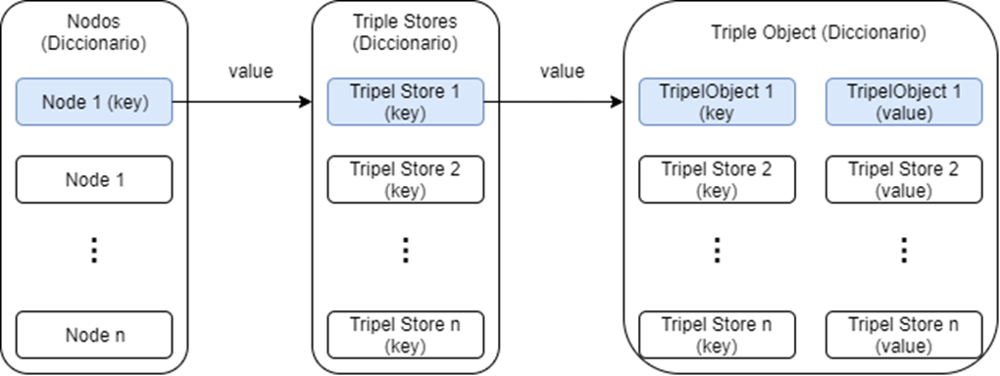

Estructuras de datos en memoria.

##### Reducción de tiempo en operaciones pesadas

Seria deseable minimizar el tiempo de las peticiones pesadas como actualización y carga de datos desde la cache y desde los triple Store, y que estas no fuesen bloqueantes para la aplicación.

Para ello se implementan todas las operaciones pesadas de forma que estas se ejecutan siempre de forma concurrente y asíncrona. Esto hace que el tiempo necesario para acometer una operación (por ejemplo la carga de todos los datos desde un determinado triple store), no sea la suma de las operaciones necesarias sino el tiempo de la operación mas lenta. Por otra parte para favorecer la concurrencia se dividen los grandes conjuntos de datos por nodo, triple store y clase. 

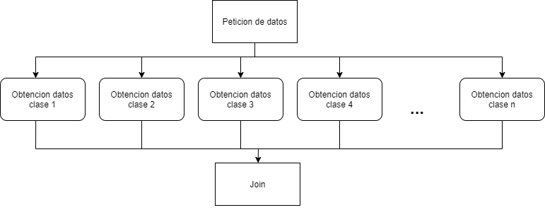

##### Búsqueda de similitudes no bloqueante

Seria deseable que las peticiones de búsqueda de similitud , siendo potencialmente operaciones pesadas no bloqueasen al cliente que las invoca. 

Para ello las peticiones (si están marcadas como asíncronas), no se procesan inmediatamente sino que se almacenan en una cola FIFO, y la petición retorna inmediatamente indicando un código de petición, que puede ser consultado posteriormente y la respuesta es enviada de forma asíncrona, por medio de colas Kafka o webhook según preferencias del usuario

Seria también deseable que las peticiones se procesen en función de la capacidad de proceso de la librería de descubrimiento.  Para ello la librería de descubrimiento maneja la gestión de Jobs en función de su tipo, prioridad y orden de llegada, haciendo que se ejecuten automáticamente una vez que la librería este en disposición de hacerlo.

Múltiples peticiones idénticas no deberían de procesarse múltiples veces, sino únicamente una. Sin embargo todas las peticiones han de obtener respuesta.

Por ello las peticiones idénticas solo se almacenan una vez en la cola FIFO, por lo que solo será procesada una sola vez. Sin embargo, se guarda registro de todos los clientes que realizaron la petición y por lo tanto la librería responderá a todas ellas. 

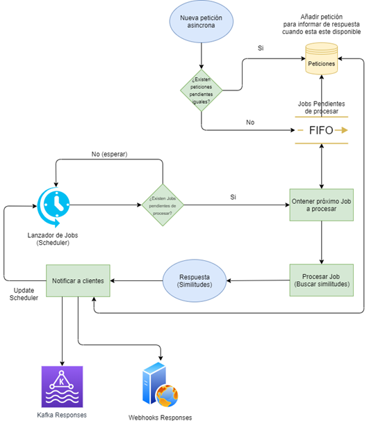

#### Integración del proceso dentro de la arquitectura general de la aplicación.

En el siguiente esquema se pueden apreciar a grandes rasgos los bloques funcionales de la librería de descubrimiento, y su integración con el resto de la arquitectura del proyecto ASIO.

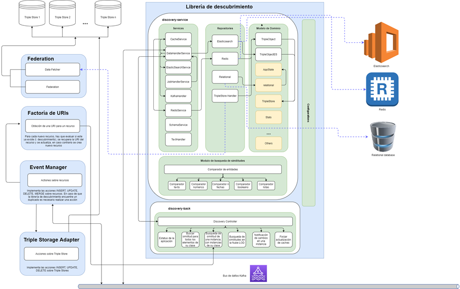

La solución propuesta, será implementada como una tarea programada. Esta tarea esta compuesta por los siguientes bloques funcionales:

* Pertenecientes a la librería de descubrimiento:
  * **Modelo de dominio:** Modela todas las entidades necesarias para la librería de descubrimiento entre ellas:

    * **Paquete appstate** modela el estado de la aplicacion

      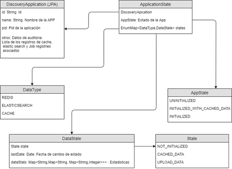

      * **Paquete stats:** Contiene las clases que el modelan las estadísticas relativas a las clases e instancias a tratar por la librería de descubrimiento, como por ejemplo el índice de relevancia de un determinado atributo para una entidad.

        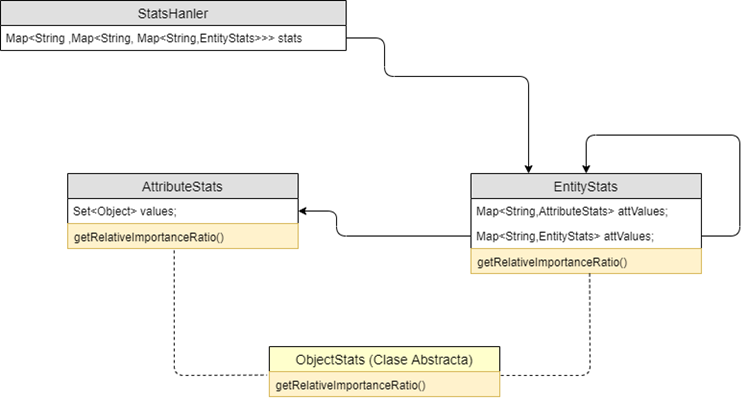

      * **Contenedores de datos genéricos:**

        * **TipleStore:** Esta clase modela datos relativos a el origen del dato (triple store).
        * **TripleObject** Clase principal que modela la entidad a comparar, con suficiente grado de generalización para modelar cualquier objeto representable en un triple store. Sus atributos pueden resumirse en 2 tipos:
          * **Metadatos:** Datos acerca del origen de al información y su lugar de almacenamiento
          * **Atributos:** Todos los atributos de la entidad que de forma recursiva pueden contener otros TripleObject, modelando asi el objeto.
          * **TripleObjectES** **(Paquete elasticsearch):** Clases que modelan el objeto TripleObject adaptado para su uso en Elasticsearch
          * **TripleObjectLink**: Modela los objetos recuperados de la Nube LOD, con un formato muy similar a TripleObject, pero añadiendo los metadatos propios de los objetos de origen externo al proyecto ASIO

      * **Paquete relational**: Clases que modelan las entidades de la BBDD relacional (Entidades JPA). Estas clases modelan: Estado de la aplicación, Jobs, Peticiones, Respuestas y Acciones ante similitudes encontradas. También soporta la auditoria de la aplicación, es decir, quien realiza que petición y cuando se realizo, cual fue la respuesta, que acciones se generaron….

        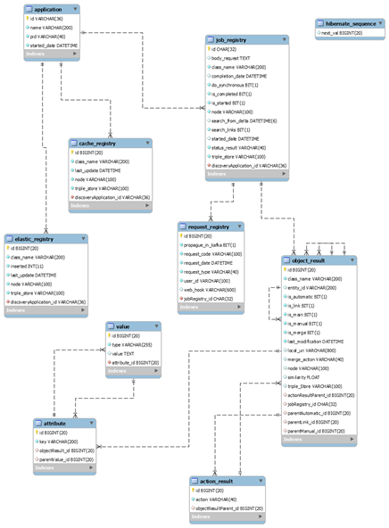

  * **Repositorios:** Donde se implementan los conectores para los distintos repositorios, entre ellos:

    * **Elasticsearch:** Conector hacia el repositorio de elasticsearch, con todos los métodos necesarios, para realizar las operaciones requeridas por la librería de descubrimiento y convertirlos en objetos TripleObjectES. Destaca la clase **TripleObjectESCustomRepository**, que contiene la lógica necesaria para construir las queries necesarias para insertar, buscar, borrar objetos **TripleObjectES** desde elasticsearch.

    * **Redis:** Conector hacia el repositorio de Redis, con todos los métodos necesarios, para realizar las operaciones requeridas por la librería de descubrimiento.

    * **Relational****:** Conector hacia el repositorio de la BBDD relacional, con todos los métodos necesarios, para realizar las operaciones requeridas por la librería de descubrimiento..

    * **TripleStore** **Handler:** Conector hacia la el módulo data-fetcher de la federación, con todos los métodos necesarios, para recuperar los datos y convertirlos en objetos **TripleObject**

      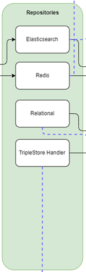

  * **Servicios:** Conjunto de servicios que contienen la logica de aplicación

    * **DataHandlerService:** Servicio encargado de **orquestar:** el flujo de datos de la aplicación y las comparaciones de entidades, haciendo las invocaciones precisas a los otros servicios mencionados a continuación.

    * **CacheService:** Servicio encargado de mantener estructuras de datos en memoria, y de interactuar con la cache.

    * **ElasticSeachService:** Servicio encargado de realizar las peticiones oportunas al repositorio de ElasticSearch (de forma asíncrona y concurrente) e implementar la lógica de negocio que proceda.

    * **RedisService:** Servicio encargado de realizar las peticiones oportunas al repositorio de Redis (de forma asíncrona y concurrente) e implementar la logica de negocio que proceda.

    * **JobHandlerService:** Servicio encargado de gestionar las distintas peticiones realizadas a la librería de descubrimiento por medio de su API Rest, crear los Jobs mínimos, para asegurarse no procesar la misma petición varias veces y de procesar las respuestas (para todos los clientes que las hubiesen requerido) ya sean síncronas (HTTP) o asíncronas (Kakfa y/o Webhook).

    * **KafkaHandler:** Servicio encargado de actuar como subscriptor y publicador para todos los topics que la aplicación requiera y de enviar los eventos precisos al resto de componentes de la aplicación que asi lo requieran.

      **SchemaService:** Servicio encargado de interpretar cualquier URI creada por la factoría de URIs, pudiendo extraer la información implícita de los componentes de dicha URI.

      **TextHandler:** Servicio en el que se delegan todas las tareas de procesamiento de texto, tales como la Normalización (eliminación de caracteres de puntuación y cambio a minúsculas) y eliminación de Stop Words (Eliminación de palabras que no aportan significado en un texto, especialmente útil para reducir resultados de la búsqueda en elasticsearch).

      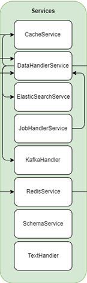

  * **Entity comparator:** El servicio implementa la comparación de entidades tal como se indica en [Métricas de similitud en comparación de entidades](#métricas-de-similitud-en-comparación-de-entidades). Se compone de:

    * **Comparador de entidades:** Módulo que calcula la similitud entre entidades haciendo uso del resto de componentes de este módulo y de si mismo

    * **Comparador de cadenas de texto:** Calcula similitud de dos atributos de tipo cadena de texto según el consenso de los 14 algoritmos de comparación de cadenas implementados, según la algoritmia ya expuesta.

    * **Comparador numérico:** Calcula similitud de dos atributos de tipo numérico según la algoritmia ya expuesta.

    * **Comparador de fechas:** Calcula similitud de dos atributos de tipo fecha según la algoritmia ya expuesta.

    * **Comparador booleano:** Calcula similitud de dos atributos de tipo booleano según la algoritmia ya expuesta.

    * **Comparador de listas:** Calcula similitud de dos atributos de tipo lista según la algoritmia ya expuesta.

    * **Comparador de enlaces:** Calcula similitud de dos atributos de tipo enlace según la algoritmia ya expuesta.

      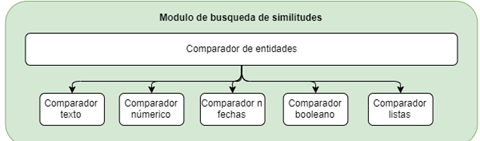

  * **Controladores (API REST):** El servicio permite interactuar con la librería de descubrimiento por medio de un API REST. esta permite:

    * Acciones de busqueda:

      * **Búsqueda de similitud entre todos los elementos de una clase:** Petición para realizar la comparación de todos los elementos de una clase para **buscar duplicados** (mismo backend) o elementos relacionados (**links**) en distintos backend insertados en los triple stores de los nodos.

      * **Búsqueda de similitud a partir de un objeto :** Calcula similitud entre el objeto pasado por parámetro y el resto de elementos de su misma clase. Esto, mediante la integración con la factoría de URIs, evita la creación de nuevos duplicados en los triple store

        * La factoría de URIs, recibe una petición para asignar una URI, por cada nuevo objeto que se quiere insertar, esta se comunica con la librería de descubrimiento para determinar si ese objeto ya existe en el triple store, dándose uno de estos casos:
        * No existe y por lo tanto se crea una nueva URI

        * Existe en el mismo nodo y se retorna la URI del objeto duplicado, y por lo tanto la acción a ejecutar será un UPDATE

        * Se detecta en otro nodo, y se realiza un INSERT y una operación de LINK, que vincula el objeto creado con el objeto similar, encontrado en otro nodo.

      * **Búsqueda de similitudes en la Nube LOD:** Orquesta las peticiones a el módulo LOD de la federación para obtener las instancias similares para un determinado nodo, triple store y clase. Las similitudes recibidas, se evalúan con el módulo de similitud, con el fin de garantizar el resultado, y se insertan en el triple store, y actualizan los enlaces (en ambas entidades). 

    * Acciones de control:

      * **Estatus:** Retorna el estado de la aplicación y los datos.

      * **Notificación de cambios en una instancia:** Este end point tiene como finalidad integrarse con el procesador de eventos, de forma que cuando se realice un cambio sobre un objeto en un Triple Store, ya sea una operación INSERT, UPDATE o DELETE, este tenga un método de comunicación con la librería de descubrimiento, que debe de:
        * Actualizar las estructuras de datos
        * Actualizar la cache

        * Actualizar la entidad almacenada en Elasticsearch

      * **Forzar actualización de cache:** Este endpoint fuerza a recargar las estructuras de datos, realizando las peticiones oportunas al triple store.
      * **Obtener el resultado de una acción de búsqueda asíncrona** Este endpoint permite obtener el resultado de una acción asíncrona ejecutada con anterioridad por medio del requestId.

* Pertenecientes a la arquitectura ASIO
  
  * Servicios no ASIO:
    * **Elasticsearch**: Motor de búsqueda por documentos indexados
    * **Redis:** Base de datos tipo clave y valor en memoria de alta velocidad.
    * **Kafka:** Cola de mensajes para suscripción y publicación en topics.
    * **Kibana** (opcional): Frontal para facilitar el visionado de los datos almacenados en Elasticsearch.
    * **MariaDB:** Base de datos relacional, para almacenamiento persistente.
  * Servicios ASIO:
    * **Federación:** Para obtener los datos desde los triple stores
    * **Factoría de URIs:** Para obtener la URI local del recurso
    * **Service Discovery:** Para descubrir los nodos de federación desplegados
    * **Event Manager:** Para orquestar la ejecución de las acciones necesarias sobre el triple store
    * **Triple Store Adapter:** Para ejecutar las acciones necesarias sobre el triple store

#### Acciones en la reconciliación de entidades

La librería de descubrimiento admite dos umbrales que determinaran las acciones a realizar tras el desabrimiento de similitudes:

* **Automático:** Determina el grado de similitud necesario, para desencadenar las acciones de forma automática sin la intervención de un usuario.
* **Manual:** Determina el grado de similitud necesaria para considerarla significativa, pero requerir la intervención de un usuario experto para determinar si la detección es correcta y por lo tanto ejecutar las acciones precisas o no.

Por otro lado por cualquiera de las dos vías, las similitudes entre entidades derivan en acciones. Estas acciones dependen del contexto de la búsqueda de similitud.

* Dentro de la solución ASIO:
  * Dentro del mismo nodo:
    * Para similitudes que derivan en inferencia de equivalencia, se considerara duplicado, por lo tanto la librería de descubrimiento orquestara las siguientes acciones en el **Event Manager**:
      * MERGE entre todas las entidades similares, conservando en cada atributo el contenido actual no nulo
      * UPDATE de la instancia mas actual en el triple store. 
      * DELETE del resto de instancias en el triple store. 
  * Entre nodos distintos:
    * añadir en todas las instancias, LINK hacia el resto de instancias, añadiendo la tripleta URL nodo local -> sameAs -> URL nodo remoto
* Con instancias externas a la solución ASIO (nube LOD):  
  * Insertar la instancia externa en el triple store asociado al nodo local, en un name graph distinto al de los datos ASIO.
  * Añadir tripletas del tipo closeMatch en la instancia local, y la instancia extraída de la nube LOD, de forma que se apunten entre ellas.

### Descubrimiento de enlaces

#### Objetivo en el proyecto ASIO

Este modulo, tiene dos módulos principales:

##### Descubrimiento de enlaces entre entidades de distintos Backend SGI

En este caso, los distintos Backend SGI, comparten ontología, y por lo tanto, las entidades disponibles entre distintos backend SGI, son comparables en los términos definidos por el módulo de [Reconciliación de entidades](#reconciliación-de-entidades), descrito en el punto anterior.

De esta forma tanto la algoritmia, como el diseño de la solución será exactamente el mismo, siendo necesaria únicamente a priori, la modificación del conector de datos ([**Data Fetcher**](#integración-del-proceso-dentro-de-la-arquitectura-general-de-la-aplicación)), que en este caso tiene que tener además de la capacidad de obtener datos de su propio Backend SGI,  la capacidad de obtener datos de todos aquellos backend SGI que estén definidos e incluso la de obtener instancias dentro del mismo Backend SGI, almacenadas en distintos Triple Stores. La labor de descubrimiento de los distintos Backend SGI, se centralizara un Service Discovery, de forma que este sea consciente de todos los posibles Backend SGI, que pudiesen estar disponibles.

Sera necesario programar con cierta periodicidad, la labor de descubrimiento de enlaces. 

En la primera iteración será necesario evaluar todas las entidades del nodo y sus instancias que pudiesen estar relacionadas con las mismas entidades de otros nodos. Esto indudablemente tendrá un coste computacional elevado en la primera iteración (que en ningún caso interferirá con cualquier otra actividad que pudiese realizar la plataforma). 

En cualquier caso se han introducido mecanismos de optimización de búsqueda, tales como cacheado de datos (Redis), evaluación perezosa (se aborta la evaluación cuando esta no puede llegar al umbral mínimo), evaluación en memoria, reducción de espacio de búsqueda (por medio de Elasticsearch) para garantizar que la operación a pesar de ser costosa, se realiza con la máxima optimización posible.

Sin embargo en sucesivas iteraciones se evaluaran solo las similitudes que pudiesen existir a partir de los deltas, es decir, las entidades que hubiesen sufrido algún tipo de cambio desde la ultima evaluación, lo que supondrá una optimización suficiente, para que de esta forma la labor pueda ser operativa en escenarios de elevado un crecimiento horizontal del numero de nodos, sin un coste computacional demasiado elevado (siempre dependiendo de la volumetría de cambios). La librería de descubrimiento almacena asimismo los metadatos necesarios para poder realizar esta función de la forma mas eficiente posible, mediante: uso de caches, metadatos de estado por nodo, triple store y tipo de entidad ....

Por otro lado el componente [**Merge event Processor**](#integración-del-proceso-dentro-de-la-arquitectura-general-de-la-aplicación), deberá en este caso de añadir las tripletas necesarias (en ambas instancias), para indicar el enlace entre instancias de distintos Backend SGI o dentro del mismo Backend SGI, almacenadas en distintos Triple Stores.

Asi mismo la propiedad que indicara una relación de equivalencia entre entidades de distintos nodos será la propiedad **owl:sameAs**, formándose asi tripletas (en ambas instancias) del tipo:

`URI_Instancia_X_nodo_A  owl:sameAs URI_Instancia_Y_nodo_B`

Donde el sujeto será siempre la instancia local, y el objeto la instancia alojada en otro nodo que referencia la misma instancia relacionada con la instancia local.

Estas tripletas de equivalencia serán de especial interés para la solución propuesta para la [federación de consultas](../00-Arquitectura/Federaci%C3%B3n/ASIO_Izertis_Federaci%C3%B3n.md), especialmente en lo relativo a la agregación de resultados, ya que permitirá al motor de agregación, no duplicar en la respuesta las instancias equivalentes retornadas por los distintos Backend SGI, y presentar en su lugar una única instancia, con todas las relaciones con otras instancias equivalentes distribuidas en otros Backend SGI. Por otra parte, dado que la relación de similitud, estará siempre pre-calculada, esto no deberá de suponer un sobrecoste al proceso de agregación. 

##### Descubrimiento de enlaces entre entidades en la nube LOD

En este caso es necesario trabajar sobre el conjunto de datasets disponibles en la nube LOD, que puedan ser relevantes  para el proyecto, por lo tanto, el primer paso, previo a la implementación, es la identificación de dichos datasets.

Los dataset seleccionados e implementados son los siguientes:

###### SCOPUS 

**Descripción:** Scopus es la mayor base de datos de resúmenes y citas de literatura revisada por pares: revistas científicas, libros y actas de congresos. Al ofrecer una descripción general completa de la producción de investigación mundial en los campos de la ciencia, la tecnología, la medicina, las ciencias sociales y las artes y las humanidades, Scopus presenta herramientas inteligentes para rastrear, analizar y visualizar la investigación.

**Extracción de información:** SCOPUS a priori contiene información de Publicaciones, Investigadores y Universidades o entidades. Se accede a la información por medio de su API. Bajo los términos de la licencia actual, solo se puede obtener información de las publicaciones. Las instancias de las entidades Article, Document, Book, BookChapter, BookSection, DoctoralThesis y MasterThesis presentes en nuestra ontología, son en principio asociables a la entidad publicaciones de SCOPUS. Estas entidades se pueden enlazar con las entidades de scopus bien por el atributo DOI o bien por el titulo del documento.

**Próximos pasos:** Si se consigue un API KEY con una licencia mayor, seria posible enlazar también otras entidades de nuestra ontología como University o Researcher.

###### CROSSREF

**Descripción:** Crossref hace que los resultados de la investigación sean fáciles de encontrar, citar, vincular, evaluar y reutilizar. Es una organización sin fines de lucro que existe para mejorar las comunicaciones académicas. 

**Extracción de información:** CROSSREF a priori contiene información de Publicaciones. Se accede a la información por medio de su API. Las instancias de las entidades Article, Document, Book, BookChapter, BookSection, DoctoralThesis y MasterThesis presentes en nuestra ontología, son en principio asociables a la entidad publicaciones de CROSSREF. Estas entidades se pueden enlazar con las entidades de CROSREFF bien por el atributo DOI o bien por el titulo del documento.

**Próximos pasos:** Evaluar la posibilidad de incluir mas entidades de nuestra ontología.

###### WIKIDATA

**Descripción:** Wikidata es una base de conocimiento abierta y gratuita que tanto humanos como máquinas pueden leer y editar.
Wikidata actúa como almacenamiento central para los datos estructurados de sus proyectos hermanos de Wikimedia, incluidos Wikipedia, Wikivoyage, Wiktionary, Wikisource y otros.

¡Wikidata también brinda soporte a muchos otros sitios y servicios más allá de los proyectos de Wikimedia! El contenido de Wikidata está disponible con una licencia gratuita, se exporta utilizando formatos estándar y se puede vincular a otros conjuntos de datos abiertos en la web de datos vinculados.

**Extracción de información:** Wikidata a priori contiene información de todo tipo de entidades. Se accede a la información por medio de su endpoint SPARQL. Por el momento solo obtenemos información de clases derivadas de persona, que tienen el atributo ORCID no nulo.

**Próximos pasos:** Evaluar la posibilidad de incluir mas entidades de nuestra ontología.

###### ORCID

**Descripción:** ORCID  es una organización sin fines de lucro que ayuda a crear un mundo en el que todos los que participan en investigación, becas e innovación están identificados y conectados de manera única con sus contribuciones y afiliaciones, a través de disciplinas, fronteras y tiempo.

**Extracción de información:** ORCID a priori contiene información de Investigadores y nos permite extraer dicha información y la información relativa a sus publicaciones por su API, bien haciendo búsquedas por el nombre de el investigador, bien mediante su codigo ORCID.

**Próximos pasos:** A priori no ofrece mas información útil.

###### DOAJ

**Descripción:** El DOAJ (Directorio de revistas de acceso abierto) se lanzó en 2003 con 300 revistas de acceso abierto. En la actualidad, esta base de datos independiente contiene más de 15 000 revistas de acceso abierto revisadas por pares que cubren todas las áreas de ciencia, tecnología, medicina, ciencias sociales, artes y humanidades. Las revistas de acceso abierto de todos los países y en todos los idiomas pueden solicitar su inclusión.

**Extracción de información:** DOAJ a priori contiene información de publicaciones. Se accede a la información por medio de su API. Las instancias de las entidades Article, Document, Book, BookChapter, BookSection, DoctoralThesis y MasterThesis presentes en nuestra ontología, son en principio asociables a la entidad publicaciones de DOAJ. Estas entidades se pueden enlazar con las entidades de DOAJ bien por el atributo DOI o bien por el titulo del documento

**Próximos pasos:** A priori no ofrece mas información útil.

###### PUBMED

**Descripción:** PubMed® comprende más de 30 millones de citas de literatura biomédica de MEDLINE, revistas de ciencias biológicas y libros en línea.

**Extracción de información:** PubMed a priori contiene información de publicaciones en el ámbito de la medicina. Se accede a la información por medio de su API. Las instancias de las entidades Article, Document, Book, BookChapter, BookSection, DoctoralThesis y MasterThesis presentes en nuestra ontología, son en principio asociables a la entidad publicaciones de DOAJ. Estas entidades se pueden enlazar con las entidades de PubMed bien por el atributo DOI o bien por el titulo del documento

**Próximos pasos:** A priori no ofrece mas información útil.

###### DBLP Computer Science Bibliography

**Descripción:** La bibliografía de informática de dblp es la referencia en línea de información bibliográfica sobre las principales publicaciones de informática. Ha evolucionado desde un pequeño servidor web experimental hasta un popular servicio de datos abiertos para toda la comunidad informática.

**Extracción de información:** DBLP a priori contiene información de publicaciones en el ámbito de la informática. Se accede a la información por medio de su API. Las instancias derivadas de Persona presentes en nuestra ontología, son en principio asociables a los investigadores de DBLP. El resultado será información del investigador y de sus publicaciones.

**Próximos pasos:** A priori no ofrece mas información útil.

Se han creado conectores para todos ellos en el servicio de Federación, ya que es, como se explico anteriormente, el componente encargado de gestionar la captura de información para la librería de descubrimiento.

Para separar convenientemente los repositorios que interactúan con las fuentes de datos. Estos se encapsulan en el modulo **federation-service**, dentro del paquete **repository**. En este modulo están todos los conectores para los distintos datasets configurados de la nube LOD.

###### Conectores y configuración

Cada conector esta asociado a la parte de la configuración que lo define dentro del fichero **application.yml**, dentro de la sección **lod-data-sources (datasets)**.

Este fichero determina el comportamiento de el conector, tanto en la fase de captura de información desde la fuente de datos, como en la fase de transformación de la información recuperada y la creación de la respuesta. 

Hasta ahora, están implementados todos los conectores descritos anteriormente, siendo posible en el futuro, añadir aquellos que sean necesarios.

En cuanto al fichero de configuración que determina el comportamiento de los conectores esta estructurado de la siguiente forma:

**LodDataSources**

Esta clase modela la entidad raíz de todos los datasources definidos

* **Atributos**
  * **datasets:** Lista de Objetos de tipo [Dataset](#Dataset) definidos en la configuración.

**Dataset**

Esta clase modela un dataset concreto (SCOPUS, WIKIDATA ....).

* **Atributos**
  * **name:** Nombre del dataset.

  * **conections:** Lista de Objetos de tipo [Connection](#Connection) definidos en la configuración.

**Connection**

Esta clase modela un canal por el cual se puede acceder a la información contenida en el dataset. Por ejemplo un canal podría ser una conexión API y otro canal podría ser un Endpoint SPARQL. Es posible configurar varios canales, y por lo tanto se debe de definir prioridad entre ellos

* **Atributos**
  * **connectionType:** Enumerado. Tipo de conexión [API,SPARQL] para conectar por medio de API o de endpoint SPARQL. Los conectores de cada dataset, implementaran cada uno de ellos, si procede.

  * **def:** Booleano. Este atributo determina si el tipo de conexión definido por el atributo connectionType es la conexión por defecto, es decir la primera de la lista de conexiones que se debe de usar para obtener los datos. El resto de conexiones definidas, solo se usaran cuando la conexión por defecto, falle o no obtenga ningún resultado.
  * **baseURL:** String. Este atributo establece la cadena de conexión a el API o el Endpoint SPARQL definido para la conexión.
  * **apiKey:** String. API Key o token del API o del endpoint SPARQL para obtener los datos.
  * **mappings:** Lista de Objetos de tipo [Mapping](#Mapping) definidos en la configuración.

**Mapping**

Esta clase modela los atributos necesarios para definir el comportamiento de un conector en su interacción cualquier API o endpoint SPARQL, para un obtener datos de un dataset remoto.

* **Atributos**
  * **remoteName:** String. Nombre del objeto remoto del que obtendremos información. Tambien sirve para alimentar los metadatos de información en la respuesta que generemos.

  * **remoteAttribute:** String. Nombre del atributo remoto por el cual realizaremos la búsqueda a través del API o endpoint SPARQL que enlazaremos con los atributos de el [LocalClass](#LocalClass) que será explicado más adelante.
  * **suffixURL:** String. Sufijo de la URL que final que se formara por la unión de baseURL +  suffixURL para atacar al API o el Endpoint SPARQL definido para la conexión.
  * **identifier:** Boolean. Si es True, indica que el atributo a enlazar definido en [LocalClass](#LocalClass) es un identificador, y por lo tanto la búsqueda en el dataset, tiene que ser por la coincidencia exacta de dicho atributo. En caso contrario, no será considerado un identificador y por lo tanto la búsqueda, puede realizarse por semejanza.
  * **order:** Integer. Determina el orden por el que se ejecutaran los distintos [Mappings](#Mapping) que pudiese haber para un mismo [Connection](#Connection).
  * **paramType**: Enumerado [URI,QUERY,SPARQL]. Determina si el atributo del objeto remoto definido por su remoteName, debe de atacarse por la construcción de una petición donde el remoteAttribute sea usado como un URL parameter, un query parameter o como parte de una query SPARQL.
  * **localClasses:** Lista de Objetos de tipo [LocalClass](#LocalClass) definidos en la configuración.

**LocalClass**

Esta clase modela los atributos necesarios para definir la relación de un objeto [Mapping](#Mapping), con la/s clase/s locales para el proyecto ASIO y definidas por la ontología.

* **Atributos**
  * **name:** String. Nombre local de la clase dentro de el proyecto ASIO y definida por la ontología.

  * **attributes:** Lista de String. Nombre de los atributos de la clase local, que están relacionados con los atributos (remoteAttribute) de la clase remota (remoteName) definida en el objeto [Mapping](#Mapping) padre. 
  * **mappers:** Lista de Objetos de tipo [Mapper](#Mapper) definidos en la configuración.

**Mapper**

Esta clase modela el mapeado entre los atributos que retornara la búsqueda de similitud entre el objeto remoto y el objeto local.

* **Atributos**
  * **remoteAttribute:** String. Nombre del atributo remoto que se mapeara con el atributo local.

  * **localAttribute:** String. Nombre del atributo local que se mapeara con el atributo remoto.

Para ello es necesario tener en cuenta las siguientes consideraciones:

* Sera necesario crear conectores para todos los datasets enumerados, que obtengan información de cada uno de los datasets externos enumerados, y lo conviertan en el modelo de datos genérico, usado por la librería de descubrimiento.
* Sera necesario admitir y procesar ficheros de configuración, donde se pueda mapear el modelo de datos propio de cada dataset, con el modelo de datos genérico, donde debe de estar descrito al menos:
  * Entidad relacionada del Backend SGI
  * Entidad relacionada con el dataset externo
  * Meta-información relativa al método de obtención de datos desde el dataset externo para cada entidad, y modo de extracción. 
  * Propiedades a mapear que relacionen propiedades del Backend SGI con Dataset externo.
* Para este caso concreto, y en base al mapeo descrito en el punto anterior y a la estadística generada por la librería de descubrimiento sobre las propiedades asociadas a una determinada entidad, se creara el sub conjunto de propiedades coincidentes de modo que puedan ser comparadas, y se generaran nuevas estadísticas para usar en la comparación en función de dichas propiedades. 
* Una vez que los datos externos, siguen el modelo de datos genérico, usado por la librería de descubrimiento y generadas las estadísticas, se aplicara la [Reconciliación de entidades](#reconciliación-de-entidades), descrita en el punto anterior, usando las estadísticas especificas de la unión de ambos modelos.

