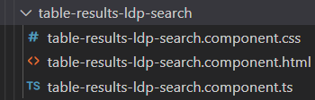

| Entregable     | **LDP - Templates**                              |
| -------------- | ------------------------------------------------------------ |
| Fecha          | 03/08/2021                                                   |
| Proyecto       | [ASIO](https://www.um.es/web/hercules/proyectos/asio) (Arquitectura Semántica e Infraestructura Ontológica) en el marco de la iniciativa [Hércules](https://www.um.es/web/hercules/) para la Semántica de Datos de Investigación de Universidades que forma parte de [CRUE-TIC](https://www.crue.org/proyecto/hercules/) |
| Módulo         | Servicio e publicación web                              |
| Tipo           | Software                                                     |
| Objetivo       | Manual modificación templates módulo LDP   |
| Estado         | **100%**  |
| Próximos pasos |       |

# ASIO - Visualización de Entidades del Grafo

El módulo para la visualización de las entidades del grafo se haya integrado en el proyecto [ib-web-publication-service](https://github.com/HerculesCRUE/ib-web-publication-service), a continuación se describirán sus distintos componentes y como se puede modificar su apariencia.

A modo general de cara a la modificación de los estilos de los distintos componentes se recomienda la creación de nuevas clases css, y su inclusión en el fichero `app.css` para despues ser asignadas a los componentes a modificar. De esta forma se podrá garantizar que no se está modificando un estilo empleado en otra parte de la aplicación.

Actualmente y de cara a garantizar la uniformidad en el diseño de todo el portal se utilizan clases comunes.

## Componentes del Módulo

### Home

Este componente es el que se enlaza desde el portal y contiene a los demás. En dicha home se define el título de la página mediante la etiqueta `ldp.header` actualmente se está mostrando `Entidades del grafo ASIO-SGI`.

Podría modificarse tanto su contenido cambiando en los ficheros de internacionalización `assets\i18n\` el valor de dicha etiqueta.

Se podría modificar igualmente los estilos de la misma mediante el ajuste de la clase css `legend` o la creación de una nueva clase. Es importante tener en cuenta que si se modifica dicha clase podrían verse afectadas otras páginas. 

### Página con información sobre entidades

Al entrar en la visualización de las entidades del grafo, lo primero que se visualiza es la información de número de registros por tipo de entidad.

El template para dicha visualización es `all-ldp.component.html` en él se definen los distintos literales visualizados (Ej: cuando no hay datos `form.no-result`), así como la propia información a mostrar.

Dicha información actualmente está estructurada en una tabla, dicha tabla está definida en el componente `table-results-ldp-count`

Mediante la modificación del fichero `table-results-ldp-count.component.css` podrá modificarse la apariencia de dicha tabla. 

El contenido de la misma, información mostrada, literales....  podrá cambiarse a través de la edición del fichero `table-results-ldp-count.component.html` hay que tener en cuenta que logicamente la información a mostrar estará limitada por la información recibida.

### Componente de Búsqueda

El componente de búsqueda, campo de texto y botón, se hayan definidos en `search-ldp-component.html` a través de la edición de dicho template se podrán realizar cambios en dicho componente.

Para la modificación de los estilos relativos tanto al campo de texo como al botón de buscar será necesario modificar o añadir estilos nuevos al fichero `app.css` y asociarlos a dichos componentes, mediante la inclusión de dichas clases en el campo `class`.

### Visualización de Resultados de Búsqueda

Los resulados de las búsquedas realizadas a través del componente de búsqueda serán visualizados mediante el template `search-ldp-result.component.html`. En dicho templete se muestra la información sobre si se ha encontrado o no resultados, y la lista de los mismos en caso de que así fuese.

Dichos resultados se muestran de una forma similar al conteo de entidades, mediante un componente de tabla, en este caso `table-results-ldp-search` 

La modificación tanto de la información mostrada como de sus estilos se realizará de forma análoga a la descrita para la tabla contadores. A través de la modificación bien de su css asociada o del propio template html.

### Detalle de una Entidad

El detalle de una entidad será gestionado por el template `details-ldp.component.html`

En dicho template está añadido el componente de búsqueda con el fin de poder acceder a ella y realizar una nueva búsqueda  `<app-search-ldp></app-search-ldp>`.

El template del detalle se divide en dos bloques principalmente:

* Detalle de la entidad propiamente dicho.
* Listado de entidades relacionadas.

#### Detalle 

En dicho detalle se pinta a modo de clave-valor en una tabla la lista de propiedades de una entidad. En el caso de las propiedades que contengan una url a otra entidad serán "pintados" con una url que dará acceso al detalle de la misma.

Si se desea modificar la apariencia de dicha tabla bastará con crear/modificar los estilos deseados en el fichero `app.css` y asociarlos a los componentes a modificar en el template. De esta forma se podría modificar el tipo de fuente, color, o tamaño de los elementos visualizados

#### Relaciones

De una forma análoga a la descrita en el punto anterior podrán modificarse los estilos del listado de entidades relacionadas con la entidad.