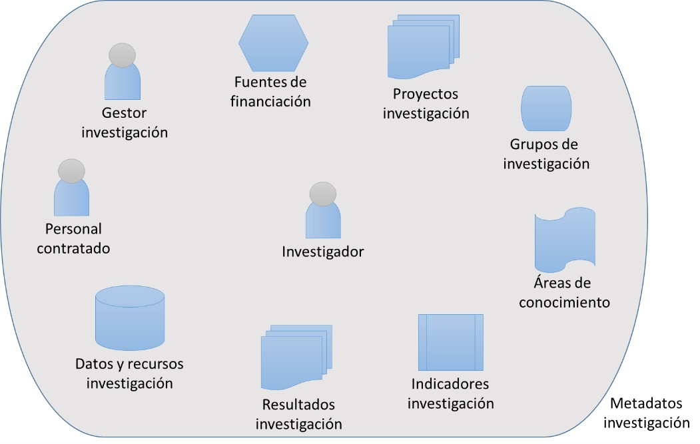

# Análisis ASIO

[Introducción](#introduccion)

   [Alcance](#alcance)

   [Objetivos](#objetivos)

[Skateholders](#skateholders)

[Casos de uso](./Casos de uso.md)

[Requisitos](./Requisitos no funcionales.md)

   [Requisitos no funcionales](./Requisitos no funcionales.md)

   [Requisitos funcionales](./Requisitos funcionales.md)

[Diseño de pantallas](./Diseño de pantallas.md)

[Términos de ASIO](./Términos.md)

## Introducción {#introduccion}

El presente documento corresponde al Análisis de Requisitos para la Red de Ontologías Hércules (ROH) de acuerdo al pliego de condiciones del proyecto: Servicio de I+D consistente en el desarrollo de soluciones innovadoras para la Universidad de Murcia en relación al reto de Arquitectura semántica e Infraestructura ontológica.  

En dicho pliego se indica: "El adjudicatario hará un análisis sobre el dominio GI, extrayendo los requisitos para crear la ROH. Estos requisitos se reflejarán en el documento Análisis de Requisitos. Este análisis será lo más exhaustivo posible, intentando capturar el dominio con la granularidad adecuada, ya que sentará la base de los demás desarrollos." 

El documento seguirá la estructura de documentación Arc421 para arquitecturas del software, dado que permite cubrir las principales necesidades de este tipo de proyectos. Dado que en este caso, se trata de los requisitos de la infraestructura ontológica, se ha suprimido el apartado "Vista de ejecución" que suele ser habitual cuando se desarrolla software que va a ejecutarse. De la misma forma, el apartado "Vista de despliegue" se ha renombrado como "Vista de implementación y despliegue" para tratar los aspectos de desarrollo de la infraestructura ontológica. 

### Alcance {#alcance}

Tal y como se indica en el pliego de condiciones, la Red de Ontologías Hércules captura el dominio de Gestión de la Investigación por lo que las ontologías definirán fundamentalmente los aspectos relevantes en este ámbito. En el apartado "Resumen" del pliego de condiciones se enumeran los principales aspectos que deberán ser modelados:

\-   Investigadores y producción científica individual: identidad del investigador, publicaciones, participación en proyectos de investigación, docencia, estancias en centros de investigación, y redes sociales de investigadores, entre otros.

\-   Proyectos de investigación: entidad financiadora, presupuesto, y participantes, entre otros.

\-   Financiación: fuentes (gobiernos, ministerios, entidades supranacionales, etc.), convocatorias, y proyectos, entre otros.

\-   Modalidades de ingresos y gastos en proyectos de investigación.

\-   Recursos humanos: contratos, candidatos, y financiación de investigadores, entre otros.

\-   Resultados científicos: artículos científicos y ponencias en congresos, software, patentes, y artículos de divulgación científica, entre otros.

\-   Áreas de conocimiento.

\-   Grupos de investigación e instituciones.

\-   Indicadores de investigación: métricas de producción científica, y recursos humanos, entre otros.

\-   Metadatos sobre la Gestión de Investigación

En la figura *Ilustración 1 - Principales elementos del dominio GI* se representa un diagrama de los principales elementos identificados en el dominio. Se representa al investigador como elemento central del dominio, a partir del cual se relacionan el resto de elementos. De esta forma, son los investigadores los que perteneces grupos de investigación, genera resultados científicos, participan en proyectos de investigación, producen resultados científicos, etc. 

                               

Ilustración 1 - Principales elementos del dominio GI

### Objetivos {#objetivos}

A continuación, se indican los principales **objetivos de calidad** que se consideran respecto a la red de ontologías. Este apartado contiene los atributos más importantes que se han considerado. El resto de atributos se desglosarán en el árbol de calidad de la sección 8.:

\-   Interoperabilidad

\-   Reusabilidad

\-   Multilingüismo

## Skateholders {#skateholders}

| Rol                                           | Expectativas                                                 |
| --------------------------------------------- | ------------------------------------------------------------ |
| Gestor  investigación – Universidad de Murcia | Disponer  de una mejor documentación del sistema universitario |
| Investigador  – Universidad de Murcia         | Conocer  flujos de trabajo de investigación ya establecidos. Poder identificar  conceptos comunes o relacionados en el ámbito de la investigación |
| Experto de  dominio                           | Disponer  de una herramienta fácil para representar su conocimiento en el dominio que  evite la pérdida semántica |
| Desarrolladores                               | Disponer  de un conjunto de ontologías que puedan adaptarse fácilmente al código de la  aplicación de gestión de la investigación |
| Investigador  – otra Universidad              | Conocer y  poder comparar las idiosincrasias del sistema de gestión de investigación de  la Universidad de Murcia para poder compararlo con el suyo y poder mapear  ambos sistemas en caso de que disponga de otra infraestructura ontológica. |

