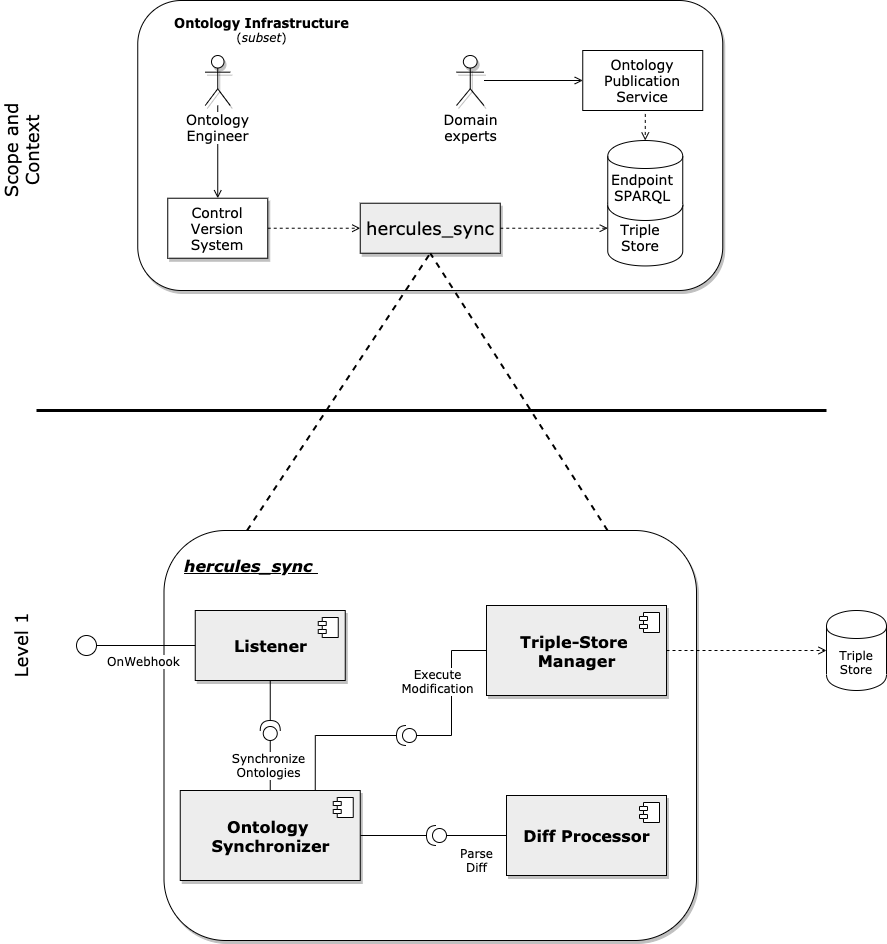
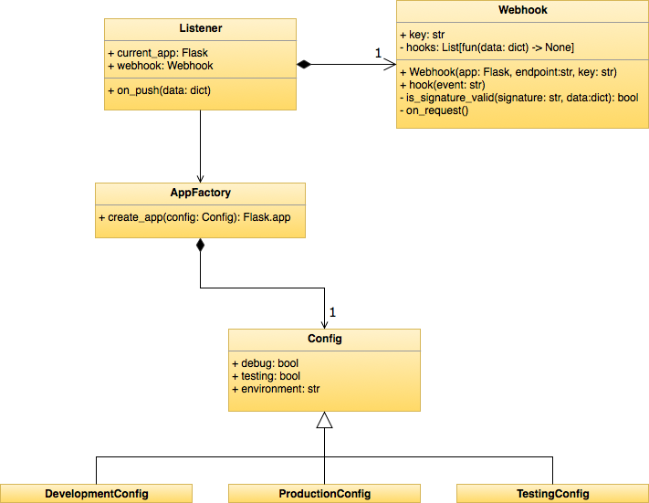
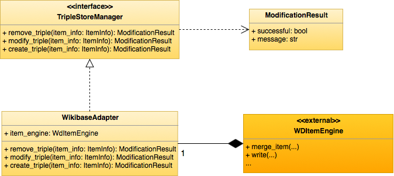
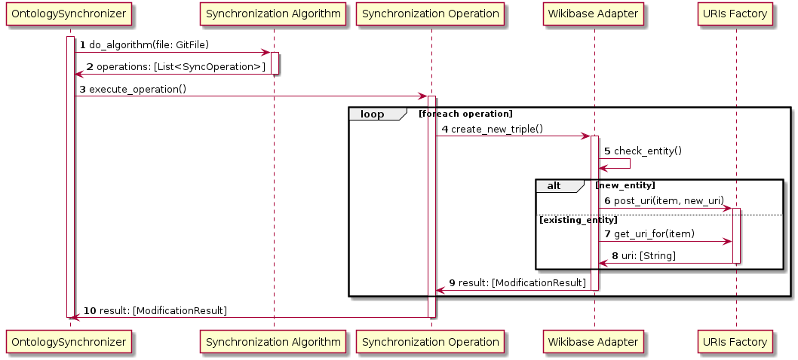
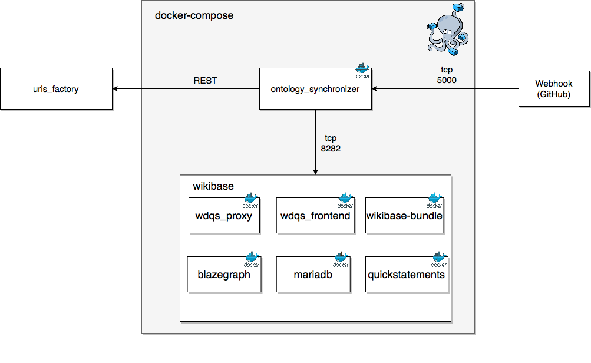
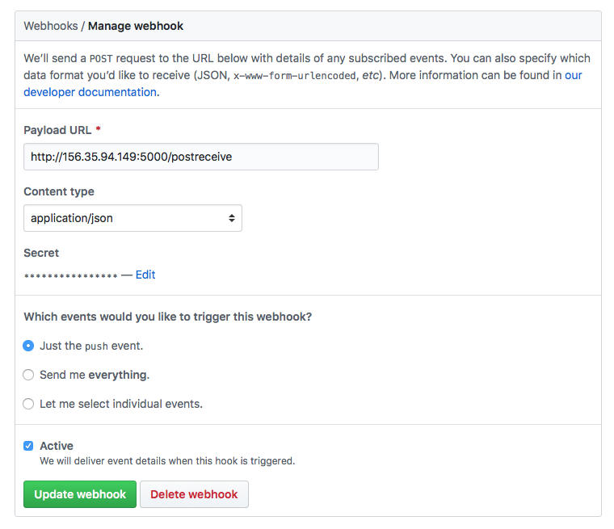

| Entregable     | Sistema de sincronización Hércules                           |
| -------------- | ------------------------------------------------------------ |
| Fecha          | 25/05/2020                                                   |
| Proyecto       | [ASIO](https://www.um.es/web/hercules/proyectos/asio) (Arquitectura Semántica e Infraestructura Ontológica) en el marco de la iniciativa [Hércules](https://www.um.es/web/hercules/) para la Semántica de Datos de Investigación de Universidades que forma parte de [CRUE-TIC](http://www.crue.org/SitePages/ProyectoHercules.aspx) |
| Módulo         | Infraestructura Ontológica                                   |
| Tipo           | Método y Software                                        |
| Objetivo       | Este documento consiste en la especificación del sistema de sincronización automática de ontologías con un triplestore. |
| Estado         | **100%** El sistema se encuentra ya en funcionamiento y deplegado. Actualmente se está trabajando en mejoras del módulo que se encuentran definidas y detalladas a lo largo del documento. Estas mejoras formarán parte del hito 2. |
| Próximos pasos | Implementación de la sincronización desde el triplestore a los ficheros de la ontología. Solución a los problemas definidos en el capítulo de Riesgos y Deuda Técnica. |

# Hercules synchronization module architecture

> __Note: Web Version__ <br>
> This document is accesible through a web interface through the following URL: http://www.weso.es/hercules-sync/. Additional information, such as the documentation generated from the source code, can also be accessed there.

## Introduction and Goals
This document includes the architectural documentation for the synchronization module - from now on called _hercules\_sync_ - between ontology files and a triple-store, whis is a part of the ontological infrastructure of Project Hércules.

The structure of this document follows the [arc42](https://arc42.org/) template for documentation of software and systems architectures.

### Requirements Overview
The overall goal of _hercules\_sync_ is to synchronize ontologies content between files hosted in a version control system and a triplestore where the content is stored.

A more complete analysis of the system's requirements can be found in the __Requirements analysis__ section.

### Quality Goals
In this section we will enumerate the top quality goals for the system's architecture:

| Priority | Goal | Scenario |
| ---- | ----------- | -------- |
| 1 | Consistency | Changes to the ontology should be completely reflected in the triplstore. Both the triple store and the ontology should have the same information. |
| 1 | Flexibility | Although the initial implementation of the system will work through the BlazeGraph triple store of Wikibase, the triple store where the changes will be propagated to should be easily extended.  |
| 1 | Fault Tolerance | In case that one of the components that surround the synchronization system fails, the system must be able to continue working and keep the other quality goals whenever possible. |

### Stakeholders

| Role/Name   | Description                   | Expectations              |
| ----------- | ------------------------- | ------------------------- |
| Domain Experts | User that modifies the content of the ontology through the user interface provided by the ontology publication service. | When a change is made through the user interface, the content of the ontologies in the version control system should be consistent with these changes. |
| Ontology Engineer | User that modifies the content of the ontology directly from the version control system. | Once a ontology file is modified, the changes should be reflected in the triplestore. |

## Architecture Constraints

| Contraint | Description                            |
|:---------:|----------------------------------------|
|     C1    | The system must be developed under the [GNU General Public License v3.0](https://www.gnu.org/licenses/gpl-3.0.html). |
|     C2    | The system must be platform-independent and should run on the major operating systems (Windows™, Linux, and Mac-OS™). |
|     C3    | The system must be runnable from the command line. |
|     C4    | The control versions system used to store the ontologies will be git based. |

## System Scope and Context
Domain experts have the domain knowledge necessary to contribute to some of the domain-specific ontologies that they are used to work in. However, not all of them have the necessary expertise in the technologies surrounding the RDF ecosystem (OWL, SPARQL, the different syntaxes...).

Wikibase is the powerful, flexible and customizable knowledge base software that drives Wikidata. With MediaWiki as its front end and a rich JavaScript interface for data management, Wikibase makes collaboration easy for humans and machines alike, and its data model prioritizes language independence and knowledge diversity.

Wikibase's robust data export options include JSON, RDF/XML, N3, YAML and more — and it provides a powerful query interface using SPARQL for both local and federated queries (with updates on changes), extending the potential data available from a single node to thousands.

With Wikibase we can bridge the gap between Ontology engineers who work directly on the ontology files, and other domain experts that can contribute directly to the ontology through the Wikibase interface but don't have the necessary knowledge to modify the files directly.

However, we still need to reflect the changes that occur in the wikibase or ontology to their counterpart. This is when the need to create a system that can propagate changes of an ontology to a triple store appears.

This system need not be just fixed to work with Wikibase (and its triplestore, Blazegraph). The idea is to provide a system that could work with different triplestores where the ontology would be synchronized.

## Solution Strategy
The solution to the problem stated above is the creation of a REST API which will be in charge of propagating these changes. There are two possible types of propagations that can occur:
* A change happens to the ontology files. This change must be propagated to the triple store where the ontology is stored.
* A change occurs in the triple store. This change must be propagated to the ontology files through the version control system.

Once a new release is created in the version control system, a REST endpoint provided by hercules\_sync will be automatically called through the use of [GitHub webhooks](https://developer.github.com/webhooks/). In this request the diff will be sent and propagated to the underlying triple store.

## Building Block View
The building block view shows the static decomposition of the system into building blocks (modules, components, subsystems, classes, interfaces, packages, libraries, frameworks, layers, partitions, tiers, functions, macros, operations, datas structures, ...) as well as their dependencies (relationships, associations, ...).

The following diagram shows the static decomposition of the system into building blocks:



We will now briefly describe the main elements that compose this view.

### Whitebox hercules_sync

#### Contained Blackboxes
The following components and interfaces have been detected:
* listener: This component is the entrypoint of the subsystem that other external systems will use. To do so, it offers an external interface - named OnWebhook - which is in charge of receiving the data about the ontology updates from the version control system.
* ontology\_synchronizer: This component performs the synchronization of the received changes, creating new operations to perform on the triple store to propagate these changes. It offers an interface named _SynchronizeOntologies_, which is used by the listener component to synchronize the received changes.
* diff\_parser: The _diff\_parser_ component is in charge of processing the usual diff information about each file used in git-based version control systems. It offers a _ParseDiff_ interface, which is used by the _ontology\_synchronizer_ component to obtain detailed information about the changes made in the ontology files.
* triplestore\_manager: Lastly, the _triplestore\_manager_ component is in charge of executing the operations received from the _ontology\_synchronizer_ component to the chosen triple-store. It provides the _ExecuteModification_ interface to accomplish this.

### Level 2
In this level we will detail each one of the previous building blocks of the system identified in level 1.

> __Python singularities__. <br>
> Since Python is a dynamically typed language that lacks some of the constructs of other programming languages, such as Interfaces, we will be making the following distinctions in the UML diagrams:
> * Python modules which are just composed of functions, and do not have any classes inside, will be treated as static classes in the UML diagrams.
> * Since access modifiers don't exist in Python, we used the convention that underscored fields and funtions are considered private. These items will be shown as private in the UML diagrams.
> * Since there are no interfaces in Python, we will represent as an interface abstract classes that do not have any field or implemented method.
> * Multiple inheritance is possible in Python, so there could be cases in the UML diagrams where a class extends multiple classes.
>
> Also, it’s important to note that Python relies in duck typing rather than in implementation of interfaces. However, we still opted to create ”pseudo-interfaces” (abstract classes with no fields or implemented methods) and extend them by other classes. This was done in order to specify explicitly that a class followed a given interface, rather than implicitly by checking at the methods that it provides internally.

#### Listener
* Listener: The listener class initializes a flask server through the AppFactory, and establishes the entrypoint where information about the ontologies' updates will be received.
* Webhook: This class manages the communication with the control version system through Webhooks (for more information about webhooks, see https://developer.github.com/webhooks/) in a safe manner with the use of RSA keys.
* AppFactory: Factory class that creates the Flask application given a specific server configuration.
* Config: Configuration class to be used by the server.




#### Diff Processor
* PushEventHandler: Main class used by the listener to process all the received information about incoming changes from the ontologies.
* PushInfo: Information about the data received from the control version system.
* GitDiffParser: This class is in charge of parsing the diff about each file changed and return the lines that were modified in each file.
* GitDataLoader: The GitDataLoader class will download the content of each file before and after the modifications were done.
* GitFile: Wrapper which stores the content of a modified file before and after the modification, as well as other metadata about the file.


#### Ontology Synchronizer
* OntologySynchronizer: This class receives the synchronization algorithm to be used and returns a list of operations to perform on the triple-store to reflect the current modifications from the ontology files.
* SyncAlgorithm: Interface to be implemented by each one of the synchronization algorithms. These algorithms receive the modified lines from each file and return the list of operations to be made.
* NaiveSync: Simple synchronization algorithms that overwrites the content of the triple-store to be consistent with the current state of the ontology files.
* RDFSync: [RDFSync](https://link.springer.com/content/pdf/10.1007%2F978-3-540-76298-0_39.pdf) algorithm for the synchronization of RDF files.
* SyncOperation: Abstract class that represents the operation to be made in the triple-store.


#### Triple-Store Manager
* TripleStoreManager: Interface to be implemented by each one of the adapters that will connect to a specific triple-store.
* WikibaseAdapter: Adapter that connects to a BlazeGraph triple-store configured in a wikibase instance.
* ModificationResult: Class which encapsulates the result of a modification performed on a triple-store.



## Runtime View
In this section we will show an example runtime view of the system, where a new triple will be added to the underlying triple store.

### Create a new triple to the triple store
The following diagram illustrates the sequence of events that occur when adding a new triple to the underlying triple store. This sequence diagram begins after the diff has already been processed and a creation operation is executed by the _Ontology\_Synchronizer_ component:


## Deployment View
The following image describes the deployment view of the system. The following elements have been identified:
* Webhook (GitHub): This corresponds to the webhook system that is automatically managed by GitHub. This system runs on an external machine and will call the synchronization system through the 5000/tcp port.
* ontology\_synchronizer: This system will be deployed in a production machine using a docker container, it will receive requests from the webhook with the changes from the ontology files. It will also communicate with wikibase to propagate the modifications from the ontology and with an external system, the URIS factory, to store and retrieve the Wikibase URIs of the entities that will be updated.
* wikibase: This component includes all of the containers available in the [wikibase-docker](https://github.com/wmde/wikibase-docker) repository which form part of a Wikibase instance.
* uris\_factory: External system that is in charge of managing the URIs associated to each element of the ontology.


## Technical and Cross-cutting Concepts
In this section we will specify some of the technical constraints of the project.

### Technologies used
The following technologies have been used in the development of the system.

#### Python
The main programming language used for the module implementation is [Python](https://www.python.org). Python is a interpreted, high level and general purpose language designed by Guido van Rossum in 1991. It is characterized by its legible syntax and dynamic typing.

Python was chosen for the implementation of this module since it provides a wide ecosystem of libraries that allow working with ontologies and triple stores compared to other languages.

This module will have compatibility with Python 3. Since January 1st of 2020 the end of cycle of Python 2 was announced, and Python 3 is the current maintained version.

#### Flask
[Flask](https://palletsprojects.com/p/flask/) is a web microframework based on the [WSGI](https://wsgi.readthedocs.io/en/latest/) standard which focuses on flexibility and efficiency.

Flask will be used in _hercules\_sync_ to launch a web server that will listen to ontology updates coming from the control version system.

#### WikidataIntegrator
[WikidataIntegrator](https://github.com/SuLab/WikidataIntegrator) is a library that allows the creation and querying of entity data on a wikibase instance through the [MediaWiki API](https://www.mediawiki.org/wiki/API:Main_page).

This library is used to propagate the modifications made in the ontologies to the Wikibase instance and its underlying triple-store.

#### Pytest
Pytest is a framework that facilitates the implementation of tests in Python. It can be used to write simple tests, but also to write functional tests which are more complex. The testing libraries which come integrated in the own language, such as unittest and doctest, can be easily integrated with pytest.

#### Travis
Travis is a continuous integration service that can be used to monitor and test projects hosted in GitHub.

#### Codacy
Codacy is a static code analysis tool that allows the monitoring of quality in projects, and supports multiple programming languages. It returns several code quality metrics, regarding security, compatibility, performance and code style aspects.

### Continuous integration
In the module repository we follow continuous integration practices in order to fulfill some of the non-functional requirements that need to be met. Before a new version of the module is pushed to the repository, a Travis build is launched where all the tests are executed. In order to be able to upload new changes to the master branch all tests need to pass, and both code coverage and quality returned by Codecov and Codacy must not drop below a given threshold.

### Style guides
The main coding standard that was followed was the [PEP 8](https://www.python.org/dev/peps/pep-0008/) Python style guide. This standard specifies how code written in Python should be formatted (number of characters per line, import formats...) and is widely adopted in the community.

In order to document the code there are also several formatting styles that can be used. In our case, we opted to use the [numpy docstring style](https://numpydoc.readthedocs.io/en/latest/format.html) due to the readability it provides when compared to other alternatives.

### Other dependencies
Additional dependencies of the project are stored in the [requirements.txt file](https://github.com/HerculesCRUE/ib-hercules-sync/blob/master/requirements.txt) from the herc\_sync repository.

## Design Decisions
In this section we will enumerate some of the design decisions made during the implementation of the system. Each decision originates from a given problem and gives the rationale behind it.

### Adapter pattern: Changing the triple-store implementation
One of our initial goals of the system was that it should be easily extensible to use different underlying triple-stores. A naive approach would be to add an additional parameter to the execute method to indicate with the triple-store type:
```python
class AdditionOperation(SyncOperation):
    def execute(self, triple_store_type: str) -> ModificationResult:
        if triple_store_type == 'blazegraph':
          # do something with blazegraph
        elif triple_store_type == '....':
          # do something else with x
        #...
```

Our solution to this was to define a common interface that all triple-stores must conform to. This interfaces provides an execute method that can then be called by each operation:
```python
class TripleStoreManager(ABC):
    """ Base class to execute operations on a triplestore.

    The methods of this class must be implemented by each specific triplestore
    adapter to allow the execution of SyncOperations on the triplestore.
    """

    @abstractmethod
    def create_triple(self, triple_info: TripleInfo) -> ModificationResult:
        """ Adds a new triple to the triplestore.

        Parameters
        ----------
        triple_info : :obj:`TripleInfo`
            Triple that will be added to the triple store.

        Returns
        -------
        :obj:`ModificationResult`
            Result of the operation.
        """

    @abstractmethod
    def remove_triple(self, triple_info: TripleInfo) -> ModificationResult:
        """ Remove a triple from the triplestore.

        Parameters
        ----------
        triple_info : :obj:`TripleInfo`
            Triple that needs to be removed from the tripe store.

        Returns
        -------
        :obj:`ModificationResult`
            Result of the operation.
        """
```

Then, each operation could be implemented like this:
```python
class AdditionOperation(SyncOperation):
    def execute(self, triple_store: TripleStoreManager) -> ModificationResult:
        return triple_store.create_triple(self._triple_info)


class RemovalOperation(SyncOperation):
    def execute(self, triple_store: TripleStoreManager) -> ModificationResult:
        return triple_store.remove_triple(self._triple_info)
```

Now if we want to allow the propagation of changes to a new triple-store we would only need to create a new class when needed that provides the _create\_triple_ and _remove\_triple_ methods.

## Risks and Technical Debts
In this section we will describe some of the risks associated to this system, and the solutions that have been proposed up to this date.

The main problem that arises with such a powerful and flexible system is that we need to take care with the problems that can arise when there is an act of vandalism or an error when making a change to the ontology.

We have considered two main solutions for this initial problem. The first solution is that the synchronization system is only called when a new release in GitHub is created. A release is supposed to be a new and stable version of the system after a series of modifications have been done. This means that most of these modifications have been validated by the repository administrators and errors have already been mostly removed.

However, since there is still a possibility that errors will go through this revision phase, Wikibase provides the capability of reverting each change made to the underlying triple-store, as shown in the 'ASIO\_Izertis\_ControlDeVersionesOWL.md' file. This means that even in the worst case where an error has gone through the revision process, there is still a possibility to roll back the changes to an error-free state.

The second problem that can arise is that when a change is made to the ontology there is a possibility that the underlying data that depends on it goes to a non-consistent state and needs to be updated. This is a problem that we are still currently considering, in our process of merging the pieces of the Ontological Infrastructure and the Semantic Architecture. One of our initial ideas is that the uris\_factory component will play a crucial part in this propagation of changes, since it will store an historial of the URIs that each entity will have and we can update it if needed when breaking modifications are made. Another alternative is to keep a removed/modified entity and/or statement in Wikibase and mark it as deprecated. The newest version would be isolated and could be used by other consumers, while the deprecated clases and properties could still be used without needing further changes in other servicies that were already using them before the new releases were made. The Level 4 detailed in the OWL Version Control deliverable would play a crucial part here, since each element in Wikibase could have additional metadata with the version where it was introduced and the one where it became deprecated.

## Tests
### Design phase
In order to test this module the following techniques will be used:
* Static techniques:
  * Static code analysis tools.
* Dynamic techniques:
  * Specification-based, with equivalence class partitioning.

These techniques were selected mainly due to the nature of the system (there is no graphical interface, so other static techniques were more difficult to use) and also due to the experience of the development team testing related systems (experience based techniques were not appropriate for this context).

### Implementation phase
After the design phase was concluded, these are some statistics about the number and nature of the tests that were implemented:
* Number of tests: 87
* Code coverage: 97.53%

The tests were distributed along the following modules:

| Module      | Number of tests       |
|:------------|:---------------------:|
| Algorithms  | 3  |
| Git Wrapper | 12 |
| Listener    | 5 |
| Mappings    | 7 |
| Ontology Synchronizer | 5 |
| Operations  | 5 |
| Triple Info | 14 |
| Triplestore Manager | 1 |
| Webhook | 8 |
| Wikibase Adapter | 27 |

## Requirements analysis
### Functional requirements

| Code        | Description          |
|:-----------:|:---------------------|
| FR1         | The system will establish an entry point where the information about the updates of the ontologies will be received. |
| FR2         | The system will process the information received from the Control Version System with respect to the updates in the ontologies. |
| FR3         | The system will detect the modifications to perform in the triplestore based on the information about the updates previously processed. |
| FR4         | The system will connect to a triplestore to reflect the changes from the ontologies. |
| FR5         | The system will also execute the inverse synchronization: from changes made in the triplestore to the ontology files. |
| FR6         | The system will use logging tools to detect anomalies in its internal functioning. |

### Non-functional requirements

| Code          | Description          |
|:-------------:|:---------------------|
| NFR1      | Security: The system will receive update notifications from the VCS in a safe way with the use of RSA keys. |
| NFR2      | Security: The system will use the OAuth protocol to update the triplestore. |
| NFR3 | Compatibility: The system will be at least compatible with versions 3.6, 3.7 and 3.8 of the Python programming language. |
| NFR4 | Mantenibility: The implementation of the system will follow the PEP8 standard. |
| NFR5 | Quality: Code coverage of each new released version will be at least 90%. |
| NFR6 | Extensibility: The system will facilitate the use of different triplestores where the ontologies can be stored. |

## Annexes
In the following chapters we will provide several documents which provide additional information about the synchronization system. These documents are distributed amongst several sources but we will also keep them here to facilitate access to them. They may be written in either Spanish or English, depending on the target audience and the context that each document was originally written in.

### A: Integración de sistema de sincronización con GitHub
>*Versión especializada en el entorno de despliegue de La Universidad de Murcia. Se recomienda abrir el manual en una pestaña del propio navegador donde se tiene abierta la cuenta de GitHub y para no perder el manual cada vez que se va a hacer click en un enlace realizarlo de modo que se abra en otra pestaña.*
Para realizar la integración del sistema de sincronización con el sistema de control de versiones de la ontología (GitHub) vamos a crear un **webhook** en el repositorio y un **token de acceso personal** para nuestro usuario.
#### Creación del webhook
Un webhook es una dirección web a la que GitHub mandará información cada vez que se produzca un cambio, en esta dirección estará escuchando el servicio de sincronización. Entonces,
 1. Ir al repositorio donde está la ontología ([ib-hercules-ontology](https://github.com/HerculesCRUE/ib-hercules-ontology)) (https://github.com/HerculesCRUE/ib-hercules-ontology).
 2. Acceder a la pestaña de [settings](https://github.com/HerculesCRUE/ib-hercules-ontology/settings) (https://github.com/HerculesCRUE/ib-hercules-ontology/settings).
 3. En el menú lateral izquierdo accederemos al elemento `Webhooks`. Y aremos click en `Add webhook` (situado en la parte superior derecha de la pantalla). Seguramente nos pedirá que introduzcamos nuestra contraseña, no pasa nada es el comportamiento esperado ya que estamos realizando una acción _sensible_.
 4. Ahora se debería de mostrar un formulario donde introduciremos los siguientes datos:

	 **Payload URL:** `http://herc-iz-back-desa.atica.um.es:5000/postreceive`

	 **Content type:** `aplication/json`

	 **Secret:** `ZE24JoxmzfS8TnEnmX4lLG4vIfUbjJLF`

	 **Which events would you like to trigger this webhook?:** `Just the push event`

	 **Active:** Seleccionar esta casilla si no está ya seleccionada
Una vez realizados estos pasos nos aparecerá una vista con el webhook creado. Si el icono que precede a la url del webhook es una señal de warning no pasa nada, es que aún no se ha configurado el sistema de sincronización para atender a los datos enviados por ese webhook.
#### Creación del token de acceso personal
Un token de acceso personal es como una llave para autorizar sistemas externos a github a interactuar con el sistema. Para crear el token personal debemos de seguir los siguientes pasos:
 1. Entramos en nuestra cuenta de github y accedemos a nuestros [settings](https://github.com/settings/profile)(https://github.com/settings/profile).
 2. En el menú lateral izquierdo, hacemos click en `Developer settings` y de nuevo hacemos click en `Personal access tokens`. Si no se encuentra se puede acceder directamente desde este [enlace](https://github.com/settings/tokens)(https://github.com/settings/tokens).
 3. Realizamos click en el botón de `Generate new token`.
 4. Nos debería de aparecer un formulario que rellenaremos con los siguientes datos:

	 **Note:** `token_sincronización`

	 **Select scopes:** Aquí seleccionaremos todos menos: `delete:packages` y `delete_repo`

 5. **ATENCIÓN!** Ahora haremos click en `Create token` y a continuación se nos mostrará el token. Hay que asegurarse de guardarlo en algún sitio y asegurarse dos veces que está bien guardado pues no podremos acceder nunca más al contenido de este token desde GitHub. A demás es conveniente tenerlo a mano ya que usaremos este token en el siguiente paso.

 Una vez realizados estos pasos ya tenemos nuestro token creado, ahora tenemos que configurarlo en el repositorio de la ontología ([ib-hercules-ontology](https://github.com/HerculesCRUE/ib-hercules-ontology)) (https://github.com/HerculesCRUE/ib-hercules-ontology).
#### Configuración del token de acceso
Para realizar la configuración del token de acceso como secreto de nuestro repositorio de la ontología deberemos de:
 1. Acceder a la configuración de `Secrets` del repositorio de la ontología. Se puede acceder directamente haciendo click [aquí](https://github.com/HerculesCRUE/ib-hercules-ontology/settings/secrets) (https://github.com/HerculesCRUE/ib-hercules-ontology/settings/secrets).
 2. Hacemos click en `Add a new secret` y se despliega un formulario donde introduciremos:

	 **Name:** `WESOBOT_ACCESS_TOKEN`

	 **Value:** Aquí deberemos de introducir el token de acceso personal que generamos antes.

 3. Finalmente hacemos click en `Add secret` y debería de crearse.
Con esto ya habremos configurado nuestro repositorio para mandar los eventos de cambios al sistema de sincronización que mantiene la ontología actualizada en wikibase.

### B: System manual
In this annex we will detail how to launch the synchronization system locally with the sources given in the [original repo](https://github.com/weso/hercules-sync).

#### Defining a webhook in the source repo
In order to perform the synchronization automatically, a webhook must be created in the original repository where the ontology is stored. This webhook will be launched whenever a new push event occurs in the repo, and the synchronization service will be called to sync the changes with the wikibase instance. When creating a new webhook, the payload url must point to the URL where this server will be available. It is also important to define a secret key that will be used to accept only requests from the source repo and not from other ones. An example configuration will look like this one:


### Launching the app with Docker
In order to execute the app you need to set the following configuration in the docker-compose.yml file:
* GITHUB\_OAUTH: Github token with access to read the repository where the ontology is stored. This token will be used to download the modified files through the GitHub API. For more information, see [the official GitHub page about creating a personal access token](https://help.github.com/en/github/authenticating-to-github/creating-a-personal-access-token-for-the-command-line).
* WBAPI: Endpoint of the target Wikibase instance API where the ontology will be sincronized. E.g. https://hercules-demo.wiki.opencura.com/w/api.php
* WBSPARQL: SPARQL endpoint of the target wikibase. E.g. https://hercules-demo.wiki.opencura.com/query/sparql
* WBUSER: Username of the user that will perform the synchronization operation in the target wikibase.
* WBPASS: Password of the user defined by the username stated above.
* WEBHOOK\_SECRET: Secret key of the webhook created in the previous step.

After the configuration is set, the following command must be executed:
`docker-compose up -d`

After the command is executed, the synchronization system will be active waiting for changes in the ontology to be synchronized.

## Glossary

| Term                              | Definition                        |
|:--------------------------------- | --------------------------------- |
| OAuth | Authorization protocol that describes how unrelated servers can safely allow authorized access between them. |
| RSA | Public-key cryptosystem used for secure data transmission. |
| Triplestore | Specific type of database designed for the storage and retrieval of triples with the use of semantic queries. |
| Version Control System | Software tool that helps a software team with the management of changes to source code. |
