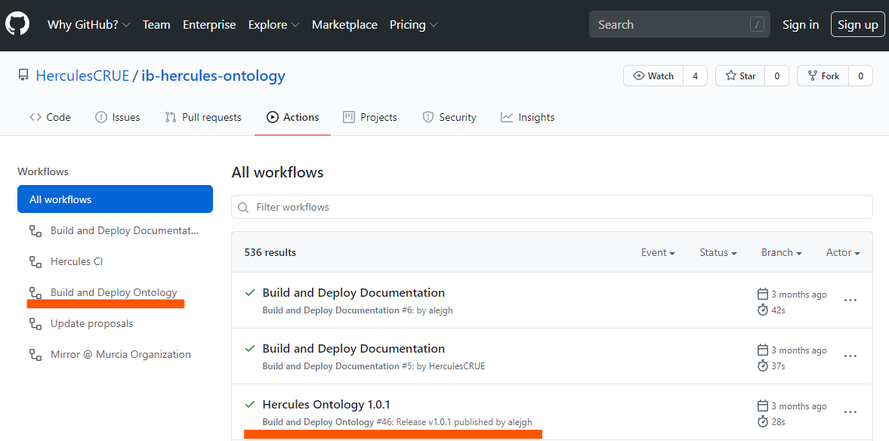
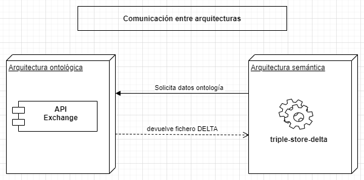

# Integración entre la arquitectura ontológica y la arquitectura semántica

## Introducción

El objetivo de este documento es explicar el diseño arquitectónico entre la infraestructura ontológica y la infraestructura semántica, describiendo los procesos que se tienen que llevar a cabo tras los cambios que pueden surgir en la red de ontologías.

## Requisito

Se precisa que la integración entre ambas infraestructuras requieran del menor esfuerzo manual posible, automatizando la mayoría de los escenarios que surgen de los cambios en las ontologías.

> Es necesario informar que aunque se busque la máxima automatización posible, habrá puntos en los que esta no se podrá llevar acabo como por ejemplo el proceso de creación/actualización de ontologías y la adaptación de estos cambios al proceso de ETL.

## Despliegue inicial ontología (primera instalación)

dibujo de todo el proceso

- Generación de clases POJO a partir de shape expressions con la herramienta [ShEx Lite](#ShEx)

- Empaquetado de las clases java en un artefacto **dataset-domain-model-X.X.X.jar** donde X.X.X es su correspondiente versionado.

- Subida del artefacto al repositorio [MVN Central](https://mvnrepository.com/repos/central) para su posterior consumo por parte de la arquitectura semántica.

## Despliegue inicial arquitectura semántica

No requiere de acciones adicionales a las ya descritas en el documento [despliegue_inicial](https://github.com/HerculesCRUE/ib-asio-docs-/blob/master/arquitectura/arquitectura_semantica/despliegues/entorno_desarrollo/despliege_inicial.md).

## Cambios en la red de ontología (sucesivas iteraciones)

### Modificaciones en la infraestructura ontológica

Cualquier modificación en la ontología implica modificaciones en las shape expressions, las cuales tienen por un lado la tarea definir un esquema para los datos a partir de la ontología y por tanto tienen la capacidad de validarlos, y por otro, permite definir el dominio de datos compartido por toda la solución, a partir de la generación de POJOs. Estos cambios también provocan modificaciones a realizar en la arquitectura semántica (ETL y adaptación de los datos existentes en Trellis y Wikibase).

#### Procesos manuales

Estas modificaciones en la ontología dan como resultado un listado de cambios a aplicar en las Shape Expressions.

| Modificación                                                                               | Protocolo a aplicar                      |
| ------------------------------------------------------------------------------------------ | ---------------------------------------- |
| Creación de nueva clase C                                                                  | Modificar directamente shape expression  |
| Borrado de clase C                                                                         | Modificar directamente shape expression  |
| Crear una propiedad p                                                                      | Modificar directamente shape expression  |
| Eliminar la propiedad p                                                                    | Modificar directamente shape expression  |
| Eliminar una propiedad p de una clase C                                                    |  Modificar directamente shape expression |
| Añadir una relación de subclase-superclase entre la subclase SubC y la superclase SuperC   | Modificar directamente shape expression  |
| Eliminar una relación de subclase-superclase entre la subclase SubC y la superclase SuperC | Modificar directamente shape expression  |
| Declarar clases C1 y C2 como disjoint                                                      | Modificar directamente shape expression  |
| Definir una propiedad p como transitiva o simétrica                                        | Modificar directamente shape expression  |
| Mover una propiedad p de una subclase a una superclase                                     | Modificar directamente shape expression  |
| Mover una propiedad p de una superclase a una subclase                                     | Modificar directamente shape expression  |
| Reducir las restricciones de una propiedad p                                               | Modificar directamente shape expression  |
| Añadir restricciones a una propiedad p                                                     | Modificar directamente shape expression  |
| Modificar la descripción de una clase (label, comment, alias)                              | Modificar directamente shape expression  |

#### Procesos automáticos

La construcción y el despliegue de la ontología están controlados a traves de [workflows de integración continua](https://docs.github.com/en/actions/configuring-and-managing-workflows/configuring-a-workflow) de GitHub. Son las que se encargan de mantener actualizada la ontología en Wikibase.



La generación de clases POJO a partir de shape expressions con la herramienta [ShEx Lite](#ShEx) se realizará de forma automática cada vez que la rama [master](https://github.com/HerculesCRUE/ib-hercules-ontology/tree/master/scripts) donde se ubican las Shape Expressions detecta que ha habido cambios.

El resultado de esta iteración es la regeneración de **todo el modelo de dominio**, posterior empaquetado y subida al repositorio [MVN Central](https://mvnrepository.com/repos/central).

> El motivo por el que es necesario la regeneración de todo el modelo de dominio es debido a que la herramienta ShEx Lite no es consciente de que ha cambiado y que no en la ontología.

## Comunicación entre la infraestructura ontológica e infraestructura semántica

Para que la infraestructura semántica sea consciente de que han habido cambios en la red de ontologías, la infraestructura ontológica ofrece un nuevo módulo API **exchange** con los siguientes métodos:

| Operación | EndPoint                                           | Descripción                                                                                           |
| --------- | -------------------------------------------------- | ----------------------------------------------------------------------------------------------------- |
| `GET`     | /versions                                          | Devuelve un listado de todas las versiones de ontologías existentes ordernadas por fecha descendente. |
| `GET`     | /ontology/{**currentVersion**}/{**targetVersion**} | Devuelve el fichero [DELTA](#DELTA) generado entre `currentVersion` y `targetVersion`.                |

La siguiente tabla muestra ejemplos de posibles respuestas a las peticiones anteriormente descritas.

| Operación | EndPoint                                           | Descripción                                     |
| --------- | -------------------------------------------------- | ----------------------------------------------- |
| `GET`     | /versions                                          | { 1.0.0, 1.0.1, 1.0.2, 1.0.3}                   |
| `GET`     | /ontology/{**currentVersion**}/{**targetVersion**} | { targetClass: Activity, operation: add field } |

Este módulo será un servicio REST autenticado accesible desde **triple-store-delta** ubicado en la arquitectura semántica.



## DELTA

Los ficheros delta son objetos JSON cuya información contiene las modificaciones a realizar en la ETL tras cambios en la ontología. Estos ficheros son interpretables por el nuevo módulo de la arquitectura semántica **triple-store-delta** de tal forma que es capaz de modificar el contenido de los datos actuales en Trellis y Wikibase de forma automática para adaptarlos a la nueva semántica de la ontología.

### Instrucciones DELTA

Operaciones soportadas:

- Creaciones de entidades o propiedades. `ADD`
- Modificaciones de entidades o propiedades. `UPDATE`
- Borrado de entidades o propiedades. `DELETE`
- Renombrado de entidades o propiedades. `RENAME`

#### ADD

```js
ADD Entidad [PROPERTY] [value]
```

#### Ejemplos:

`Añadir una nueva entidad 'Outsourcing'`

```js
ADD Outsourcing
{
  "operation": "ADD",
  "source": "Outsourcing"
}
```

`Añadir una nueva propiedad 'numeroAlumnos' a la entidad 'Universidad'`

```js
ADD Universidad PROPERTY numeroAlumnos
{
  "operation": "ADD",
  "source": "Universidad"
  "type": "PROPERTY",
  "value": "numeroAlumnos"
}
```

### Modificaciones en la infraestructura semántica

Tras modificaciones en la red de ontologías, como ya se ha mencionado anteriormente es necesario realizar las siguientes acciones:

- Cambios en la ETL
- Adaptación de los datos existentes en el triple-store (Trellis, Wikibase)

#### Secuencia de cambios a aplicar y entorno.

Para llevar a cabo los cambios procedentes de la red de ontologías, es necesario realizar los siguientes pasos en el orden indicado:


1. Modificación en la ETL según las especificaciones del fichero DELTA

   > Estas modificaciones no se despliegan hasta no completar los pasos 2 y 3.

2. Parada del servidor donde se encuentran alojados los microservicios de la arquitectura semántica.

3. Invocación del proceso para la realización de backups.

   > Desde que se para el servidor hasta que se inicia el proceso de backup debe pasar un tiempo lo suficientemente largo como para que se vacíen las colas kafka con los datos de entrada para el módulo **management-system** encargado de la generación de ficheros RDF.

4. Invocación desde linea de comandos del modulo **triple-store-delta** con el fichero DELTA como parámetro de entrada, para adaptar los datos del triple-store.

5. Despliegue de la ETL

6. Arranque del servidor, con los microservicios apuntando a la nueva versión del **dataset-domain-model-X.X.X.jar**

Los pasos anteriormente descritos se ejecutarán en un entorno no productivo y posteriormente se promocionarán al entorno final de producción.

#### Procesos manuales

- Determinación del momento en que se deben aplicar las modificaciones que surgen de cambios en la red de ontologías.
- Modificaciones en la ETL a partir de la generación de los ficheros [DELTA](#DELTA).

#### Procesos automáticos

La adaptación de los datos del triple store (Trellis, Wikibase) se harán de forma automática a partir de los ficheros [DELTA](#DELTA) procedentes de la arquitectura ontológica.

Para poder implementar esta funcionalidad es necesario crear un nuevo componente **triple-store-delta** el cual contendrá un algoritmo capaz de interpretar las instrucciones procedentes de los ficheros DELTA para modificar los datos del **triple-store** adaptándolos a los nuevos cambios en las ontologías.

Este nuevo módulo surge como substitución de la idea original **scripts ad-hoc** para la adaptación de los datos del triple-store. De esta forma, se consigue una automatización del proceso de transformación de datos procedentes del **triple-store** con la correspondiente reducción de errores en la ejecución manual de scripts.

## ShEx

[ShEx Lite](https://www.weso.es/shex-lite/) es un subconjunto de una especificación de Shape Expressions que ofrece un API para generar las clases de dominio a partir de unos datos de entrada, y el resultado se enviará a donde indique el parámetro de salida de este método.
